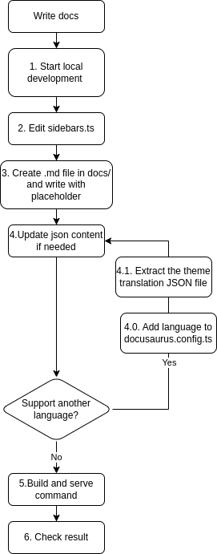

# MBC CQRS serverless documentation

This website serves as the official documentation for [the MBC CQRS Serverless Framework](https://github.com/mbc-net/mbc-cqrs-serverless). It provides comprehensive information and resources to help developers understand and effectively utilize the framework.

### Installation

```
$ npm install
```

### Local Development

```
$ npm run start:watch

or

$ npm run start:watch {{country-code}}
```

This command starts a local development server. Most changes are reflected live without having to restart the server.

### Build

```
$ npm run build
```

This command generates static content into the `build` directory and can be served using any static contents hosting service.

### Serve

```
$ npm run serve
```

After the build command, you can run a local server that will serve your website in build folder.

### Contributing

#### Support more language

1. Append country code to `i18n.locales` in docusaurus.config.ts.

2. Edit the content using the translation JSON file in the `i18n/{{country-code}}` folder

#### Write documentation

1. Create .md files in docs/ directory with English placeholders
   - Use double curly braces without spaces: `{{placeholder}}` not `{{ placeholder }}`
   - Always use full English text as placeholders (e.g., `{{Tenant Service}}` not `{{tenantService.title}}`)
   - Code examples should remain in English for all language versions
   - Do not modify existing documentation files, only add new ones

2. Run development server with English locale:
   ```bash
   npm run start:watch en
   ```

3. Update English translation JSON files in i18n/en/translation/
   - Keys must match exactly with placeholders in Markdown files
   - Use full English text as both keys and values
   - Verify translations are displaying correctly in the browser

4. Run development server with Japanese locale:
   ```bash
   npm run start:watch ja
   ```

5. Update Japanese translation JSON files in i18n/ja/translation/
   - Use the same English keys as in the English JSON files
   - Provide appropriate Japanese translations as values
   - Test that Japanese translations display correctly

6. Add documentation to navigation menu (Required)
   - Edit sidebar.ts to include new documentation in appropriate section
   - All new documentation MUST be added to the navigation menu
   - Documentation is not considered complete until it appears in the menu
   - For more information, please follow this guide: https://docusaurus.io/docs/sidebar/items

7. Build and verify:
   ```bash
   npm run build
   npm run serve
   ```
   - Check both English and Japanese versions
   - Verify all translations are displaying correctly
   - Ensure code examples remain in English

Important Notes:
- Always create documentation in the docs/ directory first
- Remove any auto-generated .md files from i18n/ directory
- Use English placeholders to make translation needs obvious
- Maintain consistent placeholder format across all files
- Do not modify program source code, only add documentation
- Test translations with both English and Japanese locales
- Always add new documentation to the navigation menu in sidebar.ts
- Documentation is incomplete until it appears in the navigation menu

We can summary the contributing process as the bellow image:

<p align="center">
  
</p>

Note: Extract the theme translation JSON file with command: `npm run write-translations -- --locale {{country-code}}`

## License
Copyright &copy; 2024, Murakami Business Consulting, Inc. https://www.mbc-net.com/
This project and sub projects are under the MIT License.
