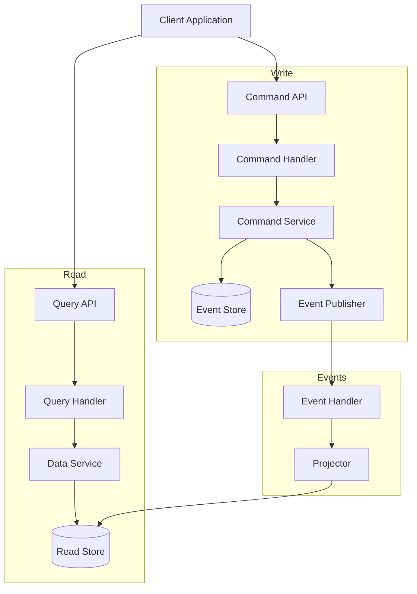
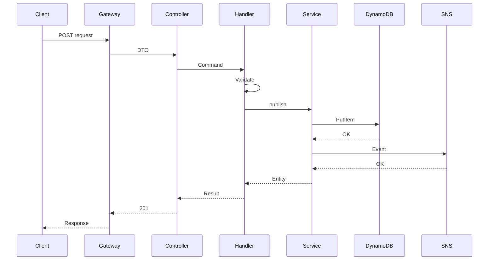
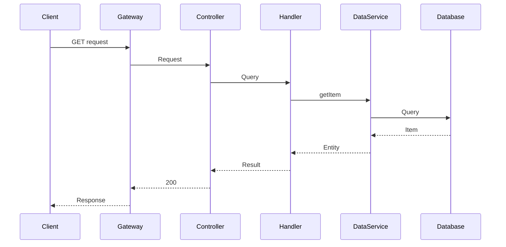

# {{CQRS Pattern Flow}}

{{This document explains how the CQRS (Command Query Responsibility Segregation) pattern is implemented in MBC CQRS Serverless.}}

## {{CQRS Overview}}



## {{Command Flow - Write Path}}

{{The flow of write operations.}}



### {{Command Flow Steps}}

1. **{{Request Received}}**: {{Client sends POST/PUT/DELETE request}}
2. **{{DTO Validation}}**: {{Controller validates input using class-validator}}
3. **{{Command Dispatch}}**: {{Controller creates and dispatches command}}
4. **{{Business Logic}}**: {{Command handler executes business rules}}
5. **{{Persistence}}**: {{Command service persists to DynamoDB with optimistic locking}}
6. **{{Event Publishing}}**: {{Domain events are published to SNS}}
7. **{{Response}}**: {{Success response returned to client}}

## {{Query Flow - Read Path}}

{{The flow of read operations.}}



### {{Query Flow Steps}}

1. **{{Request Received}}**: {{Client sends GET request}}
2. **{{Query Dispatch}}**: {{Controller creates and dispatches query}}
3. **{{Data Retrieval}}**: {{Query handler calls data service}}
4. **{{Database Query}}**: {{Data service queries DynamoDB or RDS}}
5. **{{Response}}**: {{Data returned to client}}

## {{Key Components}}

### {{Command Handler}}

```typescript
@CommandHandler(CreateResourceCommand)
export class CreateResourceHandler
  implements ICommandHandler<CreateResourceCommand> {

  constructor(private readonly commandService: CommandService) {}

  async execute(command: CreateResourceCommand): Promise<DataEntity> {
    // 1. Validate business rules
    // 2. Create entity
    // 3. Persist and publish event
    return this.commandService.publishAsync(entity, { invokeContext });
  }
}
```

### {{Query Handler}}

```typescript
@QueryHandler(GetResourceQuery)
export class GetResourceHandler
  implements IQueryHandler<GetResourceQuery> {

  constructor(private readonly dataService: DataService) {}

  async execute(query: GetResourceQuery): Promise<DataEntity> {
    return this.dataService.getItem({
      pk: query.pk,
      sk: query.sk,
    });
  }
}
```

## {{Benefits of CQRS}}

{{Adopting the CQRS pattern provides these benefits:}}

- **{{Scalability}}**: {{Read and write can be scaled independently}}
- **{{Optimization}}**: {{Optimize each side for its specific purpose}}
- **{{Flexibility}}**: {{Use different data models for reads and writes}}
- **{{Performance}}**: {{Denormalize read models for fast queries}}
- **{{Auditability}}**: {{Complete event history for audit trails}}
