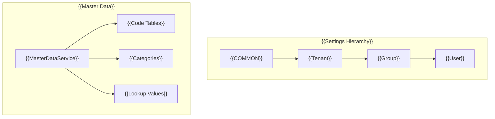

# {{Master}}


{{The Master Service provides functionality for managing master data and settings in a multi-tenant environment}}
## {{Overview}}

{{The Master Service consists of two main components:}}


### Master Setting Service
- {{Implements hierarchical settings management}}
- {{Supports creation of settings at all levels}}
- {{Provides update and delete operations for tenant settings}}
- {{Implements cascading settings retrieval}}


### {{Master Data Service}}
- {{Implements CRUD operations for master data entities}}
- {{Provides list and retrieval functionality}}
- {{Includes code validation capabilities}}
- {{Ensures data integrity across tenant boundaries}}

## {{Architecture}}



## {{Installation}}

```bash
npm install @mbc-cqrs-serverless/master
```

## {{Basic Usage}}

{{The solution for customizing the behavior of the `MasterModule` is to pass it an options `object` in the static `register()` method.}}

### {{Module Options}}

| {{Option}} | {{Type}} | {{Description}} |
|--------|------|-------------|
| `enableController` | `boolean` | {{Enable or disable default master controller}} |
| `dataSyncHandlers` | `Type<IDataSyncHandler>[]` | {{Optional handlers to sync master data to external systems (e.g., RDS)}} |
| `prismaService` | `Type<any>` | {{Optional Prisma service for RDS-backed queries}} |

```ts
import { MasterModule } from '@mbc-cqrs-serverless/master'

@Module({
  imports: [ MasterModule.register({
      enableController: true,
      dataSyncHandlers: [MasterDataRdsSyncHandler],
      prismaService: PrismaService,
    })],
  controllers: [],
  exports: [],
})

```

## {{API Reference}}

### {{MasterSettingService}}
{{The MasterSettingService interface manages settings at various levels user, group, tenant, common. It allows retrieving, updating, creating, and deleting settings.}}

##### `getSetting(dto: GetSettingDto, context: { invokeContext: IInvoke }): Promise<MasterSettingEntity>`
{{Retrieves a specific setting based on the provided setting code.}}
```ts
const masterSetting = await this.masterSettingService.getSetting(
  {
    code: "service",
  },
  { invokeContext }
);
```

#### `createCommonTenantSetting(dto: CommonSettingDto, context: { invokeContext: IInvoke }): Promise<CommandModel>`
{{Creates a common tenant setting that is shared across the system.}}
```ts
const masterSetting = await this.masterSettingService.createCommonTenantSetting(
  {
    name: "common setting",
    code: "service",
    settingValue: {
      region: "US",
      plan: "common"
    }
  },
  { invokeContext }
);
```

#### `createTenantSetting(dto: TenantSettingDto, context: { invokeContext: IInvoke }): Promise<CommandModel>`
{{Creates a tenant-specific setting.}}
```ts
const masterSetting = await this.masterSettingService.createTenantSetting(
  {
    name: "tenant setting",
    code: "service",
    tenantCode: "mbc",
    settingValue: {
      region: "US",
      plan: "tenant"
    }
  },
  { invokeContext }
);
```

#### `createGroupSetting(dto: GroupSettingDto, context: { invokeContext: IInvoke }): Promise<CommandModel>`
{{Creates a group-specific setting within a tenant.}}
```ts
const masterSetting = await this.masterSettingService.createGroupSetting(
  {
    name: "group setting",
    code: "service",
    tenantCode: "mbc",
    groupId: "12",
    settingValue: {
      region: "US",
      plan: "USER"
    }
  },
  { invokeContext }
);
```
#### `createUserSetting(dto: UserSettingDto, context: { invokeContext: IInvoke }): Promise<CommandModel>`
{{Creates a user-specific setting within a tenant.}}
```ts
const masterSetting = await this.masterSettingService.createUserSetting(
  {
    name: "user setting",
    code: "service",
    tenantCode: "mbc",
    userId: "92ca4f68-9ac6-4080-9ae2-2f02a86206a4",
    settingValue: {
      region: "US",
      plan: "USER"
    }
  },
  { invokeContext }
);
```


#### `updateSetting(params: DetailKey, dto: UpdateSettingDto, context: { invokeContext: IInvoke }): Promise<CommandModel>`
{{Updates an existing setting.}}
```ts
const masterSetting = await this.masterSettingService.updateSetting(
  {
    pk: "MASTER#abc",
    sk: "MASTER_SETTING#service"
  },
  {
    name: 'Example Master Setting',
    settingValue: {
      homepage: "url",
      desc: "string"
    }
  },
  { invokeContext }
);
```

#### `deleteSetting(key: DetailKey, context: { invokeContext: IInvoke }): Promise<CommandModel>`
{{Deletes a specific setting based on the provided key.}}
```ts
const masterSetting = await this.masterSettingService.deleteSetting(
  {
    pk: "MASTER#abc",
    sk: "MASTER_SETTING#service"
  },
  { invokeContext }
);
```

#### `list(searchDto: MasterSettingSearchDto, invokeContext: IInvoke): Promise<MasterRdsListEntity>`
{{Lists master settings with pagination and filtering. Requires RDS (Prisma) configuration.}}
```ts
const result = await this.masterSettingService.list(
  {
    name: "service",           // {{Partial match for name}}
    code: "SVC",               // {{Partial match for code}}
    keyword: "description",    // {{Search in description}}
    page: 1,
    pageSize: 10,
    orderBys: ["-createdAt"],
  },
  invokeContext
);
```

#### `getDetail(key: DetailDto): Promise<MasterRdsEntity>`
{{Retrieves detailed master setting. Throws NotFoundException if not found.}}
```ts
const masterSetting = await this.masterSettingService.getDetail({
  pk: "MASTER#mbc",
  sk: "MASTER_SETTING#service"
});
```

#### `create(createDto: CommonSettingDto, invokeContext: IInvoke): Promise<CommandModel>`
{{Creates a new tenant setting. Wrapper for createTenantSetting with automatic tenant code extraction from context.}}
```ts
const masterSetting = await this.masterSettingService.create(
  {
    code: "service",
    name: "Service Setting",
    settingValue: { key: "value" }
  },
  invokeContext
);
```

#### `createBulk(createDto: CommonSettingBulkDto, invokeContext: IInvoke): Promise<CommandModel[]>`
{{Creates multiple settings at once.}}
```ts
const settings = await this.masterSettingService.createBulk(
  {
    items: [
      { code: "setting1", name: "Setting 1", settingValue: {} },
      { code: "setting2", name: "Setting 2", settingValue: {} }
    ]
  },
  invokeContext
);
```

#### `update(key: DetailDto, updateDto: MasterSettingUpdateDto, invokeContext: IInvoke): Promise<CommandModel>`
{{Updates a master setting.}}
```ts
const result = await this.masterSettingService.update(
  { pk: "MASTER#mbc", sk: "MASTER_SETTING#service" },
  {
    name: "Updated Setting",
    attributes: { newKey: "newValue" }
  },
  invokeContext
);
```

#### `delete(key: DetailDto, invokeContext: IInvoke): Promise<CommandModel>`
{{Deletes a master setting. Wrapper for deleteSetting.}}
```ts
await this.masterSettingService.delete(
  { pk: "MASTER#mbc", sk: "MASTER_SETTING#service" },
  invokeContext
);
```

#### `checkExistCode(code: string, invokeContext: IInvoke): Promise<boolean>`
{{Checks if a setting code already exists for the current tenant.}}
```ts
const exists = await this.masterSettingService.checkExistCode("service", invokeContext);
if (exists) {
  // {{Handle duplicate code}}
}
```

#### `copy(masterCopyDto: MasterCopyDto, opts: { invokeContext: IInvoke }): Promise<any>`
{{Copies master settings and data to other tenants asynchronously using Step Functions. This is useful for initializing new tenants with existing master data.}}
```ts
const task = await this.masterSettingService.copy(
  {
    masterSettingId: "MASTER#mbc#MASTER_SETTING#service",
    targetTenants: ["tenant1", "tenant2"],
    copyType: CopyType.BOTH,   // {{CopyType.SETTING_ONLY, CopyType.DATA_ONLY, or CopyType.BOTH}}
    dataCopyOption: {
      mode: DataCopyMode.ALL,  // {{or DataCopyMode.PARTIAL}}
      // id: ["id1", "id2"]    // {{Required when mode is PARTIAL}}
    }
  },
  { invokeContext }
);
// {{Returns a task entity - the copy operation runs asynchronously}}
```

{{Copy types:}}
- {{`CopyType.SETTING_ONLY`: Copies only the setting}}
- {{`CopyType.DATA_ONLY`: Copies only the data}}
- {{`CopyType.BOTH`: Copies both setting and data}}

{{Data copy modes (used when copyType is DATA_ONLY or BOTH):}}
- {{`DataCopyMode.ALL`: Copies all master data under the setting}}
- {{`DataCopyMode.PARTIAL`: Copies only specified IDs}}

### {{MasterDataService}}
{{The MasterDataService service provides methods to manage master data and operations. This includes listing, retrieving, creating, updating, and deleting data, as well as checking for the existence of specific codes.}}

#### `list(searchDto: MasterDataSearchDto): Promise<MasterDataListEntity>`
{{Lists master data based on the provided search criteria. Note: This method does not require an invoke context.}}
```ts
const masterData = await this.masterDataService.list({
  tenantCode: "mbc",
  settingCode: "service"
});
```

#### `get(key: DetailDto): Promise<MasterDataEntity>`
{{Get a master data by pk and sk.}}

```ts
const masterData = await this.masterDataService.get(
  {
    pk:"MASTER#abc", 
    sk:"MASTER_DATA#service#01"
  }
);
```

  
#### `create(data: CreateMasterDataDto, context: { invokeContext: IInvoke }): Promise<MasterDataEntity>`

{{Creates a new master data entity}}

```ts
const masterData = await this.masterDataService.create(
  {
    code: 'MASTER001',
    name: 'Example Master Data',
    settingCode: "service",
    tenantCode: "COMMON",
    attributes: {
      homepage: "http://mbc.com",
      desc: "description for mbc"
    }
  },
  { invokeContext }
);
```

#### `update(key: DetailDto, updateDto: UpdateDataSettingDto, context: { invokeContext: IInvoke }): Promise<MasterDataEntity>`
{{Updates existing master data.}}

```ts
const masterData = await this.masterDataService.update(
  {
    pk: "MASTER#abc",
    sk: "MASTER_DATA#service#01"
  },
  {
    name: 'Example Master Data',
    attributes: {
      homepage: "http://mbc.com",
      desc: "description for mbc"
    }
  },
  { invokeContext }
);
```


#### `delete(key: DetailDto, opts: { invokeContext: IInvoke }): Promise<MasterDataEntity>`
{{Deletes specific master data based on the provided key.}}
```ts
const masterData = await this.masterDataService.delete(
  {
    pk: "MASTER#abc",
    sk: "MASTER_DATA#service#01"
  },
  { invokeContext }
);
```

#### `checkExistCode(tenantCode: string, type: string, code: string): Promise<boolean>`
{{Checks if a specific code exists within the given tenant and type.}}

```ts
const exists = await this.masterDataService.checkExistCode("mbc", "service", "01");
if (exists) {
  // {{Handle existing code}}
}
```

#### `getDetail(key: DetailDto): Promise<MasterRdsEntity>`
{{Retrieves detailed master data including related information. Throws NotFoundException if not found.}}

```ts
const masterData = await this.masterDataService.getDetail({
  pk: "MASTER#mbc",
  sk: "MASTER_DATA#service#01"
});
```

#### `createSetting(createDto: MasterDataCreateDto, invokeContext: IInvoke): Promise<MasterDataEntity>`
{{Creates a new master data entity with automatic sequence generation if not provided.}}

```ts
const masterData = await this.masterDataService.createSetting(
  {
    code: 'MASTER001',
    name: 'Example Master Data',
    settingCode: "service",
    tenantCode: "mbc",
    attributes: {
      homepage: "http://mbc.com",
      desc: "description for mbc"
    }
  },
  invokeContext
);
```

#### `createBulk(createDto: MasterDataCreateBulkDto, invokeContext: IInvoke): Promise<MasterDataEntity[]>`
{{Creates multiple master data entities in bulk.}}

```ts
const masterDataList = await this.masterDataService.createBulk(
  {
    items: [
      {
        code: 'MASTER001',
        name: 'First Master Data',
        settingCode: "service",
        tenantCode: "mbc",
        attributes: {}
      },
      {
        code: 'MASTER002',
        name: 'Second Master Data',
        settingCode: "service",
        tenantCode: "mbc",
        attributes: {}
      }
    ]
  },
  invokeContext
);
```

#### `updateSetting(key: DetailDto, updateDto: MasterDataUpdateDto, invokeContext: IInvoke): Promise<MasterDataEntity>`
{{Updates an existing master data entity.}}

```ts
const masterData = await this.masterDataService.updateSetting(
  {
    pk: "MASTER#mbc",
    sk: "MASTER_DATA#service#01"
  },
  {
    name: 'Updated Master Data',
    attributes: {
      homepage: "http://updated-mbc.com"
    }
  },
  invokeContext
);
```

#### `deleteSetting(key: DetailDto, invokeContext: IInvoke): Promise<MasterDataEntity>`
{{Deletes a master data entity by key.}}

```ts
const result = await this.masterDataService.deleteSetting(
  {
    pk: "MASTER#mbc",
    sk: "MASTER_DATA#service#01"
  },
  invokeContext
);
```

#### `listByRds(searchDto: CustomMasterDataSearchDto, context: { invokeContext: IInvoke }): Promise<MasterRdsListEntity>`
{{Searches master data in RDS with filtering and pagination. This method is used when Prisma service is configured.}}

```ts
const result = await this.masterDataService.listByRds(
  {
    settingCode: "service",    // {{Exact match for master type code}}
    keyword: "example",        // {{Partial match (case-insensitive) for name}}
    code: "001",               // {{Partial match (case-insensitive) for master code}}
    page: 1,
    pageSize: 10,
    orderBys: ["seq", "masterCode"],
  },
  { invokeContext }
);
```

##### {{Search Parameters}} {#search-parameters}

| {{Parameter}} | {{Type}} | {{Required}} | {{Match Type}} | {{Description}} |
|---------------|----------|--------------|----------------|-----------------|
| `settingCode` | `string` | {{No}} | {{Exact match}} | {{Filter by master type code (masterTypeCode)}} |
| `keyword` | `string` | {{No}} | {{Partial match (case-insensitive)}} | {{Filter by name field}} |
| `code` | `string` | {{No}} | {{Partial match (case-insensitive)}} | {{Filter by master code}} |
| `page` | `number` | {{No}} | - | {{Page number (default: 1)}} |
| `pageSize` | `number` | {{No}} | - | {{Items per page (default: 10)}} |
| `orderBys` | `string[]` | {{No}} | - | {{Sort order (default: ["seq", "masterCode"])}} |
| `isDeleted` | `boolean` | {{No}} | {{Exact match}} | {{Filter by deletion status}} |

:::warning {{Known Issue (Fixed in v1.0.17)}}
{{In versions prior to v1.0.17, the `settingCode` parameter incorrectly used partial matching (`contains`) instead of exact matching. This caused unintended search results - for example, searching for "PRODUCT" would also return "PRODUCT_TYPE" and "MY_PRODUCT".}}

{{If you are using v1.0.16 or earlier and need exact matching for `settingCode`, upgrade to v1.0.17 or later.}}

{{See also:}} [{{Changelog v1.0.17}}](./changelog#v1017)
:::
