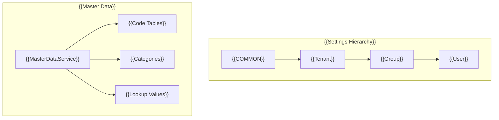

# {{Master}}


{{The Master Service provides functionality for managing master data and settings in a multi-tenant environment}}
## {{Overview}}

{{The Master Service consists of two main components:}}


### Master Setting Service
- {{Implements hierarchical settings management}}
- {{Supports creation of settings at all levels}}
- {{Provides update and delete operations for tenant settings}}
- {{Implements cascading settings retrieval}}


### {{Master Data Service}}
- {{Implements CRUD operations for master data entities}}
- {{Provides list and retrieval functionality}}
- {{Includes code validation capabilities}}
- {{Ensures data integrity across tenant boundaries}}

## {{Architecture}}



## {{Installation}}

```bash
npm install @mbc-cqrs-serverless/master
```

## {{Basic Usage}}

{{The solution for customizing the behavior of the `MasterModule` is to pass it an options `object` in the static `register()` method. The options object is only contain one property:}}

- {{`enableController`: enable or disable default master controller.}}


```ts 
import { MasterModule } from '@mbc-cqrs-serverless/master'

@Module({
  imports: [ MasterModule.register({
      enableController: true,
    })],
  controllers: [],
  exports: [],
})

```

## {{API Reference}}

### {{MasterSettingService}}
{{The MasterSettingService interface manages settings at various levels user, group, tenant, common. It allows retrieving, updating, creating, and deleting settings.}}

##### {{`getSetting(dto: GetSettingDto, context: { invokeContext: IInvoke }): Promise<MasterSettingEntity>`}}
{{Retrieves a specific setting based on the provided setting code.}}
```ts
const masterSetting = await this.masterSettingService.getSetting(
  {
    code: "service",
  }
);
```

#### {{`createCommonTenantSetting(dto: CommonSettingDto, context: { invokeContext: IInvoke }): Promise<CommandModel>`}}
{{Creates a common tenant setting that is shared across the system.}}
```ts
const masterSetting = await this.masterSettingService.createGroupSetting(
  {
  name: "common setting",
  code: "service",
  settingValue: {
    region: "US",
    plan: "common"
  }
});
```

#### {{`createTenantSetting(dto: TenantSettingDto, context: { invokeContext: IInvoke }): Promise<CommandModel>`}}
{{Creates a tenant-specific setting.}}
```ts
const masterSetting = await this.masterSettingService.createGroupSetting(
  {
  name: "tenant setting",
  code: "service",
  tenantCode: "mbc",
  settingValue: {
    region: "US",
    plan: "tenant"
  }
});
```

#### {{`createGroupSetting(dto: GroupSettingDto, context: { invokeContext: IInvoke }): Promise<CommandModel>`}}
{{Creates a group-specific setting within a tenant.}}
```ts
const masterSetting = await this.masterSettingService.createGroupSetting(
  {
  name: "group setting",
  code: "service",
  tenantCode: "mbc",
  groupId: "12",
  settingValue: {
    region: "US",
    plan: "USER"
  }
});
```
#### {{`createUserSetting(dto: UserSettingDto, context: { invokeContext: IInvoke }): Promise<CommandModel>`}}
{{Creates a user-specific setting within a tenant.}}
```ts
const masterSetting = await this.masterSettingService.createUserSetting(
  {
  name: "user setting",
  code: "service",
  tenantCode: "mbc",
  userId: "92ca4f68-9ac6-4080-9ae2-2f02a86206a4",
  settingValue: {
    region: "US",
    plan: "USER"
  }
});
```


#### {{`updateSetting(params: DetailKey, dto: UpdateSettingDto, context: { invokeContext: IInvoke }): Promise<CommandModel>`}}
{{Updates an existing setting.}}
```ts
const masterSetting = await this.masterSettingService.updateSetting(
  {
    pk:"MASTER#abc", 
    sk:"MASTER_SETTING#service"
  },
  {
  name: 'Example Master Setting',
  settingValue: {
    homepage: "url",
    desc: "string"
  }
});
```

#### {{`deleteSetting(key: DetailKey, context: { invokeContext: IInvoke }): Promise<CommandModel>`}}
{{Deletes a specific setting based on the provided key.}}
```ts
const masterSetting = await this.masterSettingService.deleteSetting(
  {
    pk:"MASTER#abc", 
    sk:"MASTER_SETTING#service"
  }
);
```

### {{MasterDataService}}
{{The MasterDataService service provides methods to manage master data and operations. This includes listing, retrieving, creating, updating, and deleting data, as well as checking for the existence of specific codes.}}

#### {{`list( searchDto: MasterDataSearchDto): Promise<MasterDataListEntity>`}}
{{Lists master data based on the provided search criteria.}}
```ts
const masterData = await this.masterDataService.list(
  {
    tenantCode: "mbc",
    settingCode: "service"
  }
);
```

#### {{`get(key: DetailDto): Promise<MasterDataEntity>`}}
{{Get a master data by pk and sk.}}

```ts
const masterData = await this.masterDataService.get(
  {
    pk:"MASTER#abc", 
    sk:"MASTER_DATA#service#01"
  }
);
```

  
#### {{`create(data: CreateMasterDataDto, context: { invokeContext: IInvoke })`}}

{{Creates a new master data entity}}

```ts
const masterData = await this.masterDataService.create({
  code: 'MASTER001',
  name: 'Example Master Data',
  settingCode: "service",
  tenantCode: "COMMON",
  attributes: {
    homepage: "http://mbc.com",
    desc: "description for mbc"
  }
});
```

#### {{`update(key: DetailDto, updateDto: UpdateDataSettingDto, context: { invokeContext: IInvoke })`}}
{{Updates existing master data.}}

```ts
const masterData = await this.masterDataService.update(
  {
    pk:"MASTER#abc", 
    sk:"MASTER_DATA#service#01"
  },
  {
  name: 'Example Master Data',
  attributes: {
    homepage: "http://mbc.com",
    desc: "description for mbc"
  }
});
```


#### {{`delete(key: DetailDto, opts: { invokeContext: IInvoke })`}}
{{Deletes specific master data based on the provided key.}}
```ts
const masterData = await this.masterDataService.delete(
  {
    pk:"MASTER#abc", 
    sk:"MASTER_DATA#service#01"
  }
);
```

#### {{`checkExistCode(tenantCode: string, type: string, code: string)`}}
{{Checks if a specific code exists within the given tenant and type.}}

```ts
const masterData = await this.masterDataService.checkExistCode("mbc", "service", "01");
```
