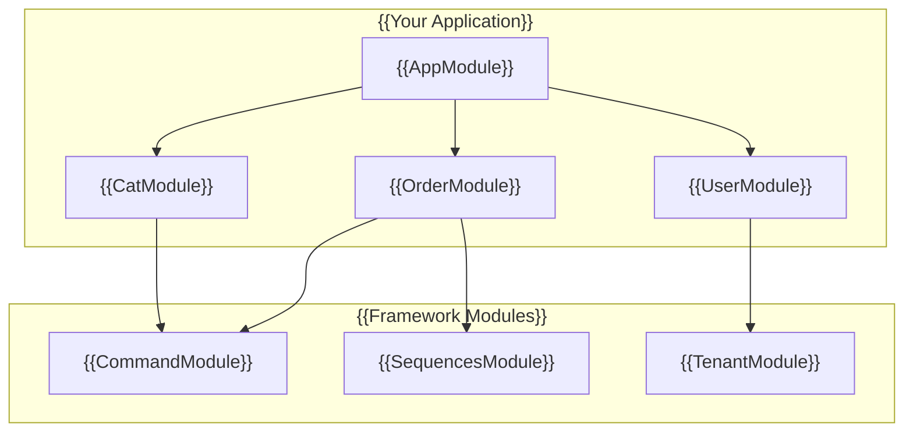

# {{Modules}}

## {{Overview}}

{{A module is a class annotated with a `@Module()` decorator. The `@Module()` decorator provides metadata that organizes the application structure. Modules encapsulate related functionality and follow the NestJS module pattern.}}



## {{Module Structure}}

{{A typical module in MBC CQRS Serverless includes:}}

```typescript
import { Module } from '@nestjs/common';
import { CommandModule } from '@mbc-cqrs-serverless/core';

import { CatController } from './cat.controller';
import { CatService } from './cat.service';
import { CatDataSyncRdsHandler } from './handler/cat-rds.handler';

@Module({
  imports: [
    CommandModule.register({
      tableName: 'cat',
      dataSyncHandlers: [CatDataSyncRdsHandler],
    }),
  ],
  controllers: [CatController],
  providers: [CatService],
  exports: [CatService],
})
export class CatModule {}
```

## {{Module Components}}

| {{Component}} | {{Description}} |
|-----------|-------------|
| `imports` | {{List of imported modules that export providers used in this module}} |
| `controllers` | {{Controllers that handle HTTP requests}} |
| `providers` | {{Services and other providers available for injection}} |
| `exports` | {{Providers that should be available in modules that import this module}} |

## {{Framework Modules}}

{{MBC CQRS Serverless provides several ready-to-use modules:}}

### {{Core Modules}}

| {{Module}} | {{Package}} | {{Purpose}} |
|--------|---------|---------|
| `CommandModule` | `@mbc-cqrs-serverless/core` | {{CQRS command handling and data sync}} |
| `SequencesModule` | `@mbc-cqrs-serverless/sequence` | {{Sequential ID generation}} |
| `TenantModule` | `@mbc-cqrs-serverless/tenant` | {{Multi-tenant management}} |

### {{Feature Modules}}

| {{Module}} | {{Package}} | {{Purpose}} |
|--------|---------|---------|
| `TaskModule` | `@mbc-cqrs-serverless/task` | {{Async task execution with Step Functions}} |
| `MasterModule` | `@mbc-cqrs-serverless/master` | {{Master data and settings management}} |
| `ImportModule` | `@mbc-cqrs-serverless/import` | {{CSV/API data import}} |

### {{Support Modules}}

| {{Module}} | {{Package}} | {{Purpose}} |
|--------|---------|---------|
| `NotificationModule` | `@mbc-cqrs-serverless/core` | {{Email notifications via SES}} |
| `SettingModule` | `@mbc-cqrs-serverless/ui-setting` | {{User interface settings storage}} |

## {{Dynamic Module Registration}}

{{Most framework modules are dynamic modules that accept configuration:}}

### {{CommandModule}}

```typescript
CommandModule.register({
  tableName: 'cat',
  dataSyncHandlers: [CatDataSyncRdsHandler],
  skipError: false,
  disableDefaultHandler: false,
})
```

| {{Option}} | {{Type}} | {{Default}} | {{Description}} |
|--------|------|---------|-------------|
| `tableName` | `string` | {{Required}} | {{DynamoDB table name (without postfix)}} |
| `dataSyncHandlers` | `Type[]` | `[]` | {{Data sync handler classes}} |
| `skipError` | `boolean` | `false` | {{Skip errors during data sync}} |
| `disableDefaultHandler` | `boolean` | `false` | {{Disable default data sync to data table}} |

### {{SequencesModule}}

```typescript
SequencesModule.register({
  enableController: true,
})
```

### {{MasterModule}}

```typescript
MasterModule.register({
  enableController: true,
})
```

## {{Creating Custom Modules}}

### {{Step 1: Create Module File}}

```typescript
// src/order/order.module.ts
import { Module } from '@nestjs/common';
import { CommandModule } from '@mbc-cqrs-serverless/core';
import { SequencesModule } from '@mbc-cqrs-serverless/sequence';

import { OrderController } from './order.controller';
import { OrderService } from './order.service';
import { OrderDataSyncHandler } from './handlers/order-data-sync.handler';

@Module({
  imports: [
    CommandModule.register({
      tableName: 'order',
      dataSyncHandlers: [OrderDataSyncHandler],
    }),
    SequencesModule.register({
      enableController: false,
    }),
  ],
  controllers: [OrderController],
  providers: [OrderService],
  exports: [OrderService],
})
export class OrderModule {}
```

### {{Step 2: Register in AppModule}}

```typescript
// src/app.module.ts
import { Module } from '@nestjs/common';
import { OrderModule } from './order/order.module';

@Module({
  imports: [OrderModule],
})
export class AppModule {}
```

## {{Best Practices}}

1. **{{One module per entity}}**: {{Create a dedicated module for each business entity}}
2. **{{Export services, not controllers}}**: {{Only export providers that other modules need}}
3. **{{Use forRoot for global modules}}**: {{Register global configuration once in AppModule}}
4. **{{Keep modules focused}}**: {{Each module should have a single responsibility}}

## {{Related Documentation}}

- {{[NestJS Modules](https://docs.nestjs.com/modules): Official NestJS module documentation}}
- {{[CommandService](./command-service.md): Detailed CommandModule configuration}}
- {{[Event Handling Patterns](./event-handling-patterns.md): Creating data sync handlers}}
