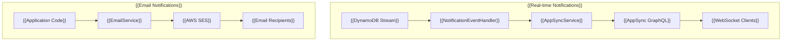

# {{Notification}}

{{The NotificationModule provides two types of notification capabilities in the MBC CQRS Serverless framework:}}

- {{**Real-time notifications** via AWS AppSync for WebSocket-based updates}}
- {{**Email notifications** via AWS SES for sending emails}}

## {{Architecture}}



## {{Real-time Notifications}}

### {{Overview}}

{{Real-time notifications are automatically sent when data changes occur in DynamoDB. The system uses AWS AppSync to deliver notifications to subscribed WebSocket clients.}}

### {{INotification Interface}}

{{The notification payload structure:}}

```ts
interface INotification {
  id: string;        // {{Unique notification ID}}
  table: string;     // {{Source DynamoDB table name}}
  pk: string;        // {{Partition key of the changed item}}
  sk: string;        // {{Sort key of the changed item}}
  tenantCode: string; // {{Tenant code for filtering notifications}}
  action: string;    // {{Type of change: 'INSERT', 'MODIFY', 'REMOVE', or custom actions}}
  content?: object;  // {{Optional payload with changed data}}
}
```

### {{AppSyncService}}

{{The `AppSyncService` sends real-time notifications to AppSync for WebSocket delivery.}}

#### {{Configuration}}

{{Set the following environment variables:}}

```bash
APPSYNC_ENDPOINT=https://xxxxx.appsync-api.ap-northeast-1.amazonaws.com/graphql
APPSYNC_API_KEY=da2-xxxxxxxxxx  # {{Optional: Use API key auth instead of IAM}}
```

#### {{Usage}}

```ts
import { AppSyncService, INotification } from "@mbc-cqrs-serverless/core";

@Injectable()
export class MyService {
  constructor(private readonly appSyncService: AppSyncService) {}

  async notifyClients() {
    const notification: INotification = {
      id: "notification-123",
      table: "my-table",
      pk: "ITEM#tenant1",
      sk: "ITEM#item001",
      tenantCode: "tenant1",
      action: "MODIFY",
      content: { status: "updated" },
    };

    await this.appSyncService.sendMessage(notification);
  }
}
```

#### {{Authentication}}

{{The AppSyncService supports two authentication methods:}}

1. **{{API Key}}**: {{Set `APPSYNC_API_KEY` environment variable}}
2. **{{IAM Signature V4}}**: {{Used automatically when API key is not set}}

### {{Automatic Notifications}}

{{The framework automatically sends notifications when data changes through:}}

1. {{DynamoDB Streams trigger the `NotificationEventHandler`}}
2. {{Handler extracts change information and creates `INotification`}}
3. {{`AppSyncService.sendMessage()` delivers to AppSync}}
4. {{Connected clients receive updates via WebSocket subscription}}

## {{Email Notifications}}

### {{EmailService}}

{{The `EmailService` sends emails using AWS SES.}}

#### {{Configuration}}

```bash
SES_FROM_EMAIL=noreply@your-domain.com  # {{Required: Default sender address}}
SES_REGION=ap-northeast-1                # {{Optional: SES region}}
SES_ENDPOINT=                            # {{Optional: Custom endpoint for LocalStack}}
```

#### {{Basic Usage}}

```ts
import { EmailService, EmailNotification } from "@mbc-cqrs-serverless/core";

@Injectable()
export class MyService {
  constructor(private readonly emailService: EmailService) {}

  async sendWelcomeEmail(userEmail: string) {
    const email: EmailNotification = {
      toAddrs: [userEmail],
      subject: "Welcome to Our Service",
      body: "<h1>Welcome!</h1><p>Thank you for signing up.</p>",
    };

    await this.emailService.sendEmail(email);
  }
}
```

#### {{Email with Attachments}}

```ts
import { EmailNotification, Attachment } from "@mbc-cqrs-serverless/core";
import * as fs from "fs";

const pdfBuffer = fs.readFileSync("report.pdf");

const email: EmailNotification = {
  toAddrs: ["user@example.com"],
  subject: "Monthly Report",
  body: "<p>Please find attached your monthly report.</p>",
  attachments: [
    {
      filename: "report.pdf",
      content: pdfBuffer,
      contentType: "application/pdf",
    },
  ],
};

await this.emailService.sendEmail(email);
```

#### {{EmailNotification Interface}}

| {{Property}} | {{Type}} | {{Required}} | {{Description}} |
|--------------|----------|--------------|-----------------|
| `fromAddr` | `string` | {{No}} | {{Sender email (uses SES_FROM_EMAIL if not set)}} |
| `toAddrs` | `string[]` | {{Yes}} | {{List of recipient email addresses}} |
| `ccAddrs` | `string[]` | {{No}} | {{CC recipients}} |
| `bccAddrs` | `string[]` | {{No}} | {{BCC recipients}} |
| `subject` | `string` | {{Yes}} | {{Email subject line}} |
| `body` | `string` | {{Yes}} | {{Email body as HTML}} |
| `replyToAddrs` | `string[]` | {{No}} | {{Reply-to addresses}} |
| `attachments` | `Attachment[]` | {{No}} | {{File attachments}} |

#### {{Attachment Interface}}

| {{Property}} | {{Type}} | {{Required}} | {{Description}} |
|--------------|----------|--------------|-----------------|
| `filename` | `string` | {{Yes}} | {{Filename shown to recipient}} |
| `content` | `Buffer` | {{Yes}} | {{File content as Buffer}} |
| `contentType` | `string` | {{No}} | {{MIME type (e.g., 'application/pdf')}} |

## {{See Also}}

- [{{Event Handling Patterns}}](./event-handling-patterns) - {{How notifications integrate with events}}
- [{{Environment Variables}}](./environment-variables) - {{Configuration reference}}
