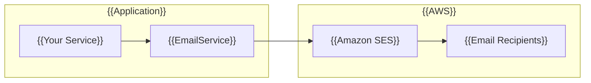

# {{NotificationModule}}

## {{Overview}}

{{The `NotificationModule` provides email notification capabilities using Amazon SES. It's designed for easy integration with minimal configuration.}}



## {{Features}}

- {{Automatic AWS SES integration}}
- {{HTML email support}}
- {{File attachments}}
- {{CC/BCC recipients}}
- {{Global scope registration}}

## {{Configuration}}

{{Set the following environment variables:}}

```bash
# Required
SES_FROM_EMAIL=noreply@your-domain.com

# Optional (defaults to AWS SDK configuration)
SES_ENDPOINT=
SES_REGION=ap-northeast-1
```

## {{Module Registration}}

{{The `NotificationModule` is registered globally, so the `EmailService` is available for injection anywhere in your application:}}

```typescript
import { Module } from '@nestjs/common';
import { NotificationModule } from '@mbc-cqrs-serverless/core';

@Module({
  imports: [NotificationModule],
})
export class AppModule {}
```

## {{Basic Usage}}

{{Inject and use the `EmailService` in any service:}}

```typescript
import { Injectable } from '@nestjs/common';
import { EmailService } from '@mbc-cqrs-serverless/core';

@Injectable()
export class OrderService {
  constructor(private readonly emailService: EmailService) {}

  async sendOrderConfirmation(order: Order): Promise<void> {
    await this.emailService.sendEmail({
      toAddrs: [order.customerEmail],
      subject: `Order Confirmation - ${order.code}`,
      body: `
        <h1>Thank you for your order!</h1>
        <p>Order Number: ${order.code}</p>
        <p>Total: ${order.total}</p>
      `,
    });
  }
}
```

## {{AWS SES Setup}}

### {{Production Setup}}

1. **{{Verify your domain}}**: {{Add DNS records for domain verification}}
2. **{{Request production access}}**: {{Move out of sandbox mode}}
3. **{{Set up IAM permissions}}**: {{Ensure Lambda has SES send permissions}}

### {{IAM Policy}}

{{Required IAM permissions for sending emails:}}

```json
{
  "Version": "2012-10-17",
  "Statement": [
    {
      "Effect": "Allow",
      "Action": [
        "ses:SendEmail",
        "ses:SendRawEmail"
      ],
      "Resource": "*"
    }
  ]
}
```

### {{Local Development}}

{{For local development, you can use LocalStack or email testing services:}}

```bash
# Using LocalStack
SES_ENDPOINT=http://localhost:4566
SES_REGION=ap-northeast-1
```

## {{Common Patterns}}

### {{Email Templates}}

{{Create reusable email templates:}}

```typescript
@Injectable()
export class EmailTemplateService {
  private templates = {
    welcome: (name: string) => ({
      subject: 'Welcome to Our Platform',
      body: `<h1>Welcome, ${name}!</h1><p>We're glad to have you.</p>`,
    }),
    passwordReset: (resetLink: string) => ({
      subject: 'Password Reset Request',
      body: `<p>Click <a href="${resetLink}">here</a> to reset your password.</p>`,
    }),
  };

  getTemplate(name: keyof typeof this.templates, ...args: any[]) {
    return this.templates[name](...args);
  }
}
```

### {{Error Handling}}

```typescript
async sendNotification(email: string, content: EmailContent): Promise<boolean> {
  try {
    await this.emailService.sendEmail({
      toAddrs: [email],
      subject: content.subject,
      body: content.body,
    });
    return true;
  } catch (error) {
    console.error('Failed to send email:', error);
    // Optionally: queue for retry or log to monitoring
    return false;
  }
}
```

## {{Related Documentation}}

- {{[EmailService API](./email-service.md): Detailed API reference with all options}}
- {{[Environment Variables](./environment-variables.md): Configuration options}}
