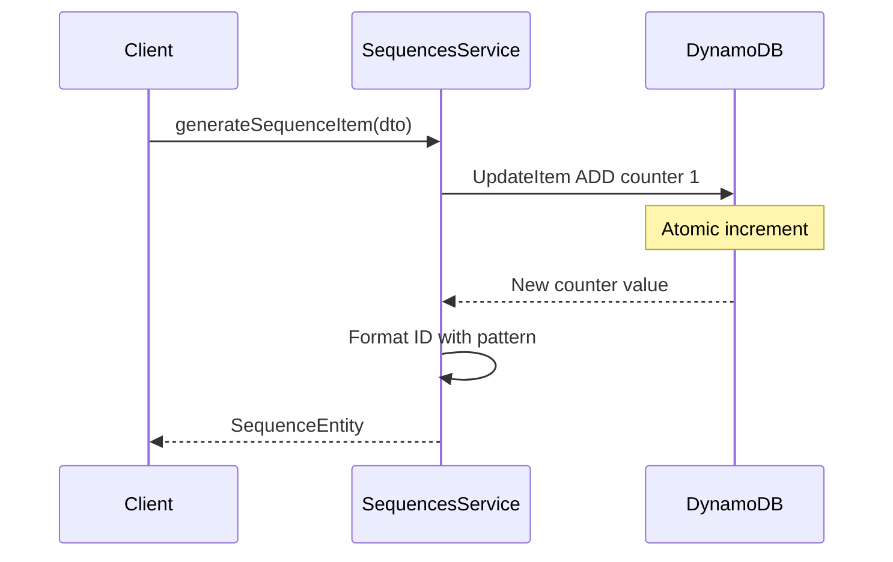

# {{Sequence}}

## 1. {{Purpose}}

{{`SequenceModule`  is a service for managing dynamic sequences in the system using DynamoDB as the primary database.}}

{{This service is designed to:}}

- {{Generate unique sequence numbers based on parameters such as sequence type, tenant, or date.}}
- {{Automatically reset sequences based on cycles like:}}
  - {{Daily.}}
  - {{Monthly.}}
  - {{Yearly.}}
  - {{Fiscal Yearly.}}

{{Format sequence numbers according to specific system requirements (e.g., TODO-PERSONAL-72-001).}}
{{Ensure data consistency and integrity in multi-tenant systems.}}

## {{How It Works}}



## 2. {{Usage}}


{{The solution for customizing the behavior of the `SequenceModule` is to pass it an options `object` in the static `register()` method. The options object is only contain one property:}}

- {{`enableController`: enable or disable default sequence controller.}}

{{We will create a simple example demonstrating how to use the sequence module and customize authentication for the sequence controller.}}

```ts
// seq.controller.ts
import { SequencesController } from "@mbc-cqrs-serverless/sequence";
import { Controller } from "@nestjs/common";
import { ApiTags } from "@nestjs/swagger";
import { Auth } from "src/auth/auth.decorator";
import { ROLE } from "src/auth/role.enum";

@Controller("api/sequence")
@ApiTags("sequence")
@Auth(ROLE.JCCI_ADMIN)
export class SeqController extends SequencesController {}
```

```ts
// seq.module.ts
import { SequencesModule } from "@mbc-cqrs-serverless/sequence";
import { Module } from "@nestjs/common";

import { SeqController } from "./seq.controller";

@Module({
  imports: [SequencesModule.register({ enableController: false })],
  controllers: [SeqController],
  exports: [SequencesModule],
})
export class SeqModule {}
```

{{Beside controller, we can directly use `SequencesService` to generating sequence by injecting service.}}

{{The `SequencesService` have three public methods:}}

### {{*async* `generateSequenceItem( dto: GenerateFormattedSequenceDto, options: {invokeContext:IInvoke}):  Promise<SequenceEntity>`}}


{{Generates a new sequence based on the parameters provided in the GenerateFormattedSequenceDto object.}}

#### {{Parameters}}

{{`dto: GenerateFormattedSequenceDto`}}
{{The data transfer object that customizes the behavior of the sequence generation. Its properties include:}}

- {{`date?: Date`}}
  - {{Default: Current date.}}
  - {{Description: Specifies the date for which the sequence is generated.}}

- {{`rotateBy?: RotateByEnum`}}
  - {{Default: none.}}
  - {{Options}}
    - {{fiscal_yearly}}
    - {{yearly}}
    - {{monthly}}
    - {{daily}}
    - {{none}}
  - {{Description: Determines the rotation type for the sequence.}}

- {{`tenantCode: string`}}
  - {{Required: Yes.}}
  - {{Description: Identifies the tenant and type code for the intended usage.}}

- {{`typeCode: string`}}
  - {{Required: Yes.}}
  - {{Description: Identifies the tenant and type code for the intended usage.}}
  
- {{`params?: SequenceParamsDto`}}
  - {{Required: No.}}
  - {{Description: Defines parameters to identify the sequence.}}
    ```ts
    export class SequenceParamsDto {
      @IsString()
      code1: string

      @IsOptional()
      @IsString()
      code2?: string

      @IsOptional()
      @IsString()
      code3?: string

      @IsOptional()
      @IsString()
      code4?: string

      @IsOptional()
      @IsString()
      code5?: string

      constructor(partial: Partial<SequenceParamsDto>) {
        Object.assign(this, partial)
      }
    }
    ```
####  {{Response}}
{{The return value of this function  has type of `SequenceEntity` as follows:}}
  ```ts
  export class SequenceEntity {
    id: string
    no: number
    formattedNo: string
    issuedAt: Date

    constructor(partial: Partial<SequenceEntity>) {
      Object.assign(this, partial)
    }
  }
  ```

####  {{Customizable}}
{{By default, the returned data includes the formattedNo field with the format `%%no%%`, where `no` represents the sequence number. If you want to define your own custom format, you can update the master data in DynamoDB with the following parameters:}}

- PK: {{`MASTER${KEY_SEPARATOR}${tenantCode}`}}
- SK: {{`MASTER_DATA${KEY_SEPARATOR}${typeCode}`}}


{{The data structure should be as follows:}}
  ```json
    {
      "format": "string",
      "startMonth": "number",
      "registerDate": "string"
    }
  ```

#### {{Example}}

{{For example, if you want to add `code1` to `code5`,  `month`, `day `, `date`, `no` as well as `fiscal_year`, into your format, the format would look like this:}}
```json
{
  "format": "%%code2#:0>7%%-%%fiscal_year#:0>2%%-%%code3%%%%no#:0>3%%"
} 
```
{{In this format}}:
- {{Variables are written inside `%% <param> %%.`}}
- {{After the #, the length of the variable is specified, indicating the desired length of the field when the formatted sequence number is returned.}}
{{For instance}}:

- {{`%%code2#:0>7%%` ensures code2 is formatted to be 7 characters long, padding with leading zeros if necessary.}}
- {{`%%fiscal_year#:0>2%% `formats fiscal_year to a length of 2 characters.}}
- {{`%%code3%%` represents the code3 value as it is.}}
- {{`%%no#:0>3%%` ensures the sequence number (no) is formatted to be 3 digits long, padded with leading zeros if necessary.}}

{{If you want to calculate the fiscal_year starting from any specific month, you can add the `startMonth` field. For example, if you want the fiscal year to start from March, the format would look like this:}}
```
{
  "format": "%%code2#:0>7%%-%%fiscal_year#:0>2%%-%%code3%%%%no#:0>3%%",
  "startMonth": 3
}
```
{{In this case}}:
- {{startMonth: Defines the month to start the fiscal year (e.g., 3 for March).}}

{{If you want to calculate the fiscal year starting from a specific date (e.x 2005-01-01), you can add the `registerDate` field, like this:}}

```
{
  "format": "%%code2#:0>7%%-%%fiscal_year#:0>2%%-%%code3%%%%no#:0>3%%",
  "registerDate": "2005-01-01"
}
```

{{In this case}}
- {{registerDate: Defines the exact start date of the fiscal year (e.g., "2005-01-01").}}

{{This allows you to customize the fiscal year calculation according to your specific business needs.}}

### {{*async* `generateSequenceItemWithProvideSetting(dto, options): Promise<SequenceEntity>`}}

{{This method allows you to generate a sequence with custom settings directly provided in the DTO, without requiring master data configuration in DynamoDB.}}

{{Example:}}

```ts
const result = await this.sequencesService.generateSequenceItemWithProvideSetting(
  {
    tenantCode: 'tenant001',
    typeCode: 'INVOICE',
    setting: {
      format: '%%code1%%-%%no#:0>5%%',
      rotateBy: RotateByEnum.YEARLY,
    },
    params: { code1: 'INV' },
  },
  { invokeContext },
);
// Returns: { formattedNo: 'INV-00001', no: 1, ... }
```

{{Use this method when you need dynamic sequence settings that vary per request rather than fixed master data configuration.}}

### {{*async* `getCurrentSequence(key: DetailKey): Promise<DataEntity>` <span class="badge badge--warning">deprecated</span>}}

:::info

{{Deprecated, for removal: This API element is subject to removal in a future version.}}

:::

### {{*async* `genNewSequence( dto: GenSequenceDto, options: {invokeContext: IInvoke}): Promise<DataEntity>` <span class="badge badge--warning">deprecated</span>}}

:::info

{{Deprecated, for removal: This API element is subject to removal in a future version. Use [`generateSequenceItem` method](#async-generatesequenceitem-dto-generateformattedsequencedto-options-invokecontextiinvoke--promisesequenceentity) instead.}}

:::


