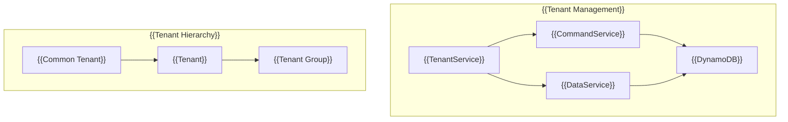

# {{Tenant}}

{{The TenantModule provides multi-tenant management capabilities in the MBC CQRS Serverless framework. It enables creating, updating, and managing tenants and their group configurations.}}

## {{Architecture}}



## {{Installation}}

```bash
npm install @mbc-cqrs-serverless/tenant
```

## {{Module Registration}}

```ts
import { TenantModule } from "@mbc-cqrs-serverless/tenant";

@Module({
  imports: [
    TenantModule.register({
      enableController: true, // {{Enable built-in REST controller}}
      dataSyncHandlers: [TenantDataSyncHandler], // {{Optional: Custom sync handlers}}
    }),
  ],
})
export class AppModule {}
```

## {{Module Options}}

| {{Option}} | {{Type}} | {{Required}} | {{Description}} |
|------------|----------|--------------|-----------------|
| `enableController` | `boolean` | {{No}} | {{Enable or disable the built-in TenantController}} |
| `dataSyncHandlers` | `Type<IDataSyncHandler>[]` | {{No}} | {{Custom handlers for syncing tenant data to external systems}} |

## {{API Reference}}

### {{TenantService Methods}}

#### `getTenant(key: DetailKey): Promise<DataModel>`

{{Retrieves a tenant by its primary key.}}

```ts
import { TenantService } from "@mbc-cqrs-serverless/tenant";

@Injectable()
export class MyService {
  constructor(private readonly tenantService: TenantService) {}

  async findTenant(pk: string, sk: string) {
    const tenant = await this.tenantService.getTenant({ pk, sk });
    return tenant;
  }
}
```

#### `createCommonTenant(dto: CommonTenantCreateDto, context): Promise<CommandModel>`

{{Creates a common tenant that serves as the base configuration for all tenants.}}

```ts
const commonTenant = await this.tenantService.createCommonTenant(
  {
    name: "Common Settings",
    attributes: {
      defaultLanguage: "en",
      timezone: "UTC",
    },
  },
  { invokeContext }
);
```

#### `createTenant(dto: TenantCreateDto, context): Promise<CommandModel>`

{{Creates a new tenant with the specified code and configuration.}}

```ts
const tenant = await this.tenantService.createTenant(
  {
    code: "tenant001",
    name: "Tenant One",
    attributes: {
      industry: "technology",
      plan: "enterprise",
    },
  },
  { invokeContext }
);
```

#### `updateTenant(key: DetailKey, dto: TenantUpdateDto, context): Promise<CommandModel>`

{{Updates an existing tenant's information.}}

```ts
const updatedTenant = await this.tenantService.updateTenant(
  { pk: "SYSTEM#tenant001", sk: "TENANT" },
  {
    name: "Updated Tenant Name",
    attributes: {
      plan: "premium",
    },
  },
  { invokeContext }
);
```

#### `deleteTenant(key: DetailKey, context): Promise<CommandModel>`

{{Soft deletes a tenant by setting isDeleted to true.}}

```ts
const deletedTenant = await this.tenantService.deleteTenant(
  { pk: "SYSTEM#tenant001", sk: "TENANT" },
  { invokeContext }
);
```

#### `addTenantGroup(dto: TenantGroupAddDto, context): Promise<CommandModel>`

{{Adds a group to a tenant with the specified role.}}

```ts
const result = await this.tenantService.addTenantGroup(
  {
    tenantCode: "tenant001",
    groupId: "group001",
    role: "admin",
  },
  { invokeContext }
);
```

#### `customizeSettingGroups(dto: TenantGroupUpdateDto, context): Promise<CommandModel>`

{{Customizes the setting groups for a specific tenant role.}}

```ts
const result = await this.tenantService.customizeSettingGroups(
  {
    tenantCode: "tenant001",
    role: "admin",
    settingGroups: ["group001", "group002", "group003"],
  },
  { invokeContext }
);
```

#### `createTenantGroup(tenantGroupCode: string, dto: TenantCreateDto, context): Promise<CommandModel>`

{{Creates a sub-tenant or tenant group under an existing tenant.}}

```ts
const tenantGroup = await this.tenantService.createTenantGroup(
  "tenant001", // {{Parent tenant code}}
  {
    code: "department-a",
    name: "Department A",
    attributes: {
      department: "engineering",
    },
  },
  { invokeContext }
);
```

## {{DTOs}}

### {{TenantCreateDto}}

| {{Property}} | {{Type}} | {{Required}} | {{Description}} |
|--------------|----------|--------------|-----------------|
| `code` | `string` | {{Yes}} | {{Unique tenant code}} |
| `name` | `string` | {{Yes}} | {{Tenant display name}} |
| `attributes` | `object` | {{No}} | {{Additional tenant attributes}} |

### {{TenantGroupAddDto}}

| {{Property}} | {{Type}} | {{Required}} | {{Description}} |
|--------------|----------|--------------|-----------------|
| `tenantCode` | `string` | {{Yes}} | {{Target tenant code}} |
| `groupId` | `string` | {{Yes}} | {{Group identifier to add}} |
| `role` | `string` | {{Yes}} | {{Role for the group}} |

### {{TenantGroupUpdateDto}}

| {{Property}} | {{Type}} | {{Required}} | {{Description}} |
|--------------|----------|--------------|-----------------|
| `tenantCode` | `string` | {{Yes}} | {{Target tenant code}} |
| `role` | `string` | {{Yes}} | {{Role to update}} |
| `settingGroups` | `string[]` | {{Yes}} | {{New setting groups array}} |

### {{CommonTenantCreateDto}}

| {{Property}} | {{Type}} | {{Required}} | {{Description}} |
|--------------|----------|--------------|-----------------|
| `name` | `string` | {{Yes}} | {{Common tenant display name}} |
| `attributes` | `object` | {{No}} | {{Additional attributes}} |

### {{TenantUpdateDto}}

| {{Property}} | {{Type}} | {{Required}} | {{Description}} |
|--------------|----------|--------------|-----------------|
| `code` | `string` | {{No}} | {{Tenant code (optional for update)}} |
| `name` | `string` | {{No}} | {{Tenant display name}} |
| `attributes` | `object` | {{No}} | {{Additional tenant attributes}} |

## {{Interfaces}}

### {{ITenantService}}

{{The `ITenantService` interface defines the contract for tenant management operations. You can use this interface for dependency injection or creating mock implementations for testing.}}

```ts
import { ITenantService } from "@mbc-cqrs-serverless/tenant";
```

{{The interface includes the following methods:}}

- `getTenant(key: DetailKey): Promise<DataModel>`
- `createTenant(dto: TenantCreateDto, context): Promise<CommandModel>`
- `updateTenant(key: DetailKey, dto: TenantUpdateDto, context): Promise<CommandModel>`
- `deleteTenant(key: DetailKey, context): Promise<CommandModel>`
- `createCommonTenant(dto: CommonTenantCreateDto, context): Promise<CommandModel>`
- `addTenantGroup(dto: TenantGroupAddDto, context): Promise<CommandModel>`
- `customizeSettingGroups(dto: TenantGroupUpdateDto, context): Promise<CommandModel>`

:::note
{{The `createTenantGroup` method is available on `TenantService` but is not part of the `ITenantService` interface.}}
:::

## {{See Also}}

- [{{Multi-Tenant Patterns}}](./multi-tenant-patterns) - {{Advanced multi-tenant implementation patterns}}
- [{{Command Service}}](./command-service) - {{Command operations used by TenantService}}
