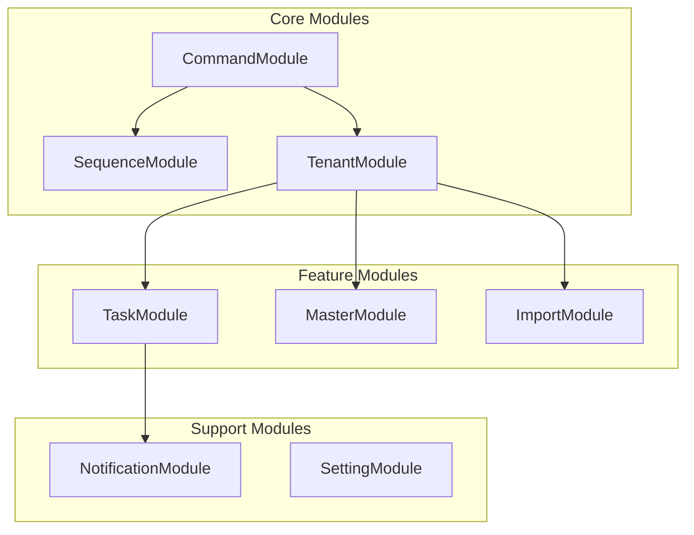

# Modules

The MBC CQRS Serverless framework provides a comprehensive set of modules for building enterprise-grade serverless applications. Each module is designed to handle specific concerns while maintaining consistency with the CQRS and Event Sourcing patterns.

## Module Overview



## Core Modules

| Module | Package | Description |
|------------|-------------|-----------------|
| Command Module | `@mbc-cqrs-serverless/core` | CQRS command handling, data synchronization, event sourcing |
| Sequence Module | `@mbc-cqrs-serverless/sequence` | Thread-safe sequential ID generation |
| Tenant Module | `@mbc-cqrs-serverless/tenant` | Multi-tenant data isolation and management |

## Feature Modules

| Module | Package | Description |
|------------|-------------|-----------------|
| Task Module | `@mbc-cqrs-serverless/task` | Async task execution with Step Functions |
| Master Module | `@mbc-cqrs-serverless/master` | Master data and settings management |
| Import Module | `@mbc-cqrs-serverless/import` | Large-scale CSV import with Distributed Map |

## Support Modules

| Module | Package | Description |
|------------|-------------|-----------------|
| Notification Module | `@mbc-cqrs-serverless/core` | Email notifications via Amazon SES |
| Setting Module | `@mbc-cqrs-serverless/ui-setting` | User interface configuration storage |

## Quick Start

Install the core package:

```bash
npm install @mbc-cqrs-serverless/core
```

Register the CommandModule in your application:

```typescript
import { CommandModule } from '@mbc-cqrs-serverless/core';

@Module({
  imports: [
    CommandModule.register({
      tableName: 'your-table-name',
    }),
  ],
})
export class YourModule {}
```

## Common Patterns

### Service Injection

All services are available for injection in your NestJS providers:

```typescript
import { CommandService, DataService } from '@mbc-cqrs-serverless/core';

@Injectable()
export class YourService {
  constructor(
    private readonly commandService: CommandService,
    private readonly dataService: DataService,
  ) {}
}
```

### Multi-Tenant Context

Most operations require tenant context for data isolation:

```typescript
async createItem(tenantCode: string, data: CreateDto, invokeContext: IInvoke) {
  return this.commandService.publishAsync({
    pk: `${tenantCode}#ITEM`,
    sk: data.id,
    tenantCode,
    // ... other fields
  }, { invokeContext });
}
```

## Module Documentation

Explore each module's detailed documentation:

```mdx-code-block
import DocCardList from '@theme/DocCardList';

<DocCardList />
```
