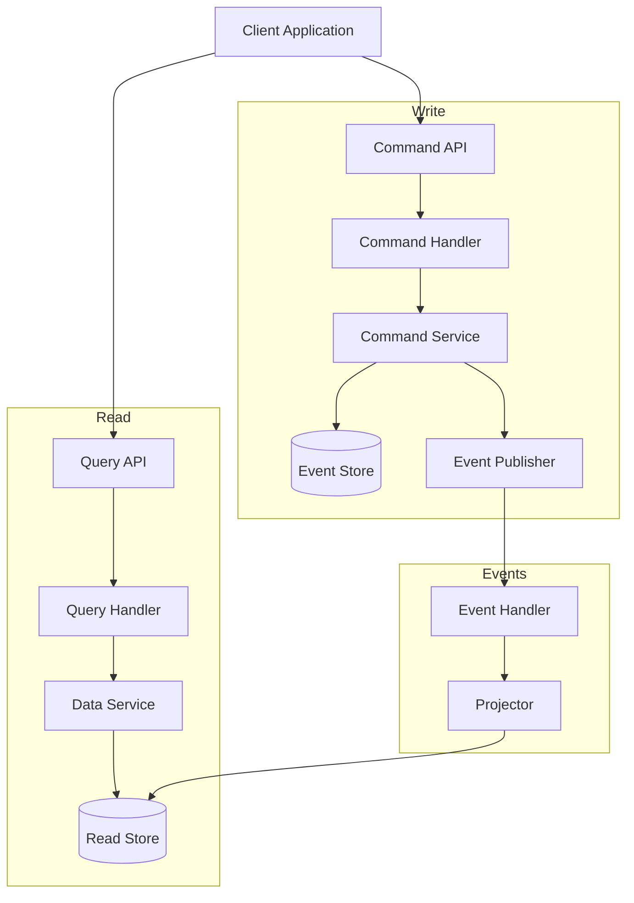
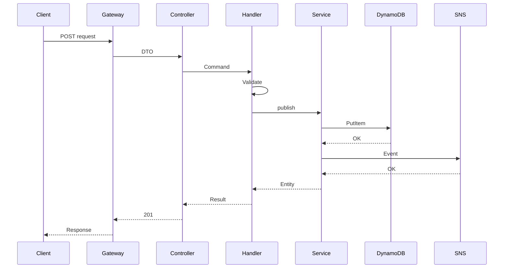
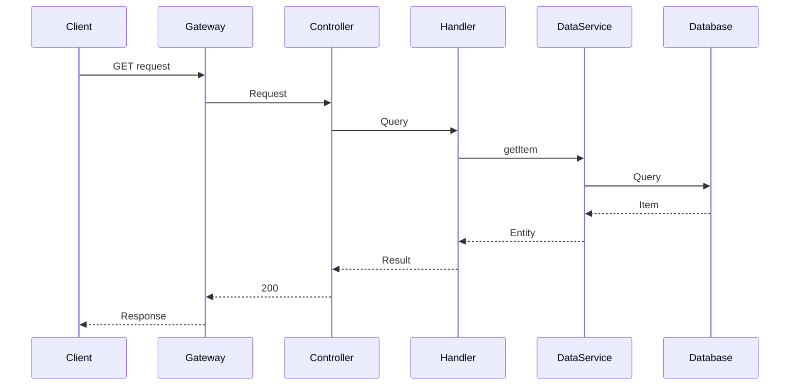

# CQRS Pattern Flow

This document explains how the CQRS (Command Query Responsibility Segregation) pattern is implemented in MBC CQRS Serverless.

## CQRS Overview



## Command Flow - Write Path

The flow of write operations.



### Command Flow Steps

1. **Request Received**: Client sends POST/PUT/DELETE request
2. **DTO Validation**: Controller validates input using class-validator
3. **Command Dispatch**: Controller creates and dispatches command
4. **Business Logic**: Command handler executes business rules
5. **Persistence**: Command service persists to DynamoDB with optimistic locking
6. **Event Publishing**: Domain events are published to SNS
7. **Response**: Success response returned to client

## Query Flow - Read Path

The flow of read operations.



### Query Flow Steps

1. **Request Received**: Client sends GET request
2. **Query Dispatch**: Controller creates and dispatches query
3. **Data Retrieval**: Query handler calls data service
4. **Database Query**: Data service queries DynamoDB or RDS
5. **Response**: Data returned to client

## Read-Your-Writes Consistency {#read-your-writes}

### The Eventual Consistency Challenge

Because `publishAsync` writes to the command table and then returns immediately — before the SNS-triggered projector has updated the read store — there is a short window where a subsequent read will return stale data:

```
publishAsync()
     │
     ▼
CommandTable ──► SNS ──► Lambda ──► ReadStore
     │                                  ▲
     │              ~async window~       │
     └──── publishAsync returns ────     │
                                         │
Client reads here ───────────────────────┘  ← may return OLD data
```

This is expected behaviour in an eventually-consistent system, but can cause confusing UX when a user creates/updates a record and immediately navigates to the list — only to see the previous state.

### Read-Your-Writes (RYW) Solution {#ryw-solution}

MBC CQRS Serverless v1.2.0 introduced a session-based **Read-Your-Writes** layer that bridges this async window for the user who just issued the write:

```
publishAsync()
     │
     ├──► CommandTable ──► SNS ──► Lambda ──► ReadStore
     │
     └──► SessionTable  ← small TTL-bounded entry
               │
               ▼
         Repository.getItem / listItemsByPk / listItems
               │
               ├── fetch from ReadStore  (DataService)
               └── fetch pending commands from SessionTable
                         │
                         └── merge → return consistent result
```

When `RYW_SESSION_TTL_MINUTES` is set, after each `publishAsync` / `publishPartialUpdateAsync` call the `SessionService` writes a short-lived entry to a dedicated session table. The `Repository` class (which wraps `DataService`) automatically reads those entries and merges any pending commands into the query result — so the caller sees their own write immediately, even before the projector has run.

### RYW Concepts at a Glance

| Concept | Description |
|-------------|-----------------|
| Session entry | Written by `SessionService.put()` after every successful `publishAsync`; expires after `RYW_SESSION_TTL_MINUTES` minutes |
| Repository | Drop-in replacement for `DataService` that transparently applies the RYW merge |
| Merge strategy | Pending `create` commands are prepended; pending `delete` commands are filtered out; `update` / `partial-update` are applied on top of the read-store item |
| Fallback | When `RYW_SESSION_TTL_MINUTES` is unset or set to a non-positive value, `SessionService.put()` is a no-op and `Repository` behaves identically to `DataService` |

:::info Version Note (v1.2.0)
Read-Your-Writes support (`SessionService`, `Repository`) was added in [v1.2.0](/docs/changelog#v120). Enabling it requires setting `RYW_SESSION_TTL_MINUTES` and provisioning a session DynamoDB table.

See the [Read-Your-Writes implementation guide](/docs/command-service#read-your-writes) for setup steps and full API reference.
:::

## Key Components

### Command Handler

```typescript
@CommandHandler(CreateResourceCommand)
export class CreateResourceHandler
  implements ICommandHandler<CreateResourceCommand> {

  constructor(private readonly commandService: CommandService) {}

  async execute(command: CreateResourceCommand): Promise<DataEntity> {
    // 1. Validate business rules
    // 2. Create entity
    // 3. Persist and publish event
    return this.commandService.publishAsync(entity, { invokeContext });
  }
}
```

### Query Handler

```typescript
@QueryHandler(GetResourceQuery)
export class GetResourceHandler
  implements IQueryHandler<GetResourceQuery> {

  constructor(private readonly dataService: DataService) {}

  async execute(query: GetResourceQuery): Promise<DataEntity> {
    return this.dataService.getItem({
      pk: query.pk,
      sk: query.sk,
    });
  }
}
```

## Benefits of CQRS

Adopting the CQRS pattern provides these benefits:

- **Scalability**: Read and write can be scaled independently
- **Optimization**: Optimize each side for its specific purpose
- **Flexibility**: Use different data models for reads and writes
- **Performance**: Denormalize read models for fast queries
- **Auditability**: Complete event history for audit trails
