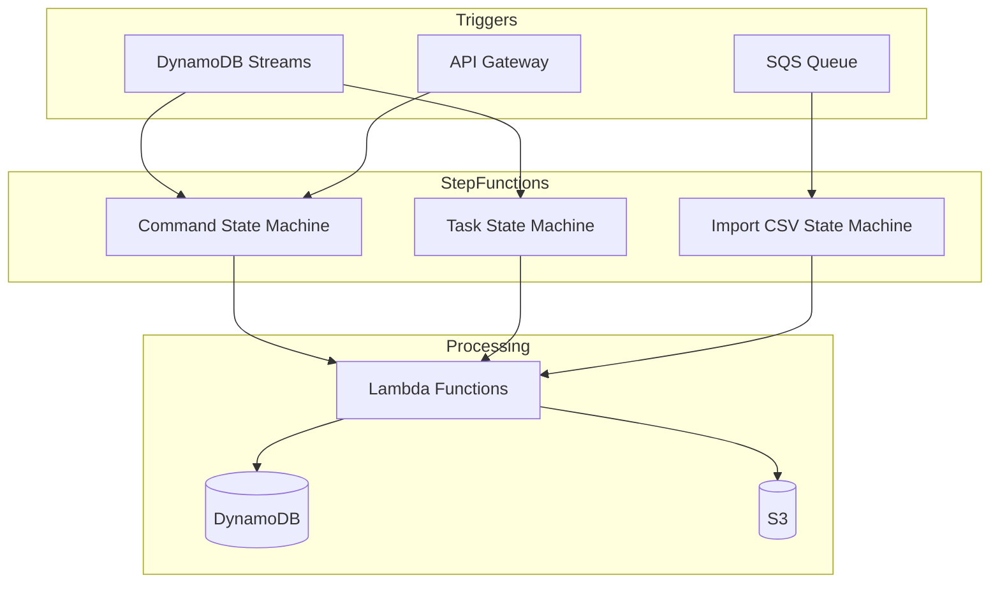
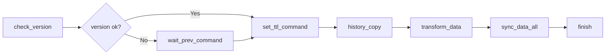
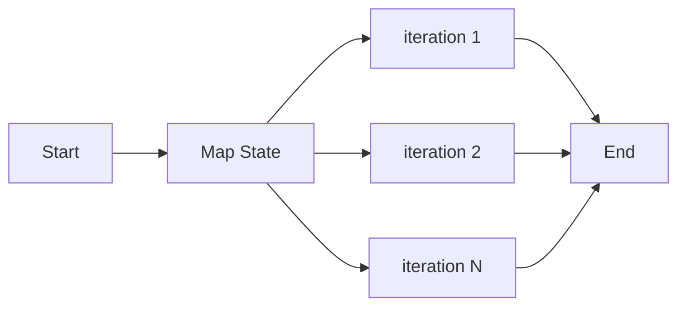
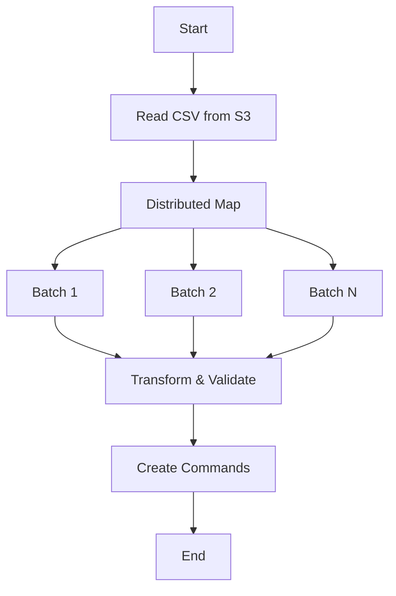
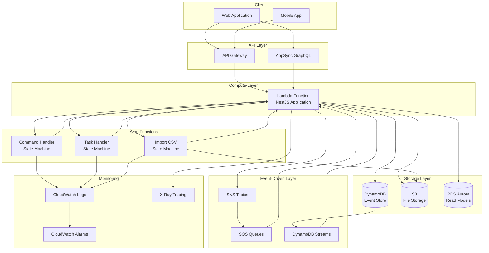
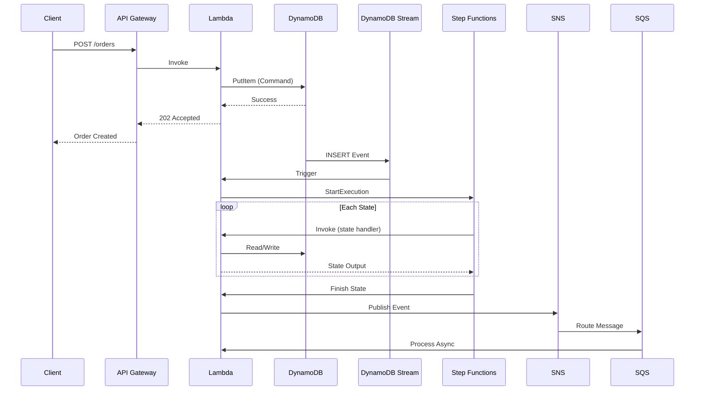

# Step Functions

AWS Step Functions provides serverless workflow orchestration for coordinating distributed applications. In the MBC CQRS Serverless framework, Step Functions are used for:

- Long-running workflow orchestration
- Saga pattern implementation for distributed transactions
- Parallel batch processing with Distributed Map
- Asynchronous task coordination with callback patterns

## Architecture Overview



## State Machines

The framework provides three pre-configured state machines:

### Command State Machine

Handles data synchronization workflows with version control and parallel processing.



Key features:

- **Version checking**: Ensures command ordering and prevents conflicts
- **Async callback**: Waits for previous commands using task tokens
- **Parallel sync**: Uses Map state to sync data across multiple targets
- **TTL management**: Automatically sets expiration on records

### Task State Machine

Executes parallel sub-tasks with controlled concurrency.



Key features:

- **Controlled concurrency**: Limits parallel executions (default: 2)
- **Status tracking**: Real-time task status updates
- **Error handling**: Automatic failure detection and reporting

### Import CSV State Machine

Processes large CSV files using AWS Distributed Map for massive parallelism.



Key features:

- **S3 native integration**: Reads CSV directly from S3
- **Batch processing**: Groups rows for efficient processing
- **High concurrency**: Supports up to 50 concurrent batch processors
- **EXPRESS execution**: Uses express workflows for child state machines

## System Configuration Example

The following diagram shows how Step Functions integrate with other AWS services in a typical production environment:



### Data Flow Example

Here is a typical data flow for a command execution with Step Functions:



## CDK Implementation Examples

### Complete Command State Machine

The following CDK code shows how to create a complete command handler state machine:

```typescript
import * as cdk from 'aws-cdk-lib';
import * as sfn from 'aws-cdk-lib/aws-stepfunctions';
import * as tasks from 'aws-cdk-lib/aws-stepfunctions-tasks';
import * as lambda from 'aws-cdk-lib/aws-lambda';
import * as logs from 'aws-cdk-lib/aws-logs';
import { Construct } from 'constructs';

export class CommandStateMachineConstruct extends Construct {
  public readonly stateMachine: sfn.StateMachine;

  constructor(scope: Construct, id: string, props: { lambdaFunction: lambda.IFunction }) {
    super(scope, id);

    const { lambdaFunction } = props;

    // Helper function to create Lambda invoke tasks
    const createLambdaTask = (
      stateName: string,
      integrationPattern: sfn.IntegrationPattern = sfn.IntegrationPattern.REQUEST_RESPONSE
    ) => {
      const payload: Record<string, any> = {
        'source': 'step-function',
        'context.$': '$$',
        'input.$': '$',
      };

      // Add task token for callback pattern
      if (integrationPattern === sfn.IntegrationPattern.WAIT_FOR_TASK_TOKEN) {
        payload['taskToken'] = sfn.JsonPath.taskToken;
      }

      return new tasks.LambdaInvoke(this, stateName, {
        lambdaFunction,
        payload: sfn.TaskInput.fromObject(payload),
        stateName,
        outputPath: '$.Payload[0][0]',
        integrationPattern,
        retryOnServiceExceptions: true,
      });
    };

    // Define states
    const fail = new sfn.Fail(this, 'fail', {
      stateName: 'fail',
      causePath: '$.cause',
      errorPath: '$.error',
    });

    const success = new sfn.Succeed(this, 'success', {
      stateName: 'success',
    });

    // Create task states
    const finish = createLambdaTask('finish').next(success);

    const syncData = createLambdaTask('sync_data');

    // Map state for parallel data sync
    const syncDataAll = new sfn.Map(this, 'sync_data_all', {
      stateName: 'sync_data_all',
      maxConcurrency: 0, // Unlimited concurrency
      itemsPath: sfn.JsonPath.stringAt('$'),
    })
      .itemProcessor(syncData)
      .next(finish);

    const transformData = createLambdaTask('transform_data').next(syncDataAll);
    const historyCopy = createLambdaTask('history_copy').next(transformData);
    const setTtlCommand = createLambdaTask('set_ttl_command').next(historyCopy);

    // Callback pattern for waiting on previous command
    const waitPrevCommand = createLambdaTask(
      'wait_prev_command',
      sfn.IntegrationPattern.WAIT_FOR_TASK_TOKEN
    ).next(setTtlCommand);

    // Choice state for version checking
    const checkVersionResult = new sfn.Choice(this, 'check_version_result', {
      stateName: 'check_version_result',
    })
      .when(sfn.Condition.numberEquals('$.result', 0), setTtlCommand)
      .when(sfn.Condition.numberEquals('$.result', 1), waitPrevCommand)
      .when(sfn.Condition.numberEquals('$.result', -1), fail)
      .otherwise(waitPrevCommand);

    const checkVersion = createLambdaTask('check_version').next(checkVersionResult);

    // Create log group
    const logGroup = new logs.LogGroup(this, 'StateMachineLogGroup', {
      logGroupName: '/aws/vendedlogs/states/command-handler-logs',
      removalPolicy: cdk.RemovalPolicy.DESTROY,
      retention: logs.RetentionDays.SIX_MONTHS,
    });

    // Create state machine
    this.stateMachine = new sfn.StateMachine(this, 'CommandHandlerStateMachine', {
      stateMachineName: 'command-handler',
      comment: 'Handles command stream processing with version control',
      definitionBody: sfn.DefinitionBody.fromChainable(checkVersion),
      tracingEnabled: true,
      logs: {
        destination: logGroup,
        level: sfn.LogLevel.ALL,
      },
    });
  }
}
```

### Task State Machine with Controlled Concurrency

```typescript
export class TaskStateMachineConstruct extends Construct {
  public readonly stateMachine: sfn.StateMachine;

  constructor(scope: Construct, id: string, props: { lambdaFunction: lambda.IFunction }) {
    super(scope, id);

    const { lambdaFunction } = props;

    // Iterator task for each item
    const iteratorTask = new tasks.LambdaInvoke(this, 'iterator', {
      lambdaFunction,
      payload: sfn.TaskInput.fromObject({
        'source': 'step-function',
        'context.$': '$$',
        'input.$': '$',
      }),
      stateName: 'iterator',
      outputPath: '$.Payload[0][0]',
    });

    // Map state with concurrency limit
    const mapState = new sfn.Map(this, 'TaskMapState', {
      stateName: 'map_state',
      maxConcurrency: 2, // Process 2 items at a time
      inputPath: '$',
      itemsPath: sfn.JsonPath.stringAt('$'),
    }).itemProcessor(iteratorTask);

    // Create log group
    const logGroup = new logs.LogGroup(this, 'TaskLogGroup', {
      logGroupName: '/aws/vendedlogs/states/task-handler-logs',
      removalPolicy: cdk.RemovalPolicy.DESTROY,
      retention: logs.RetentionDays.SIX_MONTHS,
    });

    // Create state machine
    this.stateMachine = new sfn.StateMachine(this, 'TaskHandlerStateMachine', {
      stateMachineName: 'task-handler',
      comment: 'Handles parallel task execution with concurrency control',
      definition: mapState,
      timeout: cdk.Duration.minutes(15),
      tracingEnabled: true,
      logs: {
        destination: logGroup,
        level: sfn.LogLevel.ALL,
      },
    });
  }
}
```

### Distributed Map for CSV Import

For processing large CSV files, use Distributed Map which provides native S3 integration:

```typescript
import { Map as SfnMap, ProcessorMode, ProcessorConfig, IChainable, JsonPath } from 'aws-cdk-lib/aws-stepfunctions';

// Custom Distributed Map class for S3 CSV processing
export class DistributedMap extends SfnMap {
  public itemReader?: DistributedMapItemReader;
  public itemBatcher?: DistributedMapItemBatcher;
  public label?: string;

  public override toStateJson(): object {
    const mapStateJson = super.toStateJson();
    return {
      ...mapStateJson,
      ItemReader: this.itemReader,
      ItemBatcher: this.itemBatcher,
      Label: this.label,
    };
  }

  public itemProcessor(processor: IChainable, config: ProcessorConfig = {}): DistributedMap {
    super.itemProcessor(processor, {
      ...config,
      mode: ProcessorMode.DISTRIBUTED,
    });
    return this;
  }

  public setItemReader(itemReader: DistributedMapItemReader): DistributedMap {
    this.itemReader = itemReader;
    return this;
  }

  public setItemBatcher(itemBatcher: DistributedMapItemBatcher): DistributedMap {
    this.itemBatcher = itemBatcher;
    return this;
  }

  public setLabel(label: string): DistributedMap {
    this.label = label;
    return this;
  }
}

// Usage in your stack
const csvRowsHandler = new tasks.LambdaInvoke(this, 'csv_rows_handler', {
  lambdaFunction,
  payload: sfn.TaskInput.fromObject({
    'source': 'step-function',
    'context.$': '$$',
    'input.$': '$',
  }),
  stateName: 'csv_rows_handler',
});

const importCsvDefinition = new DistributedMap(this, 'import-csv', {
  maxConcurrency: 50, // Process up to 50 batches in parallel
})
  .setLabel('import-csv')
  .setItemReader({
    Resource: 'arn:aws:states:::s3:getObject',
    ReaderConfig: {
      InputType: 'CSV',
      CSVHeaderLocation: 'FIRST_ROW',
    },
    Parameters: {
      'Bucket.$': '$.bucket',
      'Key.$': '$.key',
    },
  })
  .setItemBatcher({
    MaxInputBytesPerBatch: 10,
    BatchInput: {
      'Attributes.$': '$',
    },
  })
  .itemProcessor(csvRowsHandler, {
    executionType: sfn.ProcessorType.EXPRESS, // Use EXPRESS for child executions
  });

const importCsvStateMachine = new sfn.StateMachine(this, 'ImportCsvStateMachine', {
  stateMachineName: 'import-csv',
  comment: 'Processes large CSV files with distributed batch processing',
  definitionBody: sfn.DefinitionBody.fromChainable(importCsvDefinition),
  tracingEnabled: true,
});
```

### Event Source Configuration

Configure DynamoDB Streams and SQS to trigger Step Functions:

```typescript
// DynamoDB Stream event source
const tableNames = ['tasks', 'commands', 'import_tmp'];

for (const tableName of tableNames) {
  const table = dynamodb.Table.fromTableAttributes(this, `${tableName}-table`, {
    tableArn: `arn:aws:dynamodb:${region}:${account}:table/${prefix}${tableName}`,
    tableStreamArn: `arn:aws:dynamodb:${region}:${account}:table/${prefix}${tableName}/stream/*`,
  });

  lambdaFunction.addEventSource(
    new lambdaEventSources.DynamoEventSource(table, {
      startingPosition: lambda.StartingPosition.TRIM_HORIZON,
      batchSize: 1,
      filters: [
        lambda.FilterCriteria.filter({
          eventName: lambda.FilterRule.isEqual('INSERT'),
        }),
      ],
    })
  );
}

// SQS event sources
const queues = ['task-action-queue', 'notification-queue', 'import-action-queue'];

for (const queueName of queues) {
  const queue = sqs.Queue.fromQueueArn(
    this,
    queueName,
    `arn:aws:sqs:${region}:${account}:${prefix}${queueName}`
  );

  lambdaFunction.addEventSource(
    new lambdaEventSources.SqsEventSource(queue, {
      batchSize: 1,
    })
  );
}
```

## Implementation Guide

### Step 1: Infrastructure Setup

The framework automatically provisions Step Functions infrastructure using AWS CDK. Key resources include:

```typescript
// State machine definition in CDK
const commandStateMachine = new sfn.StateMachine(this, 'CommandHandler', {
  stateMachineName: 'command',
  definitionBody: sfn.DefinitionBody.fromChainable(definition),
  timeout: Duration.minutes(15),
  tracingEnabled: true,
  logs: {
    destination: logGroup,
    level: sfn.LogLevel.ALL,
  },
});
```

### Step 2: Define Step Function Events

Create event classes that extend the base Step Function event:

```typescript
import { IEvent } from '@mbc-cqrs-serverless/core';
import { StepFunctionsContext } from '@mbc-cqrs-serverless/core';

export class CustomWorkflowEvent implements IEvent {
  source: string;
  context: StepFunctionsContext;
  input?: WorkflowInput;
  taskToken?: string;
}
```

### Step 3: Implement Event Handlers

Create handlers that process Step Function events:

```typescript
import { EventHandler, IEventHandler } from '@mbc-cqrs-serverless/core';
import { Logger } from '@nestjs/common';

@EventHandler(CustomWorkflowEvent)
export class CustomWorkflowHandler implements IEventHandler<CustomWorkflowEvent> {
  private readonly logger = new Logger(CustomWorkflowHandler.name);

  async execute(event: CustomWorkflowEvent): Promise<StepStateOutput> {
    const stateName = event.context.State.Name;

    switch (stateName) {
      case 'initialize':
        return this.handleInitialize(event);
      case 'process':
        return this.handleProcess(event);
      case 'finalize':
        return this.handleFinalize(event);
      default:
        throw new Error(`Unknown state: ${stateName}`);
    }
  }

  private async handleInitialize(event: CustomWorkflowEvent) {
    // Initialization logic
    return { status: 'initialized', data: event.input };
  }

  private async handleProcess(event: CustomWorkflowEvent) {
    // Processing logic
    return { status: 'processed' };
  }

  private async handleFinalize(event: CustomWorkflowEvent) {
    // Finalization logic
    return { status: 'completed' };
  }
}
```

### Step 4: Configure Event Factory

Register your Step Function events in the event factory:

```typescript
import { EventFactory, IEvent, StepFunctionsEvent } from '@mbc-cqrs-serverless/core';

@EventFactory()
export class CustomEventFactory {
  async transformStepFunction(event: StepFunctionsEvent<any>): Promise<IEvent[]> {
    const stateMachineName = event.context.StateMachine.Name;

    if (stateMachineName.includes('custom-workflow')) {
      return [new CustomWorkflowEvent(event)];
    }

    return [];
  }
}
```

### Step 5: Trigger State Machine Execution

Start a state machine execution from your service:

```typescript
import { StepFunctionService } from '@mbc-cqrs-serverless/core';
import { Injectable } from '@nestjs/common';

@Injectable()
export class WorkflowService {
  constructor(private readonly sfnService: StepFunctionService) {}

  async startWorkflow(input: WorkflowInput): Promise<string> {
    const executionArn = await this.sfnService.startExecution({
      stateMachineArn: process.env.WORKFLOW_STATE_MACHINE_ARN,
      input: JSON.stringify(input),
      name: `workflow-${Date.now()}`,
    });

    return executionArn;
  }
}
```

## Use Cases

### Use Case 1: Data Synchronization

Synchronize data across multiple tables with version control and conflict resolution.

**Scenario**: When a command is created, sync the data to multiple read models.

```typescript
// Trigger: DynamoDB Stream INSERT event
// Flow: check_version -> set_ttl -> history_copy -> transform -> sync_all -> finish

await this.commandService.publish({
  pk: 'TENANT#tenant1',
  sk: 'ORDER#order123',
  attributes: { status: 'confirmed', total: 1000 },
});
// This triggers the command state machine automatically
```

### Use Case 2: Batch Task Processing

Execute multiple related tasks in parallel with controlled concurrency.

**Scenario**: Process multiple items in a batch job with status tracking.

```typescript
// Create tasks that will be processed by the task state machine
const items = [
  { itemId: 'item1', action: 'process' },
  { itemId: 'item2', action: 'process' },
  { itemId: 'item3', action: 'process' },
];

await this.taskService.createStepFunctionTask({
  input: items,
  taskType: 'batch-processor',
  tenantCode: 'tenant1',
}, { invokeContext });
```

### Use Case 3: Large-Scale CSV Import

Import millions of rows from CSV files with distributed processing.

**Scenario**: Import a large CSV file from S3 with validation and transformation.

```typescript
// Trigger CSV import via API or direct invocation
await this.importService.createCsvImport({
  s3Bucket: 'my-bucket',
  s3Key: 'imports/data.csv',
  tableName: 'products',
  processingMode: ProcessingMode.STEP_FUNCTION,
});

// The import-csv state machine will:
// 1. Read CSV from S3
// 2. Batch rows (default: 10 per batch)
// 3. Process up to 50 batches concurrently
// 4. Transform and validate each row
// 5. Create import commands
```

### Use Case 4: Async Callback Pattern

Wait for external events using task tokens.

**Scenario**: Wait for approval before proceeding with a workflow.

```typescript
// In your state machine definition
{
  "WaitForApproval": {
    "Type": "Task",
    "Resource": "arn:aws:states:::lambda:invoke.waitForTaskToken",
    "Parameters": {
      "FunctionName": "${LambdaFunction}",
      "Payload": {
        "taskToken.$": "$$.Task.Token",
        "requestId.$": "$.requestId"
      }
    },
    "Next": "ProcessApproval"
  }
}

// In your handler, store the task token
async handleWaitForApproval(event: ApprovalEvent) {
  await this.approvalService.createApprovalRequest({
    requestId: event.input.requestId,
    taskToken: event.taskToken, // Store for later callback
  });
}

// When approval is received, resume the workflow
async approveRequest(requestId: string) {
  const request = await this.approvalService.getRequest(requestId);

  await this.sfnService.sendTaskSuccess({
    taskToken: request.taskToken,
    output: JSON.stringify({ approved: true }),
  });
}
```

## Step Functions Context

Every Step Function event includes context information about the execution:

```typescript
interface StepFunctionsContext {
  Execution: {
    Id: string;        // Execution ARN
    Input: object;     // Original input
    Name: string;      // Execution name
    RoleArn: string;   // IAM role
    StartTime: string; // ISO timestamp
  };
  State: {
    EnteredTime: string; // When this state started
    Name: string;        // Current state name
    RetryCount: number;  // Retry attempt number
  };
  StateMachine: {
    Id: string;   // State machine ARN
    Name: string; // State machine name
  };
}
```

## Error Handling

Implement robust error handling in your state machines:

```typescript
// In your handler
async execute(event: WorkflowEvent): Promise<StepStateOutput> {
  try {
    const result = await this.processEvent(event);
    return { status: 'success', result };
  } catch (error) {
    // Log error for debugging
    this.logger.error('Workflow step failed', error);

    // Return error information for state machine
    return {
      status: 'error',
      error: error.message,
      cause: error.stack,
    };
  }
}
```

State machine error handling configuration:

```json
{
  "ProcessStep": {
    "Type": "Task",
    "Resource": "${LambdaArn}",
    "Retry": [
      {
        "ErrorEquals": ["States.TaskFailed"],
        "IntervalSeconds": 2,
        "MaxAttempts": 3,
        "BackoffRate": 2
      }
    ],
    "Catch": [
      {
        "ErrorEquals": ["States.ALL"],
        "Next": "HandleError",
        "ResultPath": "$.error"
      }
    ],
    "Next": "NextStep"
  }
}
```

## Best Practices

### Design Principles

1. **Idempotency**: Design each state to be safely retryable
2. **Single Responsibility**: Each state should do one thing well
3. **Timeout Configuration**: Set appropriate timeouts for each state
4. **Logging**: Enable comprehensive logging for debugging

### Performance Optimization

1. **Use Express Workflows**: For high-volume, short-duration workflows
2. **Batch Processing**: Group items to reduce state transitions
3. **Concurrency Limits**: Set appropriate limits to prevent throttling
4. **S3 Integration**: Use native S3 integration for large data processing

### Monitoring

1. **CloudWatch Metrics**: Monitor execution counts, failures, and duration
2. **X-Ray Tracing**: Enable distributed tracing for debugging
3. **CloudWatch Logs**: Capture detailed execution logs
4. **Alarms**: Set up alerts for failure rates and execution times

## Related Documentation

- [Task Module](../tasks.md) - Task management with Step Functions
- [Import/Export Patterns](../import-export-patterns.md) - CSV import with Distributed Map
- [Event Sourcing](./event-sourcing.md) - Event-driven architecture
- [CQRS Flow](./cqrs-flow.md) - Command and query separation
