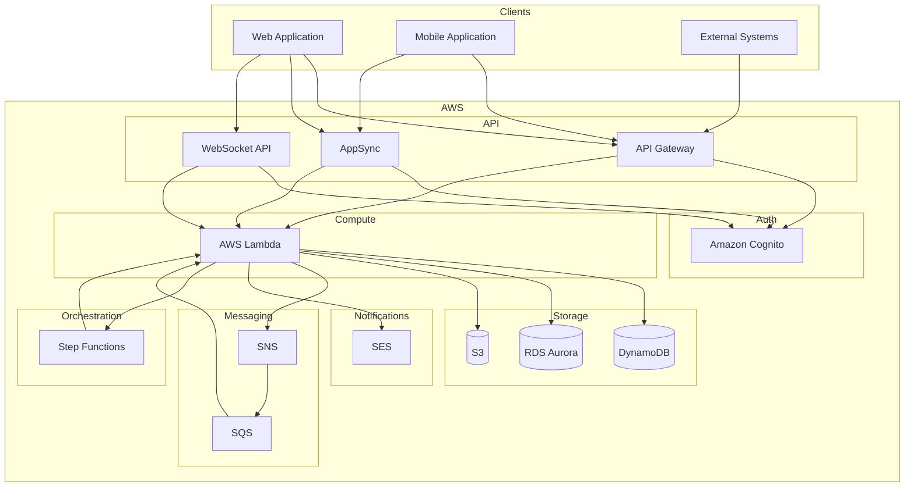
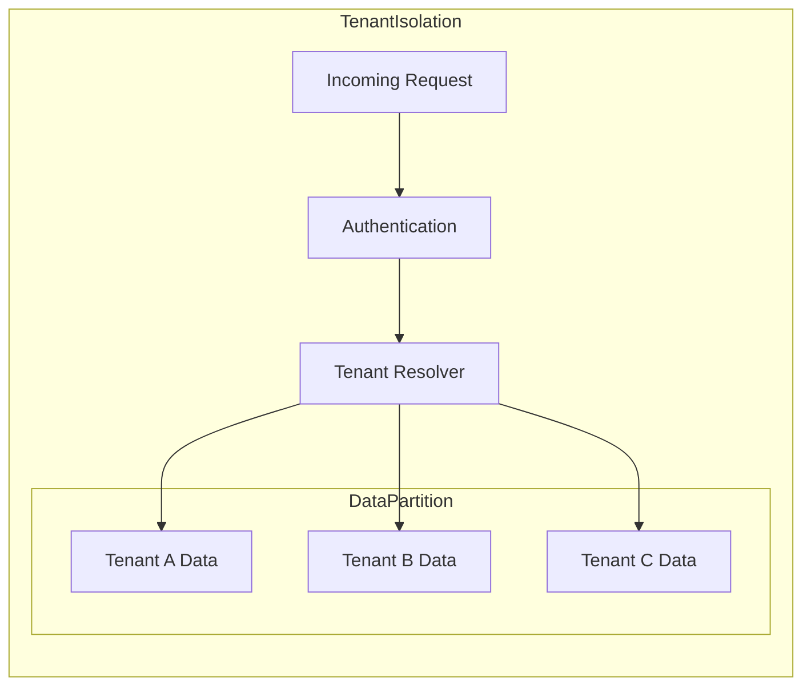

# System Architecture Overview

This document provides an overview of the MBC CQRS Serverless framework architecture.

## AWS Infrastructure

## Component Description

### API Layer

The entry point for receiving client requests.

- **API Gateway**: REST API endpoints for CRUD operations
- **AppSync**: GraphQL API for flexible queries and subscriptions
- **WebSocket API**: Real-time bidirectional communication

### Authentication

- **Amazon Cognito**: User authentication, JWT tokens, and user pools

### Compute

- **AWS Lambda**: Serverless execution of NestJS applications

### Data Storage

- **DynamoDB**: Primary event store for CQRS data persistence
- **RDS Aurora**: Optional relational data for complex queries
- **S3**: File and document storage

### Messaging

- **SNS**: Event fan-out and topic-based publishing
- **SQS**: Reliable message queuing and async processing

### Orchestration

- **Step Functions**: Long-running workflows and saga patterns

### Notifications

- **SES**: Transactional email delivery

## Data Flow

How requests flow through the system.

1. **Client Request**: Client sends request via API Gateway, AppSync, or WebSocket
2. **Authentication**: Cognito validates JWT tokens
3. **Command Execution**: Lambda processes command and persists to DynamoDB
4. **Event Publishing**: Events are published to SNS
5. **Event Processing**: SQS queues trigger Lambda handlers for async processing
6. **Read Model Update**: Projections update RDS for complex queries

## Multi-Tenant Architecture

Tenant isolation is achieved through:

- **Partition Key Prefix**: Each tenant's data is prefixed with the tenant code
- **Request Context**: Tenant information is extracted from JWT tokens
- **Query Filtering**: All queries are automatically scoped to the tenant
