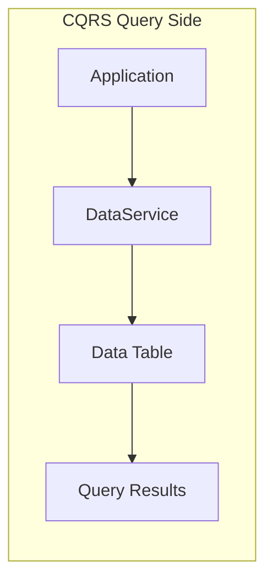

# DataService

## Overview

The `DataService` is the query side of the CQRS pattern, providing efficient read operations for data stored in DynamoDB. It handles all read operations from the data table (the read model) which is optimized for queries.



Before using the DataService, you need to set up the CommandModule as described in [the CommandService section](./command-service.md).

## Methods

### *async* `getItem(key: DetailKey)`

The `getItem` method returns a set of attributes for the item with the given detail/primary key. If there is no matching item, `getItem` does not return any data and there will be no item element in the response.

Example:

```ts
import { Injectable, NotFoundException } from '@nestjs/common';
import { DataService } from '@mbc-cqrs-serverless/core';

@Injectable()
export class CatService {
  constructor(private readonly dataService: DataService) {}

  async getCat(pk: string, sk: string): Promise<CatDataEntity> {
    const item = await this.dataService.getItem({ pk, sk });

    if (!item) {
      throw new NotFoundException('Cat not found');
    }
    return new CatDataEntity(item as CatDataEntity);
  }
}
```

### *async* `listItemsByPk(pk: string, opts?: ListItemsOptions)`

The `listItemsByPk` method returns one or more items matching the partition key. It supports filtering, pagination, and sorting.

#### Basic Usage

List all items by primary key (`pk`):

```ts
const res = await this.dataService.listItemsByPk(pk);
return new CatListEntity(res as CatListEntity);
```

#### With Sort Key Filter

List items by primary key (`pk`) and use a filter expression on the sort key (`sk`). For example, get items where the sort key starts with `CAT#` and limit to 100 items:

```ts
const query = {
  sk: {
    skExpession: 'begins_with(sk, :typeCode)',
    skAttributeValues: {
      ':typeCode': `CAT${KEY_SEPARATOR}`,
    },
  },
  limit: 100,
};
const res = await this.dataService.listItemsByPk(pk, query);
return new CatDataListEntity(res as CatDataListEntity);
```

#### Pagination

Implement pagination using `startFromSk` and `limit`:

```ts
async listCatsWithPagination(
  tenantCode: string,
  pageSize: number,
  lastSk?: string
): Promise<{ items: CatDataEntity[]; lastSk?: string }> {
  const pk = `${tenantCode}#CAT`;

  const result = await this.dataService.listItemsByPk(pk, {
    limit: pageSize,
    startFromSk: lastSk,
  });

  return {
    items: result.items.map(item => new CatDataEntity(item)),
    lastSk: result.lastSk,
  };
}
```

#### Sort Key Operators

The following sort key expressions are supported:

| Operator | Expression | Description |
|-----------|------------|-------------|
| Equals | `sk = :value` | Exact match |
| Begins With | `begins_with(sk, :prefix)` | Prefix match |
| Between | `sk BETWEEN :start AND :end` | Range query |
| Less Than | `sk < :value` | Less than comparison |
| Greater Than | `sk > :value` | Greater than comparison |

Example with range query:

```ts
const query = {
  sk: {
    skExpession: 'sk BETWEEN :start AND :end',
    skAttributeValues: {
      ':start': 'ORDER#2024-01-01',
      ':end': 'ORDER#2024-12-31',
    },
  },
};
const res = await this.dataService.listItemsByPk(pk, query);
```

### *async* `publish(cmd: CommandModel): Promise<DataModel>`

The `publish` method publishes command data to the data table. This is typically called internally by the framework's data sync handlers, but can be used directly when implementing custom synchronization logic.

:::note
This method is primarily used internally by the framework. In most cases, you should use `CommandService.publishSync()` or `CommandService.publishAsync()` which automatically handles data synchronization.
:::

```ts
import { DataService, CommandModel } from "@mbc-cqrs-serverless/core";

// Custom data sync handler example
async up(cmd: CommandModel): Promise<void> {
  // Publish command to data table
  const dataModel = await this.dataService.publish(cmd);

  // Additional synchronization to external systems
  await this.syncToExternalSystem(dataModel);
}
```

The method:
- Converts CommandModel to DataModel format
- Removes version suffix from sort key
- Preserves original creation metadata (createdAt, createdBy, createdIp)
- Updates modification metadata (updatedAt, updatedBy, updatedIp)
- Stores the data in the data table

## Common Patterns

### Search by Code

Find an item by its unique code within a tenant:

```ts
async findByCode(tenantCode: string, code: string): Promise<CatDataEntity | null> {
  const pk = `${tenantCode}#CAT`;
  const sk = `CAT#${code}`;

  const item = await this.dataService.getItem({ pk, sk });
  return item ? new CatDataEntity(item) : null;
}
```

### List with Type Filter

List items filtered by type:

```ts
async listByType(tenantCode: string, type: string): Promise<CatDataEntity[]> {
  const pk = `${tenantCode}#CAT`;

  const result = await this.dataService.listItemsByPk(pk, {
    sk: {
      skExpession: 'begins_with(sk, :type)',
      skAttributeValues: {
        ':type': `${type}#`,
      },
    },
  });

  return result.items.map(item => new CatDataEntity(item));
}
```

### Error Handling

Handle common query errors gracefully:

```ts
async getItemSafely(pk: string, sk: string): Promise<CatDataEntity> {
  try {
    const item = await this.dataService.getItem({ pk, sk });

    if (!item) {
      throw new NotFoundException(`Item not found: ${pk}/${sk}`);
    }

    return new CatDataEntity(item);
  } catch (error) {
    if (error instanceof NotFoundException) {
      throw error;
    }
    // Log and rethrow unexpected errors
    console.error('Unexpected error querying item:', error);
    throw new InternalServerErrorException('Failed to retrieve item');
  }
}
```

## Type Definitions

### DetailKey

```ts
interface DetailKey {
  pk: string;  // Partition key
  sk: string;  // Sort key
}
```

### ListItemsOptions

```ts
interface ListItemsOptions {
  sk?: {
    skExpession: string;
    skAttributeValues: Record<string, string>;
    skAttributeNames?: Record<string, string>;
  };
  startFromSk?: string;
  limit?: number;
  order?: 'asc' | 'desc';
}
```

### ListItemsResponse

```ts
interface ListItemsResponse {
  items: DataEntity[];
  lastSk?: string;  // Sort key for pagination cursor
  total?: number;   // Total count (if available)
}
```

## Best Practices

1. **Use projection expressions**: Only retrieve the attributes you need to reduce data transfer
2. **Implement pagination**: Always paginate large result sets to avoid memory issues
3. **Cache frequently accessed data**: Consider caching static or slowly changing data
4. **Use appropriate key design**: Design your keys to support your query patterns efficiently
5. **Handle not found cases**: Always check if the item exists before using it
