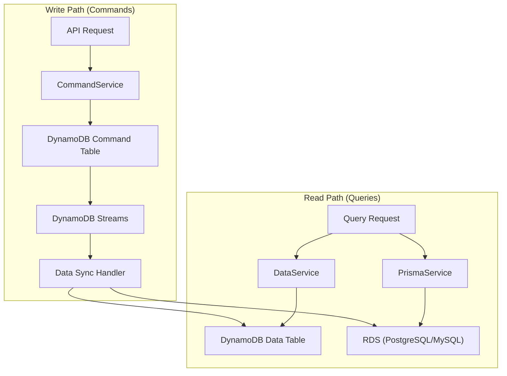
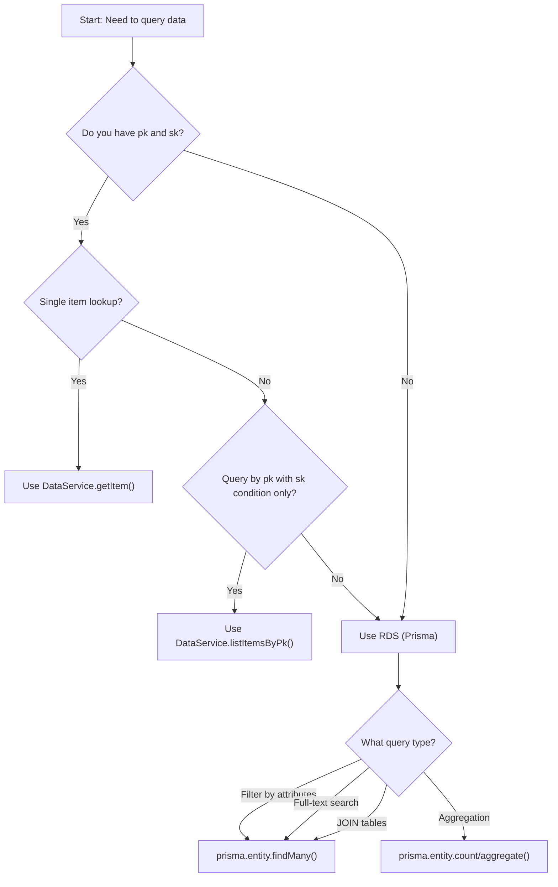

# Database Selection Guide

This guide helps you understand when to query DynamoDB directly versus RDS (via Prisma) in the MBC CQRS Serverless framework.

## Overview of CQRS Data Flow

In the CQRS pattern, write operations (commands) and read operations (queries) are handled separately with different data stores optimized for each purpose.



### Data Flow Explanation

1. **Command Path**: Write operations go through `CommandService` to DynamoDB Command Table
2. **Event Sync**: DynamoDB Streams trigger Data Sync Handlers
3. **Dual Storage**: Data is synchronized to both DynamoDB Data Table and RDS
4. **Query Path**: Read operations choose between `DataService` (DynamoDB) or `PrismaService` (RDS)

## Database Characteristics

### DynamoDB

| Characteristic | Description |
|------------------|---------------|
| Access Pattern | Key-based lookups (pk, sk) |
| Query Types | Get by key, Query by partition key with sort key conditions |
| Strengths | Single-digit millisecond latency, automatic scaling, no connection management |
| Limitations | No JOINs, limited filtering, no full-text search |

### RDS (PostgreSQL/MySQL)

| Characteristic | Description |
|------------------|---------------|
| Access Pattern | SQL-based queries |
| Query Types | Complex filters, JOINs, aggregations, full-text search |
| Strengths | Flexible querying, relational integrity, powerful filtering |
| Limitations | Connection management needed, requires Data Sync Handler setup |

## Decision Matrix

Use this matrix to quickly determine which database to query:

| Query Scenario | Use DynamoDB | Use RDS |
|------------------|----------------|-----------|
| Get single item by pk + sk | **Yes** | No |
| List items by pk with sk prefix | **Yes** | No |
| Filter by multiple non-key attributes | No | **Yes** |
| Full-text search | No | **Yes** |
| JOIN multiple entities | No | **Yes** |
| Aggregate (COUNT, SUM, AVG) | No | **Yes** |
| Sort by non-key attributes | No | **Yes** |
| Pagination with total count | Limited | **Yes** |
| Complex WHERE conditions (OR, LIKE) | No | **Yes** |

## Decision Flowchart



## Code Examples

### Example 1: Single Item Lookup - Use DynamoDB

When you have the exact pk and sk, use DataService for fast, direct access.

```ts
import { DataService } from "@mbc-cqrs-serverless/core";
import { Injectable, NotFoundException } from "@nestjs/common";

@Injectable()
export class ProductService {
  constructor(private readonly dataService: DataService) {}

  async findOne(pk: string, sk: string): Promise<ProductDataEntity> {
    // Direct key lookup - DynamoDB is optimal
    const item = await this.dataService.getItem({ pk, sk });

    if (!item) {
      throw new NotFoundException("Product not found");
    }

    return new ProductDataEntity(item);
  }
}
```

### Example 2: List by Partition Key - Use DynamoDB

When listing items that share the same pk with a sort key filter, use DataService.

```ts
import { DataService, KEY_SEPARATOR } from "@mbc-cqrs-serverless/core";
import { Injectable } from "@nestjs/common";

@Injectable()
export class OrderService {
  constructor(private readonly dataService: DataService) {}

  async listOrdersByTenant(tenantCode: string): Promise<OrderDataEntity[]> {
    const pk = `ORDER${KEY_SEPARATOR}${tenantCode}`;

    // List all orders for a tenant - efficient pk-based query
    const result = await this.dataService.listItemsByPk(pk, {
      sk: {
        skExpression: "begins_with(sk, :prefix)",
        skAttributeValues: {
          ":prefix": "ORDER#",
        },
      },
      limit: 100,
    });

    return result.items.map((item) => new OrderDataEntity(item));
  }

  async listOrderItemsForOrder(
    tenantCode: string,
    orderId: string,
  ): Promise<OrderItemDataEntity[]> {
    const pk = `ORDER${KEY_SEPARATOR}${tenantCode}`;

    // List order items using sk prefix
    const result = await this.dataService.listItemsByPk(pk, {
      sk: {
        skExpression: "begins_with(sk, :prefix)",
        skAttributeValues: {
          ":prefix": `ORDER_ITEM#${orderId}#`,
        },
      },
    });

    return result.items.map((item) => new OrderItemDataEntity(item));
  }
}
```

### Example 3: Complex Filtering - Use RDS

When you need to filter by multiple attributes, use Prisma for SQL-powered queries.

```ts
import { Injectable } from "@nestjs/common";
import { PrismaService } from "src/prisma";

@Injectable()
export class ProductService {
  constructor(private readonly prismaService: PrismaService) {}

  async searchProducts(searchDto: {
    tenantCode: string;
    category?: string;
    minPrice?: number;
    maxPrice?: number;
    inStock?: boolean;
    page?: number;
    limit?: number;
  }): Promise<{ items: ProductDataEntity[]; total: number }> {
    const page = searchDto.page ?? 1;
    const limit = searchDto.limit ?? 20;
    const skip = (page - 1) * limit;

    // Build dynamic WHERE clause - RDS excels at this
    const where: any = {
      tenantCode: searchDto.tenantCode,
      isDeleted: false,
    };

    if (searchDto.category) {
      where.category = searchDto.category;
    }

    if (searchDto.minPrice !== undefined || searchDto.maxPrice !== undefined) {
      where.price = {};
      if (searchDto.minPrice !== undefined) {
        where.price.gte = searchDto.minPrice;
      }
      if (searchDto.maxPrice !== undefined) {
        where.price.lte = searchDto.maxPrice;
      }
    }

    if (searchDto.inStock !== undefined) {
      where.inStock = searchDto.inStock;
    }

    // Execute count and find in parallel
    const [total, items] = await Promise.all([
      this.prismaService.product.count({ where }),
      this.prismaService.product.findMany({
        where,
        take: limit,
        skip,
        orderBy: { createdAt: "desc" },
      }),
    ]);

    return {
      total,
      items: items.map((item) => new ProductDataEntity(item)),
    };
  }
}
```

### Example 4: Full-Text Search - Use RDS

DynamoDB does not support full-text search. Use RDS for text search queries.

```ts
import { Injectable } from "@nestjs/common";
import { PrismaService } from "src/prisma";

@Injectable()
export class ProductService {
  constructor(private readonly prismaService: PrismaService) {}

  async searchByText(
    tenantCode: string,
    searchText: string,
  ): Promise<ProductDataEntity[]> {
    // Full-text search across multiple fields - only possible with RDS
    const items = await this.prismaService.product.findMany({
      where: {
        tenantCode,
        isDeleted: false,
        OR: [
          { name: { contains: searchText } },
          { description: { contains: searchText } },
          { code: { contains: searchText } },
        ],
      },
      orderBy: { name: "asc" },
    });

    return items.map((item) => new ProductDataEntity(item));
  }
}
```

### Example 5: JOIN Queries - Use RDS

When you need to combine data from multiple tables, use RDS with Prisma relations.

```ts
import { Injectable } from "@nestjs/common";
import { PrismaService } from "src/prisma";

@Injectable()
export class OrderService {
  constructor(private readonly prismaService: PrismaService) {}

  async getOrderWithItems(orderId: string): Promise<OrderWithItemsDto> {
    // JOIN order with order items - requires RDS
    const order = await this.prismaService.order.findUnique({
      where: { id: orderId },
      include: {
        orderItems: {
          include: {
            product: true, // Also JOIN product details
          },
        },
      },
    });

    return new OrderWithItemsDto(order);
  }

  async getOrderSummaryByCustomer(
    tenantCode: string,
    customerId: string,
  ): Promise<CustomerOrderSummaryDto> {
    // Aggregate with GROUP BY - only possible with RDS
    const summary = await this.prismaService.order.groupBy({
      by: ["status"],
      where: {
        tenantCode,
        customerId,
        isDeleted: false,
      },
      _count: { id: true },
      _sum: { totalAmount: true },
    });

    return new CustomerOrderSummaryDto(summary);
  }
}
```

### Example 6: Combining Both Databases

For optimal performance, use both databases based on the query type.

```ts
import { DataService } from "@mbc-cqrs-serverless/core";
import { Injectable, NotFoundException } from "@nestjs/common";
import { PrismaService } from "src/prisma";

@Injectable()
export class ProductService {
  constructor(
    private readonly dataService: DataService,
    private readonly prismaService: PrismaService,
  ) {}

  // Use DynamoDB for single item by key
  async findOne(pk: string, sk: string): Promise<ProductDataEntity> {
    const item = await this.dataService.getItem({ pk, sk });
    if (!item) {
      throw new NotFoundException("Product not found");
    }
    return new ProductDataEntity(item);
  }

  // Use RDS for complex search
  async search(searchDto: SearchProductDto): Promise<ProductListEntity> {
    const [total, items] = await Promise.all([
      this.prismaService.product.count({
        where: this.buildWhereClause(searchDto),
      }),
      this.prismaService.product.findMany({
        where: this.buildWhereClause(searchDto),
        take: searchDto.limit ?? 20,
        skip: ((searchDto.page ?? 1) - 1) * (searchDto.limit ?? 20),
        orderBy: { [searchDto.sortBy ?? "createdAt"]: searchDto.sortOrder ?? "desc" },
      }),
    ]);

    return new ProductListEntity({ total, items });
  }

  private buildWhereClause(searchDto: SearchProductDto): any {
    const where: any = {
      tenantCode: searchDto.tenantCode,
      isDeleted: false,
    };

    if (searchDto.category) where.category = searchDto.category;
    if (searchDto.search) {
      where.OR = [
        { name: { contains: searchDto.search } },
        { description: { contains: searchDto.search } },
      ];
    }

    return where;
  }
}
```

## Performance Considerations

### DynamoDB Performance

| Scenario | Performance | Notes |
|------------|---------------|---------|
| GetItem by pk+sk | < 10ms | Optimal use case |
| Query by pk | < 50ms | Efficient for bounded result sets |
| Scan (avoid) | 100ms - seconds | Avoid in production |

### RDS Performance

| Scenario | Performance | Notes |
|------------|---------------|---------|
| Indexed query | 10-50ms | Ensure proper indexes |
| Full-text search | 50-200ms | Consider search indexes |
| Complex JOIN | 50-500ms | Depends on data volume |
| Aggregation | 100ms-1s | Consider caching for frequent queries |

### Optimization Tips

1. **Index RDS columns**: Add indexes on frequently queried columns

```prisma
model Product {
  id         String @id
  tenantCode String @map("tenant_code")
  category   String
  name       String
  price      Decimal

  @@index([tenantCode, category])  // Index for filtering by category
  @@index([tenantCode, name])      // Index for name search
}
```

2. **Use DynamoDB for hot paths**: Single-item lookups in user-facing APIs

3. **Cache frequent RDS queries**: Consider caching aggregation results

4. **Parallel queries**: Run independent queries in parallel

```ts
const [total, items] = await Promise.all([
  this.prismaService.product.count({ where }),
  this.prismaService.product.findMany({ where, take, skip }),
]);
```

## Data Sync Handler Requirement

To query data from RDS, you must implement a Data Sync Handler that synchronizes data from DynamoDB to RDS.

```ts
import {
  CommandModel,
  IDataSyncHandler,
  removeSortKeyVersion,
} from "@mbc-cqrs-serverless/core";
import { Injectable } from "@nestjs/common";
import { PrismaService } from "src/prisma";

@Injectable()
export class ProductDataSyncRdsHandler implements IDataSyncHandler {
  constructor(private readonly prismaService: PrismaService) {}

  async up(cmd: CommandModel): Promise<any> {
    const sk = removeSortKeyVersion(cmd.sk);

    await this.prismaService.product.upsert({
      where: { id: cmd.id },
      update: {
        pk: cmd.pk,
        sk: sk,
        name: cmd.name,
        // Map attributes to RDS columns
        category: cmd.attributes?.category,
        price: cmd.attributes?.price,
        isDeleted: cmd.isDeleted ?? false,
        updatedAt: cmd.updatedAt,
      },
      create: {
        id: cmd.id,
        pk: cmd.pk,
        sk: sk,
        cpk: cmd.pk,
        csk: cmd.sk,
        tenantCode: cmd.tenantCode,
        code: cmd.code,
        name: cmd.name,
        category: cmd.attributes?.category,
        price: cmd.attributes?.price,
        isDeleted: cmd.isDeleted ?? false,
        createdAt: cmd.createdAt,
        updatedAt: cmd.updatedAt,
      },
    });
  }

  async down(cmd: CommandModel): Promise<any> {
    // Handle rollback if needed
  }
}
```

See [Data Sync Handler Examples](./data-sync-handler-examples.md) for more detailed examples.

## Summary

| Use Case | Database | Service |
|------------|------------|-----------|
| Get item by pk + sk | DynamoDB | `DataService.getItem()` |
| List by pk with sk filter | DynamoDB | `DataService.listItemsByPk()` |
| Multi-attribute filter | RDS | `PrismaService.findMany()` |
| Full-text search | RDS | `PrismaService.findMany()` |
| JOIN queries | RDS | `PrismaService.findMany({ include })` |
| Aggregations | RDS | `PrismaService.count/groupBy()` |
| Pagination with count | RDS | `PrismaService.count() + findMany()` |

## Related Documentation

- [DynamoDB](./dynamodb.md): DynamoDB table design and management
- [Prisma](./prisma.md): Prisma ORM setup and conventions
- [DataService](./data-service.md): DynamoDB query methods
- [Data Sync Handler Examples](./data-sync-handler-examples.md): RDS synchronization patterns
- [Service Implementation Patterns](./service-patterns.md): Complete service layer examples
