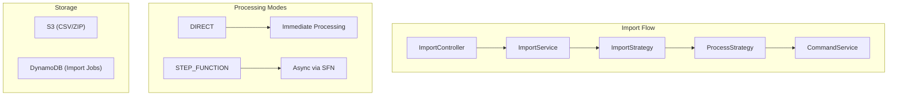

# Import

The ImportModule provides bulk data import capabilities in the MBC CQRS Serverless framework. It supports single record imports, CSV file imports, and ZIP file imports with multiple CSVs.

## Architecture



## Installation

```bash
npm install @mbc-cqrs-serverless/import
```

## Module Registration

```ts
import { ImportModule } from "@mbc-cqrs-serverless/import";

@Module({
  imports: [
    ImportModule.register({
      enableController: true, // Enable built-in REST controller
      profiles: [
        {
          tableName: "products",
          importStrategy: ProductImportStrategy,
          processStrategy: ProductProcessStrategy,
        },
      ],
      imports: [ProductModule], // Modules exporting strategy dependencies
      zipFinalizationHooks: [BackupToS3Hook], // Optional: Post-import hooks
    }),
  ],
})
export class AppModule {}
```

## Module Options

| Option | Type | Required | Description |
|------------|----------|--------------|-----------------|
| `profiles` | `ImportEntityProfile[]` | Yes | Array of import configurations for each entity type |
| `enableController` | `boolean` | No | Enable the built-in ImportController endpoints |
| `imports` | `ModuleMetadata['imports']` | No | Modules that export providers needed by strategy classes |
| `zipFinalizationHooks` | `Type<IZipFinalizationHook>[]` | No | Hooks that execute after ZIP import completes |

## Core Concepts

### Import Entity Profile

Each entity type you want to import requires a profile configuration:

```ts
interface ImportEntityProfile {
  tableName: string; // Unique identifier for this data type
  importStrategy: Type<IImportStrategy<any, any>>; // Transform and validate
  processStrategy: Type<IProcessStrategy<any, any>>; // Compare and map
}
```

### Processing Modes

| Mode | Description | Use Case |
|----------|-----------------|--------------|
| `DIRECT` | Process CSV immediately in the request | Small files (< 100 rows) |
| `STEP_FUNCTION` | Process asynchronously via AWS Step Functions | Large files, production imports |

### Import Status

| Status | Description |
|------------|-----------------|
| `CREATED` | Import job created, waiting to be processed |
| `QUEUED` | Job queued for processing |
| `PROCESSING` | Currently being processed |
| `COMPLETED` | Successfully completed |
| `FAILED` | Processing failed |

## API Reference

### ImportService Methods

#### `createWithApi(dto: CreateImportDto, options): Promise<ImportEntity>`

Creates a single import record using the API. The data is transformed and validated using the configured ImportStrategy.

```ts
const importEntity = await this.importService.createWithApi(
  {
    tableName: "products",
    tenantCode: "tenant001",
    attributes: {
      code: "PROD001",
      name: "Product One",
      price: 100,
    },
  },
  { invokeContext }
);
```

#### `handleCsvImport(dto: CreateCsvImportDto, options): Promise<ImportEntity[] | ImportEntity>`

Main router for CSV imports. Delegates to either direct processing or Step Function based on processingMode.

```ts
// DIRECT mode - returns array of created imports
const imports = await this.importService.handleCsvImport(
  {
    processingMode: "DIRECT",
    bucket: "my-bucket",
    key: "imports/products.csv",
    tableName: "products",
    tenantCode: "tenant001",
  },
  { invokeContext }
);

// STEP_FUNCTION mode - returns master job entity
const masterJob = await this.importService.handleCsvImport(
  {
    processingMode: "STEP_FUNCTION",
    bucket: "my-bucket",
    key: "imports/products.csv",
    tableName: "products",
    tenantCode: "tenant001",
  },
  { invokeContext }
);
```

#### `createZipJob(dto: CreateZipImportDto, options): Promise<ImportEntity>`

Creates a master job for ZIP file import. The ZIP file should contain multiple CSV files.

```ts
const zipJob = await this.importService.createZipJob(
  {
    bucket: "my-bucket",
    key: "imports/bulk-data.zip",
    tenantCode: "tenant001",
    sortedFileKeys: ["products.csv", "categories.csv"], // Optional: specify processing order
    tableName: "products", // Optional: override tableName detection
  },
  { invokeContext }
);
```

#### `updateStatus(key: DetailKey, status: string, payload?, attributes?, notifyId?): Promise<void>`

Updates the status of an import job and sends a notification via SNS.

```ts
await this.importService.updateStatus(
  { pk: "IMPORT#tenant001", sk: "products#01ABC" },
  "COMPLETED",
  { result: { recordsProcessed: 100 } }
);
```

#### `getImportByKey(key: DetailKey): Promise<ImportEntity>`

Retrieves an import entity by its key.

```ts
const importJob = await this.importService.getImportByKey({
  pk: "IMPORT#tenant001",
  sk: "products#01ABC",
});
```

## REST API Endpoints

When `enableController: true`, the following endpoints are available:

### `POST /imports`

Create a single import record.

```json
{
  "tableName": "products",
  "tenantCode": "tenant001",
  "attributes": {
    "code": "PROD001",
    "name": "Product One"
  }
}
```

**Response**: `202 Accepted`

### `POST /imports/csv`

Initiate a CSV file import.

```json
{
  "processingMode": "STEP_FUNCTION",
  "bucket": "my-bucket",
  "key": "imports/products.csv",
  "tableName": "products",
  "tenantCode": "tenant001"
}
```

**Response**: `200 OK` (DIRECT) / `202 Accepted` (STEP_FUNCTION)

### `POST /imports/zip`

Initiate a ZIP file import.

```json
{
  "bucket": "my-bucket",
  "key": "imports/bulk-data.zip",
  "tenantCode": "tenant001"
}
```

**Response**: `202 Accepted`

## Implementing Import Strategies

### IImportStrategy Interface

The ImportStrategy handles data transformation and validation:

```ts
interface IImportStrategy<TInput, TAttributesDto> {
  transform(input: TInput): Promise<TAttributesDto>;
  validate(data: TAttributesDto): Promise<void>;
}
```

### Using BaseImportStrategy

Extend the base class for common functionality:

```ts
import { BaseImportStrategy } from "@mbc-cqrs-serverless/import";
import { Injectable } from "@nestjs/common";

@Injectable()
export class ProductImportStrategy extends BaseImportStrategy<
  CsvProductRow,
  ProductAttributesDto
> {
  async transform(input: CsvProductRow): Promise<ProductAttributesDto> {
    return {
      code: input.product_code?.trim(),
      name: input.product_name?.trim(),
      price: parseFloat(input.price),
      category: input.category?.trim(),
    };
  }

  // validate() is inherited - uses class-validator
}
```

### IProcessStrategy Interface

The ProcessStrategy handles comparison with existing data and mapping to commands:

```ts
interface IProcessStrategy<TEntity, TAttributesDto> {
  compare(
    importAttributes: TAttributesDto,
    tenantCode: string
  ): Promise<ComparisonResult<TEntity>>;

  map(
    status: ComparisonStatus,
    importAttributes: TAttributesDto,
    tenantCode: string,
    existingData?: TEntity
  ): Promise<CommandInputModel | CommandPartialInputModel>;

  getCommandService(): CommandService;
}
```

### Comparison Status

| Status | Description |
|------------|-----------------|
| `NOT_EXIST` | Entity does not exist - will create new |
| `CHANGED` | Entity exists but has changes - will update |
| `EQUAL` | Entity exists and is identical - will skip |

### Example ProcessStrategy

```ts
import {
  BaseProcessStrategy,
  ComparisonResult,
  ComparisonStatus,
} from "@mbc-cqrs-serverless/import";
import { CommandService, DataService } from "@mbc-cqrs-serverless/core";
import { Injectable } from "@nestjs/common";

@Injectable()
export class ProductProcessStrategy extends BaseProcessStrategy<
  ProductEntity,
  ProductAttributesDto
> {
  constructor(
    private readonly dataService: DataService,
    private readonly commandService: CommandService
  ) {
    super();
  }

  async compare(
    importAttributes: ProductAttributesDto,
    tenantCode: string
  ): Promise<ComparisonResult<ProductEntity>> {
    const pk = `PRODUCT#${tenantCode}`;
    const sk = `PRODUCT#${importAttributes.code}`;

    const existing = await this.dataService.getItem({ pk, sk });

    if (!existing) {
      return { status: ComparisonStatus.NOT_EXIST };
    }

    // Compare relevant fields
    if (
      existing.name !== importAttributes.name ||
      existing.attributes?.price !== importAttributes.price
    ) {
      return { status: ComparisonStatus.CHANGED, existingData: existing };
    }

    return { status: ComparisonStatus.EQUAL };
  }

  async map(
    status: ComparisonStatus,
    importAttributes: ProductAttributesDto,
    tenantCode: string,
    existingData?: ProductEntity
  ) {
    const pk = `PRODUCT#${tenantCode}`;
    const sk = `PRODUCT#${importAttributes.code}`;

    if (status === ComparisonStatus.NOT_EXIST) {
      return {
        pk,
        sk,
        code: importAttributes.code,
        name: importAttributes.name,
        tenantCode,
        type: "PRODUCT",
        attributes: { price: importAttributes.price },
      };
    }

    // Update existing
    return {
      pk,
      sk,
      name: importAttributes.name,
      version: existingData.version,
      attributes: {
        ...existingData.attributes,
        price: importAttributes.price,
      },
    };
  }

  getCommandService(): CommandService {
    return this.commandService;
  }
}
```

## ZIP Finalization Hooks

Hooks execute after ZIP import completes. Use them for post-processing tasks.

```ts
import { IZipFinalizationHook, ZipFinalizationContext } from "@mbc-cqrs-serverless/import";
import { S3Service } from "@mbc-cqrs-serverless/core";
import { Injectable } from "@nestjs/common";

@Injectable()
export class BackupToS3Hook implements IZipFinalizationHook {
  constructor(private readonly s3Service: S3Service) {}

  async execute(context: ZipFinalizationContext): Promise<void> {
    const { executionInput, status, results } = context;
    const { bucket, key } = executionInput.parameters;

    if (status === "COMPLETED") {
      // Move file to backup location
      const backupKey = `backup/${new Date().toISOString()}/${key}`;
      await this.s3Service.copyObject({
        sourceBucket: bucket,
        sourceKey: key,
        destinationBucket: bucket,
        destinationKey: backupKey,
      });
    }
  }
}
```

### ZipFinalizationContext

| Property | Type | Description |
|--------------|----------|-----------------|
| `event` | `ZipImportSfnEvent` | Original Step Function event |
| `masterJobKey` | `DetailKey` | Key of the master ZIP job |
| `results` | `object` | Aggregated results (totalRows, processedRows, failedRows) |
| `status` | `ImportStatusEnum` | Final status of the job |
| `executionInput` | `any` | Original Step Functions execution input |

## DTOs

### CreateImportDto

| Property | Type | Required | Description |
|--------------|----------|--------------|-----------------|
| `tableName` | `string` | Yes | Target entity type |
| `tenantCode` | `string` | Yes | Tenant code |
| `attributes` | `object` | Yes | Import data attributes |
| `sourceId` | `string` | No | Source identifier |
| `name` | `string` | No | Display name for the import |

### CreateCsvImportDto

| Property | Type | Required | Description |
|--------------|----------|--------------|-----------------|
| `processingMode` | `'DIRECT' \| 'STEP_FUNCTION'` | Yes | How to process the CSV |
| `bucket` | `string` | Yes | S3 bucket name |
| `key` | `string` | Yes | S3 object key |
| `tableName` | `string` | Yes | Target entity type |
| `tenantCode` | `string` | Yes | Tenant code |

### CreateZipImportDto

| Property | Type | Required | Description |
|--------------|----------|--------------|-----------------|
| `bucket` | `string` | Yes | S3 bucket name |
| `key` | `string` | Yes | S3 object key |
| `tenantCode` | `string` | Yes | Tenant code |
| `sortedFileKeys` | `string[]` | No | Process files in this order |
| `tableName` | `string` | No | Override auto-detected tableName |

## Best Practices

### CSV File Format

- Use UTF-8 encoding
- Include header row with column names
- Column names are trimmed automatically
- Values are trimmed automatically

### Large File Imports

- Use `STEP_FUNCTION` mode for files with more than 100 rows
- Monitor progress via SNS notifications
- Use ZIP imports for related data that must be imported in order

### Error Handling

- Invalid rows are logged and skipped in CSV processing
- Use the `failedRows` counter to track failures
- Check import status via API or notifications

## See Also

- [Import/Export Patterns](./import-export-patterns) - Common patterns for data import and export
- [Command Service](./command-service) - Command operations used by ProcessStrategy
- [Step Functions](./architecture/step-functions) - Async processing infrastructure
