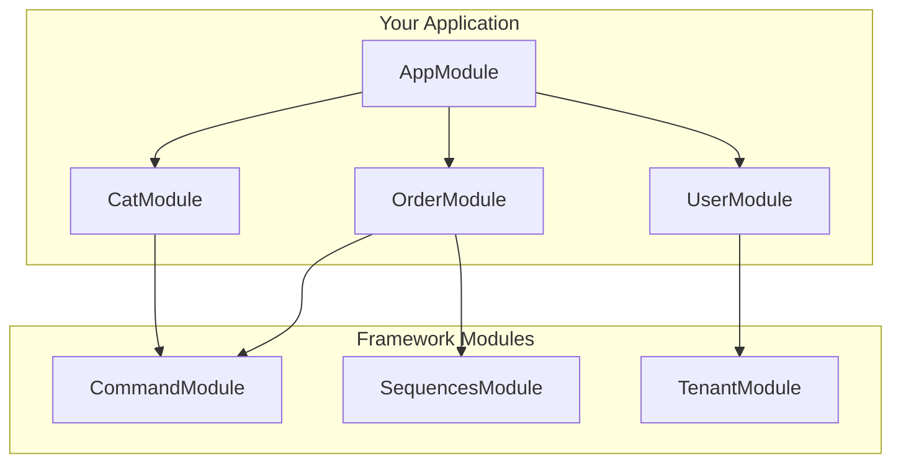

# Modules

## Overview

A module is a class annotated with a `@Module()` decorator. The `@Module()` decorator provides metadata that organizes the application structure. Modules encapsulate related functionality and follow the NestJS module pattern.



## Module Structure

A typical module in MBC CQRS Serverless includes:

```typescript
import { Module } from '@nestjs/common';
import { CommandModule } from '@mbc-cqrs-serverless/core';

import { CatController } from './cat.controller';
import { CatService } from './cat.service';
import { CatDataSyncRdsHandler } from './handler/cat-rds.handler';

@Module({
  imports: [
    CommandModule.register({
      tableName: 'cat',
      dataSyncHandlers: [CatDataSyncRdsHandler],
    }),
  ],
  controllers: [CatController],
  providers: [CatService],
  exports: [CatService],
})
export class CatModule {}
```

## Module Components

| Component | Description |
|-----------|-------------|
| `imports` | List of imported modules that export providers used in this module |
| `controllers` | Controllers that handle HTTP requests |
| `providers` | Services and other providers available for injection |
| `exports` | Providers that should be available in modules that import this module |

## Framework Modules

MBC CQRS Serverless provides several ready-to-use modules:

### Core Modules

| Module | Package | Purpose |
|--------|---------|---------|
| `CommandModule` | `@mbc-cqrs-serverless/core` | CQRS command handling and data sync |
| `SequencesModule` | `@mbc-cqrs-serverless/sequence` | Sequential ID generation |
| `TenantModule` | `@mbc-cqrs-serverless/tenant` | Multi-tenant management |

### Feature Modules

| Module | Package | Purpose |
|--------|---------|---------|
| `TaskModule` | `@mbc-cqrs-serverless/task` | Async task execution with Step Functions |
| `MasterModule` | `@mbc-cqrs-serverless/master` | Master data and settings management |
| `ImportModule` | `@mbc-cqrs-serverless/import` | CSV/API data import |

### Support Modules

| Module | Package | Purpose |
|--------|---------|---------|
| `NotificationModule` | `@mbc-cqrs-serverless/core` | Email notifications via SES |
| `SettingModule` | `@mbc-cqrs-serverless/ui-setting` | User interface settings storage |

## Dynamic Module Registration

Most framework modules are dynamic modules that accept configuration:

### CommandModule

```typescript
CommandModule.register({
  tableName: 'cat',
  dataSyncHandlers: [CatDataSyncRdsHandler],
  skipError: false,
  disableDefaultHandler: false,
})
```

| Option | Type | Default | Description |
|--------|------|---------|-------------|
| `tableName` | `string` | Required | DynamoDB table name (without postfix) |
| `dataSyncHandlers` | `Type[]` | `[]` | Data sync handler classes |
| `skipError` | `boolean` | `false` | Reserved for future use (not yet implemented) |
| `disableDefaultHandler` | `boolean` | `false` | Disable default DynamoDB data sync handler |

### SequencesModule

```typescript
SequencesModule.register({
  enableController: true,
})
```

### MasterModule

```typescript
MasterModule.register({
  enableController: true,
  prismaService: PrismaService,
})
```

:::warning MasterModule Configuration Note
When `enableController: true`, the `prismaService` parameter is **required**. You must provide your application's PrismaService class. The framework will throw an error if `prismaService` is not provided when controllers are enabled.
:::

### TaskModule

TaskModule handles asynchronous task execution using AWS Step Functions. It requires a custom event factory that implements `ITaskQueueEventFactory`.

```typescript
import { TaskModule } from '@mbc-cqrs-serverless/task';
import { MyTaskQueueEventFactory } from './my-task-queue-event.factory';

TaskModule.register({
  taskQueueEventFactory: MyTaskQueueEventFactory,
  enableController: true,
})
```

| Option | Type | Default | Description |
|--------|------|---------|-------------|
| `taskQueueEventFactory` | `Type<ITaskQueueEventFactory>` | Required | Factory class for transforming task queue events |
| `enableController` | `boolean` | `false` | Enable built-in task REST endpoints |

The `taskQueueEventFactory` must implement the `ITaskQueueEventFactory` interface. Both methods are optional - implement only what you need:

```typescript
import { ITaskQueueEventFactory, TaskQueueEvent, StepFunctionTaskEvent } from '@mbc-cqrs-serverless/task';
import { IEvent } from '@mbc-cqrs-serverless/core';
import { MyTaskEvent } from './my-task.event';
import { MyStepFunctionTaskEvent } from './my-sfn-task.event';

export class MyTaskQueueEventFactory implements ITaskQueueEventFactory {
  // Optional: Transform SQS task queue events into domain events
  async transformTask(event: TaskQueueEvent): Promise<IEvent[]> {
    // Create domain-specific events from task queue events
    return [new MyTaskEvent().fromSqsRecord(event)];
  }

  // Optional: Transform Step Function task events into domain events
  async transformStepFunctionTask(event: StepFunctionTaskEvent): Promise<IEvent[]> {
    // Check taskKey.sk to determine which event type to create
    if (event.taskKey.sk.startsWith('MY_TASK')) {
      return [new MyStepFunctionTaskEvent(event)];
    }
    return [];
  }
}
```

### ImportModule

The ImportModule provides CSV and API data import functionality. It requires defining import profiles that specify how data should be imported and processed for each entity type.

```typescript
import { ImportModule } from '@mbc-cqrs-serverless/import';
import { PolicyImportStrategy } from './strategies/policy-import.strategy';
import { PolicyProcessStrategy } from './strategies/policy-process.strategy';
import { PolicyModule } from './policy.module';

@Module({
  imports: [
    ImportModule.register({
      profiles: [
        {
          tableName: 'policy',
          importStrategy: PolicyImportStrategy,
          processStrategy: PolicyProcessStrategy,
        },
      ],
      imports: [PolicyModule], // Modules that export providers needed by strategies
      enableController: true,
    }),
  ],
})
export class AppModule {}
```

| Option | Type | Default | Description |
|--------|------|---------|-------------|
| `profiles` | `ImportEntityProfile[]` | Required | Array of import profiles for each entity type |
| `imports` | `ModuleMetadata['imports']` | `[]` | Modules that export providers needed by strategy classes |
| `enableController` | `boolean` | `false` | Enable built-in `/import` and `/import/csv` endpoints |

Each `ImportEntityProfile` requires:

| Property | Type | Description |
|----------|------|-------------|
| `tableName` | `string` | Unique identifier for the data type (e.g., 'policy', 'user') |
| `importStrategy` | `Type<IImportStrategy>` | Class implementing import logic (transform & validate) |
| `processStrategy` | `Type<IProcessStrategy>` | Class implementing business processing logic (compare & map) |

### SettingModule

The SettingModule manages user interface settings. It can optionally expose REST endpoints for managing settings.

```typescript
import { SettingModule } from '@mbc-cqrs-serverless/ui-setting';

@Module({
  imports: [
    SettingModule.register({
      enableSettingController: true,
      enableDataController: true,
    }),
  ],
})
export class AppModule {}
```

| Option | Type | Default | Description |
|--------|------|---------|-------------|
| `enableSettingController` | `boolean` | `false` | Enable the setting controller for UI settings management |
| `enableDataController` | `boolean` | `false` | Enable the data setting controller for data-related settings |

### NotificationModule (Static)

The NotificationModule is a static (not dynamic) module that provides email notifications via SES and real-time updates via AppSync. It is automatically registered as a global module, so you only need to import it once in your AppModule.

```typescript
import { NotificationModule } from '@mbc-cqrs-serverless/core';

@Module({
  imports: [
    NotificationModule, // No configuration needed - static module
  ],
})
export class AppModule {}
```

This module exports:
- `EmailService` - Send emails via Amazon SES
- `AppSyncService` - Send real-time notifications via AppSync

## Creating Custom Modules

### Step 1: Create Module File

```typescript
// src/order/order.module.ts
import { Module } from '@nestjs/common';
import { CommandModule } from '@mbc-cqrs-serverless/core';
import { SequencesModule } from '@mbc-cqrs-serverless/sequence';

import { OrderController } from './order.controller';
import { OrderService } from './order.service';
import { OrderDataSyncHandler } from './handlers/order-data-sync.handler';

@Module({
  imports: [
    CommandModule.register({
      tableName: 'order',
      dataSyncHandlers: [OrderDataSyncHandler],
    }),
    SequencesModule.register({
      enableController: false,
    }),
  ],
  controllers: [OrderController],
  providers: [OrderService],
  exports: [OrderService],
})
export class OrderModule {}
```

### Step 2: Register in AppModule

```typescript
// src/app.module.ts
import { Module } from '@nestjs/common';
import { OrderModule } from './order/order.module';

@Module({
  imports: [OrderModule],
})
export class AppModule {}
```

## Best Practices

1. **One module per entity**: Create a dedicated module for each business entity
2. **Export services, not controllers**: Only export providers that other modules need
3. **Use forRoot for global modules**: Register global configuration once in AppModule
4. **Keep modules focused**: Each module should have a single responsibility

## Related Documentation

- [NestJS Modules](https://docs.nestjs.com/modules): Official NestJS module documentation
- [CommandService](./command-service.md): Detailed CommandModule configuration
- [Event Handling Patterns](./event-handling-patterns.md): Creating data sync handlers
