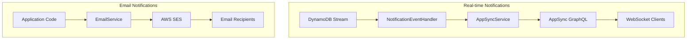

# Notification

The NotificationModule provides two types of notification capabilities in the MBC CQRS Serverless framework:

- **Real-time notifications** via AWS AppSync for WebSocket-based updates
- **Email notifications** via AWS SES for sending emails

## Architecture



## Real-time Notifications

### Overview

Real-time notifications are automatically sent when data changes occur in DynamoDB. The system uses AWS AppSync to deliver notifications to subscribed WebSocket clients.

### INotification Interface

The notification payload structure:

```ts
interface INotification {
  id: string;        // Unique notification ID
  table: string;     // Source DynamoDB table name
  pk: string;        // Partition key of the changed item
  sk: string;        // Sort key of the changed item
  tenantCode: string; // Tenant code for filtering notifications
  action: string;    // Type of change: 'INSERT', 'MODIFY', 'REMOVE'
  content?: object;  // Optional payload with changed data
}
```

### AppSyncService

The `AppSyncService` sends real-time notifications to AppSync for WebSocket delivery.

#### Method: `sendMessage(msg: INotification): Promise<any>`

Sends a notification to AppSync via GraphQL mutation. The notification is delivered to all subscribed WebSocket clients.

```ts
await this.appSyncService.sendMessage({
  id: "unique-id",
  table: "my-table",
  pk: "ITEM#tenant1",
  sk: "ITEM#001",
  tenantCode: "tenant1",
  action: "MODIFY",
  content: { status: "updated" },
});
```

#### Configuration

Set the following environment variables:

```bash
APPSYNC_ENDPOINT=https://xxxxx.appsync-api.ap-northeast-1.amazonaws.com/graphql
APPSYNC_API_KEY=da2-xxxxxxxxxx  # Optional: Use API key auth instead of IAM
```

#### Usage

```ts
import { AppSyncService, INotification } from "@mbc-cqrs-serverless/core";

@Injectable()
export class MyService {
  constructor(private readonly appSyncService: AppSyncService) {}

  async notifyClients() {
    const notification: INotification = {
      id: "notification-123",
      table: "my-table",
      pk: "ITEM#tenant1",
      sk: "ITEM#item001",
      tenantCode: "tenant1",
      action: "MODIFY",
      content: { status: "updated" },
    };

    await this.appSyncService.sendMessage(notification);
  }
}
```

#### Authentication

The AppSyncService supports two authentication methods:

1. **API Key**: Set `APPSYNC_API_KEY` environment variable
2. **IAM Signature V4**: Used automatically when API key is not set

### Automatic Notifications

The framework automatically sends notifications when data changes through:

1. DynamoDB Streams trigger the `NotificationEventHandler`
2. Handler extracts change information and creates `INotification`
3. `AppSyncService.sendMessage()` delivers to AppSync
4. Connected clients receive updates via WebSocket subscription

### NotificationEvent

The `NotificationEvent` class represents a notification event from SQS. It implements `IEvent` and wraps an SQS record containing notification data.

```ts
import { NotificationEvent } from "@mbc-cqrs-serverless/core";

class NotificationEvent implements IEvent, SQSRecord {
  source: string;
  messageId: string;
  receiptHandle: string;
  body: string;              // JSON string containing INotification data
  attributes: SQSRecordAttributes;
  messageAttributes: SQSMessageAttributes;
  md5OfBody: string;
  eventSource: string;
  eventSourceARN: string;
  awsRegion: string;

  // Creates a NotificationEvent from an SQS record
  fromSqsRecord(record: SQSRecord): NotificationEvent;
}
```

### NotificationEventHandler

The `NotificationEventHandler` is the built-in event handler that processes `NotificationEvent` and sends notifications to AppSync. It is automatically registered when using the notification module.

```ts
import { NotificationEventHandler, NotificationEvent } from "@mbc-cqrs-serverless/core";

@EventHandler(NotificationEvent)
export class NotificationEventHandler implements IEventHandler<NotificationEvent> {
  async execute(event: NotificationEvent): Promise<any> {
    // Parses the notification from event body
    // Sends to AppSync via sendMessage()
  }
}
```

You typically don't need to interact with this handler directly - it works automatically when notifications are published to the SQS queue.

## Email Notifications

### EmailService

The `EmailService` sends emails using AWS SES.

#### Configuration

```bash
SES_FROM_EMAIL=noreply@your-domain.com  # Required: Default sender address
SES_REGION=ap-northeast-1                # Optional: SES region
SES_ENDPOINT=                            # Optional: Custom endpoint for LocalStack
```

#### Basic Usage

```ts
import { EmailService, EmailNotification } from "@mbc-cqrs-serverless/core";

@Injectable()
export class MyService {
  constructor(private readonly emailService: EmailService) {}

  async sendWelcomeEmail(userEmail: string) {
    const email: EmailNotification = {
      toAddrs: [userEmail],
      subject: "Welcome to Our Service",
      body: "<h1>Welcome!</h1><p>Thank you for signing up.</p>",
    };

    await this.emailService.sendEmail(email);
  }
}
```

#### Email with Attachments

```ts
import { EmailNotification, Attachment } from "@mbc-cqrs-serverless/core";
import * as fs from "fs";

const pdfBuffer = fs.readFileSync("report.pdf");

const email: EmailNotification = {
  toAddrs: ["user@example.com"],
  subject: "Monthly Report",
  body: "<p>Please find attached your monthly report.</p>",
  attachments: [
    {
      filename: "report.pdf",
      content: pdfBuffer,
      contentType: "application/pdf",
    },
  ],
};

await this.emailService.sendEmail(email);
```

### Inline Template Emails {#inline-template-emails}

The `sendInlineTemplateEmail()` method allows you to send templated emails with dynamic data substitution, without requiring pre-registered SES templates.

:::info Version Note
Inline template emails (`sendInlineTemplateEmail()`) were added in [version 1.0.23](/docs/changelog#v1023).
:::

#### Basic Usage

```ts
import { EmailService, TemplatedEmailNotification } from "@mbc-cqrs-serverless/core";

@Injectable()
export class MyService {
  constructor(private readonly emailService: EmailService) {}

  async sendWelcomeEmail(user: { name: string; email: string }) {
    const notification: TemplatedEmailNotification = {
      toAddrs: [user.email],
      template: {
        subject: "Welcome, {{name}}!",
        html: "<h1>Hello {{name}}</h1><p>Welcome to our service!</p>",
        text: "Hello {{name}}, Welcome to our service!", // Optional plain text version
      },
      data: {
        name: user.name,
      },
    };

    await this.emailService.sendInlineTemplateEmail(notification);
  }
}
```

#### Template Syntax

Templates use `{{variableName}}` placeholders that are replaced with values from the `data` object:

```ts
const notification: TemplatedEmailNotification = {
  toAddrs: ["user@example.com"],
  template: {
    subject: "Order {{orderId}} Confirmation",
    html: `
      <h1>Thank you, {{customerName}}!</h1>
      <p>Your order #{{orderId}} has been confirmed.</p>
      <p>Total: {{currency}}{{totalAmount}}</p>
    `,
  },
  data: {
    customerName: "John Doe",
    orderId: "12345",
    currency: "$",
    totalAmount: "99.99",
  },
};
```

#### Advanced Template Features {#advanced-template-features}

:::info Version Note
Nested property access and Unicode key support were added in [version 1.0.25](/docs/changelog#v1025).
:::

##### Nested Property Access

You can access nested object properties using dot notation:

```ts
const notification: TemplatedEmailNotification = {
  toAddrs: ["user@example.com"],
  template: {
    subject: "Welcome {{user.profile.firstName}}!",
    html: `
      <p>Hello {{user.profile.firstName}} {{user.profile.lastName}},</p>
      <p>Your verification code is: {{auth.otp}}</p>
    `,
  },
  data: {
    user: {
      profile: {
        firstName: "John",
        lastName: "Doe",
      },
    },
    auth: {
      otp: "123456",
    },
  },
};
```

##### Unicode and Japanese Key Support

Template variables support Unicode characters, including Japanese keys:

```ts
const notification: TemplatedEmailNotification = {
  toAddrs: ["user@example.com"],
  template: {
    subject: "{{注文.確認番号}} - Order Confirmation",
    html: `
      <p>{{顧客.名前}} 様</p>
      <p>ご注文番号: {{注文.確認番号}}</p>
      <p>商品: {{注文.詳細.品名}}</p>
    `,
  },
  data: {
    "顧客": {
      "名前": "山田 太郎",
    },
    "注文": {
      "確認番号": "ORD-2024-001",
      "詳細": {
        "品名": "ワイヤレスイヤホン",
      },
    },
  },
};
```

##### Whitespace in Placeholders

Whitespace inside placeholders is automatically trimmed, so `{{ name }}` and `{{name}}` are equivalent:

```ts
// Both of these work identically
template: {
  subject: "Hello {{ name }}!",  // Whitespace is trimmed
  html: "<p>Hello {{name}}!</p>", // No whitespace
}
```

##### Missing Variables

If a variable is not found in the data object, the placeholder is preserved in the output. This helps identify missing data during development:

```ts
// If 'missingKey' is not in data, output will contain '{{missingKey}}'
template: {
  html: "<p>Value: {{missingKey}}</p>",
}
```

##### Limitations

The following limitations apply to template variable names (for security reasons):

| Limitation | Value | Reason |
|----------------|-----------|------------|
| Maximum variable name length | 255 characters | Prevents ReDoS (Regular Expression Denial of Service) attacks |

Variable names exceeding 255 characters will not be replaced and will remain as literal placeholders in the output.

#### TemplatedEmailNotification Interface

| Property | Type | Required | Description |
|--------------|----------|--------------|-----------------|
| `fromAddr` | `string` | No | Sender email (uses SES_FROM_EMAIL if not set) |
| `toAddrs` | `string[]` | Yes | List of recipient email addresses |
| `ccAddrs` | `string[]` | No | CC recipients |
| `bccAddrs` | `string[]` | No | BCC recipients |
| `replyToAddrs` | `string[]` | No | Reply-to addresses |
| `template` | `InlineTemplateContent` | Yes | Template with subject, HTML, and optional text |
| `data` | `Record<string, any>` | Yes | Data object for template variable substitution |
| `configurationSetName` | `string` | No | SES configuration set name for tracking |

#### InlineTemplateContent Interface

| Property | Type | Required | Description |
|--------------|----------|--------------|-----------------|
| `subject` | `string` | Yes | Email subject line (supports template variables) |
| `html` | `string` | Yes | HTML body (supports template variables) |
| `text` | `string` | No | Plain text body (supports template variables) |

#### Local Development

When running locally without SES access, the method automatically falls back to manual template compilation, allowing you to test email flows during development.

#### EmailNotification Interface

| Property | Type | Required | Description |
|--------------|----------|--------------|-----------------|
| `fromAddr` | `string` | No | Sender email (uses SES_FROM_EMAIL if not set) |
| `toAddrs` | `string[]` | Yes | List of recipient email addresses |
| `ccAddrs` | `string[]` | No | CC recipients |
| `bccAddrs` | `string[]` | No | BCC recipients |
| `subject` | `string` | Yes | Email subject line |
| `body` | `string` | Yes | Email body as HTML |
| `replyToAddrs` | `string[]` | No | Reply-to addresses |
| `attachments` | `Attachment[]` | No | File attachments |
| `emailTags` | `EmailTag[]` | No | Tags for email categorization (SES Email Tags) |

### Email Tags {#email-tags}

Email tags allow you to categorize and track emails sent through AWS SES. Tags are useful for filtering emails in SES analytics, CloudWatch, and event destinations.

:::info Version Note
EmailTags support was added in [version 1.1.0](/docs/changelog#v110).
:::

#### Basic Usage

```ts
import { EmailService, EmailNotification, EmailTag } from "@mbc-cqrs-serverless/core";

const email: EmailNotification = {
  toAddrs: ["user@example.com"],
  subject: "Order Confirmation",
  body: "<p>Your order has been confirmed.</p>",
  emailTags: [
    { name: "category", value: "order-confirmation" },
    { name: "tenant", value: "tenant-123" },
    { name: "environment", value: "production" },
  ],
};

await this.emailService.sendEmail(email);
```

#### EmailTag Interface

| Property | Type | Required | Description |
|--------------|----------|--------------|-----------------|
| `name` | `string` | Yes | Tag name (e.g., 'category', 'campaign') |
| `value` | `string` | Yes | Tag value for categorization |

#### Use Cases

- **Campaign tracking**: Tag emails by marketing campaign to analyze performance
- **Tenant isolation**: Tag by tenant code for multi-tenant email analytics
- **Email type categorization**: Distinguish transactional emails from promotional ones
- **Environment tagging**: Track emails across development, staging, and production

#### Attachment Interface

| Property | Type | Required | Description |
|--------------|----------|--------------|-----------------|
| `filename` | `string` | Yes | Filename shown to recipient |
| `content` | `Buffer` | Yes | File content as Buffer |
| `contentType` | `string` | No | MIME type (e.g., 'application/pdf') |

## See Also

- [Event Handling Patterns](./event-handling-patterns) - How notifications integrate with events
- [Environment Variables](./environment-variables) - Configuration reference
