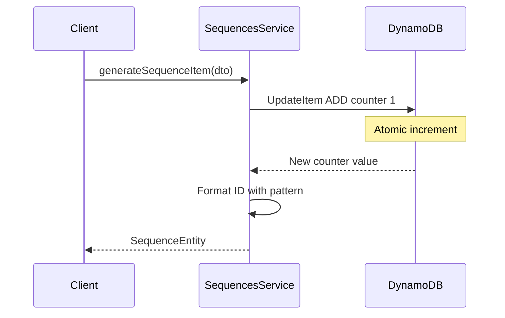

# Sequence

## 1. Purpose {#purpose}

`SequencesModule` is a service for managing dynamic sequences in the system using DynamoDB as the primary database.

This service is designed to:

- Generate unique sequence numbers based on parameters such as sequence type, tenant, or date.
- Automatically reset sequences based on cycles like:
  - Daily.
  - Monthly.
  - Yearly.
  - Fiscal Yearly.

Format sequence numbers according to specific system requirements (e.g., TODO-PERSONAL-72-001).
Ensure data consistency and integrity in multi-tenant systems.

## How It Works {#how-it-works}



## 2. Usage {#usage}


The solution for customizing the behavior of the `SequencesModule` is to pass it an options `object` in the static `register()` method. The options object contains only one property:

- `enableController`: enable or disable default sequence controller.

We will create a simple example demonstrating how to use the sequence module and customize authentication for the sequence controller.

```ts
// seq.controller.ts
import { SequencesController } from "@mbc-cqrs-serverless/sequence";
import { Controller } from "@nestjs/common";
import { ApiTags } from "@nestjs/swagger";
import { Auth } from "src/auth/auth.decorator";
import { ROLE } from "src/auth/role.enum";

@Controller("api/sequence")
@ApiTags("sequence")
@Auth(ROLE.ADMIN)
export class SeqController extends SequencesController {}
```

```ts
// seq.module.ts
import { SequencesModule } from "@mbc-cqrs-serverless/sequence";
import { Module } from "@nestjs/common";

import { SeqController } from "./seq.controller";

@Module({
  imports: [SequencesModule.register({ enableController: false })],
  controllers: [SeqController],
  exports: [SequencesModule],
})
export class SeqModule {}
```

Besides the controller, we can directly use `SequencesService` to generate sequences by injecting the service.

The `SequencesService` has four public methods (two current, one deprecated, one removed in v1.1.0):

### *async* `generateSequenceItem(dto: GenerateFormattedSequenceDto, options?: {invokeContext: IInvoke}): Promise<SequenceEntity>` {#generate-sequence-item}


Generates a new sequence based on the parameters provided in the GenerateFormattedSequenceDto object.

#### Parameters

`dto: GenerateFormattedSequenceDto`
The data transfer object that customizes the behavior of the sequence generation. Its properties include:

- `date?: Date`
  - Default: Current date.
  - Description: Specifies the date for which the sequence is generated.

- `rotateBy?: RotateByEnum`
  - Default: NONE.
  - Options
    - FISCAL_YEARLY (`'fiscal_yearly'`)
    - YEARLY (`'yearly'`)
    - MONTHLY (`'monthly'`)
    - DAILY (`'daily'`)
    - NONE (`'none'`)
  - Description: Determines when the sequence counter resets to 1.
  - Rotation strategy reference:

    | Strategy | Counter resets when | Example |
    |---|---|---|
    | `NONE` | Never — counter increments indefinitely | `1, 2, 3, … 9999` |
    | `DAILY` | The calendar date changes | Resets each midnight |
    | `MONTHLY` | The calendar month changes | Resets on the 1st of each month |
    | `YEARLY` | The calendar year changes | Resets every January 1st |
    | `FISCAL_YEARLY` | The fiscal year changes (start month controlled by `startMonth`) | Resets at fiscal year start; defaults to April (Japanese convention) |

- `tenantCode: string`
  - Required: Yes.
  - Description: Identifies the tenant and type code for the intended usage.

- `typeCode: string`
  - Required: Yes.
  - Description: Identifies the type code for the sequence.
  
- `params?: SequenceParamsDto`
  - Required: No.
  - Description: Defines parameters to identify the sequence.
    ```ts
    import { IsString, IsOptional } from 'class-validator';

    export class SequenceParamsDto {
      @IsString()
      code1: string

      @IsString()
      @IsOptional()
      code2?: string

      @IsOptional()
      @IsString()
      code3?: string

      @IsOptional()
      @IsString()
      code4?: string

      @IsOptional()
      @IsString()
      code5?: string

      constructor(partial: Partial<SequenceParamsDto>) {
        Object.assign(this, partial)
      }
    }
    ```

- `prefix?: string`
  - Required: No.
  - Description: Optional prefix to prepend to the formatted sequence. The prefix is added before the formatted pattern.
  - Example: If prefix is `'INV-'` and format produces `'2024-001'`, the result will be `'INV-2024-001'`.

- `postfix?: string`
  - Required: No.
  - Description: Optional postfix to append to the formatted sequence. The postfix is added after the formatted pattern.
  - Example: If postfix is `'-DRAFT'` and format produces `'2024-001'`, the result will be `'2024-001-DRAFT'`.

####  Response
The return value of this function is of type `SequenceEntity` as follows:
  ```ts
  export class SequenceEntity {
    id: string
    no: number
    formattedNo: string
    issuedAt: Date

    constructor(partial: Partial<SequenceEntity>) {
      Object.assign(this, partial)
    }
  }
  ```

####  Customizable
By default, the returned data includes the formattedNo field with the format `%%no%%`, where `no` represents the sequence number. If you want to define your own custom format, you can update the master data in DynamoDB with the following parameters:

- PK: `MASTER${KEY_SEPARATOR}${tenantCode}`
- SK: `MASTER_DATA${KEY_SEPARATOR}${typeCode}`


The data structure should be as follows:
  ```json
    {
      "format": "string",
      "startMonth": "number",
      "registerDate": "string"
    }
  ```

#### Example

For example, if you want to add `code1` to `code5`, `year`, `month`, `day`, `date`, `no` as well as `fiscal_year`, into your format, the format would look like this:
```json
{
  "format": "%%code2#:0>7%%-%%fiscal_year#:0>2%%-%%code3%%%%no#:0>3%%"
} 
```
In this format:
- Variables are written inside `%% <param> %%.`
- The `#:0>N` suffix pads the value to `N` characters wide with leading zeros (e.g., `#:0>3` turns `5` into `005`). Omit the suffix to use the value as-is.

Format spec reference:

| Suffix | Meaning | Input `5` | Result |
|---|---|---|---|
| (none) | No padding — raw value | `5` | `5` |
| `#:0>3` | Pad to width 3 with leading zeros | `5` | `005` |
| `#:0>7` | Pad to width 7 with leading zeros | `5` | `0000005` |

For instance:

- `%%code2#:0>7%%` ensures code2 is formatted to be 7 characters long, padding with leading zeros if necessary.
- `%%fiscal_year#:0>2%% `formats fiscal_year to a length of 2 characters.
- `%%code3%%` represents the code3 value as it is.
- `%%no#:0>3%%` ensures the sequence number (no) is formatted to be 3 digits long, padded with leading zeros if necessary.

If you want to calculate the fiscal_year starting from any specific month, you can add the `startMonth` field. For example, if you want the fiscal year to start from March, the format would look like this:
```json
{
  "format": "%%code2#:0>7%%-%%fiscal_year#:0>2%%-%%code3%%%%no#:0>3%%",
  "startMonth": 3
}
```
In this case:
- startMonth: Defines the month to start the fiscal year (e.g., 3 for March). Defaults to 4 (April), following the Japanese fiscal year convention (April–March).

If you want to calculate the fiscal year starting from a specific date (e.g. 2005-01-01), you can add the `registerDate` field, like this:

```json
{
  "format": "%%code2#:0>7%%-%%fiscal_year#:0>2%%-%%code3%%%%no#:0>3%%",
  "registerDate": "2005-01-01"
}
```

In this case:
- registerDate: Defines the exact start date of the fiscal year (e.g., "2005-01-01").

This allows you to customize the fiscal year calculation according to your specific business needs.

### *async* `generateSequenceItemWithProvideSetting(dto: GenerateFormattedSequenceWithProvidedSettingDto, options?: {invokeContext: IInvoke}): Promise<SequenceEntity>` {#generate-sequence-item-with-provide-setting}

This method allows you to generate a sequence with custom settings directly provided in the DTO, without requiring master data configuration in DynamoDB.

#### Parameters

`dto: GenerateFormattedSequenceWithProvidedSettingDto`
The data transfer object that contains both sequence parameters and format settings. Its properties include:

- `date?: Date`
  - Default: Current date.
  - Description: Specifies the date for which the sequence is generated.

- `rotateBy?: RotateByEnum`
  - Default: NONE.
  - Options: FISCAL_YEARLY, YEARLY, MONTHLY, DAILY, NONE
  - Description: Determines when the sequence counter resets. See the rotation strategy table in `generateSequenceItem` above.

- `tenantCode: string`
  - Required: Yes.
  - Description: Identifies the tenant for the sequence.

- `typeCode: string`
  - Required: Yes.
  - Description: Identifies the type code for the sequence.

- `params?: SequenceParamsDto`
  - Required: No.
  - Description: Defines parameters to identify the sequence (code1 to code5).

- `prefix?: string`
  - Required: No.
  - Description: Optional prefix to prepend to the formatted sequence.

- `postfix?: string`
  - Required: No.
  - Description: Optional postfix to append to the formatted sequence.

- `format: string`
  - Required: Yes.
  - Description: Format string defining the structure of the generated sequence. Example: `%%code1%%-%%no#:0>5%%`.

- `registerDate?: string`
  - Required: No.
  - Description: Optional registration date (ISO 8601 format) to influence fiscal year calculation.

- `startMonth?: number`
  - Required: No.
  - Description: Starting month of the fiscal year (1-12). Defaults to 4 (April) if not provided.

#### Example

```ts
import { RotateByEnum } from "@mbc-cqrs-serverless/sequence";

const result = await this.sequencesService.generateSequenceItemWithProvideSetting(
  {
    tenantCode: 'tenant001',
    typeCode: 'INVOICE',
    format: '%%code1%%-%%no#:0>5%%',
    rotateBy: RotateByEnum.YEARLY,
    params: { code1: 'INV' },
  },
  { invokeContext },
);
// Returns: { formattedNo: 'INV-00001', no: 1, ... }
```

Use this method when you need dynamic sequence settings that vary per request rather than fixed master data configuration.

Example with prefix and postfix:

```ts
import { RotateByEnum } from "@mbc-cqrs-serverless/sequence";

const result = await this.sequencesService.generateSequenceItemWithProvideSetting(
  {
    tenantCode: 'tenant001',
    typeCode: 'ORDER',
    format: '%%fiscal_year%%-%%no#:0>4%%',
    rotateBy: RotateByEnum.FISCAL_YEARLY,
    startMonth: 4,
    params: { code1: 'ORD' },
    prefix: 'ORD-',    // Prepended to formatted sequence
    postfix: '-DRAFT', // Appended to formatted sequence
  },
  { invokeContext },
);
// Returns: { formattedNo: 'ORD-2024-0001-DRAFT', no: 1, ... }
```

### *async* `getCurrentSequence(key: DetailKey): Promise<DataEntity>` <span class="badge badge--warning">deprecated</span>

:::info

Deprecated, for removal: This API element is subject to removal in a future version.

:::

### *async* `genNewSequence( dto: GenerateSequenceDto, options: {invokeContext: IInvoke}): Promise<DataEntity>` <span class="badge badge--danger">removed</span> {#gen-new-sequence-removed}

:::danger Removed in v1.1.0

This method was removed in [v1.1.0](/docs/changelog#v110). Use [`generateSequenceItem`](#generate-sequence-item) or [`generateSequenceItemWithProvideSetting`](#generate-sequence-item-with-provide-setting) instead.

:::


## Related Documentation

- [Configuring](/docs/configuring) - SequencesModule configuration options
- [Master](/docs/master) - Master data settings for sequence format
- [Key Patterns](/docs/key-patterns) - PK/SK design using sequences as sort keys
- [Build a Todo App](/docs/build-todo-app) - Practical example using sequences
- [Interfaces](/docs/interfaces) - SequencesModuleOptions interface
