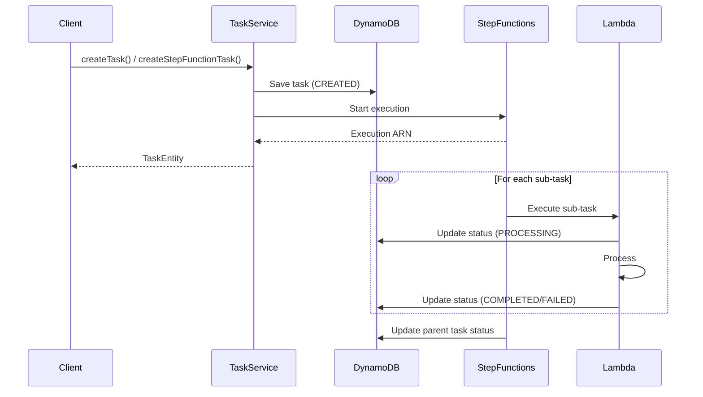

# Task

The Task package provides comprehensive task management functionality in the MBC CQRS Serverless framework. It enables:

- Asynchronous task execution
- Task status tracking
- Progress monitoring
- Error handling and retries
- Task queue management
- Task history and logging

## Architecture



## Installation

```bash
npm install @mbc-cqrs-serverless/task
```

## Usage

There are 2 type task processing:

- Single task processing
- Task processing with Step function

### Single task processing

1. Define task event

```ts
import { TaskQueueEvent } from "@mbc-cqrs-serverless/task";

export class TaskEvent extends TaskQueueEvent {}
```

2. Define task event handler

```ts
import { EventHandler, IEventHandler } from "@mbc-cqrs-serverless/core";
import { Logger } from "@nestjs/common";

import { TaskEvent } from "./task.event";

@EventHandler(TaskEvent)
export class TaskEventHandler implements IEventHandler<TaskEvent> {
  private readonly logger = new Logger(TaskEventHandler.name);

  constructor() {}

  async execute(event: TaskEvent): Promise<any> {
    this.logger.debug("executing task event::", event);

    //

    this.logger.debug(`Process task completed: ${event.taskEvent.eventID}`);
    return "Result after process";
  }
}
```

3. Implement `ITaskQueueEventFactory`

```ts
import {
  ITaskQueueEventFactory,
  TaskQueueEvent,
} from "@mbc-cqrs-serverless/task";
import { TaskEvent } from "src/sample/handler/task.event";

export class TaskQueueEventFactory implements ITaskQueueEventFactory {
  async transformTask(event: TaskQueueEvent): Promise<any[]> {
    return [new TaskEvent().fromSqsRecord(event)];
  }
}
```

4. Custom `TaskModule`

```ts
import { TaskModule } from "@mbc-cqrs-serverless/task";
import { Module } from "@nestjs/common";
import { TaskEventHandler } from "src/sample/handler/task.handler";

import { TaskQueueEventFactory } from "./task-queue-event-factory";

@Module({
  imports: [
    TaskModule.register({
      taskQueueEventFactory: TaskQueueEventFactory,
      enableController: true, // Optional: enable REST endpoints for task management
    }),
  ],
  providers: [TaskEventHandler],
  exports: [TaskModule],
})
export class CustomTaskModule {}
```

5. Custom `EventFactoryAddedTask`

```ts
import { EventFactory, IEvent } from "@mbc-cqrs-serverless/core";
import { EventFactoryAddedTask, TaskEvent } from "@mbc-cqrs-serverless/task";
import { Logger } from "@nestjs/common";
import { DynamoDBStreamEvent } from "aws-lambda";

@EventFactory()
export class CustomEventFactory extends EventFactoryAddedTask {
  private readonly logger = new Logger(CustomEventFactory.name);
  async transformDynamodbStream(event: DynamoDBStreamEvent): Promise<IEvent[]> {
    const curEvents = await super.transformDynamodbStream(event);
    const taskEvents = event.Records.map((record) => {
      if (
        record.eventSourceARN.endsWith("tasks") ||
        record.eventSourceARN.includes("tasks" + "/stream/")
      ) {
        if (record.eventName === "INSERT") {
          return new TaskEvent().fromDynamoDBRecord(record);
        }
      }
      return undefined;
    })
      .filter((event) => !!event)
      .filter((event) => event.taskEntity.sk.split("#").length < 3);

    return [...curEvents, ...taskEvents];
  }
}
```

6. Create a Task

### Task processing with Step function

1. Define step function task event

```ts
import { StepFunctionTaskEvent } from "@mbc-cqrs-serverless/task";

export class SfnTaskEvent extends StepFunctionTaskEvent {}
```

2. Define step function task event handler

```ts
import {
  EventHandler,
  IEventHandler,
  StepFunctionService,
} from "@mbc-cqrs-serverless/core";
import { TaskService } from "@mbc-cqrs-serverless/task";
import { Logger } from "@nestjs/common";
import { ConfigService } from "@nestjs/config";

import { SfnTaskEvent } from "./sfn-task.event";

@EventHandler(SfnTaskEvent)
export class SfnTaskEventHandler implements IEventHandler<SfnTaskEvent> {
  private readonly logger = new Logger(SfnTaskEventHandler.name);

  constructor() {}

  async execute(event: SfnTaskEvent): Promise<any> {
    this.logger.debug("executing task event::", event);

    //

    return "Result after process";
  }
}
```

3. Implement `ITaskQueueEventFactory`

```ts
import {
  ITaskQueueEventFactory,
  StepFunctionTaskEvent,
} from "@mbc-cqrs-serverless/task";
import { SfnTaskEvent } from "src/sample/handler/sfn-task.event";

export class TaskQueueEventFactory implements ITaskQueueEventFactory {
  async transformStepFunctionTask(event: StepFunctionTaskEvent): Promise<any[]> {
    return [new SfnTaskEvent(event)];
  }
}
```

4. Custom `TaskModule`

```ts
import { TaskModule } from "@mbc-cqrs-serverless/task";
import { Module } from "@nestjs/common";
import { TaskEventHandler } from "src/sample/handler/task.handler";

import { TaskQueueEventFactory } from "./task-queue-event-factory";

@Module({
  imports: [
    TaskModule.register({
      taskQueueEventFactory: TaskQueueEventFactory,
      enableController: true, // Optional: enable REST endpoints for task management
    }),
  ],
  providers: [TaskEventHandler],
  exports: [TaskModule],
})
export class CustomTaskModule {}
```

5. Custom `EventFactoryAddedTask`

```ts
import { EventFactory, IEvent } from "@mbc-cqrs-serverless/core";
import { EventFactoryAddedTask, TaskEvent } from "@mbc-cqrs-serverless/task";
import { Logger } from "@nestjs/common";
import { DynamoDBStreamEvent } from "aws-lambda";

@EventFactory()
export class CustomEventFactory extends EventFactoryAddedTask {
  private readonly logger = new Logger(CustomEventFactory.name);
  async transformDynamodbStream(event: DynamoDBStreamEvent): Promise<IEvent[]> {
    const curEvents = await super.transformDynamodbStream(event);
    const taskEvents = event.Records.map((record) => {
      if (
        record.eventSourceARN.endsWith("tasks") ||
        record.eventSourceARN.includes("tasks" + "/stream/")
      ) {
        if (record.eventName === "INSERT") {
          return new TaskEvent().fromDynamoDBRecord(record);
        }
      }
      return undefined;
    })
      .filter((event) => !!event)
      .filter((event) => event.taskEntity.sk.split("#").length < 3);

    return [...curEvents, ...taskEvents];
  }
}
```

6. Create a step function task

```ts
const item = [
  { key: "value1" },
  { key: "value2" },
  { key: "value3" },
  { key: "value4" },
  { key: "value5" },
  { key: "value6" },
];

await this.taskService.createStepFunctionTask(
  {
    input: item,
    taskType: "cat",
    tenantCode: "mbc",
  },
  { invokeContext }
);
```

## API Reference

### TaskService Methods

#### `createTask(dto: CreateTaskDto, options: { invokeContext: IInvoke }): Promise<TaskEntity>`

Creates a new task for single task processing.

```ts
const task = await this.taskService.createTask(
  {
    taskType: "data-export",
    tenantCode: "mbc",
    name: "Export user data",
    input: { userId: "123", format: "csv" },
  },
  { invokeContext }
);
```

#### `createStepFunctionTask(dto: CreateTaskDto, options: { invokeContext: IInvoke }): Promise<TaskEntity>`

Creates a new task for Step Functions processing. The input array will be processed as subtasks.

```ts
const task = await this.taskService.createStepFunctionTask(
  {
    taskType: "batch-process",
    tenantCode: "mbc",
    name: "Process batch items",
    input: [{ id: 1 }, { id: 2 }, { id: 3 }],
  },
  { invokeContext }
);
```

#### `getTask(key: DetailKey): Promise<TaskEntity>`

Retrieves a task by its primary key.

```ts
const task = await this.taskService.getTask({
  pk: "TASK#mbc",
  sk: "data-export#01HXYZ123",
});
```

#### `listItemsByPk(tenantCode: string, type?: string, options?: ListTaskOptions): Promise<TaskListEntity>`

Lists tasks by tenant code and type.

**ListTaskOptions:**
```ts
interface ListTaskOptions {
  sk?: {
    skExpession: string;
    skAttributeValues: Record<string, string>;
    skAttributeNames?: Record<string, string>;
  };
  startFromSk?: string;  // For pagination
  limit?: number;
  order?: 'asc' | 'desc';
}
```

```ts
// List all tasks for a tenant
const tasks = await this.taskService.listItemsByPk("mbc", "TASK", {
  limit: 10,
  order: "desc",
});

// List Step Function tasks
const sfnTasks = await this.taskService.listItemsByPk("mbc", "SFN_TASK");

// Paginate through results
const nextPage = await this.taskService.listItemsByPk("mbc", "TASK", {
  startFromSk: tasks.lastSk,
  limit: 10,
});
```

#### `createSubTask(event: TaskQueueEvent): Promise<TaskEntity[]>`

Creates subtasks from a parent task's input array. Each item in the input array becomes a separate subtask.

```ts
// Typically called within a TaskQueueEvent handler
const subTasks = await this.taskService.createSubTask(event);
// Returns array of TaskEntity for each input item
```

#### `getAllSubTask(subTask: DetailKey): Promise<TaskEntity[]>`

Retrieves all subtasks for a parent task.

```ts
const subTasks = await this.taskService.getAllSubTask({
  pk: "SFN_TASK#mbc",
  sk: "batch-process#01HXYZ123#0", // Any subtask key
});
// Returns all subtasks under the parent task
```

#### `updateStatus(key: DetailKey, status: string, attributes?: { result?: any; error?: any }, notifyId?: string): Promise<void>`

Updates the status of a task and sends an SNS notification.

```ts
// Mark task as completed
await this.taskService.updateStatus(
  { pk: "TASK#mbc", sk: "data-export#01HXYZ123" },
  "COMPLETED",
  { result: { exportedRows: 100 } }
);

// Mark task as failed
await this.taskService.updateStatus(
  { pk: "TASK#mbc", sk: "data-export#01HXYZ123" },
  "FAILED",
  { error: { message: "Export failed", code: "EXPORT_ERROR" } }
);
```

#### `updateSubTaskStatus(key: DetailKey, status: string, attributes?: { result?: any; error?: any }, notifyId?: string): Promise<void>`

Updates the status of a subtask and sends an SNS notification with action `"sub-task-status"`.

```ts
await this.taskService.updateSubTaskStatus(
  { pk: "SFN_TASK#mbc", sk: "batch-process#01HXYZ123#0" },
  "COMPLETED",
  { result: { processedItem: { id: 1 } } }
);
```

#### `updateStepFunctionTask(key: DetailKey, attributes?: Record<string, any>, status?: string, notifyId?: string): Promise<void>`

Updates a Step Function task with attributes and status, then sends an SNS notification.

```ts
await this.taskService.updateStepFunctionTask(
  { pk: "SFN_TASK#mbc", sk: "batch-process#01HXYZ123" },
  { executionArn: "arn:aws:states:..." },
  "PROCESSING"
);
```

#### `publishAlarm(event: TaskQueueEvent | StepFunctionTaskEvent, errorDetails: any): Promise<void>`

Publishes an alarm notification via SNS when an error occurs during task processing. This method is typically called from error handlers in task processing workflows.

```ts
try {
  // Process task
  await this.processTask(event);
} catch (error) {
  // Send alarm notification
  await this.taskService.publishAlarm(event, {
    message: error.message,
    stack: error.stack,
  });
  throw error;
}
```

The alarm notification includes:
- Task key (`pk`, `sk`)
- Tenant code
- Error details
- Action type: `"sfn-alarm"`

#### `formatTaskStatus(tasks: TaskEntity[]): Promise<object>`

Formats the task status by calculating subtask counts and aggregating status information. Useful for displaying task progress in UI.

```ts
// Get all subtasks for a parent task
const subTasks = await this.taskService.getAllSubTask({
  pk: "SFN_TASK#mbc",
  sk: "batch-process#01HXYZ123#0"
});

const formattedStatus = await this.taskService.formatTaskStatus(subTasks);
// Returns:
// {
//   subTaskCount: 10,           // Total number of subtasks
//   subTaskSucceedCount: 7,     // Number of completed subtasks
//   subTaskFailedCount: 1,      // Number of failed subtasks
//   subTaskRunningCount: 2,     // Number of in-progress subtasks
//   subTasks: [                 // Array of subtask summaries
//     { pk: "...", sk: "...", status: "COMPLETED" },
//     ...
//   ]
// }
```

The return object structure:

```ts
{
  subTaskCount: number;        // Total subtask count
  subTaskSucceedCount: number; // COMPLETED subtasks
  subTaskFailedCount: number;  // FAILED subtasks
  subTaskRunningCount: number; // PROCESSING subtasks
  subTasks: Array<{            // Subtask summary array
    pk: string;
    sk: string;
    status: string;
  }>;
}
```

### Task Status Values

| Status | Description |
|------------|-----------------|
| `CREATED` | Task has been created but not yet started |
| `QUEUED` | Task has been queued for processing |
| `STARTED` | Task execution has started |
| `PROCESSING` | Task is currently being processed |
| `FINISHED` | Task execution has finished |
| `COMPLETED` | Task finished successfully |
| `ERRORED` | Task encountered an error during execution |
| `FAILED` | Task failed with an error |

### CreateTaskDto

The `CreateTaskDto` class defines the structure for creating a new task:

```ts
interface CreateTaskDto {
  tenantCode: string;  // Required: Tenant identifier
  taskType: string;    // Required: Type/category of the task
  name?: string;       // Optional: Display name (defaults to taskType)
  input: Record<string, any>;  // Required: Task input data
}
```

### ITaskQueueEventFactory Interface

The `ITaskQueueEventFactory` interface defines optional methods for transforming task events. You only need to implement the method(s) relevant to your use case:

```ts
interface ITaskQueueEventFactory<TEvent extends IEvent = any> {
  transformTask?(event: TaskQueueEvent): Promise<TEvent[]>;           // Optional: For single task processing
  transformStepFunctionTask?(event: StepFunctionTaskEvent): Promise<TEvent[]>;  // Optional: For Step Function task processing
}
```

Note: Both methods are optional. Implement `transformTask` for single task processing, or `transformStepFunctionTask` for Step Function task processing, or both if your application uses both types.
