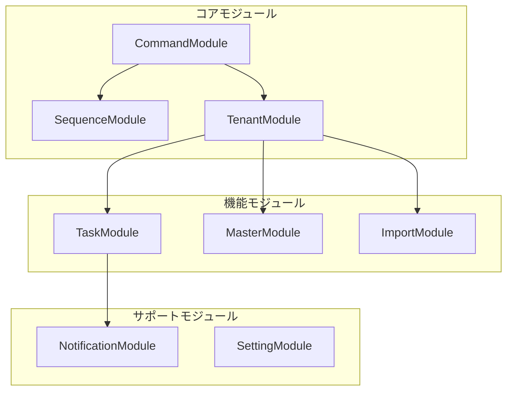

# モジュール

MBC CQRS Serverlessフレームワークは、エンタープライズグレードのサーバーレスアプリケーションを構築するための包括的なモジュールセットを提供します。各モジュールは、CQRSとイベントソーシングパターンとの一貫性を維持しながら、特定の関心事を処理するように設計されています。

## モジュール概要



## コアモジュール

| モジュール | パッケージ | 説明 |
|------------|-------------|-----------------|
| Commandモジュール | `@mbc-cqrs-serverless/core` | CQRSコマンド処理、データ同期、イベントソーシング |
| Sequenceモジュール | `@mbc-cqrs-serverless/sequence` | スレッドセーフな連番ID生成 |
| Tenantモジュール | `@mbc-cqrs-serverless/tenant` | マルチテナントデータの分離と管理 |

## 機能モジュール

| モジュール | パッケージ | 説明 |
|------------|-------------|-----------------|
| Taskモジュール | `@mbc-cqrs-serverless/task` | Step Functionsによる非同期タスク実行 |
| Masterモジュール | `@mbc-cqrs-serverless/master` | マスターデータと設定の管理 |
| Importモジュール | `@mbc-cqrs-serverless/import` | Distributed Mapによる大規模CSVインポート |

## サポートモジュール

| モジュール | パッケージ | 説明 |
|------------|-------------|-----------------|
| Notificationモジュール | `@mbc-cqrs-serverless/core` | Amazon SESによるメール通知 |
| Settingモジュール | `@mbc-cqrs-serverless/ui-setting` | ユーザーインターフェース設定のストレージ |

## クイックスタート

コアパッケージをインストール：

```bash
npm install @mbc-cqrs-serverless/core
```

アプリケーションにCommandModuleを登録：

```typescript
import { CommandModule } from '@mbc-cqrs-serverless/core';

@Module({
  imports: [
    CommandModule.register({
      tableName: 'your-table-name',
    }),
  ],
})
export class YourModule {}
```

## 共通パターン

### サービスインジェクション

すべてのサービスはNestJSプロバイダーでインジェクション可能です：

```typescript
import { CommandService, DataService } from '@mbc-cqrs-serverless/core';

@Injectable()
export class YourService {
  constructor(
    private readonly commandService: CommandService,
    private readonly dataService: DataService,
  ) {}
}
```

### マルチテナントコンテキスト

ほとんどの操作はデータ分離のためにテナントコンテキストが必要です：

```typescript
async createItem(tenantCode: string, data: CreateDto, invokeContext: IInvoke) {
  return this.commandService.publishAsync({
    pk: `${tenantCode}#ITEM`,
    sk: data.id,
    tenantCode,
    // ... other fields
  }, { invokeContext });
}
```

## モジュールドキュメント

各モジュールの詳細ドキュメントを参照：

```mdx-code-block
import DocCardList from '@theme/DocCardList';

<DocCardList />
```
