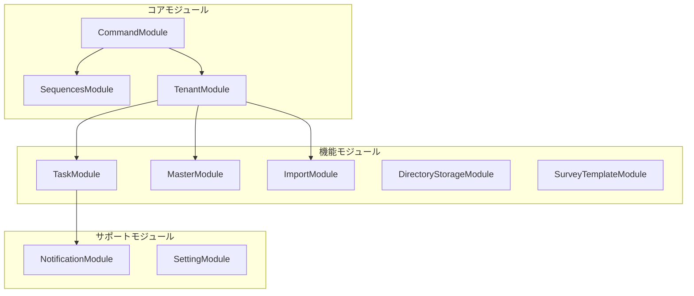

# APIリファレンス

MBC CQRS Serverlessフレームワークは、エンタープライズグレードのサーバーレスアプリケーションを構築するための包括的なモジュールセットを提供します。各モジュールは、CQRSとイベントソーシングパターンとの一貫性を維持しながら、特定の関心事を処理するように設計されています。

## モジュール概要 {#module-overview}


```mermaid
graph TB
    subgraph "コアモジュール"
        A["CommandModule"]
        B["SequencesModule"]
        C["TenantModule"]
    end

    subgraph "機能モジュール"
        D["TaskModule"]
        E["MasterModule"]
        F["ImportModule"]
        G["DirectoryStorageModule"]
        H["SurveyTemplateModule"]
    end

    subgraph "サポートモジュール"
        I["NotificationModule"]
        J["SettingModule"]
    end

    A --> B
    A --> C
    C --> D
    C --> E
    C --> F
    D --> I
```

## コアモジュール {#core-modules}

| モジュール | パッケージ | 説明 |
|------------|-------------|-----------------|
| Commandモジュール | `@mbc-cqrs-serverless/core` | CQRSコマンド処理、データ同期、イベントソーシング |
| Sequenceモジュール | `@mbc-cqrs-serverless/sequence` | スレッドセーフな連番ID生成 |
| Tenantモジュール | `@mbc-cqrs-serverless/tenant` | マルチテナントデータの分離と管理 |

## 機能モジュール {#feature-modules}

| モジュール | パッケージ | 説明 |
|------------|-------------|-----------------|
| Taskモジュール | `@mbc-cqrs-serverless/task` | Step Functionsによる非同期タスク実行 |
| Masterモジュール | `@mbc-cqrs-serverless/master` | マスターデータと設定の管理 |
| Importモジュール | `@mbc-cqrs-serverless/import` | Distributed Mapによる大規模CSVインポート |
| Directoryモジュール | `@mbc-cqrs-serverless/directory` | S3バックのファイル・フォルダ管理 |
| Survey Templateモジュール | `@mbc-cqrs-serverless/survey-template` | 調査テンプレート管理 |

## サポートモジュール {#support-modules}

| モジュール | パッケージ | 説明 |
|------------|-------------|-----------------|
| Queueモジュール | `@mbc-cqrs-serverless/core` | SNSとSQSメッセージング（グローバル登録済み） |
| Notificationモジュール | `@mbc-cqrs-serverless/core` | AppSyncによるリアルタイム通知（デフォルトはGraphQLサブスクリプション。Events APIはv1.3.0以降でオプトイン） |
| Emailサービス | `@mbc-cqrs-serverless/core` | Amazon SESによるトランザクションメール送信 |
| Settingモジュール | `@mbc-cqrs-serverless/ui-setting` | ユーザーインターフェース設定のストレージ |

## クイックスタート {#quick-start}

コアパッケージをインストール：

```bash
npm install @mbc-cqrs-serverless/core
```

アプリケーションにCommandModuleを登録：

```typescript
import { Module } from '@nestjs/common';
import { CommandModule } from '@mbc-cqrs-serverless/core';

@Module({
  imports: [
    CommandModule.register({
      tableName: 'your-table-name',
    }),
  ],
})
export class YourModule {}
```

## 共通パターン {#common-patterns}

### サービスインジェクション

すべてのサービスはNestJSプロバイダーでインジェクション可能です：

```typescript
import { Injectable } from '@nestjs/common';
import { CommandService, DataService } from '@mbc-cqrs-serverless/core';

@Injectable()
export class YourService {
  constructor(
    private readonly commandService: CommandService,
    private readonly dataService: DataService,
  ) {}
}
```

### マルチテナントコンテキスト

ほとんどの操作はデータ分離のためにテナントコンテキストが必要です：

```typescript
async createItem(tenantCode: string, data: CreateDto, invokeContext: IInvoke) {
  return this.commandService.publishAsync({
    pk: `ITEM#${tenantCode}`,
    sk: data.id,
    tenantCode,
    // ... other fields
  }, { invokeContext });
}
```

## モジュールドキュメント {#module-documentation}

各モジュールの詳細ドキュメントを参照：

```mdx-code-block
import DocCardList from '@theme/DocCardList';

<DocCardList />
```


## 関連ドキュメント

- [コマンドサービス](/docs/command-service) - CommandServiceの詳細ドキュメント
- [データサービス](/docs/data-service) - DataServiceクエリメソッド
- [Notificationモジュール](/docs/notification-module) - AppSyncリアルタイム通知のドキュメント
- [Emailサービス](/docs/email-service) - SESメール送信のドキュメント
- [インターフェース](/docs/interfaces) - TypeScriptインターフェースリファレンス
- [モジュール](/docs/modules) - 利用可能なモジュール
