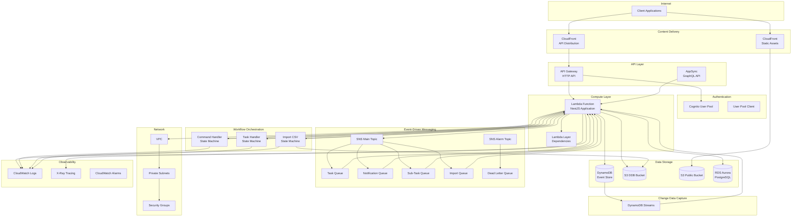
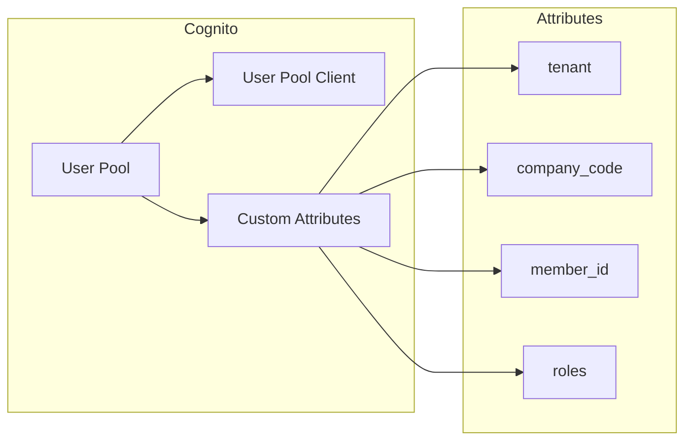
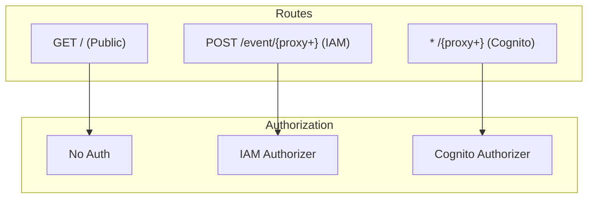
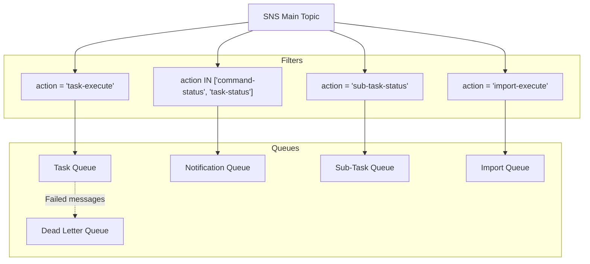
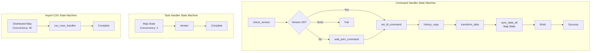
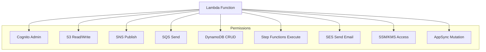
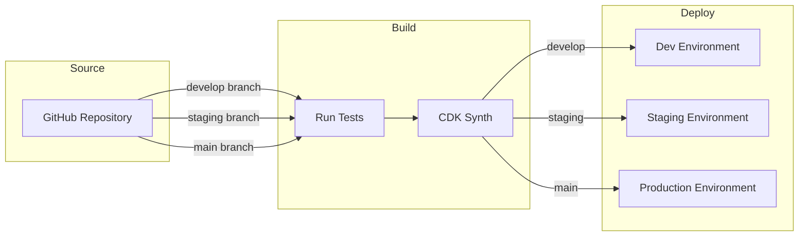

# CDKインフラストラクチャ

このドキュメントでは、MBC CQRS ServerlessフレームワークがAWS CDKを使用してプロビジョニングするAWSインフラストラクチャについて説明します。このアーキテクチャを理解することで、デプロイのカスタマイズや問題のトラブルシューティングに役立ちます。

## システムアーキテクチャ概要

以下の図は、フレームワークによって作成される完全なAWSインフラストラクチャを示しています：



## 作成されるAWSリソース

### 認証（Cognito）

Amazon Cognitoはユーザー認証と認可を提供します：



**CDK実装:**

```typescript
import * as cognito from 'aws-cdk-lib/aws-cognito';

// Create User Pool
const userPool = new cognito.UserPool(this, 'UserPool', {
  userPoolName: `${env}-${appName}-user-pool`,
  selfSignUpEnabled: false,
  signInAliases: {
    username: true,
    preferredUsername: true,
  },
  passwordPolicy: {
    minLength: 6,
    requireLowercase: false,
    requireUppercase: false,
    requireDigits: false,
    requireSymbols: false,
  },
  mfa: cognito.Mfa.OFF,
  accountRecovery: cognito.AccountRecovery.NONE,
  deletionProtection: true,
  customAttributes: {
    tenant: new cognito.StringAttribute({ maxLen: 50, mutable: true }),
    company_code: new cognito.StringAttribute({ maxLen: 50, mutable: true }),
    member_id: new cognito.StringAttribute({ maxLen: 2024, mutable: true }),
    roles: new cognito.StringAttribute({ mutable: true }),
  },
});

// Create User Pool Client
const userPoolClient = userPool.addClient('UserPoolClient', {
  authFlows: {
    userPassword: true,
    userSrp: true,
  },
});
```

### API Gateway

HTTP APIはCognito認可付きのRESTfulエンドポイントを提供します：



**CDK実装:**

```typescript
import * as apigatewayv2 from 'aws-cdk-lib/aws-apigatewayv2';
import * as apigatewayv2Integrations from 'aws-cdk-lib/aws-apigatewayv2-integrations';
import * as apigatewayv2Authorizers from 'aws-cdk-lib/aws-apigatewayv2-authorizers';

// Create HTTP API
const httpApi = new apigatewayv2.HttpApi(this, 'HttpApi', {
  apiName: `${env}-${appName}-api`,
  corsPreflight: {
    allowOrigins: ['*'],
    allowMethods: [apigatewayv2.CorsHttpMethod.ANY],
    allowHeaders: ['*'],
    maxAge: cdk.Duration.hours(1),
  },
});

// Lambda integration
const lambdaIntegration = new apigatewayv2Integrations.HttpLambdaIntegration(
  'LambdaIntegration',
  lambdaFunction
);

// Cognito authorizer
const cognitoAuthorizer = new apigatewayv2Authorizers.HttpUserPoolAuthorizer(
  'CognitoAuthorizer',
  userPool,
  { userPoolClients: [userPoolClient] }
);

// Public health check route
httpApi.addRoutes({
  path: '/',
  methods: [apigatewayv2.HttpMethod.GET],
  integration: lambdaIntegration,
});

// Protected API routes
httpApi.addRoutes({
  path: '/{proxy+}',
  methods: [
    apigatewayv2.HttpMethod.GET,
    apigatewayv2.HttpMethod.POST,
    apigatewayv2.HttpMethod.PUT,
    apigatewayv2.HttpMethod.DELETE,
    apigatewayv2.HttpMethod.PATCH,
  ],
  integration: lambdaIntegration,
  authorizer: cognitoAuthorizer,
});
```

### Lambda関数

メインコンピューティングレイヤーはNestJSアプリケーションを実行します：

**CDK実装:**

```typescript
import * as lambda from 'aws-cdk-lib/aws-lambda';

// Create Lambda Layer for dependencies
const lambdaLayer = new lambda.LayerVersion(this, 'MainLayer', {
  layerVersionName: `${env}-${appName}-main-layer`,
  code: lambda.Code.fromAsset('dist_layer'),
  compatibleRuntimes: [lambda.Runtime.NODEJS_20_X],
  compatibleArchitectures: [lambda.Architecture.ARM_64],
});

// Create Lambda Function
const lambdaFunction = new lambda.Function(this, 'LambdaApi', {
  functionName: `${env}-${appName}-lambda-api`,
  runtime: lambda.Runtime.NODEJS_20_X,
  architecture: lambda.Architecture.ARM_64,
  handler: 'main.handler',
  code: lambda.Code.fromAsset('dist'),
  memorySize: 512,
  timeout: cdk.Duration.seconds(30),
  layers: [lambdaLayer],
  tracing: lambda.Tracing.ACTIVE,
  loggingFormat: lambda.LoggingFormat.JSON,
  vpc: vpc,
  vpcSubnets: { subnets: privateSubnets },
  securityGroups: securityGroups,
  environment: {
    NODE_OPTIONS: '--enable-source-maps',
    TZ: 'Asia/Tokyo',
    NODE_ENV: env,
    APP_NAME: appName,
    LOG_LEVEL: 'info',
    S3_BUCKET_NAME: ddbBucket.bucketName,
    SNS_TOPIC_ARN: mainSnsTopic.topicArn,
    COGNITO_USER_POOL_ID: userPool.userPoolId,
    DATABASE_URL: databaseUrl,
  },
});
```

### SNSとSQS（イベント駆動メッセージング）

異なるイベントタイプに対するフィルタリング付きメッセージルーティング：



**CDK実装:**

```typescript
import * as sns from 'aws-cdk-lib/aws-sns';
import * as sqs from 'aws-cdk-lib/aws-sqs';
import * as subscriptions from 'aws-cdk-lib/aws-sns-subscriptions';

// Create SNS Topics
const mainSnsTopic = new sns.Topic(this, 'MainSnsTopic', {
  topicName: `${env}-${appName}-main-sns`,
});

const alarmSnsTopic = new sns.Topic(this, 'AlarmSnsTopic', {
  topicName: `${env}-${appName}-alarm-sns`,
});

// Create Dead Letter Queue
const taskDlq = new sqs.Queue(this, 'TaskDLQ', {
  queueName: `${env}-${appName}-task-dead-letter-queue`,
});

// Create Task Queue with DLQ
const taskQueue = new sqs.Queue(this, 'TaskQueue', {
  queueName: `${env}-${appName}-task-action-queue`,
  deadLetterQueue: {
    queue: taskDlq,
    maxReceiveCount: 5,
  },
});

// Create Notification Queue
const notificationQueue = new sqs.Queue(this, 'NotificationQueue', {
  queueName: `${env}-${appName}-notification-queue`,
});

// Create Import Queue
const importQueue = new sqs.Queue(this, 'ImportQueue', {
  queueName: `${env}-${appName}-import-action-queue`,
});

// Subscribe queues with message filtering
mainSnsTopic.addSubscription(
  new subscriptions.SqsSubscription(taskQueue, {
    filterPolicy: {
      action: sns.SubscriptionFilter.stringFilter({
        allowlist: ['task-execute'],
      }),
    },
  })
);

mainSnsTopic.addSubscription(
  new subscriptions.SqsSubscription(notificationQueue, {
    filterPolicy: {
      action: sns.SubscriptionFilter.stringFilter({
        allowlist: ['command-status', 'task-status'],
      }),
    },
    rawMessageDelivery: true,
  })
);

mainSnsTopic.addSubscription(
  new subscriptions.SqsSubscription(importQueue, {
    filterPolicy: {
      action: sns.SubscriptionFilter.stringFilter({
        allowlist: ['import-execute'],
      }),
    },
  })
);
```

### S3バケット

アプリケーションデータと静的アセットのストレージ：

**CDK実装:**

```typescript
import * as s3 from 'aws-cdk-lib/aws-s3';

// DynamoDB attributes bucket
const ddbBucket = new s3.Bucket(this, 'DdbAttributesBucket', {
  bucketName: `${env}-${appName}-ddb-attributes`,
  versioned: false,
  blockPublicAccess: s3.BlockPublicAccess.BLOCK_ALL,
  removalPolicy: cdk.RemovalPolicy.DESTROY,
  cors: [
    {
      allowedMethods: [
        s3.HttpMethods.GET,
        s3.HttpMethods.PUT,
        s3.HttpMethods.POST,
      ],
      allowedOrigins: ['*'],
      allowedHeaders: ['*'],
      maxAge: 3000,
    },
  ],
});

// Public assets bucket
const publicBucket = new s3.Bucket(this, 'PublicBucket', {
  bucketName: `${env}-${appName}-public`,
  versioned: false,
  blockPublicAccess: s3.BlockPublicAccess.BLOCK_ALL,
  removalPolicy: cdk.RemovalPolicy.DESTROY,
});

// Grant Lambda access
ddbBucket.grantReadWrite(lambdaFunction);
publicBucket.grantReadWrite(lambdaFunction);
```

### CloudFrontディストリビューション

地理的制限付きのAPIおよび静的アセット用CDN：

**CDK実装:**

```typescript
import * as cloudfront from 'aws-cdk-lib/aws-cloudfront';
import * as origins from 'aws-cdk-lib/aws-cloudfront-origins';

// Origin Access Identity for S3
const oai = new cloudfront.OriginAccessIdentity(this, 'OAI');
publicBucket.grantRead(oai);

// Static assets distribution
const staticDistribution = new cloudfront.Distribution(this, 'StaticDistribution', {
  defaultBehavior: {
    origin: new origins.S3Origin(publicBucket, {
      originAccessIdentity: oai,
    }),
    viewerProtocolPolicy: cloudfront.ViewerProtocolPolicy.REDIRECT_TO_HTTPS,
    cachePolicy: cloudfront.CachePolicy.CACHING_OPTIMIZED,
    allowedMethods: cloudfront.AllowedMethods.ALLOW_GET_HEAD,
  },
  priceClass: cloudfront.PriceClass.PRICE_CLASS_200,
  geoRestriction: cloudfront.GeoRestriction.allowlist('JP', 'VN'),
});

// API distribution
const apiDistribution = new cloudfront.Distribution(this, 'ApiDistribution', {
  defaultBehavior: {
    origin: new origins.HttpOrigin(httpApiDomain, {
      customHeaders: {
        'X-Origin-Verify': originVerifyToken,
      },
    }),
    viewerProtocolPolicy: cloudfront.ViewerProtocolPolicy.REDIRECT_TO_HTTPS,
    cachePolicy: cloudfront.CachePolicy.CACHING_DISABLED,
    originRequestPolicy: cloudfront.OriginRequestPolicy.ALL_VIEWER_EXCEPT_HOST_HEADER,
    responseHeadersPolicy: cloudfront.ResponseHeadersPolicy.CORS_ALLOW_ALL_ORIGINS,
    allowedMethods: cloudfront.AllowedMethods.ALLOW_ALL,
  },
  priceClass: cloudfront.PriceClass.PRICE_CLASS_200,
  geoRestriction: cloudfront.GeoRestriction.allowlist('JP', 'VN'),
});
```

### AppSync（GraphQL API）

サブスクリプション付きリアルタイムGraphQL API：

**CDK実装:**

```typescript
import * as appsync from 'aws-cdk-lib/aws-appsync';

// Create AppSync API
const graphqlApi = new appsync.GraphqlApi(this, 'GraphqlApi', {
  name: `${env}-${appName}-realtime`,
  definition: appsync.Definition.fromFile('asset/schema.graphql'),
  authorizationConfig: {
    defaultAuthorization: {
      authorizationType: appsync.AuthorizationType.API_KEY,
      apiKeyConfig: {
        expires: cdk.Expiration.after(cdk.Duration.days(365)),
      },
    },
    additionalAuthorizationModes: [
      { authorizationType: appsync.AuthorizationType.IAM },
      {
        authorizationType: appsync.AuthorizationType.USER_POOL,
        userPoolConfig: { userPool },
      },
    ],
  },
  xrayEnabled: true,
});

// None data source for local resolvers
const noneDataSource = graphqlApi.addNoneDataSource('NoneDataSource');

// Mutation resolver
noneDataSource.createResolver('SendMessageResolver', {
  typeName: 'Mutation',
  fieldName: 'sendMessage',
  requestMappingTemplate: appsync.MappingTemplate.fromString(`
    {
      "version": "2017-02-28",
      "payload": $util.toJson($context.arguments.message)
    }
  `),
  responseMappingTemplate: appsync.MappingTemplate.fromString(
    '$util.toJson($context.result)'
  ),
});
```

### Step Functionsステートマシン

長時間実行プロセスのワークフローオーケストレーション：



**CDK実装:**

```typescript
import * as sfn from 'aws-cdk-lib/aws-stepfunctions';
import * as tasks from 'aws-cdk-lib/aws-stepfunctions-tasks';

// Helper function to create Lambda invoke tasks
const createLambdaTask = (
  stateName: string,
  integrationPattern: sfn.IntegrationPattern = sfn.IntegrationPattern.REQUEST_RESPONSE
) => {
  const payload: Record<string, any> = {
    'source': 'step-function',
    'context.$': '$$',
    'input.$': '$',
  };

  if (integrationPattern === sfn.IntegrationPattern.WAIT_FOR_TASK_TOKEN) {
    payload['taskToken'] = sfn.JsonPath.taskToken;
  }

  return new tasks.LambdaInvoke(this, stateName, {
    lambdaFunction,
    payload: sfn.TaskInput.fromObject(payload),
    stateName,
    outputPath: '$.Payload[0][0]',
    integrationPattern,
    retryOnServiceExceptions: true,
  });
};

// Define states
const fail = new sfn.Fail(this, 'fail', {
  stateName: 'fail',
  causePath: '$.cause',
  errorPath: '$.error',
});

const success = new sfn.Succeed(this, 'success', {
  stateName: 'success',
});

const finish = createLambdaTask('finish').next(success);

// Map state for parallel data sync
const syncData = createLambdaTask('sync_data');
const syncDataAll = new sfn.Map(this, 'sync_data_all', {
  stateName: 'sync_data_all',
  maxConcurrency: 0, // Unlimited
  itemsPath: sfn.JsonPath.stringAt('$'),
})
  .itemProcessor(syncData)
  .next(finish);

const transformData = createLambdaTask('transform_data').next(syncDataAll);
const historyCopy = createLambdaTask('history_copy').next(transformData);
const setTtlCommand = createLambdaTask('set_ttl_command').next(historyCopy);

// Callback pattern for async waiting
const waitPrevCommand = createLambdaTask(
  'wait_prev_command',
  sfn.IntegrationPattern.WAIT_FOR_TASK_TOKEN
).next(setTtlCommand);

// Version check choice
const checkVersionResult = new sfn.Choice(this, 'check_version_result')
  .when(sfn.Condition.numberEquals('$.result', 0), setTtlCommand)
  .when(sfn.Condition.numberEquals('$.result', 1), waitPrevCommand)
  .when(sfn.Condition.numberEquals('$.result', -1), fail)
  .otherwise(waitPrevCommand);

const checkVersion = createLambdaTask('check_version').next(checkVersionResult);

// Create log group
const commandSfnLogGroup = new logs.LogGroup(this, 'CommandSfnLogGroup', {
  logGroupName: `/aws/vendedlogs/states/${prefix}-command-handler-logs`,
  removalPolicy: cdk.RemovalPolicy.DESTROY,
  retention: logs.RetentionDays.SIX_MONTHS,
});

// Create state machine
const commandStateMachine = new sfn.StateMachine(this, 'CommandStateMachine', {
  stateMachineName: `${prefix}command-handler`,
  definitionBody: sfn.DefinitionBody.fromChainable(checkVersion),
  tracingEnabled: true,
  logs: {
    destination: commandSfnLogGroup,
    level: sfn.LogLevel.ALL,
  },
});
```

### DynamoDBイベントソース

DynamoDB StreamsをLambdaトリガーとして設定：

**CDK実装:**

```typescript
import * as lambdaEventSources from 'aws-cdk-lib/aws-lambda-event-sources';

// Tables to monitor for changes
const tableNames = ['tasks', 'sample-command', 'import_tmp'];

for (const tableName of tableNames) {
  // Lookup existing table
  const tableDesc = new cdk.custom_resources.AwsCustomResource(
    this,
    `${tableName}-desc`,
    {
      onCreate: {
        service: 'DynamoDB',
        action: 'describeTable',
        parameters: { TableName: `${prefix}${tableName}` },
        physicalResourceId: cdk.custom_resources.PhysicalResourceId.fromResponse(
          'Table.TableArn'
        ),
      },
      policy: cdk.custom_resources.AwsCustomResourcePolicy.fromSdkCalls({
        resources: cdk.custom_resources.AwsCustomResourcePolicy.ANY_RESOURCE,
      }),
    }
  );

  const table = dynamodb.Table.fromTableAttributes(this, `${tableName}-table`, {
    tableArn: tableDesc.getResponseField('Table.TableArn'),
    tableStreamArn: tableDesc.getResponseField('Table.LatestStreamArn'),
  });

  // Add event source with INSERT filter
  lambdaFunction.addEventSource(
    new lambdaEventSources.DynamoEventSource(table, {
      startingPosition: lambda.StartingPosition.TRIM_HORIZON,
      batchSize: 1,
      filters: [
        lambda.FilterCriteria.filter({
          eventName: lambda.FilterRule.isEqual('INSERT'),
        }),
      ],
    })
  );
}
```

## 環境設定

フレームワークは複数のデプロイ環境をサポートしています：

### 設定構造

```typescript
// config/type.ts
export interface Config {
  env: 'dev' | 'stg' | 'prod';
  appName: string;

  domain: {
    http: string;      // e.g., api.example.com
    appsync: string;   // e.g., graphql.example.com
  };

  userPoolId?: string;  // Optional: use existing Cognito pool

  vpc: {
    id: string;
    subnetIds: string[];
    securityGroupIds: string[];
  };

  rds: {
    accountSsmKey: string;  // SSM parameter for DB credentials
    endpoint: string;
    dbName: string;
  };

  logLevel?: {
    lambdaSystem?: 'INFO' | 'DEBUG';
    lambdaApplication?: 'TRACE' | 'DEBUG' | 'INFO' | 'WARN' | 'ERROR';
    level?: 'verbose' | 'debug' | 'info' | 'warn' | 'error';
  };

  frontBaseUrl: string;
  fromEmailAddress: string;
  wafArn?: string;  // Optional: WAF for CloudFront

  ecs?: {
    maxInstances: number;
    minInstances: number;
    cpu: number;
    memory: number;
    cpuThreshold?: number;
    autoRollback?: boolean;
  };
}
```

### 環境の例

**開発環境:**

```typescript
// config/dev/index.ts
export const config: Config = {
  env: 'dev',
  appName: 'myapp',
  logLevel: {
    lambdaSystem: 'DEBUG',
    lambdaApplication: 'TRACE',
    level: 'verbose',
  },
  // ... other config
};
```

**本番環境:**

```typescript
// config/prod/index.ts
export const config: Config = {
  env: 'prod',
  appName: 'myapp',
  logLevel: {
    lambdaSystem: 'DEBUG',
    lambdaApplication: 'INFO',
    level: 'info',
  },
  ecs: {
    maxInstances: 2,
    minInstances: 1,
    cpu: 2048,
    memory: 4096,
    cpuThreshold: 70,
    autoRollback: true,
  },
  // ... other config
};
```

## IAM権限

Lambda関数には以下の権限が付与されます：



**CDK実装:**

```typescript
// Cognito permissions
lambdaFunction.addToRolePolicy(
  new iam.PolicyStatement({
    actions: [
      'cognito-idp:AdminGetUser',
      'cognito-idp:AdminCreateUser',
      'cognito-idp:AdminDeleteUser',
      'cognito-idp:AdminUpdateUserAttributes',
      'cognito-idp:AdminSetUserPassword',
      'cognito-idp:AdminResetUserPassword',
      'cognito-idp:AdminEnableUser',
      'cognito-idp:AdminDisableUser',
      'cognito-idp:AdminAddUserToGroup',
    ],
    resources: [userPool.userPoolArn],
  })
);

// DynamoDB permissions
lambdaFunction.addToRolePolicy(
  new iam.PolicyStatement({
    actions: [
      'dynamodb:PutItem',
      'dynamodb:UpdateItem',
      'dynamodb:GetItem',
      'dynamodb:Query',
    ],
    resources: [`arn:aws:dynamodb:${region}:${account}:table/${prefix}*`],
  })
);

// Step Functions permissions
lambdaFunction.addToRolePolicy(
  new iam.PolicyStatement({
    actions: [
      'states:StartExecution',
      'states:GetExecutionHistory',
      'states:DescribeExecution',
    ],
    resources: [commandStateMachine.stateMachineArn],
  })
);

// SES permissions
lambdaFunction.addToRolePolicy(
  new iam.PolicyStatement({
    actions: ['ses:SendEmail'],
    resources: ['*'],
  })
);

// Grant S3, SNS, SQS access
ddbBucket.grantReadWrite(lambdaFunction);
publicBucket.grantReadWrite(lambdaFunction);
mainSnsTopic.grantPublish(lambdaFunction);
alarmSnsTopic.grantPublish(lambdaFunction);
taskQueue.grantSendMessages(lambdaFunction);
notificationQueue.grantSendMessages(lambdaFunction);
```

## デプロイ出力

デプロイ後、以下の出力が利用可能になります：

| 出力 | 説明 |
|--------|-------------|
| `userPoolId` | Cognito User Pool ID |
| `userPoolClientId` | Cognitoアプリクライアント ID |
| `graphqlApiUrl` | AppSync GraphQLエンドポイント |
| `graphqlApiKey` | AppSync APIキー |
| `httpApiUrl` | HTTP APIエンドポイント |
| `httpDistributionDomain` | CloudFrontカスタムドメイン |
| `stateMachineArn` | コマンドハンドラーステートマシンARN |
| `sfnTaskStateMachineArn` | タスクハンドラーステートマシンARN |

## CI/CDパイプライン

フレームワークには自動デプロイ用のCodePipelineが含まれています：



## ベストプラクティス

### セキュリティ

1. **VPC分離**：Lambdaをプライベートサブネットにデプロイ
2. **シークレット管理**：認証情報をKMS暗号化でSSM Parameter Storeに保存
3. **APIセキュリティ**：認証にCognito、内部ルートにIAMを使用
4. **S3セキュリティ**：すべてのパブリックアクセスをブロックし、CloudFront OAIを使用

### パフォーマンス

1. **Lambda最適化**：最適化されたレイヤーでARM64アーキテクチャを使用
2. **CloudFrontキャッシュ**：静的アセットをキャッシュし、APIのキャッシュを無効化
3. **コネクションプーリング**：データベース接続にRDS Proxyを使用

### モニタリング

1. **CloudWatch Logs**：構造化データを含むJSONフォーマットのログ
2. **X-Rayトレーシング**：デバッグのための分散トレーシングを有効化
3. **CloudWatch Alarms**：失敗とレイテンシに対するアラートを設定

## 関連ドキュメント

- [Step Functions](./step-functions.md) - ワークフローオーケストレーションの詳細
- [システム概要](./system-overview.md) - 高レベルアーキテクチャ
- [インストール](../installation.md) - はじめにガイド
