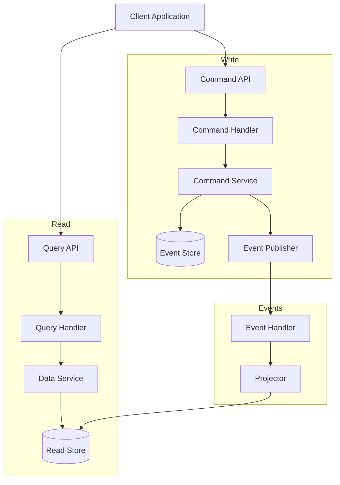
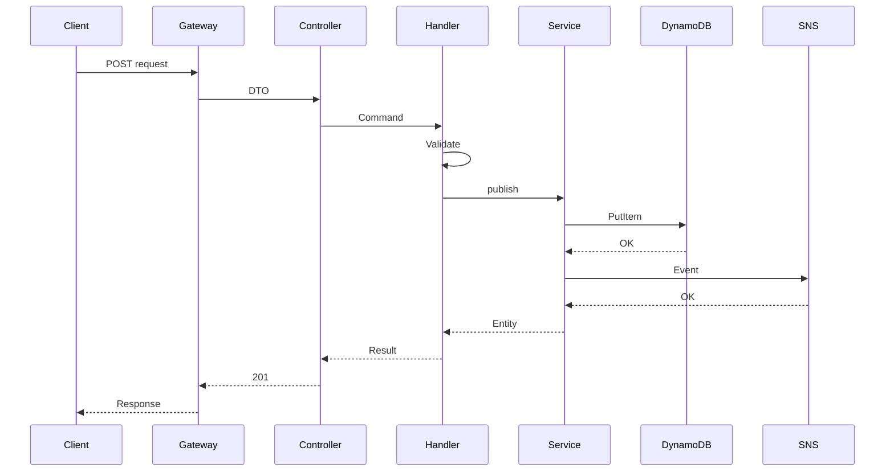
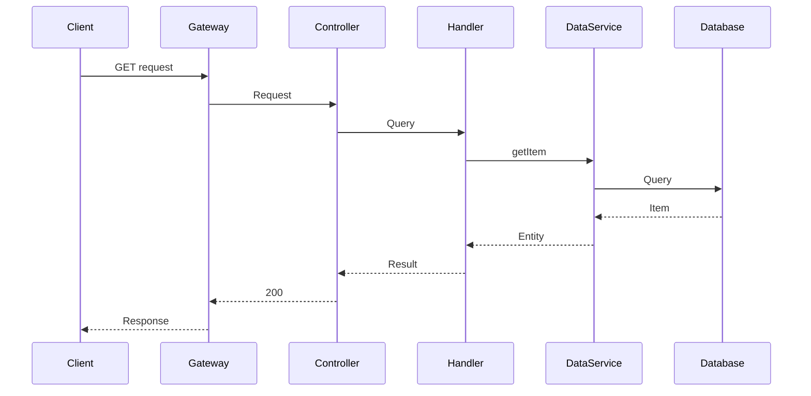

# CQRSパターンフロー

このドキュメントでは、MBC CQRS ServerlessにおけるCQRS（Command Query Responsibility Segregation）パターンの実装について説明します。

## CQRS概要



## コマンドフロー - 書き込みパス

書き込み操作のフローです。



### コマンドフローのステップ

1. **リクエスト受信**: クライアントがPOST/PUT/DELETEリクエストを送信
2. **DTOバリデーション**: コントローラーがclass-validatorを使用して入力を検証
3. **コマンドディスパッチ**: コントローラーがコマンドを作成してディスパッチ
4. **ビジネスロジック**: コマンドハンドラーがビジネスルールを実行
5. **永続化**: コマンドサービスが楽観的ロックでDynamoDBに永続化
6. **イベント発行**: ドメインイベントがSNSに発行される
7. **レスポンス**: 成功レスポンスをクライアントに返却

## クエリフロー - 読み取りパス

読み取り操作のフローです。



### クエリフローのステップ

1. **リクエスト受信**: クライアントがGETリクエストを送信
2. **クエリディスパッチ**: コントローラーがクエリを作成してディスパッチ
3. **データ取得**: クエリハンドラーがデータサービスを呼び出す
4. **データベースクエリ**: データサービスがDynamoDBまたはRDSにクエリ
5. **レスポンス**: データをクライアントに返却

## 主要コンポーネント

### コマンドハンドラー

```typescript
@CommandHandler(CreateResourceCommand)
export class CreateResourceHandler
  implements ICommandHandler<CreateResourceCommand> {

  constructor(private readonly commandService: CommandService) {}

  async execute(command: CreateResourceCommand): Promise<DataEntity> {
    // 1. Validate business rules
    // 2. Create entity
    // 3. Persist and publish event
    return this.commandService.publishAsync(entity, { invokeContext });
  }
}
```

### クエリハンドラー

```typescript
@QueryHandler(GetResourceQuery)
export class GetResourceHandler
  implements IQueryHandler<GetResourceQuery> {

  constructor(private readonly dataService: DataService) {}

  async execute(query: GetResourceQuery): Promise<DataEntity> {
    return this.dataService.getItem({
      pk: query.pk,
      sk: query.sk,
    });
  }
}
```

## CQRSの利点

CQRSパターンを採用することで以下の利点が得られます：

- **スケーラビリティ**: 読み取りと書き込みを独立してスケール可能
- **最適化**: 各側面を目的に応じて最適化可能
- **柔軟性**: 読み取りと書き込みで異なるデータモデルを使用可能
- **パフォーマンス**: 高速クエリのためにリードモデルを非正規化
- **監査性**: 監査証跡のための完全なイベント履歴
