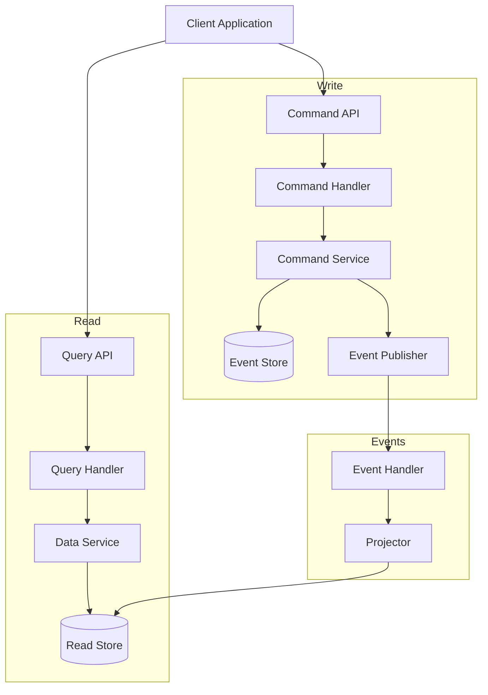
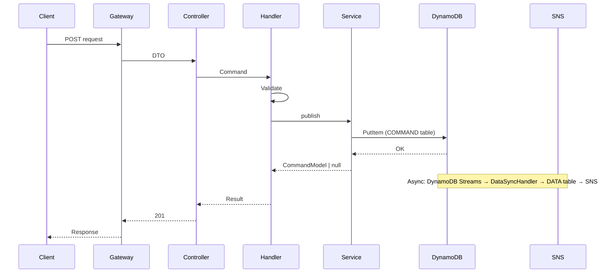
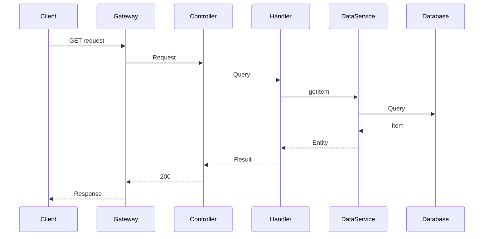

# CQRSパターンフロー

このドキュメントでは、MBC CQRS ServerlessにおけるCQRS（Command Query Responsibility Segregation）パターンの実装について説明します。

## CQRS概要


```mermaid
flowchart TB
    Client[Client Application]

    subgraph Write
        CommandAPI[Command API]
        CommandHandler[Command Handler]
        CommandService[Command Service]
        EventStore[(Event Store)]
        EventPublisher[Event Publisher]
    end

    subgraph Read
        QueryAPI[Query API]
        QueryHandler[Query Handler]
        DataService[Data Service]
        ReadStore[(Read Store)]
    end

    subgraph Events
        EventHandler[Event Handler]
        Projector[Projector]
    end

    Client --> CommandAPI
    Client --> QueryAPI

    CommandAPI --> CommandHandler
    CommandHandler --> CommandService
    CommandService --> EventStore
    CommandService --> EventPublisher

    QueryAPI --> QueryHandler
    QueryHandler --> DataService
    DataService --> ReadStore

    EventPublisher --> EventHandler
    EventHandler --> Projector
    Projector --> ReadStore
```

## コマンドフロー - 書き込みパス

書き込み操作のフローです。


```mermaid
sequenceDiagram
    Client->>Gateway: POST request
    Gateway->>Controller: DTO
    Controller->>Handler: Command
    Handler->>Handler: Validate
    Handler->>Service: publish
    Service->>DynamoDB: PutItem (COMMAND table)
    DynamoDB-->>Service: OK
    Service-->>Handler: CommandModel | null
    Note over DynamoDB,SNS: Async: DynamoDB Streams → DataSyncHandler → DATA table → SNS
    Handler-->>Controller: Result
    Controller-->>Gateway: 201
    Gateway-->>Client: Response
```

### コマンドフローのステップ

1. **リクエスト受信**: クライアントがPOST/PUT/DELETEリクエストを送信
2. **DTOバリデーション**: コントローラーがclass-validatorを使用して入力を検証
3. **コマンドディスパッチ**: コントローラーがコマンドを作成してディスパッチ
4. **ビジネスロジック**: コマンドハンドラーがビジネスルールを実行
5. **永続化**: コマンドサービスが楽観的ロックでDynamoDBに永続化
6. **イベント発行**: ドメインイベントがDynamoDB StreamsとDataSyncHandlerを経由してSNSに非同期で発行される
7. **レスポンス**: 成功レスポンスをクライアントに返却

## クエリフロー - 読み取りパス

読み取り操作のフローです。


```mermaid
sequenceDiagram
    Client->>Gateway: GET request
    Gateway->>Controller: Request
    Controller->>Handler: Query
    Handler->>DataService: getItem
    DataService->>Database: Query
    Database-->>DataService: Item
    DataService-->>Handler: Entity
    Handler-->>Controller: Result
    Controller-->>Gateway: 200
    Gateway-->>Client: Response
```

### クエリフローのステップ

1. **リクエスト受信**: クライアントがGETリクエストを送信
2. **クエリディスパッチ**: コントローラーがクエリを作成してディスパッチ
3. **データ取得**: クエリハンドラーがデータサービスを呼び出す
4. **データベースクエリ**: データサービスがDynamoDBまたはRDSにクエリ
5. **レスポンス**: データをクライアントに返却

## Read-Your-Writes整合性 {#read-your-writes}

### 結果整合性の課題

`publishAsync` はコマンドテーブルに書き込んだ直後に返却されます。SNS経由でトリガーされるプロジェクターがリードストアを更新する前に、後続の読み取りが古いデータを返す短い時間窓が存在します：

```text
publishAsync()
     │
     ▼
CommandTable ──► SNS ──► Lambda ──► ReadStore
     │                                  ▲
     │              ~async window~       │
     └──── publishAsync returns ────     │
                                         │
Client reads here ───────────────────────┘  ← may return OLD data
```

これは結果整合性システムとして期待される動作ですが、ユーザーがレコードを作成・更新してすぐに一覧画面に遷移した際に、更新前の状態が表示されるという混乱を招くことがあります。

### Read-Your-Writes (RYW) ソリューション {#ryw-solution}

MBC CQRS Serverless v1.2.0 では、書き込みを行ったユーザーに対してこの非同期ウィンドウを埋めるセッションベースの **Read-Your-Writes** レイヤーが導入されました：

```text
publishAsync()
     │
     ├──► CommandTable ──► SNS ──► Lambda ──► ReadStore
     │
     └──► SessionTable  ← TTL付きの小さなエントリ
               │
               ▼
         Repository.getItem / listItemsByPk / listItems
               │
               ├── ReadStoreから取得（DataService）
               └── SessionTableから保留中のコマンドを取得
                         │
                         └── マージ → 整合性のある結果を返す
```

`RYW_SESSION_TTL_MINUTES` が設定されている場合、`publishAsync` / `publishPartialUpdateAsync` の呼び出しごとに `SessionService` が専用のセッションテーブルに短命なエントリを書き込みます。`Repository` クラス（`DataService` をラップ）は自動的にそれらのエントリを読み取り、保留中のコマンドをクエリ結果にマージします。プロジェクターが実行される前でも、呼び出し元は自分の書き込みを即座に確認できます。

### RYWの概念まとめ

| 概念 | 説明 |
|-------------|-----------------|
| セッションエントリ | `publishAsync` 成功後に `SessionService.put()` が書き込む。`RYW_SESSION_TTL_MINUTES` 分後に失効する |
| Repository | RYWマージを透過的に適用する `DataService` の代替クラス |
| マージ戦略 | 保留中の `create` コマンドは先頭に追加、`delete` コマンドはフィルタリング、`update` / `partial-update` はリードストアのアイテムに上書き適用される |
| フォールバック | `RYW_SESSION_TTL_MINUTES` が未設定または0以下の値の場合、`SessionService.put()` はno-opとなり、`Repository` は `DataService` と同じ動作をする |

:::info バージョン情報 (v1.2.0)
Read-Your-Writesサポート（`SessionService`、`Repository`）は [v1.2.0](/docs/changelog#v120) で追加されました。有効にするには `RYW_SESSION_TTL_MINUTES` の設定とセッション用DynamoDBテーブルのプロビジョニングが必要です。

セットアップ手順と完全なAPIリファレンスについては、[Read-Your-Writes実装ガイド](/docs/command-service#read-your-writes)を参照してください。
:::

## 主要コンポーネント

### コマンドハンドラー

```typescript
@Injectable()
export class ResourceService {
  constructor(private readonly commandService: CommandService) {}

  async create(
    dto: CreateResourceDto,
    invokeContext: IInvoke,
  ): Promise<CommandModel | null> {
    // 1. ビジネスルールを検証
    // 2. コマンド入力を構築（pk、sk、属性など）
    // 3. イベントを永続化して発行
    return this.commandService.publishAsync(input, { invokeContext });
  }
}
```

### クエリハンドラー

```typescript
@Injectable()
export class ResourceQueryService {
  constructor(private readonly dataService: DataService) {}

  async findOne(pk: string, sk: string): Promise<DataModel | undefined> {
    return this.dataService.getItem({ pk, sk });
  }
}
```

## CQRSの利点

CQRSパターンを採用することで以下の利点が得られます：

- **スケーラビリティ**: 読み取りと書き込みを独立してスケール可能
- **最適化**: 各側面を目的に応じて最適化可能
- **柔軟性**: 読み取りと書き込みで異なるデータモデルを使用可能
- **パフォーマンス**: 高速クエリのためにリードモデルを非正規化
- **監査性**: 監査証跡のための完全なイベント履歴


## 関連ドキュメント

- [システム概要](/docs/architecture/system-overview) - AWSインフラストラクチャコンポーネント
- [イベントソーシング](/docs/architecture/event-sourcing) - イベントストアとリプレイ
- [コマンドサービス](/docs/command-service) - CQRSコマンドの実装
- [データサービス](/docs/data-service) - CQRSクエリの実装
