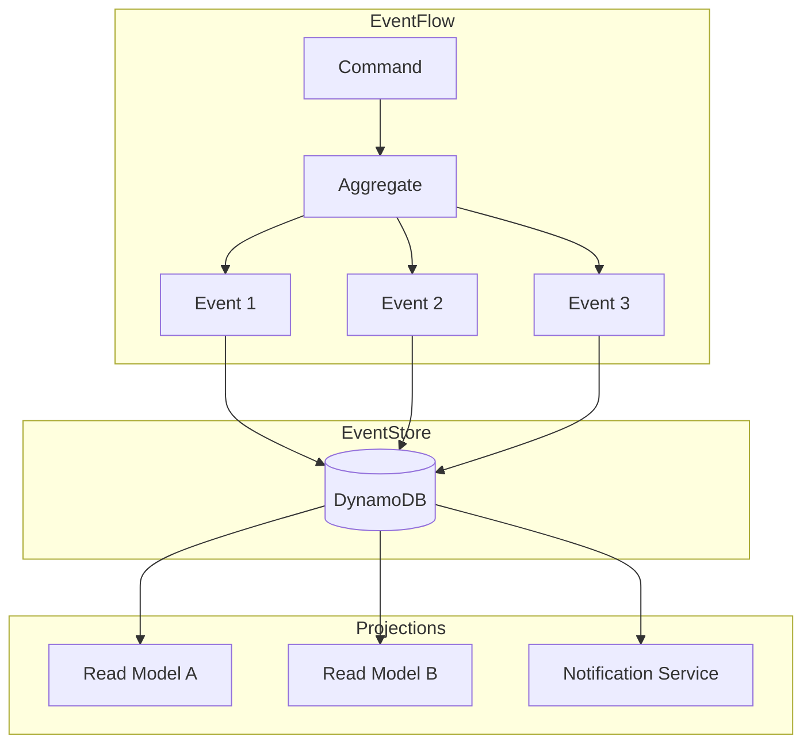
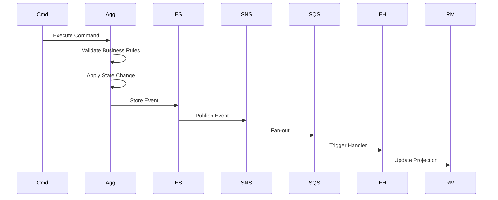
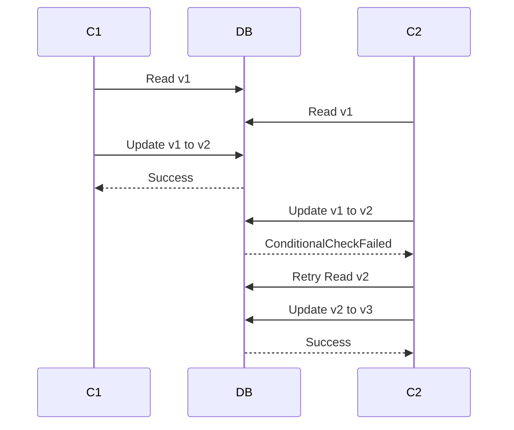
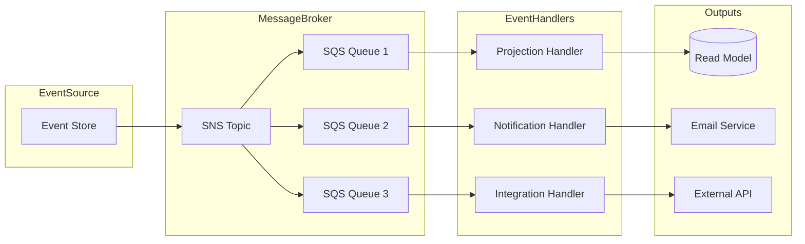

# イベントソーシングパターン

このドキュメントでは、MBC CQRS Serverlessにおけるイベントソーシングの実装について説明します。

## イベントソーシング概要



## イベントライフサイクル



## DynamoDBイベントストアスキーマ

### キー構造

イベントストレージ用のDynamoDBキー構造：

- **PK (Partition Key)**: `{TENANT}#{ENTITY_TYPE}` (例: `TENANT001#ORDER`)
- **SK (Sort Key)**: `{ENTITY_TYPE}#{ID}` (例: `ORDER#20240101-001`)

### イベントレコード例

```json
{
  "pk": "TENANT001#ORDER",
  "sk": "ORDER#20240101-001",
  "version": 3,
  "type": "OrderCreated",
  "data": {
    "orderId": "20240101-001",
    "customerId": "CUST-001",
    "items": [],
    "totalAmount": 15000
  },
  "createdAt": "2024-01-01T10:00:00Z",
  "createdBy": "user-123"
}
```

## 楽観的ロック

同時更新時のデータ整合性を確保するための楽観的ロックメカニズムについて説明します。



### バージョン管理の実装

```typescript
// Command Service automatically handles versioning
await this.commandService.publishAsync(entity, {
  invokeContext: context,
});

// DynamoDB ConditionExpression ensures optimistic locking
// ConditionExpression: 'attribute_not_exists(pk) OR version = :currentVersion'
```

## イベント処理パイプライン



## イベントハンドラーの実装

```typescript
import { EventHandler, IEventHandler } from '@mbc-cqrs-serverless/core';

@EventHandler(OrderCreatedEvent)
export class OrderCreatedHandler implements IEventHandler<OrderCreatedEvent> {
  constructor(
    private readonly notificationService: NotificationService,
    private readonly readModelService: ReadModelService,
  ) {}

  async execute(event: OrderCreatedEvent): Promise<void> {
    // Update read model
    await this.readModelService.updateOrderSummary(event);

    // Send notification
    await this.notificationService.sendOrderConfirmation(event);
  }
}
```

## イベントソーシングの利点

イベントソーシングを採用することで以下の利点が得られます：

- **完全な監査証跡**: すべての状態変更がイベントとして記録される
- **タイムトラベル**: 任意の時点での状態を再構築可能
- **イベントリプレイ**: プロジェクションを再構築するためにイベントをリプレイ
- **デバッグ**: 操作の正確なシーケンスを追跡
- **分析**: ビジネスインテリジェンス用の豊富なイベントデータ
- **統合**: イベントが外部システムの更新をトリガー可能

## ベストプラクティス

効果的なイベントソーシングのためのベストプラクティス：

1. **イミュータブルイベント**: 保存されたイベントを変更しない
2. **べき等ハンドラー**: 重複イベント配信を適切に処理
3. **イベントバージョニング**: イベントスキーマの進化を計画
4. **相関ID**: サービス間で関連イベントを追跡
5. **デッドレターキュー**: 失敗したイベント処理を処理
