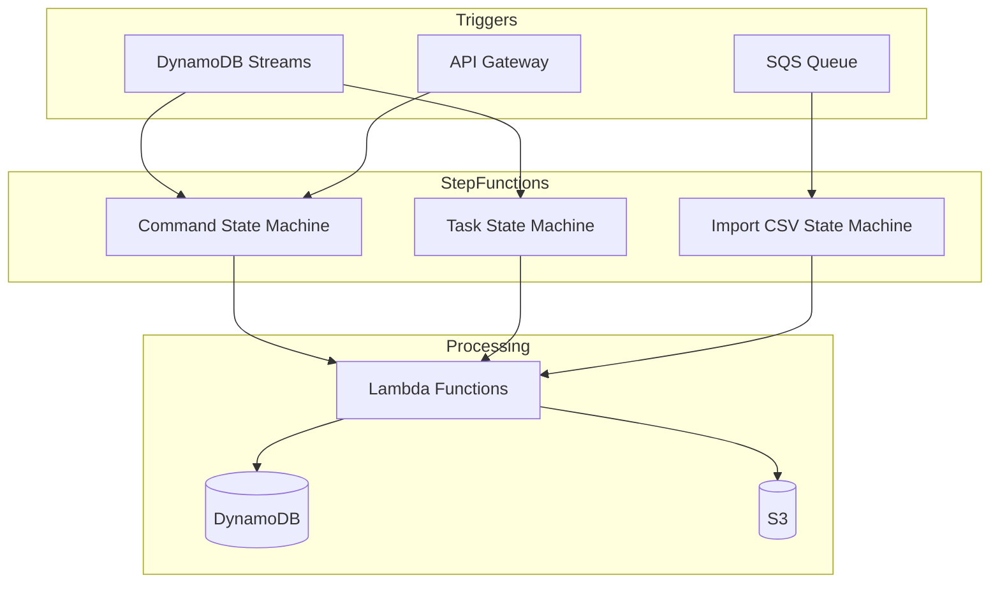
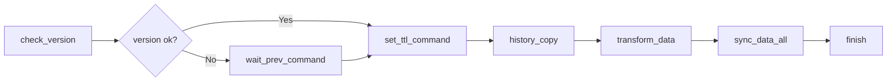
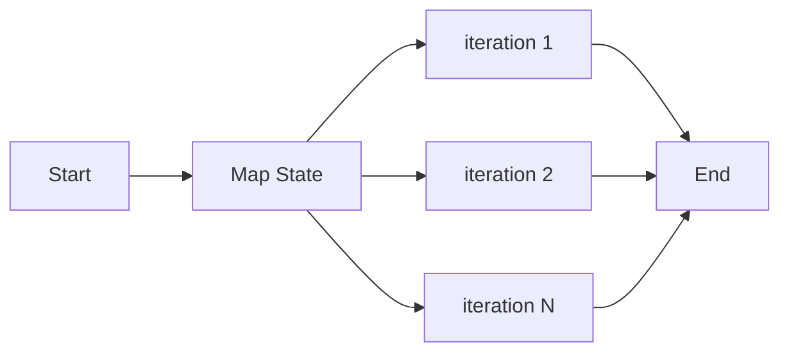
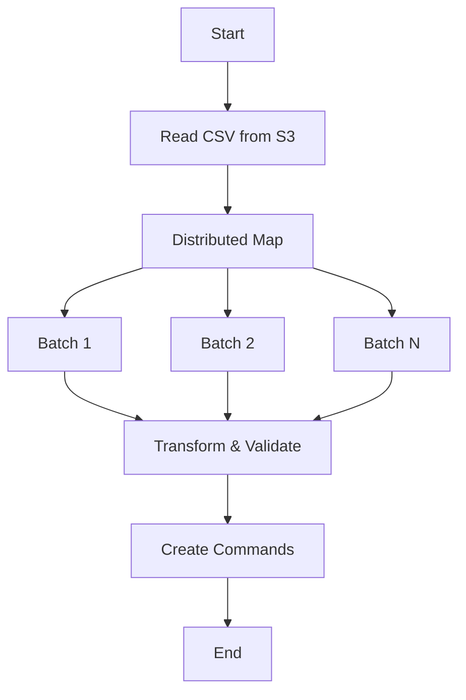
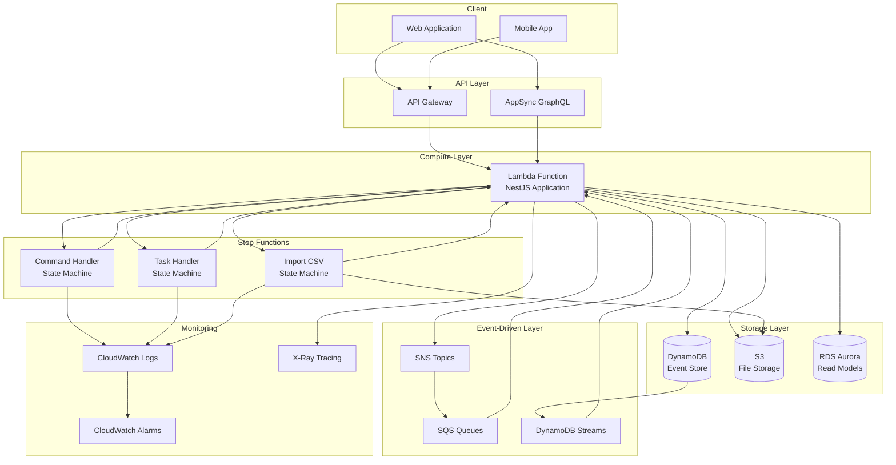
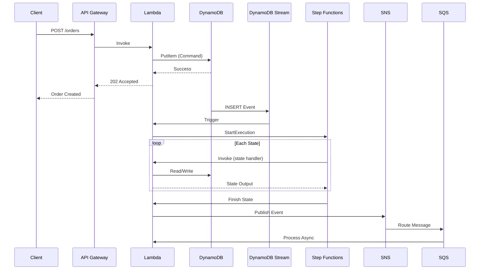

# Step Functions

AWS Step Functionsは、分散アプリケーションを調整するためのサーバーレスワークフローオーケストレーションを提供します。MBC CQRS Serverlessフレームワークでは、Step Functionsは以下の目的で使用されます：

- 長時間実行ワークフローのオーケストレーション
- 分散トランザクションのためのSagaパターン実装
- Distributed Mapを使用した並列バッチ処理
- コールバックパターンを使用した非同期タスク調整

## アーキテクチャ概要



## ステートマシン

フレームワークは3つの事前設定済みステートマシンを提供します：

### コマンドステートマシン

バージョン管理と並列処理を伴うデータ同期ワークフローを処理します。



主な機能：

- **バージョンチェック**：コマンドの順序を保証し、競合を防止
- **非同期コールバック**：タスクトークンを使用して前のコマンドを待機
- **並列同期**：Map状態を使用して複数のターゲットにデータを同期
- **TTL管理**：レコードの有効期限を自動設定

### タスクステートマシン

制御された並行性で並列サブタスクを実行します。



主な機能：

- **制御された並行性**：並列実行を制限（デフォルト：2）
- **ステータス追跡**：リアルタイムのタスクステータス更新
- **エラーハンドリング**：自動的な障害検出とレポート

### CSVインポートステートマシン

AWS Distributed Mapを使用して大規模なCSVファイルを大規模並列処理します。



主な機能：

- **S3ネイティブ統合**：S3から直接CSVを読み取り
- **バッチ処理**：効率的な処理のために行をグループ化
- **高並行性**：最大50の同時バッチプロセッサをサポート
- **EXPRESS実行**：子ステートマシンにExpressワークフローを使用

## システム構成例

以下の図は、一般的な本番環境でStep FunctionsがどのようにAWSサービスと統合されるかを示しています：



### データフローの例

Step Functionsを使用したコマンド実行の一般的なデータフローは以下の通りです：



## CDK実装例

### 完全なコマンドステートマシン

以下のCDKコードは、完全なコマンドハンドラーステートマシンの作成方法を示しています：

```typescript
import * as cdk from 'aws-cdk-lib';
import * as sfn from 'aws-cdk-lib/aws-stepfunctions';
import * as tasks from 'aws-cdk-lib/aws-stepfunctions-tasks';
import * as lambda from 'aws-cdk-lib/aws-lambda';
import * as logs from 'aws-cdk-lib/aws-logs';
import { Construct } from 'constructs';

export class CommandStateMachineConstruct extends Construct {
  public readonly stateMachine: sfn.StateMachine;

  constructor(scope: Construct, id: string, props: { lambdaFunction: lambda.IFunction }) {
    super(scope, id);

    const { lambdaFunction } = props;

    // Helper function to create Lambda invoke tasks
    const createLambdaTask = (
      stateName: string,
      integrationPattern: sfn.IntegrationPattern = sfn.IntegrationPattern.REQUEST_RESPONSE
    ) => {
      const payload: Record<string, any> = {
        'source': 'step-function',
        'context.$': '$$',
        'input.$': '$',
      };

      // Add task token for callback pattern
      if (integrationPattern === sfn.IntegrationPattern.WAIT_FOR_TASK_TOKEN) {
        payload['taskToken'] = sfn.JsonPath.taskToken;
      }

      return new tasks.LambdaInvoke(this, stateName, {
        lambdaFunction,
        payload: sfn.TaskInput.fromObject(payload),
        stateName,
        outputPath: '$.Payload[0][0]',
        integrationPattern,
        retryOnServiceExceptions: true,
      });
    };

    // Define states
    const fail = new sfn.Fail(this, 'fail', {
      stateName: 'fail',
      causePath: '$.cause',
      errorPath: '$.error',
    });

    const success = new sfn.Succeed(this, 'success', {
      stateName: 'success',
    });

    // Create task states
    const finish = createLambdaTask('finish').next(success);

    const syncData = createLambdaTask('sync_data');

    // Map state for parallel data sync
    const syncDataAll = new sfn.Map(this, 'sync_data_all', {
      stateName: 'sync_data_all',
      maxConcurrency: 0, // Unlimited concurrency
      itemsPath: sfn.JsonPath.stringAt('$'),
    })
      .itemProcessor(syncData)
      .next(finish);

    const transformData = createLambdaTask('transform_data').next(syncDataAll);
    const historyCopy = createLambdaTask('history_copy').next(transformData);
    const setTtlCommand = createLambdaTask('set_ttl_command').next(historyCopy);

    // Callback pattern for waiting on previous command
    const waitPrevCommand = createLambdaTask(
      'wait_prev_command',
      sfn.IntegrationPattern.WAIT_FOR_TASK_TOKEN
    ).next(setTtlCommand);

    // Choice state for version checking
    const checkVersionResult = new sfn.Choice(this, 'check_version_result', {
      stateName: 'check_version_result',
    })
      .when(sfn.Condition.numberEquals('$.result', 0), setTtlCommand)
      .when(sfn.Condition.numberEquals('$.result', 1), waitPrevCommand)
      .when(sfn.Condition.numberEquals('$.result', -1), fail)
      .otherwise(waitPrevCommand);

    const checkVersion = createLambdaTask('check_version').next(checkVersionResult);

    // Create log group
    const logGroup = new logs.LogGroup(this, 'StateMachineLogGroup', {
      logGroupName: '/aws/vendedlogs/states/command-handler-logs',
      removalPolicy: cdk.RemovalPolicy.DESTROY,
      retention: logs.RetentionDays.SIX_MONTHS,
    });

    // Create state machine
    this.stateMachine = new sfn.StateMachine(this, 'CommandHandlerStateMachine', {
      stateMachineName: 'command-handler',
      comment: 'Handles command stream processing with version control',
      definitionBody: sfn.DefinitionBody.fromChainable(checkVersion),
      tracingEnabled: true,
      logs: {
        destination: logGroup,
        level: sfn.LogLevel.ALL,
      },
    });
  }
}
```

### 制御された並行性を持つタスクステートマシン

```typescript
export class TaskStateMachineConstruct extends Construct {
  public readonly stateMachine: sfn.StateMachine;

  constructor(scope: Construct, id: string, props: { lambdaFunction: lambda.IFunction }) {
    super(scope, id);

    const { lambdaFunction } = props;

    // Iterator task for each item
    const iteratorTask = new tasks.LambdaInvoke(this, 'iterator', {
      lambdaFunction,
      payload: sfn.TaskInput.fromObject({
        'source': 'step-function',
        'context.$': '$$',
        'input.$': '$',
      }),
      stateName: 'iterator',
      outputPath: '$.Payload[0][0]',
    });

    // Map state with concurrency limit
    const mapState = new sfn.Map(this, 'TaskMapState', {
      stateName: 'map_state',
      maxConcurrency: 2, // Process 2 items at a time
      inputPath: '$',
      itemsPath: sfn.JsonPath.stringAt('$'),
    }).itemProcessor(iteratorTask);

    // Create log group
    const logGroup = new logs.LogGroup(this, 'TaskLogGroup', {
      logGroupName: '/aws/vendedlogs/states/task-handler-logs',
      removalPolicy: cdk.RemovalPolicy.DESTROY,
      retention: logs.RetentionDays.SIX_MONTHS,
    });

    // Create state machine
    this.stateMachine = new sfn.StateMachine(this, 'TaskHandlerStateMachine', {
      stateMachineName: 'task-handler',
      comment: 'Handles parallel task execution with concurrency control',
      definition: mapState,
      timeout: cdk.Duration.minutes(15),
      tracingEnabled: true,
      logs: {
        destination: logGroup,
        level: sfn.LogLevel.ALL,
      },
    });
  }
}
```

### CSVインポート用のDistributed Map

大規模CSVファイルの処理には、ネイティブS3統合を提供するDistributed Mapを使用します：

```typescript
import { Map as SfnMap, ProcessorMode, ProcessorConfig, IChainable, JsonPath } from 'aws-cdk-lib/aws-stepfunctions';

// Custom Distributed Map class for S3 CSV processing
export class DistributedMap extends SfnMap {
  public itemReader?: DistributedMapItemReader;
  public itemBatcher?: DistributedMapItemBatcher;
  public label?: string;

  public override toStateJson(): object {
    const mapStateJson = super.toStateJson();
    return {
      ...mapStateJson,
      ItemReader: this.itemReader,
      ItemBatcher: this.itemBatcher,
      Label: this.label,
    };
  }

  public itemProcessor(processor: IChainable, config: ProcessorConfig = {}): DistributedMap {
    super.itemProcessor(processor, {
      ...config,
      mode: ProcessorMode.DISTRIBUTED,
    });
    return this;
  }

  public setItemReader(itemReader: DistributedMapItemReader): DistributedMap {
    this.itemReader = itemReader;
    return this;
  }

  public setItemBatcher(itemBatcher: DistributedMapItemBatcher): DistributedMap {
    this.itemBatcher = itemBatcher;
    return this;
  }

  public setLabel(label: string): DistributedMap {
    this.label = label;
    return this;
  }
}

// Usage in your stack
const csvRowsHandler = new tasks.LambdaInvoke(this, 'csv_rows_handler', {
  lambdaFunction,
  payload: sfn.TaskInput.fromObject({
    'source': 'step-function',
    'context.$': '$$',
    'input.$': '$',
  }),
  stateName: 'csv_rows_handler',
});

const importCsvDefinition = new DistributedMap(this, 'import-csv', {
  maxConcurrency: 50, // Process up to 50 batches in parallel
})
  .setLabel('import-csv')
  .setItemReader({
    Resource: 'arn:aws:states:::s3:getObject',
    ReaderConfig: {
      InputType: 'CSV',
      CSVHeaderLocation: 'FIRST_ROW',
    },
    Parameters: {
      'Bucket.$': '$.bucket',
      'Key.$': '$.key',
    },
  })
  .setItemBatcher({
    MaxInputBytesPerBatch: 10,
    BatchInput: {
      'Attributes.$': '$',
    },
  })
  .itemProcessor(csvRowsHandler, {
    executionType: sfn.ProcessorType.EXPRESS, // Use EXPRESS for child executions
  });

const importCsvStateMachine = new sfn.StateMachine(this, 'ImportCsvStateMachine', {
  stateMachineName: 'import-csv',
  comment: 'Processes large CSV files with distributed batch processing',
  definitionBody: sfn.DefinitionBody.fromChainable(importCsvDefinition),
  tracingEnabled: true,
});
```

### イベントソース設定

DynamoDB StreamsとSQSを設定してStep Functionsをトリガーします：

```typescript
// DynamoDB Stream event source
const tableNames = ['tasks', 'commands', 'import_tmp'];

for (const tableName of tableNames) {
  const table = dynamodb.Table.fromTableAttributes(this, `${tableName}-table`, {
    tableArn: `arn:aws:dynamodb:${region}:${account}:table/${prefix}${tableName}`,
    tableStreamArn: `arn:aws:dynamodb:${region}:${account}:table/${prefix}${tableName}/stream/*`,
  });

  lambdaFunction.addEventSource(
    new lambdaEventSources.DynamoEventSource(table, {
      startingPosition: lambda.StartingPosition.TRIM_HORIZON,
      batchSize: 1,
      filters: [
        lambda.FilterCriteria.filter({
          eventName: lambda.FilterRule.isEqual('INSERT'),
        }),
      ],
    })
  );
}

// SQS event sources
const queues = ['task-action-queue', 'notification-queue', 'import-action-queue'];

for (const queueName of queues) {
  const queue = sqs.Queue.fromQueueArn(
    this,
    queueName,
    `arn:aws:sqs:${region}:${account}:${prefix}${queueName}`
  );

  lambdaFunction.addEventSource(
    new lambdaEventSources.SqsEventSource(queue, {
      batchSize: 1,
    })
  );
}
```

## 実装ガイド

### ステップ1：インフラストラクチャのセットアップ

フレームワークはAWS CDKを使用してStep Functionsインフラストラクチャを自動的にプロビジョニングします。主要なリソースは以下の通りです：

```typescript
// State machine definition in CDK
const commandStateMachine = new sfn.StateMachine(this, 'CommandHandler', {
  stateMachineName: 'command',
  definitionBody: sfn.DefinitionBody.fromChainable(definition),
  timeout: Duration.minutes(15),
  tracingEnabled: true,
  logs: {
    destination: logGroup,
    level: sfn.LogLevel.ALL,
  },
});
```

### ステップ2：Step Functionイベントの定義

基本のStep Functionイベントを拡張するイベントクラスを作成します：

```typescript
import { IEvent } from '@mbc-cqrs-serverless/core';
import { StepFunctionsContext } from '@mbc-cqrs-serverless/core';

export class CustomWorkflowEvent implements IEvent {
  source: string;
  context: StepFunctionsContext;
  input?: WorkflowInput;
  taskToken?: string;
}
```

### ステップ3：イベントハンドラーの実装

Step Functionイベントを処理するハンドラーを作成します：

```typescript
import { EventHandler, IEventHandler } from '@mbc-cqrs-serverless/core';
import { Logger } from '@nestjs/common';

@EventHandler(CustomWorkflowEvent)
export class CustomWorkflowHandler implements IEventHandler<CustomWorkflowEvent> {
  private readonly logger = new Logger(CustomWorkflowHandler.name);

  async execute(event: CustomWorkflowEvent): Promise<StepStateOutput> {
    const stateName = event.context.State.Name;

    switch (stateName) {
      case 'initialize':
        return this.handleInitialize(event);
      case 'process':
        return this.handleProcess(event);
      case 'finalize':
        return this.handleFinalize(event);
      default:
        throw new Error(`Unknown state: ${stateName}`);
    }
  }

  private async handleInitialize(event: CustomWorkflowEvent) {
    // Initialization logic
    return { status: 'initialized', data: event.input };
  }

  private async handleProcess(event: CustomWorkflowEvent) {
    // Processing logic
    return { status: 'processed' };
  }

  private async handleFinalize(event: CustomWorkflowEvent) {
    // Finalization logic
    return { status: 'completed' };
  }
}
```

### ステップ4：イベントファクトリーの設定

イベントファクトリーにStep Functionイベントを登録します：

```typescript
import { EventFactory, IEvent, StepFunctionsEvent } from '@mbc-cqrs-serverless/core';

@EventFactory()
export class CustomEventFactory {
  async transformStepFunction(event: StepFunctionsEvent<any>): Promise<IEvent[]> {
    const stateMachineName = event.context.StateMachine.Name;

    if (stateMachineName.includes('custom-workflow')) {
      return [new CustomWorkflowEvent(event)];
    }

    return [];
  }
}
```

### ステップ5：ステートマシン実行のトリガー

サービスからステートマシン実行を開始します：

```typescript
import { StepFunctionService } from '@mbc-cqrs-serverless/core';
import { Injectable } from '@nestjs/common';

@Injectable()
export class WorkflowService {
  constructor(private readonly sfnService: StepFunctionService) {}

  async startWorkflow(input: WorkflowInput): Promise<string> {
    const executionArn = await this.sfnService.startExecution({
      stateMachineArn: process.env.WORKFLOW_STATE_MACHINE_ARN,
      input: JSON.stringify(input),
      name: `workflow-${Date.now()}`,
    });

    return executionArn;
  }
}
```

## ユースケース

### ユースケース1：データ同期

バージョン管理と競合解決を伴う複数テーブル間のデータ同期。

**シナリオ**: コマンドが作成されると、データを複数のリードモデルに同期します。

```typescript
// Trigger: DynamoDB Stream INSERT event
// Flow: check_version -> set_ttl -> history_copy -> transform -> sync_all -> finish

await this.commandService.publish({
  pk: 'TENANT#tenant1',
  sk: 'ORDER#order123',
  attributes: { status: 'confirmed', total: 1000 },
});
// This triggers the command state machine automatically
```

### ユースケース2：バッチタスク処理

制御された並行性で複数の関連タスクを並列実行します。

**シナリオ**: ステータス追跡を伴うバッチジョブで複数のアイテムを処理します。

```typescript
// Create tasks that will be processed by the task state machine
const items = [
  { itemId: 'item1', action: 'process' },
  { itemId: 'item2', action: 'process' },
  { itemId: 'item3', action: 'process' },
];

await this.taskService.createStepFunctionTask({
  input: items,
  taskType: 'batch-processor',
  tenantCode: 'tenant1',
}, { invokeContext });
```

### ユースケース3：大規模CSVインポート

分散処理でCSVファイルから数百万行をインポートします。

**シナリオ**: バリデーションと変換を伴うS3からの大規模CSVファイルのインポート。

```typescript
// Trigger CSV import via API or direct invocation
await this.importService.createCsvImport({
  s3Bucket: 'my-bucket',
  s3Key: 'imports/data.csv',
  tableName: 'products',
  processingMode: ProcessingMode.STEP_FUNCTION,
});

// The import-csv state machine will:
// 1. Read CSV from S3
// 2. Batch rows (default: 10 per batch)
// 3. Process up to 50 batches concurrently
// 4. Transform and validate each row
// 5. Create import commands
```

### ユースケース4：非同期コールバックパターン

タスクトークンを使用して外部イベントを待機します。

**シナリオ**: ワークフローを続行する前に承認を待機します。

```typescript
// In your state machine definition
{
  "WaitForApproval": {
    "Type": "Task",
    "Resource": "arn:aws:states:::lambda:invoke.waitForTaskToken",
    "Parameters": {
      "FunctionName": "${LambdaFunction}",
      "Payload": {
        "taskToken.$": "$$.Task.Token",
        "requestId.$": "$.requestId"
      }
    },
    "Next": "ProcessApproval"
  }
}

// In your handler, store the task token
async handleWaitForApproval(event: ApprovalEvent) {
  await this.approvalService.createApprovalRequest({
    requestId: event.input.requestId,
    taskToken: event.taskToken, // Store for later callback
  });
}

// When approval is received, resume the workflow
async approveRequest(requestId: string) {
  const request = await this.approvalService.getRequest(requestId);

  await this.sfnService.sendTaskSuccess({
    taskToken: request.taskToken,
    output: JSON.stringify({ approved: true }),
  });
}
```

## Step Functionsコンテキスト

すべてのStep Functionイベントには、実行に関するコンテキスト情報が含まれます：

```typescript
interface StepFunctionsContext {
  Execution: {
    Id: string;        // Execution ARN
    Input: object;     // Original input
    Name: string;      // Execution name
    RoleArn: string;   // IAM role
    StartTime: string; // ISO timestamp
  };
  State: {
    EnteredTime: string; // When this state started
    Name: string;        // Current state name
    RetryCount: number;  // Retry attempt number
  };
  StateMachine: {
    Id: string;   // State machine ARN
    Name: string; // State machine name
  };
}
```

## エラーハンドリング

ステートマシンに堅牢なエラーハンドリングを実装します：

```typescript
// In your handler
async execute(event: WorkflowEvent): Promise<StepStateOutput> {
  try {
    const result = await this.processEvent(event);
    return { status: 'success', result };
  } catch (error) {
    // Log error for debugging
    this.logger.error('Workflow step failed', error);

    // Return error information for state machine
    return {
      status: 'error',
      error: error.message,
      cause: error.stack,
    };
  }
}
```

ステートマシンのエラーハンドリング設定：

```json
{
  "ProcessStep": {
    "Type": "Task",
    "Resource": "${LambdaArn}",
    "Retry": [
      {
        "ErrorEquals": ["States.TaskFailed"],
        "IntervalSeconds": 2,
        "MaxAttempts": 3,
        "BackoffRate": 2
      }
    ],
    "Catch": [
      {
        "ErrorEquals": ["States.ALL"],
        "Next": "HandleError",
        "ResultPath": "$.error"
      }
    ],
    "Next": "NextStep"
  }
}
```

## ベストプラクティス

### 設計原則

1. **冪等性**：各状態を安全に再試行可能に設計
2. **単一責任**：各状態は一つのことをうまく行う
3. **タイムアウト設定**：各状態に適切なタイムアウトを設定
4. **ロギング**：デバッグのための包括的なロギングを有効化

### パフォーマンス最適化

1. **Expressワークフローを使用**：高ボリューム、短期間のワークフロー向け
2. **バッチ処理**：状態遷移を減らすためにアイテムをグループ化
3. **並行性制限**：スロットリングを防ぐための適切な制限を設定
4. **S3統合**：大規模データ処理にはネイティブS3統合を使用

### モニタリング

1. **CloudWatchメトリクス**：実行回数、失敗、期間を監視
2. **X-Rayトレーシング**：デバッグのための分散トレーシングを有効化
3. **CloudWatch Logs**：詳細な実行ログをキャプチャ
4. **アラーム**：失敗率と実行時間に対するアラートを設定

## 関連ドキュメント

- [タスクモジュール](../tasks.md) - Step Functionsを使用したタスク管理
- [インポート/エクスポートパターン](../import-export-patterns.md) - Distributed Mapを使用したCSVインポート
- [イベントソーシング](./event-sourcing.md) - イベント駆動アーキテクチャ
- [CQRSフロー](./cqrs-flow.md) - コマンドとクエリの分離
