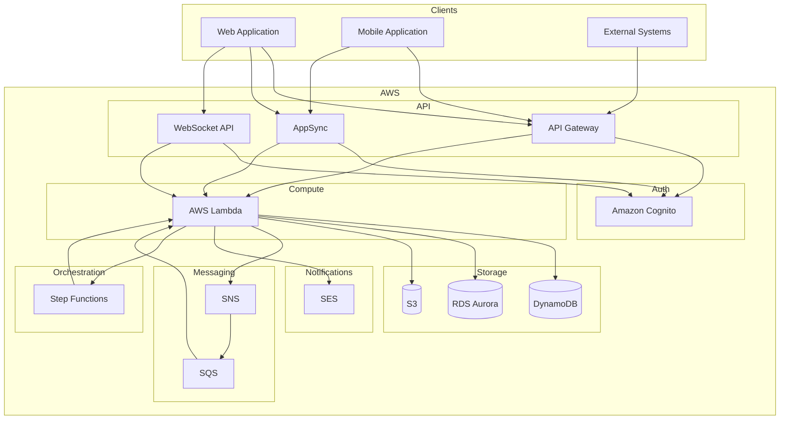
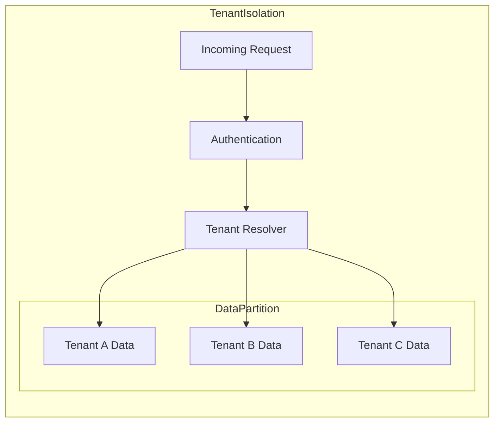

# システムアーキテクチャ概要

このドキュメントではMBC CQRS Serverlessフレームワークのアーキテクチャ概要を説明します。

## AWSインフラストラクチャ

## コンポーネント説明

### APIレイヤー

クライアントリクエストを受け取るエントリーポイントです。

- **API Gateway**: CRUD操作用のREST APIエンドポイント
- **AppSync**: 柔軟なクエリとサブスクリプション用のGraphQL API
- **WebSocket API**: リアルタイム双方向通信

### 認証

- **Amazon Cognito**: ユーザー認証、JWTトークン、ユーザープール

### コンピューティング

- **AWS Lambda**: NestJSアプリケーションのサーバーレス実行

### データストレージ

- **DynamoDB**: CQRSデータ永続化のためのプライマリイベントストア
- **RDS Aurora**: 複雑なクエリ用のオプショナルリレーショナルデータ
- **S3**: ファイルとドキュメントのストレージ

### メッセージング

- **SNS**: イベントファンアウトとトピックベースのパブリッシング
- **SQS**: 信頼性の高いメッセージキューイングと非同期処理

### オーケストレーション

- **Step Functions**: 長時間実行ワークフローとSagaパターン

### 通知

- **SES**: トランザクションメール配信

## データフロー

システム内でのリクエストの流れを説明します。

1. **クライアントリクエスト**: クライアントがAPI Gateway、AppSync、またはWebSocket経由でリクエストを送信
2. **認証**: CognitoがJWTトークンを検証
3. **コマンド実行**: Lambdaがコマンドを処理しDynamoDBに永続化
4. **イベント発行**: イベントがSNSに発行される
5. **イベント処理**: SQSキューが非同期処理用のLambdaハンドラーをトリガー
6. **リードモデル更新**: プロジェクションが複雑なクエリ用にRDSを更新

## マルチテナントアーキテクチャ

テナント分離は以下の方法で実現されます：

- **パーティションキープレフィックス**: 各テナントのデータはテナントコードでプレフィックスされる
- **リクエストコンテキスト**: テナント情報はJWTトークンから抽出される
- **クエリフィルタリング**: すべてのクエリは自動的にテナントにスコープされる
