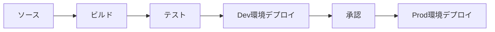

# CodePipelineによるCI/CD

このガイドでは、MBC CQRS Serverlessアプリケーション用にAWS CodePipelineを使用したCI/CDパイプラインのセットアップ方法を説明します。

## 概要

AWS CodePipelineは、ビルド、テスト、デプロイのワークフローを自動化します。典型的なパイプラインは以下で構成されます：

1. **ソースステージ**: リポジトリからコードを取得
2. **ビルドステージ**: テストを実行しアプリケーションをビルド
3. **デプロイステージ**: CDK/CloudFormationを使用してAWSにデプロイ



## 前提条件

- CodePipeline、CodeBuild権限を持つAWSアカウント
- ソースリポジトリ（GitHub、CodeCommit、またはBitbucket）
- 設定済みのAWS CDKプロジェクト

## CDKによるパイプラインスタック

### パイプラインスタックの作成

`infra/libs/pipeline-stack.ts` にパイプライン用のCDKスタックを作成します：

```typescript
import * as cdk from 'aws-cdk-lib';
import * as codepipeline from 'aws-cdk-lib/aws-codepipeline';
import * as codepipeline_actions from 'aws-cdk-lib/aws-codepipeline-actions';
import * as codebuild from 'aws-cdk-lib/aws-codebuild';
import { Construct } from 'constructs';

export interface PipelineStackProps extends cdk.StackProps {
  repositoryName: string;
  branchName: string;
  connectionArn: string;
}

export class PipelineStack extends cdk.Stack {
  constructor(scope: Construct, id: string, props: PipelineStackProps) {
    super(scope, id, props);

    // Source artifact
    const sourceOutput = new codepipeline.Artifact();

    // Build artifact
    const buildOutput = new codepipeline.Artifact();

    // CodeBuild project
    const buildProject = new codebuild.PipelineProject(this, 'BuildProject', {
      environment: {
        buildImage: codebuild.LinuxBuildImage.STANDARD_7_0,
        computeType: codebuild.ComputeType.MEDIUM,
      },
      buildSpec: codebuild.BuildSpec.fromSourceFilename('buildspec.yml'),
    });

    // Pipeline
    const pipeline = new codepipeline.Pipeline(this, 'Pipeline', {
      pipelineName: `${props.repositoryName}-pipeline`,
      stages: [
        {
          stageName: 'Source',
          actions: [
            new codepipeline_actions.CodeStarConnectionsSourceAction({
              actionName: 'GitHub_Source',
              owner: 'your-org',
              repo: props.repositoryName,
              branch: props.branchName,
              connectionArn: props.connectionArn,
              output: sourceOutput,
            }),
          ],
        },
        {
          stageName: 'Build',
          actions: [
            new codepipeline_actions.CodeBuildAction({
              actionName: 'Build',
              project: buildProject,
              input: sourceOutput,
              outputs: [buildOutput],
            }),
          ],
        },
        {
          stageName: 'Deploy',
          actions: [
            new codepipeline_actions.CloudFormationCreateUpdateStackAction({
              actionName: 'Deploy',
              stackName: `${props.repositoryName}-app`,
              templatePath: buildOutput.atPath('cdk.out/AppStack.template.json'),
              adminPermissions: true,
            }),
          ],
        },
      ],
    });
  }
}
```

## BuildSpec設定

### 基本的なbuildspec.yml

プロジェクトルートに `buildspec.yml` ファイルを作成します：

```yaml
version: 0.2

phases:
  install:
    runtime-versions:
      nodejs: 18
    commands:
      - npm ci

  pre_build:
    commands:
      - echo "Running tests..."
      - npm run test
      - npm run lint

  build:
    commands:
      - echo "Building application..."
      - npm run build
      - echo "Synthesizing CDK..."
      - cd infra && npm ci && npx cdk synth

  post_build:
    commands:
      - echo "Build completed on $(date)"

artifacts:
  files:
    - '**/*'
  base-directory: infra

cache:
  paths:
    - node_modules/**/*
    - infra/node_modules/**/*
```

### 環境変数付きBuildSpec

環境固有の設定が必要なビルドの場合：

```yaml
version: 0.2

env:
  variables:
    NODE_ENV: production
  parameter-store:
    DATABASE_URL: /your-app/database-url
  secrets-manager:
    API_KEY: your-app-secrets:api-key

phases:
  install:
    runtime-versions:
      nodejs: 18
    commands:
      - npm ci

  build:
    commands:
      - npm run build
      - cd infra && npx cdk synth --context env=$ENVIRONMENT

artifacts:
  files:
    - 'infra/cdk.out/**/*'
```

## マルチ環境パイプライン

### 開発環境と本番環境のステージ

各環境用に別々のステージを持つパイプラインを作成します：

```typescript
const pipeline = new codepipeline.Pipeline(this, 'Pipeline', {
  stages: [
    // Source stage
    { stageName: 'Source', actions: [sourceAction] },

    // Build stage
    { stageName: 'Build', actions: [buildAction] },

    // Deploy to Development
    {
      stageName: 'Deploy_Dev',
      actions: [
        new codepipeline_actions.CloudFormationCreateUpdateStackAction({
          actionName: 'Deploy_Dev',
          stackName: 'myapp-dev',
          templatePath: buildOutput.atPath('cdk.out/DevStack.template.json'),
          adminPermissions: true,
        }),
      ],
    },

    // Manual Approval for Production
    {
      stageName: 'Approval',
      actions: [
        new codepipeline_actions.ManualApprovalAction({
          actionName: 'Approve_Production',
          notifyEmails: ['team@your-company.com'],
        }),
      ],
    },

    // Deploy to Production
    {
      stageName: 'Deploy_Prod',
      actions: [
        new codepipeline_actions.CloudFormationCreateUpdateStackAction({
          actionName: 'Deploy_Prod',
          stackName: 'myapp-prod',
          templatePath: buildOutput.atPath('cdk.out/ProdStack.template.json'),
          adminPermissions: true,
        }),
      ],
    },
  ],
});
```

## GitHub接続

### CodeStar Connectionの作成

GitHubをCodePipelineに接続するには：

1. AWSコンソール → 開発者ツール → 設定 → 接続 に移動
2. 「接続を作成」をクリック
3. プロバイダーとして「GitHub」を選択
4. AWS Connector for GitHubを承認
5. 接続ARNをコピー

### CDKでの接続の使用

```typescript
const connectionArn = 'arn:aws:codestar-connections:REGION:ACCOUNT:connection/CONNECTION_ID';

new codepipeline_actions.CodeStarConnectionsSourceAction({
  actionName: 'GitHub_Source',
  owner: 'your-org',
  repo: 'your-repo',
  branch: 'main',
  connectionArn: connectionArn,
  output: sourceOutput,
});
```

## ブランチベースのパイプライン

### フィーチャーブランチ戦略

異なるブランチ用に別々のパイプラインを作成します：

| ブランチ | 環境 | 自動デプロイ |
|------------|-----------------|-----------------|
| `main` | 本番 | いいえ（承認が必要） |
| `develop` | ステージング | はい |
| `feature/*` | 開発 | はい |

### ブランチ対応のCDKパイプライン

```typescript
// Development pipeline (auto-deploy)
new PipelineStack(app, 'DevPipeline', {
  repositoryName: 'your-app',
  branchName: 'develop',
  connectionArn: connectionArn,
  autoApprove: true,
});

// Production pipeline (manual approval)
new PipelineStack(app, 'ProdPipeline', {
  repositoryName: 'your-app',
  branchName: 'main',
  connectionArn: connectionArn,
  autoApprove: false,
});
```

## 通知

### SNS通知

パイプライン通知を追加します：

```typescript
import * as sns from 'aws-cdk-lib/aws-sns';
import * as notifications from 'aws-cdk-lib/aws-codestarnotifications';

const topic = new sns.Topic(this, 'PipelineNotifications');

new notifications.NotificationRule(this, 'PipelineNotificationRule', {
  source: pipeline,
  events: [
    'codepipeline-pipeline-pipeline-execution-failed',
    'codepipeline-pipeline-pipeline-execution-succeeded',
  ],
  targets: [topic],
});
```

## ベストプラクティス

### セキュリティ

- 最小権限のIAMロールを使用
- シークレットはSecrets ManagerまたはParameter Storeに保存
- アーティファクトの暗号化を有効化
- プライベートリソースにアクセスする場合はCodeBuildでVPCを使用

### パフォーマンス

- CodeBuildで依存関係をキャッシュ
- 適切なコンピュートタイプを使用
- 独立したアクションを並列化

### 信頼性

- デプロイ後にヘルスチェックを追加
- ロールバック戦略を実装
- 本番環境にはBlue-GreenまたはCanaryデプロイを使用

## トラブルシューティング

### よくある問題

| 問題 | 解決策 |
|-----------|--------------|
| ソース接続の失敗 | CodeStar接続が「利用可能」ステータスであることを確認 |
| ビルドタイムアウト | CodeBuildプロジェクト設定でタイムアウトを延長 |
| 権限拒否 | IAMロールに必要な権限があることを確認 |
| アーティファクトが見つからない | buildspecのアーティファクト設定を確認 |

### ログの確認

CodeBuildのログはCloudWatch Logsで確認できます：

```bash
aws logs tail /aws/codebuild/your-build-project --follow
```

## 次のステップ

- [モニタリングとロギング](./monitoring-logging) - 可観測性をセットアップする
- [デプロイメントガイド](./deployment-guide) - 手動デプロイオプション
- [トラブルシューティング](./common-issues) - よくあるデプロイの問題
