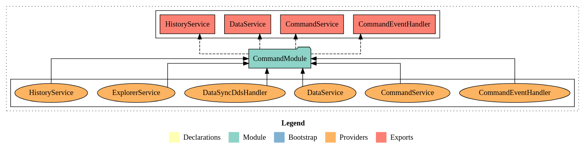

# CommandService

## 概要

「CommandService」は、コマンドの管理と同期を容易にするフレームワークのコアコンポーネントです。主に、完全なコマンドと部分的なコマンドの両方を発行する方法を提供し、それらの処理を同期または非同期で行うことができるため、システム内のコマンド処理の全体的な効率と柔軟性が向上します。

## CommandModule設定



`CommandModule`は、データ同期ハンドラーを登録し、テーブル名に関連付けられたサービスを提供するために使用される動的モジュールです。このモジュールをインポートする際は、特定のオプションを指定する必要があります。

### 登録オプション

| プロパティ                  | 説明                                                      |
| ----------------------------- | -------------------------------------------------------------------- |
| `tableName: string`           | テーブル名を指定                                               |
| `skipError?: boolean`         | 将来の使用のために予約済み。未実装です。                    |
| `dataSyncHandlers?: Type[]`   | データ同期ハンドラーを登録                                      |
| `disableDefaultHandler?: boolean` | `true`に設定すると、デフォルトのDynamoDBデータ同期ハンドラーを無効にします|

### 登録例

```typescript
import { CommandModule } from '@mbc-cqrs-serverless/core';
import { Module } from '@nestjs/common';

@Module({
  imports: [
    CommandModule.register({
      tableName: 'cat',
      dataSyncHandlers: [CatDataSyncRdsHandler],
    }),
  ],
})
export class CatModule {}
```

ここでは、`CommandModule`を`cat`テーブル名で登録し、`CatDataSyncRdsHandler`をデータ同期ハンドラーに提供しています。

## CommandServiceの使用

以下のメソッドの例では、次のように `CommandModule` をモジュールにインポートすると仮定します。

```ts
import { CommandModule } from "@mbc-cqrs-serverless/core";
import { Module } from "@nestjs/common";

import { CatDataSyncRdsHandler } from "./handler/cat-rds.handler";
import { CatController } from "./cat.controller";
import { CatService } from "./cat.service";

@Module({
  imports: [
    CommandModule.register({
      tableName: "cat",
      dataSyncHandlers: [CatDataSyncRdsHandler],
    }),
  ],
  controllers: [CatController],
  providers: [CatService],
})
export class CatModule {}
```

これで、`CommandService` と `DataService` を他のサービスに挿入して使用できるようになります。

:::tip 実装パターンについて
CommandServiceを使用した完全なCRUD実装パターンについては、[Service実装パターン](./service-patterns.md)を参照してください。
:::

## メソッド

### *async* `publishAsync(input: CommandInputModel, options: ICommandOptions): Promise<CommandModel | null>` {#publishasync}

このメソッドを使用すると、コマンド データが **command** テーブルに挿入されるため、完全なコマンドを公開できます。

このメソッドはコマンド データをすぐに返すことによって即時フィードバックを提供するため、コマンドの処理を待たずに続行できます。その後、コマンドはバックグラウンドで非同期に処理され、処理中もアプリケーションの応答性が維持されます。

**戻り値:** 成功時は`Promise<CommandModel>`を返します。コマンドがdirtyでない場合（既存のコマンドと比較して変更が検出されない場合）は`Promise<null>`を返します。

たとえば、次のように新しい cat コマンドを発行できます。

```ts
import {
  generateId,
  getCommandSource,
  VERSION_FIRST,
} from "@mbc-cqrs-serverless/core";

// class CatCommandDto extends CommandDto {}

const catCommand = new CatCommandDto({
  pk: catPk,
  sk: catSk,
  tenantCode,
  id: generateId(catPk, catSk),
  code,
  type: "CAT",
  name: attributes.name,
  version: VERSION_FIRST,
  attributes,
});

const commandSource = getCommandSource(
  basename(__dirname),
  this.constructor.name,
  "createCatCommand"
);

const item = await this.commandService.publishAsync(catCommand, {
  source: commandSource,
  invokeContext,
});
```

### *async* `publishPartialUpdateAsync( input: CommandPartialInputModel, options: ICommandOptions): Promise<CommandModel>` {#publishpartialupdateasync}

この方法を使用すると、同じ `pk` および `sk` (主キー) 値を持つ前のコマンドに基づいて新しいコマンド データを作成できます。

`publishAsync` メソッドと同様に、このメソッドはコマンドの処理を待たずに、更新されたコマンド データをすぐに返します。

たとえば、猫の名前を更新したいとします。

```ts
import { generateId, getCommandSource } from "@mbc-cqrs-serverless/core";

// ...

const catCommand: CommandPartialInputModel = {
  pk: catPk,
  sk: catSk,
  version: storedItem.version,
  name: attributes.name,
};

const commandSource = getCommandSource(
  basename(__dirname),
  this.constructor.name,
  "updateCatCommand"
);

const item = await this.commandService.publishPartialUpdateAsync(catCommand, {
  source: commandSource,
  invokeContext,
});
```

### *async* `publishSync( input: CommandInputModel, options: ICommandOptions): Promise<CommandModel | null>` {#publishsync-audit-trail}

このメソッドは、`publishAsync` メソッドに相当する同期メソッドとして機能します。つまり、コマンドが完全に処理されるまでコードの実行を停止します。これにより、コード内で以降の操作を続行する前にコマンドの結果を確実に受け取ることができます。

:::danger 破壊的変更 (v1.2.0)
[v1.2.0](/docs/changelog#v120)以降、`publishSync()`と`publishPartialUpdateSync()`はコマンドに変更がない場合（no-op）に`null`を返します。プロパティにアクセスする前に必ずnullチェックを行ってください：

```ts
const result = await this.commandService.publishSync(command, { invokeContext });
if (!result) return; // no-op: コマンドに変更なし、何も書き込まれていません
console.log(result.pk); // nullチェック後は安全
```
:::

:::info バージョンノート (v1.1.4+)
[v1.1.4](/docs/changelog#v114)以降、`publishSync`は非同期パイプラインと同等の完全な監査証跡を書き込みます：
- `syncMode: 'SYNC'`マーカー付きの不変イベントがCommandテーブルに書き込まれます
- Historyテーブルにデータが書き込まれ、完全なイベントソーシングの一致が実現されます
- コマンドライフサイクル: `publish_sync:STARTED` → `finish:FINISHED`（エラー時は`publish_sync:FAILED`）
- コマンドに変更がない場合は`null`を返します（`publishAsync`の動作と同一）
- DynamoDB Streamフィルターが`syncMode=SYNC`レコードを除外し、Step Functionsの二重実行を防止

v1.1.4以前は、`publishSync`はStep Functionsのトリガーを避けるためCommandテーブルをバイパスしており、監査証跡の欠落とHistoryテーブルへの書き込みがない状態でした。
:::

変更が検出されない場合は`null`を返します（ダーティチェック最適化）。

例えば

```ts
import {
  generateId,
  getCommandSource,
  VERSION_FIRST,
} from "@mbc-cqrs-serverless/core";

// class CatCommandDto extends CommandDto {}

const catCommand = new CatCommandDto({
  pk: catPk,
  sk: catSk,
  tenantCode,
  id: generateId(catPk, catSk),
  code,
  type: "CAT",
  name: attributes.name,
  version: VERSION_FIRST,
  attributes,
});

const commandSource = getCommandSource(
  basename(__dirname),
  this.constructor.name,
  "createCatCommandSync"
);

const item = await this.commandService.publishSync(catCommand, {
  source: commandSource,
  invokeContext,
});
```

### *async* `publishPartialUpdateSync( input: CommandPartialInputModel, options: ICommandOptions): Promise<CommandModel | null>`

このメソッドは、`publishPartialUpdateAsync` メソッドの同期バージョンです。コマンドが処理されるまでコードの実行がブロックされます。

:::danger 破壊的変更 (v1.2.0)
[v1.2.0](/docs/changelog#v120)以降、このメソッドはコマンドに変更がない場合（no-op）に`null`を返します。結果を必ずnullチェックしてください。詳細は[publishSync null return](/docs/command-service#publishsync-null-return)を参照。
:::

:::warning バージョンマッチング
このメソッドでは、入力の `version` フィールドが既存アイテムの現在のバージョンと一致する必要があります。アイテムが見つからないかバージョンが一致しない場合、「The input is not a valid, item not found or version not match」というメッセージで `BadRequestException` がスローされます。
:::

たとえば、猫の名前を更新したいとします。

```ts
import { generateId, getCommandSource } from "@mbc-cqrs-serverless/core";

// ...

const catCommand: CommandPartialInputModel = {
  pk: catPk,
  sk: catSk,
  version: storedItem.version,
  name: attributes.name,
};

const commandSource = getCommandSource(
  basename(__dirname),
  this.constructor.name,
  "updateCatCommandSync"
);

const item = await this.commandService.publishPartialUpdateSync(catCommand, {
  source: commandSource,
  invokeContext,
});
```

### *async* `publish(input: CommandInputModel, options: ICommandOptions): Promise<CommandModel | null>` <span class="badge badge--danger">削除済み</span>

:::danger v1.1.0で削除

このメソッドは[v1.1.0](/docs/changelog#v110)で削除されました。代わりに[`publishAsync`メソッド](#publishasync)を使用してください。

:::

たとえば、次のように新しい cat コマンドを発行できます。

```ts
import {
  generateId,
  getCommandSource,
  VERSION_FIRST,
} from "@mbc-cqrs-serverless/core";

// class CatCommandDto extends CommandDto {}

const catCommand = new CatCommandDto({
  pk: catPk,
  sk: catSk,
  tenantCode,
  id: generateId(catPk, catSk),
  code,
  type: "CAT",
  name: attributes.name,
  version: VERSION_FIRST,
  attributes,
});

const commandSource = getCommandSource(
  basename(__dirname),
  this.constructor.name,
  "createCatCommand"
);

const item = await this.commandService.publish(catCommand, {
  source: commandSource,
  invokeContext,
});
```

このメソッドはコマンド データを返します。

### *async* `publishPartialUpdate( input: CommandPartialInputModel, options: ICommandOptions): Promise<CommandModel | null>` <span class="badge badge--danger">削除済み</span>

:::danger v1.1.0で削除

このメソッドは[v1.1.0](/docs/changelog#v110)で削除されました。代わりに[`publishPartialUpdateAsync`メソッド](#publishpartialupdateasync)を使用してください。

:::

この方法では、以前のコマンドに基づいて新しいコマンド データを作成できます。

たとえば、猫の名前を更新したいとします。

```ts
import { generateId, getCommandSource } from "@mbc-cqrs-serverless/core";

// ...

const catCommand: CommandPartialInputModel = {
  pk: catPk,
  sk: catSk,
  version: storedItem.version,
  name: attributes.name,
};

const commandSource = getCommandSource(
  basename(__dirname),
  this.constructor.name,
  "updateCatCommand"
);

const item = await this.commandService.publishPartialUpdate(catCommand, {
  source: commandSource,
  invokeContext,
});
```

このメソッドは更新されたコマンド データを返します。

### *async* `reSyncData(): Promise<void>`

データ同期ハンドラーを再適用する場合は、このメソッドを使用できるように設計されています。次のように関数を呼び出すだけです。

```ts
await this.commandService.reSyncData();
```

### *async* `getItem(key: DetailKey): Promise<CommandModel>`

プライマリキーでコマンドアイテムを取得します。ソートキーにバージョン区切り文字が含まれていない場合、自動的に`getLatestItem`を呼び出して最新バージョンを取得します。

```ts
import { DetailKey } from "@mbc-cqrs-serverless/core";

// Get a specific version of a command (特定バージョンのコマンドを取得)
const command = await this.commandService.getItem({
  pk: "CAT#tenant1",
  sk: "CAT#cat001@2", // Includes version number (バージョン番号を含む)
});

// If no version in sk, automatically gets latest version (skにバージョンがない場合、自動的に最新バージョンを取得)
const latestCommand = await this.commandService.getItem({
  pk: "CAT#tenant1",
  sk: "CAT#cat001",
});
```

### *async* `getLatestItem(key: DetailKey): Promise<CommandModel>`

プライマリキーでコマンドアイテムの最新バージョンを取得します。このメソッドは、データテーブルのバージョンから開始し、最新のコマンドバージョンを見つけるために上下に検索するルックアップアルゴリズムを使用します。

```ts
import { DetailKey } from "@mbc-cqrs-serverless/core";

const latestCommand = await this.commandService.getLatestItem({
  pk: "CAT#tenant1",
  sk: "CAT#cat001", // Sort key without version (バージョンなしのソートキー)
});

if (latestCommand) {
  console.log(`Latest version: ${latestCommand.version}`);
}
```

### *async* `getNextCommand(currentKey: DetailKey): Promise<CommandModel>`

現在のコマンドのキーに基づいて、次のバージョンのコマンドを取得します。これは、コマンドチェーンの処理やリトライロジックの実装に役立ちます。

```ts
import { DetailKey } from "@mbc-cqrs-serverless/core";

const currentKey: DetailKey = {
  pk: "CAT#tenant1",
  sk: "CAT#cat001@2",
};

const nextCommand = await this.commandService.getNextCommand(currentKey);
// Returns command with sk: "CAT#cat001@3" if exists (存在する場合、sk: "CAT#cat001@3"のコマンドを返す)
```

### *async* `updateStatus(key: DetailKey, status: string, notifyId?: string): Promise<void>`

コマンドのステータスを更新し、SNS通知を送信します。これは、タスクやプロセスのステータスを更新し、変更をサブスクライバーに通知するために一般的に使用されます。

```ts
import { DetailKey } from "@mbc-cqrs-serverless/core";

const key: DetailKey = {
  pk: "CAT#tenant1",
  sk: "CAT#cat001@1",
};

// Update status and send SNS notification (ステータスを更新してSNS通知を送信)
await this.commandService.updateStatus(key, "COMPLETED");

// With custom notification ID (カスタム通知IDを指定)
await this.commandService.updateStatus(key, "FAILED", "custom-notify-id");
```

SNS通知ペイロードには以下が含まれます：
- `action`: `"command-status"`
- `pk`, `sk`: コマンドキー
- `table`: コマンドテーブル名
- `id`: 通知ID（カスタムまたは自動生成）
- `tenantCode`: pkから抽出
- `content`: `status`と`source`を含むオブジェクト

### *async* `duplicate(key: DetailKey, options: ICommandOptions): Promise<CommandModel>`

既存のコマンドをバージョン番号を増加させて複製します。複製されたコマンドは`source`が`"duplicated"`に設定され、メタデータ（タイムスタンプ、ユーザー、IP）が更新されます。

```ts
import { DetailKey, getCommandSource } from "@mbc-cqrs-serverless/core";
import { basename } from "path";

const key: DetailKey = {
  pk: "CAT#tenant1",
  sk: "CAT#cat001@1",
};

const commandSource = getCommandSource(
  basename(__dirname),
  this.constructor.name,
  "duplicateCatCommand"
);

const duplicatedCommand = await this.commandService.duplicate(key, {
  source: commandSource,
  invokeContext,
});

// The duplicated command has: (複製されたコマンドの内容:)
// - version incremented by 1 (- バージョンが1増加)
// - source set to "duplicated" (- sourceが"duplicated"に設定)
// - updated timestamps and user info (- タイムスタンプとユーザー情報が更新)
```

### *async* `updateTaskToken(key: DetailKey, token: string): Promise<CommandModel>` {#updatetasktoken}

コマンドアイテムにAWS Step Functionsタスクトークンを保存します。これは、Step Functionsと統合してコールバックパターンを有効にする際に使用されます。

```ts
import { DetailKey } from "@mbc-cqrs-serverless/core";

const key: DetailKey = {
  pk: "CAT#tenant1",
  sk: "CAT#cat001@1",
};

// Store the Step Functions task token (Step Functionsタスクトークンを保存)
await this.commandService.updateTaskToken(key, event.taskToken);

// Later, use the token to send task success/failure (後でトークンを使用してタスクの成功/失敗を送信)
// via SendTaskSuccessCommand or SendTaskFailureCommand (SendTaskSuccessCommandまたはSendTaskFailureCommandを使用)
```

### *async* `updateTtl(key: DetailKey): Promise<any | null>`

コマンドの前のバージョンのTTL（Time To Live）を更新します。これは通常、コマンド履歴の保持を管理するために内部的に使用されます。バージョンが低すぎるか、前のコマンドが存在しない場合は`null`を返します。

```ts
import { DetailKey } from "@mbc-cqrs-serverless/core";

const key: DetailKey = {
  pk: "CAT#tenant1",
  sk: "CAT#cat001@3", // Version 3 (バージョン3)
};

// Updates TTL of version 2 (previous version) (バージョン2（前のバージョン）のTTLを更新)
const result = await this.commandService.updateTtl(key);
```

:::note
このメソッドは主にフレームワークがコマンド履歴管理のために内部的に使用します。アプリケーションコードでの直接使用はほとんど必要ありません。
:::

### `dataSyncHandlers` (getter): IDataSyncHandler[]

このCommandServiceインスタンスに登録されているデータ同期ハンドラーの配列を返します。ハンドラーをプログラムで検査または反復処理する必要がある場合に便利です。

```ts
// Get all registered data sync handlers (登録済みのすべてのデータ同期ハンドラーを取得)
const handlers = this.commandService.dataSyncHandlers;

handlers.forEach((handler) => {
  console.log(`Handler: ${handler.constructor.name}, Type: ${handler.type}`);
});
```

### `getDataSyncHandler(name: string): IDataSyncHandler | undefined`

クラス名で特定のデータ同期ハンドラーを取得します。指定された名前のハンドラーが見つからない場合は`undefined`を返します。

```ts
// Get a specific handler by name (名前で特定のハンドラーを取得)
const rdsHandler = this.commandService.getDataSyncHandler('CatDataSyncRdsHandler');

if (rdsHandler) {
  // Use the handler directly (ハンドラーを直接使用)
  await rdsHandler.up(commandModel);
}
```

### `isNotCommandDirty(item: CommandModel, input: CommandInputModel): boolean`

既存のコマンドアイテムと新しい入力を比較して、実際に変更があるかどうかを判定します。コマンドがdirtyでない場合（変更なし）は`true`を返し、変更がある場合は`false`を返します。

このメソッドは、変更が検出されない場合に不要な書き込みをスキップするためにpublishメソッド内部で使用されます。publishを呼び出す前に更新で変更が発生するかどうかを直接確認することもできます。

```ts
// Check if an update would result in changes (更新で変更が発生するか確認)
const existingCommand = await this.commandService.getItem({ pk, sk });

if (existingCommand && this.commandService.isNotCommandDirty(existingCommand, newInput)) {
  // No changes detected, skip the update (変更が検出されないため、更新をスキップ)
  console.log('Command has no changes, skipping update');
  return existingCommand;
}

// Proceed with the update (更新を続行)
const result = await this.commandService.publishAsync(newInput, options);
```

### `tableName` (getter/setter): string

このCommandServiceインスタンスのDynamoDBテーブル名を取得または設定します。テーブル名は`CommandModule`を登録する際に設定されますが、必要に応じて実行時に変更することもできます。

```ts
// Get the current table name (現在のテーブル名を取得)
const currentTable = this.commandService.tableName;
console.log(`Operating on table: ${currentTable}`);

// Set a different table name (別のテーブル名を設定)
this.commandService.tableName = 'another-table';
```

:::note
実行時にテーブル名を変更することは高度なユースケースです。ほとんどのアプリケーションでは、`CommandModule.register()`でテーブル名を設定し、その後は変更しないでください。
:::

---

## Read-Your-Writes（RYW）一貫性 {#read-your-writes}

:::info バージョンノート
Read-Your-Writes一貫性は[v1.2.0](/docs/changelog#v120)で追加されました。
:::

### 問題: publishAsync後の古いデータ読み取り

`publishAsync`はCommandテーブルへの書き込み後すぐに返り、その後DynamoDB StreamパイプラインがデータをReadモデル（Dataテーブル）に非同期で同期します。この間、同一ユーザーによる後続の読み取りは古いデータを返してしまいます。例えば「注文作成」ボタンが正常に送信されてユーザーが注文一覧にリダイレクトされても、新しい注文がまだ表示されない状態です。

```
User Action                 DynamoDB Stream          User Sees
──────────────────────────────────────────────────────────────────
POST /orders ──────────► publishAsync() ─────► Command table ✓
                                                      │
GET  /orders ──────────► DataService.list() ─► Data table   ✗  ← stale!
                                                      │
                         [Stream sync ~1-3s]          │
                                          ↓           ▼
GET  /orders ──────────► DataService.list() ─► Data table   ✓  ← fresh
```

### 解決策: セッションベースのマージ

RYWはこのギャップを、保留中のコマンドのバージョン番号を短命なセッションテーブルに一時キャッシュすることで解消します。`Repository`経由で読み取る際、セッションエントリが検出され、保留中のコマンドがCommandテーブルから取得されてレスポンスにマージされます — これにより書き込みを行ったユーザーには即座に反映されます。

```
User Action                 With RYW                 User Sees
──────────────────────────────────────────────────────────────────
POST /orders ──────────► publishAsync()
                         ├─► Command table ✓
                         └─► Session table (TTL=5m)

GET  /orders ──────────► Repository.listItemsByPk()
                         ├─► Session table ─► found! version=3
                         ├─► Command table  ─► fetch pending cmd
                         └─► merge into result     ✓  ← fresh!
```

### 動作の仕組み（内部処理）

1. **書き込みパス** — `publishAsync`成功後、`CommandService`が`{NODE_ENV}-{APP_NAME}-session`テーブルにセッションエントリを書き込みます：
   - PK: `{userId}#{tenantCode}`
   - SK: `{moduleTableName}#{itemId}`
   - `version`: 発行されたコマンドのバージョン番号
   - `ttl`: 現在時刻 + `RYW_SESSION_TTL_MINUTES`秒（DynamoDB TTLがエントリを自動削除）
   - **注意**: `RYW_SESSION_TTL_MINUTES`未設定の場合、この書き込みは完全にスキップされます。`Repository`の読み取りは正しく動作します — セッションエントリが見つからず`DataService`にフォールバックするだけです。

2. **読み取りパス** — `Repository`はデータを返す前にセッションテーブルを確認します：
   - `getItem`の場合: セッションエントリが存在すれば、バージョン付きコマンドを取得して既存のデータアイテムとマージ
   - `listItemsByPk`の場合: ユーザー/テナント/モジュールのセッションエントリを全取得し、更新・削除・新規作成を基底リスト結果に適用
   - `listItems`（RDS等の外部ソース）の場合: 同様のマージロジックで、`transformCommand`でコマンドを外部クエリの形に変換。`listItemsByPk`（`pk`引数から`tenantCode`を取得）とは異なり、`listItems`は`getUserContext(options.invokeContext)`から`tenantCode`を取得するため、RYWを有効にするには有効な`invokeContext`を持つ`options`が必要

3. **セッション期限切れ** — DynamoDB TTLにより自動的に期限切れになります。Streamの同期が完了すると（通常1〜3秒）、セッションエントリは不要となりTTL期間内にクリーンアップされます。

### RYWの有効化 {#enabling-ryw}

#### ステップ1: 環境変数を設定する

`RYW_SESSION_TTL_MINUTES`を正の整数に設定します。`5`（分）が安全なデフォルト値です — Streamの同期遅延をカバーしつつセッションテーブルを小さく保てます。

```bash
RYW_SESSION_TTL_MINUTES=5
```

未設定（または0や非数値に設定）の場合、機能は完全に無効になります：セッション書き込みはスキップされ、`Repository`は`DataService`と同じ動作をします。

#### ステップ2: セッションDynamoDBテーブルを作成する

`dynamodbs/session.json`をプロジェクトに追加します（他のテーブル定義と同じ場所）：

```json
{
  "TableName": "${NODE_ENV}-${APP_NAME}-session",
  "BillingMode": "PAY_PER_REQUEST",
  "KeySchema": [
    { "AttributeName": "pk", "KeyType": "HASH" },
    { "AttributeName": "sk", "KeyType": "RANGE" }
  ],
  "AttributeDefinitions": [
    { "AttributeName": "pk", "AttributeType": "S" },
    { "AttributeName": "sk", "AttributeType": "S" }
  ],
  "TimeToLiveSpecification": {
    "AttributeName": "ttl",
    "Enabled": true
  }
}
```

テーブル名は`{NODE_ENV}-{APP_NAME}-session`として自動計算されます（例: `dev-myapp-session`）。

### Repositoryの使い方 {#repository-api}

`Repository`はRYW一貫性が必要な読み取り操作において`DataService`の代替として使用できます。`@mbc-cqrs-serverless/core`（`CommandModule`経由）からエクスポートされています。モジュールに登録してサービスにインジェクトしてください。

#### モジュールへの登録

```ts
import { CommandModule } from '@mbc-cqrs-serverless/core'

@Module({
  imports: [
    CommandModule.register({
      tableName: 'order',
      dataSyncHandlers: [OrderDataSyncHandler],
    }),
  ],
  providers: [OrderService],
  exports: [OrderService],
})
export class OrderModule {}
```

`Repository`は`CommandModule.register()`によって自動的にプロバイドおよびエクスポートされます — 追加の設定は不要です。

#### `getItem` — RYWマージ付き単一アイテム取得

```ts
import { DetailKey, ICommandOptions, Repository } from '@mbc-cqrs-serverless/core'
import { Injectable } from '@nestjs/common'

@Injectable()
export class OrderService {
  constructor(private readonly repository: Repository) {}

  async getOrder(key: DetailKey, options: ICommandOptions) {
    // このアイテムに対してユーザーが直前にasyncコマンドを発行した場合、
    // 保留バージョンがマージされます — ユーザーは常に自分の書き込みを見ることができます。
    return this.repository.getItem(key, options)
  }
}
```

#### `listItemsByPk` — RYWマージ付きDynamoDBリスト取得

マージを有効にするには第3引数に`{ latestFlg: true }`を渡します。`mergeOptions`を省略するか`latestFlg`が`false`/`undefined`の場合、`DataService.listItemsByPk`と同じ動作です。

```ts
async listOrders(pk: string, options: ICommandOptions) {
  return this.repository.listItemsByPk(
    pk,
    { limit: 20, order: 'desc' },  // 標準DynamoDBクエリオプション
    { latestFlg: true },            // RYWマージを有効化
    options,
  )
}
```

操作ごとのマージ動作：

| 操作 | 結果 |
|---|---|
| 新規作成 | リストの先頭に追加（複数の保留作成がある場合は`updatedAt`降順でソート） |
| 更新 | 元の位置で置き換え — 元のソート順を保持 |
| 削除 | 結果から除外 |

:::note 新規作成後のソート順
新規作成されたアイテムはリストの先頭に追加されます。呼び出し元のソート順（`name`や`code`順など）には統合されません。DynamoDB Streamの同期が完了して次の読み取りで完全にソートされたデータが返るまで先頭に表示されます。これは意図的な動作です — RYWが保証するのは*可視性*であり、ソート位置ではありません。
:::

#### `listItems` — RYWマージ付き外部ソース（RDS / Elasticsearch）クエリ

外部ソース（TypeORMやPrismaを使用したRDSなど）をクエリするサービスでは、`listItems`と`transformCommand`関数を使用して保留中のコマンドをクエリ結果と同じ形に変換します。

```ts
import { IMergeOptions, ICommandOptions, Repository } from '@mbc-cqrs-serverless/core'
import { Injectable } from '@nestjs/common'
import { OrderDto } from './dto/order.dto'

@Injectable()
export class OrderService {
  constructor(
    private readonly repository: Repository,
    private readonly orderRepository: TypeOrmOrderRepository,
  ) {}

  async searchOrders(
    filter: OrderFilterDto,
    options: ICommandOptions,
  ): Promise<{ total: number; items: OrderDto[] }> {
    const mergeOptions: IMergeOptions<OrderDto> = {
      latestFlg: true,

      // 保留中のCommandModelをOrderDtoに変換
      transformCommand: (cmd, existing) => ({
        id: cmd.id,
        code: cmd.code,
        name: cmd.name,
        status: cmd.attributes?.status ?? existing?.status,
        // コマンドに存在しないJOINフィールドを引き継ぐ
        customerName: existing?.customerName ?? '',
        createdAt: cmd.createdAt,
        updatedAt: cmd.updatedAt,
      }),

      // 現在の検索フィルターにマッチする新規作成アイテムのみを先頭に追加
      matchesFilter: (item) =>
        !filter.status || item.status === filter.status,
    }

    return this.repository.listItems(
      // 基底クエリ — 通常通り実行
      () => this.orderRepository.search(filter),
      mergeOptions,
      options,
    )
  }
}
```

:::note listItemsのページネーション
マージ後に`total`が調整されます（新規作成でインクリメント、削除でデクリメント）。ただし先頭に追加されたアイテムはRDSの`LIMIT`/`OFFSET`ウィンドウの外にあるため、Streamの同期が完了するまでページ2以降で1アイテムの重複またはギャップが生じる場合があります。ほとんどのUXパターン（書き込み後リダイレクト、楽観的UI）では気になりません。
:::

### 動作サマリー

| シナリオ | `RYW_SESSION_TTL_MINUTES`未設定 | `RYW_SESSION_TTL_MINUTES=5` |
|---|---|---|
| `getItem` — 直前に作成したアイテム | 古いデータを返す（空） | 保留中のコマンドデータを返す |
| `getItem` — Streamの同期後 | 最新データを返す | 最新データを返す（セッション期限切れまたは未存在） |
| `listItemsByPk`（`latestFlg`あり） | 古いリストを返す | 保留アイテムを先頭に追加したリストを返す |
| パフォーマンスオーバーヘッド | なし | 保留アイテムごとに1〜2回の追加DynamoDB読み取り |
| 既存コードへの影響 | なし | なし — `DataService`は変更なし |

### 制限とトレードオフ

- **可視性の保証であり、順序ではない**: 保留中の新規作成アイテムはリストの先頭に表示されますが、呼び出し元のソート順には統合されません。
- **単一ユーザースコープ**: RYWはコマンドを発行したユーザーにのみ適用されます。他のユーザーはStreamの同期が完了するまで結果整合性の読み取りが返ります。
- **`listItems`のページネーション重複**: ページネーションされた外部クエリ（RDS）では、新規作成アイテムがページ1（先頭追加）とページ2（同期後）の両方に表示される場合があります。次の完全なリロードで解消されます。
- **セッションテーブルのコスト**: `publishAsync`の呼び出しごとに更新エンティティ1件につきDynamoDBアイテムを1件書き込みます。`RYW_SESSION_TTL_MINUTES=5`の場合、アイテムは小さく短命です。一般的なワークロードではコストは無視できます。
