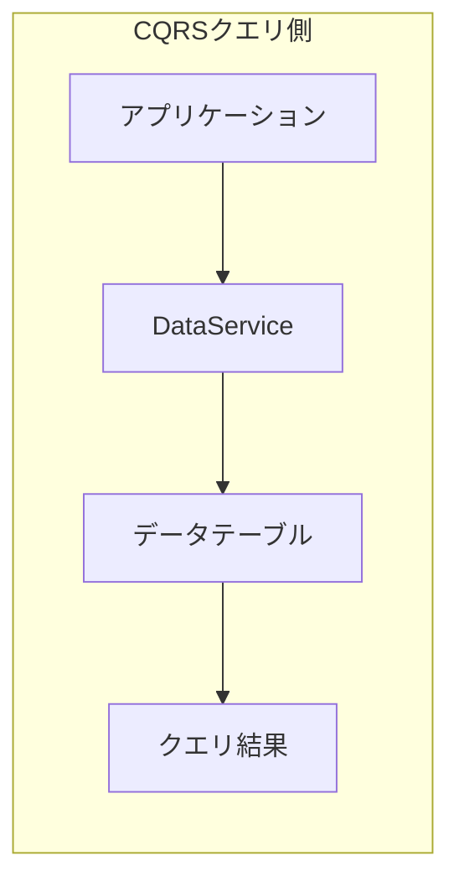

# DataService

## 概要

`DataService`はCQRSパターンのクエリ側であり、DynamoDBに保存されたデータに対する効率的な読み取り操作を提供します。クエリに最適化されたデータテーブル（読み取りモデル）からのすべての読み取り操作を処理します。



Before using the DataService, you need to set up the CommandModule as described in [the CommandService section](./command-service.md).

## メソッド

### *async* `getItem(key: DetailKey)`

`getItem`メソッドは、指定された詳細キー/主キーを持つアイテムの属性セットを返します。一致するアイテムがない場合、`getItem`はデータを返さず、レスポンスにはitem要素がありません。

例：

```ts
import { Injectable, NotFoundException } from '@nestjs/common';
import { DataService } from '@mbc-cqrs-serverless/core';

@Injectable()
export class CatService {
  constructor(private readonly dataService: DataService) {}

  async getCat(pk: string, sk: string): Promise<CatDataEntity> {
    const item = await this.dataService.getItem({ pk, sk });

    if (!item) {
      throw new NotFoundException('Cat not found');
    }
    return new CatDataEntity(item as CatDataEntity);
  }
}
```

### *async* `listItemsByPk(pk: string, opts?: ListItemsOptions)`

`listItemsByPk`メソッドは、パーティションキーに一致する1つ以上のアイテムを返します。フィルタリング、ページネーション、ソートをサポートしています。

#### 基本的な使い方

主キー（`pk`）でアイテムを一覧取得：

```ts
const res = await this.dataService.listItemsByPk(pk);
return new CatListEntity(res as CatListEntity);
```

#### ソートキーフィルター付き

主キー（`pk`）でアイテムを一覧取得し、ソートキー（`sk`）にフィルター式を使用します。例えば、ソートキーが`CAT#`で始まるアイテムを取得し、100件に制限：

```ts
const query = {
  sk: {
    skExpession: 'begins_with(sk, :typeCode)',
    skAttributeValues: {
      ':typeCode': `CAT${KEY_SEPARATOR}`,
    },
  },
  limit: 100,
};
const res = await this.dataService.listItemsByPk(pk, query);
return new CatDataListEntity(res as CatDataListEntity);
```

#### ページネーション

`exclusiveStartKey`と`limit`を使用してページネーションを実装：

```ts
async listCatsWithPagination(
  tenantCode: string,
  pageSize: number,
  nextToken?: string
): Promise<{ items: CatDataEntity[]; nextToken?: string }> {
  const pk = `${tenantCode}#CAT`;

  const result = await this.dataService.listItemsByPk(pk, {
    limit: pageSize,
    exclusiveStartKey: nextToken
      ? JSON.parse(Buffer.from(nextToken, 'base64').toString())
      : undefined,
  });

  return {
    items: result.items.map(item => new CatDataEntity(item)),
    nextToken: result.lastEvaluatedKey
      ? Buffer.from(JSON.stringify(result.lastEvaluatedKey)).toString('base64')
      : undefined,
  };
}
```

#### ソートキー演算子

以下のソートキー式がサポートされています：

| 演算子 | 式 | 説明 |
|-----------|------------|-------------|
| 等しい | `sk = :value` | 完全一致 |
| 前方一致 | `begins_with(sk, :prefix)` | プレフィックス一致 |
| 範囲 | `sk BETWEEN :start AND :end` | 範囲クエリ |
| より小さい | `sk < :value` | より小さい比較 |
| より大きい | `sk > :value` | より大きい比較 |

範囲クエリの例：

```ts
const query = {
  sk: {
    skExpession: 'sk BETWEEN :start AND :end',
    skAttributeValues: {
      ':start': 'ORDER#2024-01-01',
      ':end': 'ORDER#2024-12-31',
    },
  },
};
const res = await this.dataService.listItemsByPk(pk, query);
```

## 共通パターン

### コードで検索

テナント内でユニークなコードでアイテムを検索：

```ts
async findByCode(tenantCode: string, code: string): Promise<CatDataEntity | null> {
  const pk = `${tenantCode}#CAT`;
  const sk = `CAT#${code}`;

  const item = await this.dataService.getItem({ pk, sk });
  return item ? new CatDataEntity(item) : null;
}
```

### タイプフィルター付き一覧

タイプでフィルターされたアイテムを一覧取得：

```ts
async listByType(tenantCode: string, type: string): Promise<CatDataEntity[]> {
  const pk = `${tenantCode}#CAT`;

  const result = await this.dataService.listItemsByPk(pk, {
    sk: {
      skExpession: 'begins_with(sk, :type)',
      skAttributeValues: {
        ':type': `${type}#`,
      },
    },
  });

  return result.items.map(item => new CatDataEntity(item));
}
```

### エラーハンドリング

一般的なクエリエラーを適切に処理：

```ts
async getItemSafely(pk: string, sk: string): Promise<CatDataEntity> {
  try {
    const item = await this.dataService.getItem({ pk, sk });

    if (!item) {
      throw new NotFoundException(`Item not found: ${pk}/${sk}`);
    }

    return new CatDataEntity(item);
  } catch (error) {
    if (error instanceof NotFoundException) {
      throw error;
    }
    // Log and rethrow unexpected errors
    console.error('Unexpected error querying item:', error);
    throw new InternalServerErrorException('Failed to retrieve item');
  }
}
```

## 型定義

### DetailKey

```ts
interface DetailKey {
  pk: string;  // Partition key
  sk: string;  // Sort key
}
```

### ListItemsOptions

```ts
interface ListItemsOptions {
  sk?: {
    skExpession: string;
    skAttributeValues: Record<string, string>;
    skAttributeNames?: Record<string, string>;
  };
  startFromSk?: string;
  limit?: number;
  order?: 'asc' | 'desc';
}
```

## ベストプラクティス

1. **プロジェクション式を使用**: データ転送を削減するために必要な属性のみを取得
2. **ページネーションを実装**: メモリ問題を避けるため、大きな結果セットは常にページネーション
3. **頻繁にアクセスするデータをキャッシュ**: 静的または変更頻度の低いデータのキャッシュを検討
4. **適切なキー設計を使用**: クエリパターンを効率的にサポートするようにキーを設計
5. **見つからない場合の処理**: 使用する前に常にアイテムが存在するか確認
