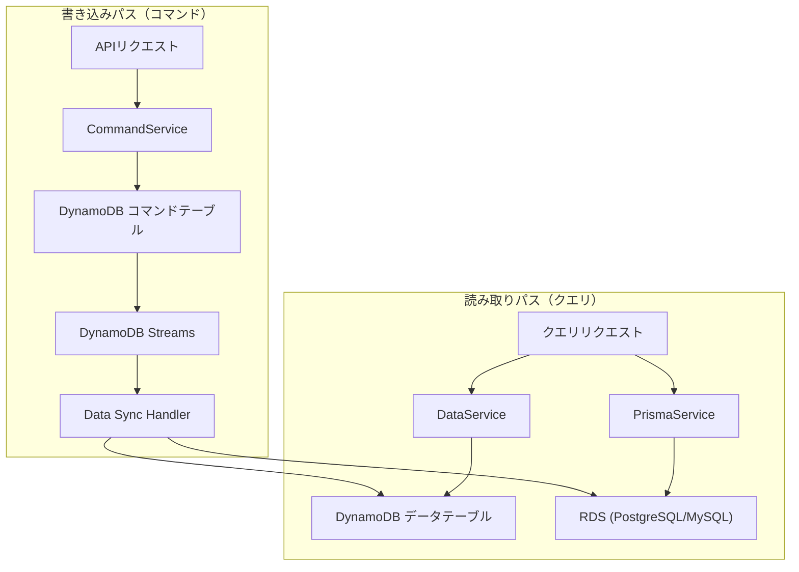
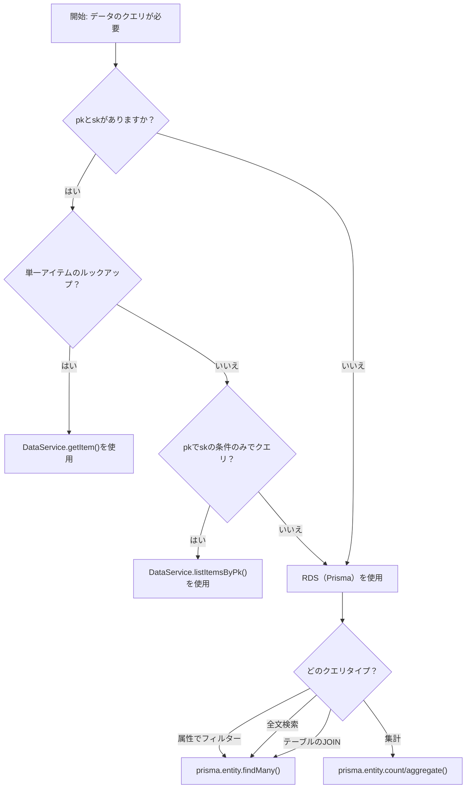

# データベース選択ガイド

このガイドでは、MBC CQRS ServerlessフレームワークでDynamoDBに直接クエリする場合とRDS（Prisma経由）を使用する場合の判断基準を説明します。

## CQRSデータフローの概要

CQRSパターンでは、書き込み操作（コマンド）と読み取り操作（クエリ）は、それぞれの目的に最適化された異なるデータストアで別々に処理されます。



### データフローの説明

1. **コマンドパス**: 書き込み操作は`CommandService`を通じてDynamoDB コマンドテーブルに保存されます
2. **イベント同期**: DynamoDB StreamsがData Sync Handlerをトリガーします
3. **二重ストレージ**: データはDynamoDB データテーブルとRDSの両方に同期されます
4. **クエリパス**: 読み取り操作は`DataService`（DynamoDB）または`PrismaService`（RDS）を選択します

## データベースの特性

### DynamoDB

| 特性 | 説明 |
|------------------|---------------|
| アクセスパターン | キーベースのルックアップ（pk, sk） |
| クエリタイプ | キーによる取得、ソートキー条件付きパーティションキーによるクエリ |
| 強み | ミリ秒単位のレイテンシ、自動スケーリング、コネクション管理不要 |
| 制限 | JOINなし、限定的なフィルタリング、全文検索なし |

### RDS (PostgreSQL/MySQL)

| 特性 | 説明 |
|------------------|---------------|
| アクセスパターン | SQLベースのクエリ |
| クエリタイプ | 複雑なフィルター、JOIN、集計、全文検索 |
| 強み | 柔軟なクエリ、リレーショナル整合性、強力なフィルタリング |
| 制限 | コネクション管理が必要、Data Sync Handlerの設定が必要 |

## 判断マトリクス

このマトリクスを使用して、どのデータベースにクエリすべきかを素早く判断できます：

| クエリシナリオ | DynamoDBを使用 | RDSを使用 |
|------------------|----------------|-----------|
| pk + skで単一アイテムを取得 | **はい** | いいえ |
| pkでskプレフィックス付きアイテムをリスト | **はい** | いいえ |
| 複数のキー以外の属性でフィルター | いいえ | **はい** |
| 全文検索 | いいえ | **はい** |
| 複数エンティティのJOIN | いいえ | **はい** |
| 集計（COUNT, SUM, AVG） | いいえ | **はい** |
| キー以外の属性でソート | いいえ | **はい** |
| 総件数付きページネーション | 限定的 | **はい** |
| 複雑なWHERE条件（OR, LIKE） | いいえ | **はい** |

## 判断フローチャート



## コード例

### 例1: 単一アイテムのルックアップ - DynamoDBを使用

正確なpkとskがある場合は、DataServiceを使用して高速で直接アクセスします。

```ts
import { DataService } from "@mbc-cqrs-serverless/core";
import { Injectable, NotFoundException } from "@nestjs/common";

@Injectable()
export class ProductService {
  constructor(private readonly dataService: DataService) {}

  async findOne(pk: string, sk: string): Promise<ProductDataEntity> {
    // Direct key lookup - DynamoDB is optimal (直接キールックアップ - DynamoDBが最適)
    const item = await this.dataService.getItem({ pk, sk });

    if (!item) {
      throw new NotFoundException("Product not found");
    }

    return new ProductDataEntity(item);
  }
}
```

### 例2: パーティションキーでリスト - DynamoDBを使用

同じpkを共有するアイテムをソートキーフィルターでリストする場合は、DataServiceを使用します。

```ts
import { DataService, KEY_SEPARATOR } from "@mbc-cqrs-serverless/core";
import { Injectable } from "@nestjs/common";

@Injectable()
export class OrderService {
  constructor(private readonly dataService: DataService) {}

  async listOrdersByTenant(tenantCode: string): Promise<OrderDataEntity[]> {
    const pk = `ORDER${KEY_SEPARATOR}${tenantCode}`;

    // List all orders for a tenant - efficient pk-based query (テナントのすべての注文をリスト - 効率的なpkベースのクエリ)
    const result = await this.dataService.listItemsByPk(pk, {
      sk: {
        skExpression: "begins_with(sk, :prefix)",
        skAttributeValues: {
          ":prefix": "ORDER#",
        },
      },
      limit: 100,
    });

    return result.items.map((item) => new OrderDataEntity(item));
  }

  async listOrderItemsForOrder(
    tenantCode: string,
    orderId: string,
  ): Promise<OrderItemDataEntity[]> {
    const pk = `ORDER${KEY_SEPARATOR}${tenantCode}`;

    // List order items using sk prefix (skプレフィックスを使用して注文アイテムをリスト)
    const result = await this.dataService.listItemsByPk(pk, {
      sk: {
        skExpression: "begins_with(sk, :prefix)",
        skAttributeValues: {
          ":prefix": `ORDER_ITEM#${orderId}#`,
        },
      },
    });

    return result.items.map((item) => new OrderItemDataEntity(item));
  }
}
```

### 例3: 複雑なフィルタリング - RDSを使用

複数の属性でフィルターする必要がある場合は、PrismaでSQLクエリを使用します。

```ts
import { Injectable } from "@nestjs/common";
import { PrismaService } from "src/prisma";

@Injectable()
export class ProductService {
  constructor(private readonly prismaService: PrismaService) {}

  async searchProducts(searchDto: {
    tenantCode: string;
    category?: string;
    minPrice?: number;
    maxPrice?: number;
    inStock?: boolean;
    page?: number;
    limit?: number;
  }): Promise<{ items: ProductDataEntity[]; total: number }> {
    const page = searchDto.page ?? 1;
    const limit = searchDto.limit ?? 20;
    const skip = (page - 1) * limit;

    // Build dynamic WHERE clause - RDS excels at this (動的WHERE句の構築 - RDSが得意)
    const where: any = {
      tenantCode: searchDto.tenantCode,
      isDeleted: false,
    };

    if (searchDto.category) {
      where.category = searchDto.category;
    }

    if (searchDto.minPrice !== undefined || searchDto.maxPrice !== undefined) {
      where.price = {};
      if (searchDto.minPrice !== undefined) {
        where.price.gte = searchDto.minPrice;
      }
      if (searchDto.maxPrice !== undefined) {
        where.price.lte = searchDto.maxPrice;
      }
    }

    if (searchDto.inStock !== undefined) {
      where.inStock = searchDto.inStock;
    }

    // Execute count and find in parallel (countとfindを並列実行)
    const [total, items] = await Promise.all([
      this.prismaService.product.count({ where }),
      this.prismaService.product.findMany({
        where,
        take: limit,
        skip,
        orderBy: { createdAt: "desc" },
      }),
    ]);

    return {
      total,
      items: items.map((item) => new ProductDataEntity(item)),
    };
  }
}
```

### 例4: 全文検索 - RDSを使用

DynamoDBは全文検索をサポートしていません。テキスト検索クエリにはRDSを使用します。

```ts
import { Injectable } from "@nestjs/common";
import { PrismaService } from "src/prisma";

@Injectable()
export class ProductService {
  constructor(private readonly prismaService: PrismaService) {}

  async searchByText(
    tenantCode: string,
    searchText: string,
  ): Promise<ProductDataEntity[]> {
    // Full-text search across multiple fields - only possible with RDS (複数フィールドの全文検索 - RDSでのみ可能)
    const items = await this.prismaService.product.findMany({
      where: {
        tenantCode,
        isDeleted: false,
        OR: [
          { name: { contains: searchText } },
          { description: { contains: searchText } },
          { code: { contains: searchText } },
        ],
      },
      orderBy: { name: "asc" },
    });

    return items.map((item) => new ProductDataEntity(item));
  }
}
```

### 例5: JOINクエリ - RDSを使用

複数のテーブルのデータを結合する必要がある場合は、Prismaリレーションを使用してRDSを使用します。

```ts
import { Injectable } from "@nestjs/common";
import { PrismaService } from "src/prisma";

@Injectable()
export class OrderService {
  constructor(private readonly prismaService: PrismaService) {}

  async getOrderWithItems(orderId: string): Promise<OrderWithItemsDto> {
    // JOIN order with order items - requires RDS (注文と注文アイテムのJOIN - RDSが必要)
    const order = await this.prismaService.order.findUnique({
      where: { id: orderId },
      include: {
        orderItems: {
          include: {
            product: true, // Also JOIN product details (製品詳細もJOIN)
          },
        },
      },
    });

    return new OrderWithItemsDto(order);
  }

  async getOrderSummaryByCustomer(
    tenantCode: string,
    customerId: string,
  ): Promise<CustomerOrderSummaryDto> {
    // Aggregate with GROUP BY - only possible with RDS (GROUP BYによる集計 - RDSでのみ可能)
    const summary = await this.prismaService.order.groupBy({
      by: ["status"],
      where: {
        tenantCode,
        customerId,
        isDeleted: false,
      },
      _count: { id: true },
      _sum: { totalAmount: true },
    });

    return new CustomerOrderSummaryDto(summary);
  }
}
```

### 例6: 両方のデータベースの組み合わせ

最適なパフォーマンスを得るために、クエリタイプに基づいて両方のデータベースを使用します。

```ts
import { DataService } from "@mbc-cqrs-serverless/core";
import { Injectable, NotFoundException } from "@nestjs/common";
import { PrismaService } from "src/prisma";

@Injectable()
export class ProductService {
  constructor(
    private readonly dataService: DataService,
    private readonly prismaService: PrismaService,
  ) {}

  // Use DynamoDB for single item by key (キーによる単一アイテムにはDynamoDBを使用)
  async findOne(pk: string, sk: string): Promise<ProductDataEntity> {
    const item = await this.dataService.getItem({ pk, sk });
    if (!item) {
      throw new NotFoundException("Product not found");
    }
    return new ProductDataEntity(item);
  }

  // Use RDS for complex search (複雑な検索にはRDSを使用)
  async search(searchDto: SearchProductDto): Promise<ProductListEntity> {
    const [total, items] = await Promise.all([
      this.prismaService.product.count({
        where: this.buildWhereClause(searchDto),
      }),
      this.prismaService.product.findMany({
        where: this.buildWhereClause(searchDto),
        take: searchDto.limit ?? 20,
        skip: ((searchDto.page ?? 1) - 1) * (searchDto.limit ?? 20),
        orderBy: { [searchDto.sortBy ?? "createdAt"]: searchDto.sortOrder ?? "desc" },
      }),
    ]);

    return new ProductListEntity({ total, items });
  }

  private buildWhereClause(searchDto: SearchProductDto): any {
    const where: any = {
      tenantCode: searchDto.tenantCode,
      isDeleted: false,
    };

    if (searchDto.category) where.category = searchDto.category;
    if (searchDto.search) {
      where.OR = [
        { name: { contains: searchDto.search } },
        { description: { contains: searchDto.search } },
      ];
    }

    return where;
  }
}
```

## パフォーマンスの考慮事項

### DynamoDBのパフォーマンス

| シナリオ | パフォーマンス | 備考 |
|------------|---------------|---------|
| pk+skでGetItem | < 10ms | 最適なユースケース |
| pkでQuery | < 50ms | 制限された結果セットに効率的 |
| Scan（避けるべき） | 100ms〜数秒 | 本番環境では避ける |

### RDSのパフォーマンス

| シナリオ | パフォーマンス | 備考 |
|------------|---------------|---------|
| インデックス付きクエリ | 10-50ms | 適切なインデックスを確保 |
| 全文検索 | 50-200ms | 検索インデックスを検討 |
| 複雑なJOIN | 50-500ms | データ量に依存 |
| 集計 | 100ms-1s | 頻繁なクエリにはキャッシュを検討 |

### 最適化のヒント

1. **RDSカラムにインデックスを作成**: 頻繁にクエリされるカラムにインデックスを追加

```prisma
model Product {
  id         String @id
  tenantCode String @map("tenant_code")
  category   String
  name       String
  price      Decimal

  @@index([tenantCode, category])  // Index for filtering by category (カテゴリフィルター用インデックス)
  @@index([tenantCode, name])      // Index for name search (名前検索用インデックス)
}
```

2. **ホットパスにはDynamoDBを使用**: ユーザー向けAPIでの単一アイテムルックアップ

3. **頻繁なRDSクエリをキャッシュ**: 集計結果のキャッシュを検討

4. **並列クエリ**: 独立したクエリを並列実行

```ts
const [total, items] = await Promise.all([
  this.prismaService.product.count({ where }),
  this.prismaService.product.findMany({ where, take, skip }),
]);
```

## Data Sync Handlerの要件

RDSからデータをクエリするには、DynamoDBからRDSにデータを同期するData Sync Handlerを実装する必要があります。

```ts
import {
  CommandModel,
  IDataSyncHandler,
  removeSortKeyVersion,
} from "@mbc-cqrs-serverless/core";
import { Injectable } from "@nestjs/common";
import { PrismaService } from "src/prisma";

@Injectable()
export class ProductDataSyncRdsHandler implements IDataSyncHandler {
  constructor(private readonly prismaService: PrismaService) {}

  async up(cmd: CommandModel): Promise<any> {
    const sk = removeSortKeyVersion(cmd.sk);

    await this.prismaService.product.upsert({
      where: { id: cmd.id },
      update: {
        pk: cmd.pk,
        sk: sk,
        name: cmd.name,
        // Map attributes to RDS columns (属性をRDSカラムにマッピング)
        category: cmd.attributes?.category,
        price: cmd.attributes?.price,
        isDeleted: cmd.isDeleted ?? false,
        updatedAt: cmd.updatedAt,
      },
      create: {
        id: cmd.id,
        pk: cmd.pk,
        sk: sk,
        cpk: cmd.pk,
        csk: cmd.sk,
        tenantCode: cmd.tenantCode,
        code: cmd.code,
        name: cmd.name,
        category: cmd.attributes?.category,
        price: cmd.attributes?.price,
        isDeleted: cmd.isDeleted ?? false,
        createdAt: cmd.createdAt,
        updatedAt: cmd.updatedAt,
      },
    });
  }

  async down(cmd: CommandModel): Promise<any> {
    // Handle rollback if needed (必要に応じてロールバックを処理)
  }
}
```

詳細な例については[Data Sync Handlerの実装例](./data-sync-handler-examples.md)を参照してください。

## まとめ

| ユースケース | データベース | サービス |
|------------|------------|-----------|
| pk + skでアイテムを取得 | DynamoDB | `DataService.getItem()` |
| pkでskフィルター付きリスト | DynamoDB | `DataService.listItemsByPk()` |
| 複数属性フィルター | RDS | `PrismaService.findMany()` |
| 全文検索 | RDS | `PrismaService.findMany()` |
| JOINクエリ | RDS | `PrismaService.findMany({ include })` |
| 集計 | RDS | `PrismaService.count/groupBy()` |
| Pagination with count | RDS | `PrismaService.count() + findMany()` |

## 関連ドキュメント

- [DynamoDB](./dynamodb.md): DynamoDBテーブル設計と管理
- [Prisma](./prisma.md): Prisma ORMのセットアップと規約
- [DataService](./data-service.md): DynamoDBクエリメソッド
- [Data Sync Handlerの実装例](./data-sync-handler-examples.md): RDS同期パターン
- [サービス実装パターン](./service-patterns.md): 完全なサービスレイヤー例
