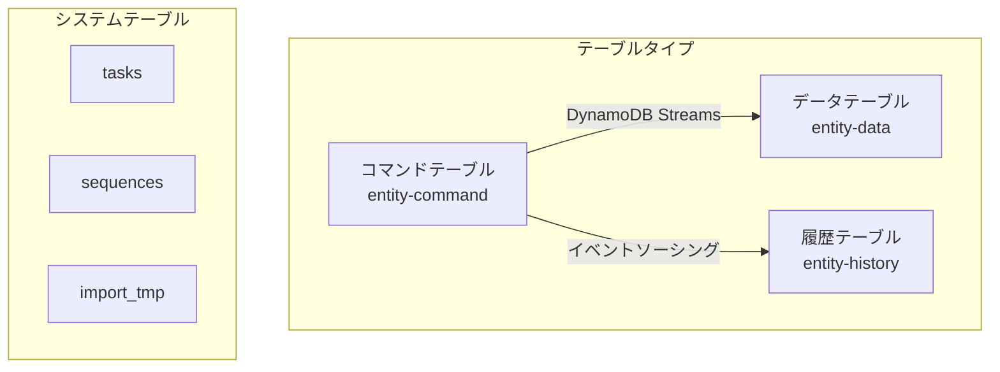

# DynamoDB

## 概要

MBC CQRS ServerlessはDynamoDBをプライマリデータストアとして使用し、構造化されたテーブル設計を通じてCQRSとイベントソーシングパターンを実装しています。効率的なアプリケーションを構築するには、テーブル構造を理解することが重要です。

## テーブルアーキテクチャ



MBC CQRS Serverlessでは、DynamoDBテーブルは以下のタイプに整理されています：

### エンティティテーブル

| テーブルタイプ | 命名規則 | 用途 |
|------------|-------------------|---------|
| コマンドテーブル | `entity-command` | 書き込みコマンドを保存（書き込みモデル） |
| データテーブル | `entity-data` | 現在の状態を保存（読み取りモデル） |
| 履歴テーブル | `entity-history` | イベントソーシング用にすべてのバージョンを保存 |

### システムテーブル

| テーブル | 用途 |
|--------|---------|
| `tasks` | 長時間実行される非同期タスクの情報を保存 |
| `sequences` | ID生成用のシーケンスデータを保持 |
| `import_tmp` | Step Functionsを介したインポート操作用の一時データを保存 |

## テーブル定義

テーブル定義は`prisma/dynamodbs`フォルダに保存されています。新しいエンティティテーブルを追加するには：

### ステップ1: 設定でテーブルを定義

`prisma/dynamodbs/cqrs.json`にテーブル名を追加：

```json
["cat", "dog", "order"]
```

### ステップ2: マイグレーションを実行

ローカル開発用：

```bash
# Migrate DynamoDB tables only
npm run migrate:ddb

# Migrate both DynamoDB and RDS
npm run migrate
```

### システムテーブル定義 {#system-table-definitions}

システムテーブル（`tasks`、`sequences`、`import_tmp`）は`prisma/dynamodbs/`フォルダに独自のJSON定義ファイルがあります。マイグレーション時に自動的に作成されます：

| ファイル | テーブル | 用途 |
|------|---------|---------|
| `tasks.json` | `tasks` | DynamoDB Streamsによるタスク管理 |
| `sequences.json` | `sequences` | シーケンスID生成 |
| `import_tmp.json` | `import_tmp` | [ImportModule](/docs/import)用のDynamoDB Streams付き一時インポートデータ |

:::info バージョン情報
`import_tmp.json`テンプレートは[バージョン1.1.1](/docs/changelog#v111)で追加されました。それ以前のバージョンでプロジェクトを作成し、ImportModuleを使用している場合は、このファイルを手動で追加する必要があります。詳細は[よくある問題](/docs/common-issues#missing-import-tmp-table)を参照してください。
:::

## キー設計パターン

### 標準キー構造

すべてのテーブルは以下で構成される複合主キーを使用します：

| キー | 形式 | 例 |
|-----|--------|---------|
| `pk` | `TYPE#tenantCode` | `ORDER#ACME` |
| `sk` | `TYPE#code` | `ORDER#ORD-000001` |

### エンティティキーの例

```typescript
// Order entity
const orderKey = {
  pk: `ORDER#${tenantCode}`,
  sk: `ORDER#${orderId}`,
};

// User entity
const userKey = {
  pk: `USER#${tenantCode}`,
  sk: `USER#${userId}`,
};

// Hierarchical data (e.g., organization)
const departmentKey = {
  pk: `ORG#${tenantCode}`,
  sk: `DEPT#${parentId}#${deptId}`,
};
```

## テーブル属性

### 共通属性

すべてのエンティティテーブルはこれらの共通属性を共有します：

| 属性 | 型 | 説明 |
|-----------|------|-------------|
| `pk` | String | パーティションキー |
| `sk` | String | ソートキー |
| `id` | String | 一意識別子（pk#skハッシュ） |
| `code` | String | ビジネスコード |
| `name` | String | 表示名 |
| `tenantCode` | String | テナント識別子 |
| `type` | String | エンティティタイプ |
| `version` | Number | 楽観的ロック用バージョン |
| `attributes` | Map | カスタムエンティティ属性 |
| `createdBy` | String | 作成者ユーザーID |
| `createdIp` | String | 作成者IPアドレス |
| `createdAt` | String | 作成タイムスタンプ（ISO 8601） |
| `updatedBy` | String | 最終更新者ユーザーID |
| `updatedIp` | String | 最終更新者IPアドレス |
| `updatedAt` | String | 最終更新タイムスタンプ（ISO 8601） |

### コマンド固有の属性

| 属性 | 型 | 説明 |
|-----------|------|-------------|
| `source` | String | コマンドソース識別子 |
| `requestId` | String | リクエストトラッキングID |

### 履歴固有の属性

| 属性 | 型 | 説明 |
|-----------|------|-------------|
| `seq` | Number | 履歴内のシーケンス番号 |

## セカンダリインデックス

### グローバルセカンダリインデックスの追加

デフォルトのテーブル設定にはGSIが含まれていません。クエリパターンに基づいてGSIを追加できます。一般的なパターンとして、ビジネスコードによる高速検索のためのcode-indexを追加する方法があります：

GSI定義の例（テーブル設定に追加）：

```json
{
  "GlobalSecondaryIndexes": [
    {
      "IndexName": "code-index",
      "KeySchema": [
        { "AttributeName": "tenantCode", "KeyType": "HASH" },
        { "AttributeName": "code", "KeyType": "RANGE" }
      ],
      "Projection": { "ProjectionType": "ALL" }
    }
  ]
}
```

カスタムGSIの使用例：

```typescript
// Find entity by code (requires code-index GSI)
const params = {
  TableName: 'entity-data',
  IndexName: 'code-index',
  KeyConditionExpression: 'tenantCode = :tenant AND code = :code',
  ExpressionAttributeValues: {
    ':tenant': tenantCode,
    ':code': entityCode,
  },
};
```

## ベストプラクティス

### キー設計

1. **パーティションキーを広く保つ**: パーティション間でデータを均等に分散する
2. **階層的なソートキーを使用する**: 効率的な範囲クエリを有効にする
3. **パーティションキーにテナントを含める**: データ分離を確保する

### クエリ最適化

1. **ScanよりQueryを使用する**: クエリでは常にパーティションキーを使用する
2. **結果セットを制限する**: 大規模データセットにはページネーションを使用する
3. **必要な属性を射影する**: 必要なフィールドのみを取得する

### キャパシティプランニング

1. **オンデマンドキャパシティを使用する**: 予測不可能なワークロードに推奨
2. **消費キャパシティを監視する**: CloudWatchアラームを設定する
3. **DAXを検討する**: マイクロ秒レベルのレイテンシが必要な読み取り負荷の高いワークロード向け

## ローカル開発

### DynamoDB Local

フレームワークには開発用のDynamoDB Localが含まれています：

```bash
# Start DynamoDB Local (included in docker-compose)
docker-compose up -d dynamodb-local

# Access DynamoDB Local Admin UI
open http://localhost:8001
```

### 環境変数

```bash
# Local DynamoDB endpoint
DYNAMODB_ENDPOINT=http://localhost:8000
DYNAMODB_REGION=ap-northeast-1
```

## 関連ドキュメント

- [Key Patterns](./key-patterns.md): 詳細なキー設計戦略
- [Entity Patterns](./entity-patterns.md): エンティティモデリングガイドライン
- [Sequence](./sequence.md): シーケンスID生成
- [CommandService](./command-service.md): コマンド処理とデータ同期
