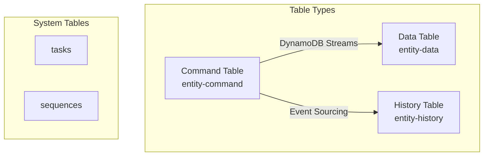

# DynamoDB

## Overview

MBC CQRS Serverless uses DynamoDB as its primary data store, implementing CQRS and Event Sourcing patterns through a structured table design. Understanding the table structure is essential for building efficient applications.

## Table Architecture



In the MBC CQRS Serverless, DynamoDB tables are organized into the following types:

### Entity Tables

| Table Type | Naming Convention | Purpose |
|------------|-------------------|---------|
| Command Table | `entity-command` | Stores write commands (write model) |
| Data Table | `entity-data` | Stores current state (read model) |
| History Table | `entity-history` | Stores all versions for event sourcing |

### System Tables

| Table | Purpose |
|--------|---------|
| `tasks` | Stores information about long-running asynchronous tasks |
| `sequences` | Holds sequence data for ID generation |

## Table Definition

Table definitions are stored in the `prisma/dynamodbs` folder. To add a new entity table:

### Step 1: Define Table in Configuration

Add the table name to `prisma/dynamodbs/cqrs.json`:

```json
{
  "tables": ["cat", "dog", "order"]
}
```

### Step 2: Run Migration

For local development:

```bash
# Migrate DynamoDB tables only
npm run migrate:ddb

# Migrate both DynamoDB and RDS
npm run migrate
```

## Key Design Patterns

### Standard Key Structure

All tables use a composite primary key consisting of:

| Key | Format | Example |
|-----|--------|---------|
| `pk` | `TYPE#tenantCode` | `ORDER#ACME` |
| `sk` | `TYPE#code` | `ORDER#ORD-000001` |

### Entity Key Examples

```typescript
// Order entity
const orderKey = {
  pk: `ORDER#${tenantCode}`,
  sk: `ORDER#${orderId}`,
};

// User entity
const userKey = {
  pk: `USER#${tenantCode}`,
  sk: `USER#${userId}`,
};

// Hierarchical data (e.g., organization)
const departmentKey = {
  pk: `ORG#${tenantCode}`,
  sk: `DEPT#${parentId}#${deptId}`,
};
```

## Table Attributes

### Common Attributes

All entity tables share these common attributes:

| Attribute | Type | Description |
|-----------|------|-------------|
| `pk` | String | Partition key |
| `sk` | String | Sort key |
| `id` | String | Unique identifier (pk#sk hash) |
| `code` | String | Business code |
| `name` | String | Display name |
| `tenantCode` | String | Tenant identifier |
| `type` | String | Entity type |
| `version` | Number | Version for optimistic locking |
| `attributes` | Map | Custom entity attributes |
| `createdBy` | String | Creator user ID |
| `createdIp` | String | Creator IP address |
| `createdAt` | String | Creation timestamp (ISO 8601) |
| `updatedBy` | String | Last modifier user ID |
| `updatedIp` | String | Last modifier IP address |
| `updatedAt` | String | Last update timestamp (ISO 8601) |

### Command-Specific Attributes

| Attribute | Type | Description |
|-----------|------|-------------|
| `source` | String | Command source identifier |
| `requestId` | String | Request tracking ID |

### History-Specific Attributes

| Attribute | Type | Description |
|-----------|------|-------------|
| `seq` | Number | Sequence number in history |

## セカンダリインデックス

### グローバルセカンダリインデックスの追加

デフォルトのテーブル設定にはGSIが含まれていません。クエリパターンに基づいてGSIを追加できます。一般的なパターンとして、ビジネスコードによる高速検索のためのcode-indexを追加する方法があります：

GSI定義の例（テーブル設定に追加）：

```json
{
  "GlobalSecondaryIndexes": [
    {
      "IndexName": "code-index",
      "KeySchema": [
        { "AttributeName": "tenantCode", "KeyType": "HASH" },
        { "AttributeName": "code", "KeyType": "RANGE" }
      ],
      "Projection": { "ProjectionType": "ALL" }
    }
  ]
}
```

カスタムGSIの使用例：

```typescript
// Find entity by code (requires code-index GSI)
const params = {
  TableName: 'entity-data',
  IndexName: 'code-index',
  KeyConditionExpression: 'tenantCode = :tenant AND code = :code',
  ExpressionAttributeValues: {
    ':tenant': tenantCode,
    ':code': entityCode,
  },
};
```

## Best Practices

### Key Design

1. **Keep partition keys broad**: Distribute data evenly across partitions
2. **Use hierarchical sort keys**: Enable efficient range queries
3. **Include tenant in partition key**: Ensure data isolation

### Query Optimization

1. **Use Query over Scan**: Always use partition key in queries
2. **Limit result sets**: Use pagination for large datasets
3. **Project needed attributes**: Only retrieve required fields

### Capacity Planning

1. **Use on-demand capacity**: Recommended for unpredictable workloads
2. **Monitor consumed capacity**: Set up CloudWatch alarms
3. **Consider DAX**: For read-heavy workloads requiring microsecond latency

## Local Development

### DynamoDB Local

The framework includes DynamoDB Local for development:

```bash
# Start DynamoDB Local (included in docker-compose)
docker-compose up -d dynamodb-local

# Access DynamoDB Local Admin UI
open http://localhost:8001
```

### Environment Variables

```bash
# Local DynamoDB endpoint
DYNAMODB_ENDPOINT=http://localhost:8000
DYNAMODB_REGION=ap-northeast-1
```

## Related Documentation

- [Key Patterns](./key-patterns.md): Detailed key design strategies
- [Entity Patterns](./entity-patterns.md): Entity modeling guidelines
- [Sequence](./sequence.md): Sequence ID generation
- [CommandService](./command-service.md): Command handling and data sync
