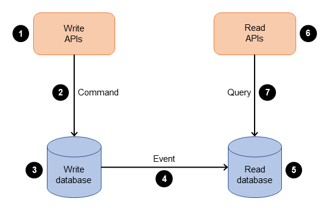

# 用語集

この用語集では、MBC CQRS Serverlessフレームワークのドキュメント全体で使用される主要な用語と概念の定義を提供します。

## デザインパターン {#design-patterns}

### CQRS（コマンドクエリ責任分離）

コマンドクエリ責任分離 (CQRS) パターンは、データの変更、つまりシステムのコマンド部分をクエリ部分から分離します。スループット、レイテンシ、一貫性などの要件が異なる場合は、CQRS パターンを使用して更新とクエリを分離できます。CQRS パターンは、アプリケーションをコマンド側とクエリ側の 2 つの部分に分割します。コマンド側は、作成、更新、削除のリクエストを処理します。クエリ側はリードレプリカを使用してクエリ部分を実行します。

> See: [CQRSパターン](https://docs.aws.amazon.com/prescriptive-guidance/latest/modernization-data-persistence/cqrs-pattern.html)

### イベントソーシング

イベント ソーシング パターンは通常、読み取りワークロードと書き込みワークロードを分離し、パフォーマンス、スケーラビリティ、セキュリティを最適化するために CQRS パターンとともに使用されます。データは、データ ストアへの直接更新ではなく、一連のイベントとして保存されます。マイクロサービスは、イベント ストアからイベントを再生して、独自のデータ ストアの適切な状態を計算します。このパターンは、アプリケーションの現在の状態を可視化し、アプリケーションがその状態にどのように到達したかについての追加のコンテキストを提供します。コマンド データ ストアとクエリ データ ストアのスキーマが異なる場合でも、特定のイベントのデータを再現できるため、イベント ソーシング パターンは CQRS パターンと効果的に連携します。

> See: [イベントソーシングパターン](https://docs.aws.amazon.com/prescriptive-guidance/latest/modernization-data-persistence/service-per-team.html)

### 楽観的ロック

リソースをロックせずに複数のトランザクションを進行させる並行性制御メカニズム。コミット前に、システムは別のトランザクションがデータを変更したかどうかを確認します。MBC CQRS Serverlessでは、バージョン番号を使用して実装されています - 各更新には現在のバージョンを含める必要があり、バージョンが一致しない場合は更新が失敗します。

### ドメイン駆動設計（DDD）

ビジネスドメインに基づいてソフトウェアをモデリングすることに焦点を当てたソフトウェア設計アプローチ。主要な概念には、エンティティ、値オブジェクト、集約、境界づけられたコンテキストが含まれます。MBC CQRS ServerlessはDDDの原則を使用してモジュールとエンティティを構造化します。

### 集約

単一のユニットとして扱うことができるドメインオブジェクトのクラスター。集約にはルートエンティティ（集約ルート）と集約内の内容を定義する境界があります。MBC CQRS Serverlessでは、各コマンドテーブルは通常、集約を表します。

## フレームワークの概念 {#framework-concepts}

### コマンド

システムの状態を変更するリクエスト。コマンドはCQRSパターンのコマンド側で処理されます。MBC CQRS Serverlessでは、コマンドはCommandServiceを使用して発行され、DynamoDBコマンドテーブルに保存されます。

### コマンドテーブル

コマンド（書き込み）モデルを保存するDynamoDBテーブル。バージョン追跡による変更の完全な履歴を含みます。データはDynamoDB Streamsを介してコマンドテーブルからデータテーブルに流れます。

### データテーブル

データ（読み取り）モデルを保存するDynamoDBテーブル。クエリ用に最適化されたエンティティの現在の状態を含みます。コマンドが処理されると自動的に更新されます。

### データ同期ハンドラー

DynamoDB Streamイベントを処理してテーブル間またはRDSなどの外部システムとデータを同期するハンドラー。IDataSyncHandlerインターフェースを実装します。

### 呼び出しコンテキスト

ユーザー情報、テナントコンテキスト、リクエストメタデータを含むサービスメソッドに渡されるコンテキストオブジェクト。Lambdaイベントから作成され、認可と監査に使用されます。

### UserContext

`getUserContext(invokeContext)` で呼び出しコンテキストから取り出す構造化オブジェクト。認証済みユーザーの情報（`userId`、`email`、`tenantCode`、`roles`（`custom:roles` JWTクレームから）、`tenantRole`（後方互換性のため最初のロール））を含みます。v1.3.1 以降は `tenantRoles`（全直接ロール）と `tenantGroupIds`（アクティブテナントのCognitoグループID）も追加されています。詳細は [Helpers — コンテキストヘルパー](/docs/helpers#context-helpers) を参照。

### パーティションキー（PK）

パーティション間のデータ分散を決定するDynamoDBのプライマリキーコンポーネント。MBC CQRS Serverlessでは、通常`TYPE#tenantCode`形式（例：`ORDER#tenant001`）。

### ソートキー（SK）

パーティション内での範囲クエリを可能にするDynamoDBのセカンダリキーコンポーネント。MBC CQRS Serverlessでは、データテーブルでは通常`TYPE#code`形式、コマンドテーブルでは`TYPE#code@vN`形式。

### テナント

マルチテナントアプリケーションにおける分離された組織単位。各テナントはテナントコードで識別される独自のデータパーティションを持ちます。テナントはアプリケーションインフラストラクチャを共有しますが、データは完全に分離されています。

### バージョン

エンティティのリビジョン履歴を追跡する番号。更新ごとにインクリメントされます。同時更新の競合を防ぐための楽観的ロックに使用されます。

### CommandModel

`publishAsync`、`publishSync` などのメソッドが返すTypeScript型。`pk`、`sk`、`version`、`tenantCode`、`attributes` などのメタデータを含むコマンド操作の結果をカプセル化します。コマンドが変更なし（no-op）の場合は `null` を返すことがあります。

### DataEntity

データ（読み取り側）テーブルに保存されるエンティティの基底クラス。型付きアクセサーとヘルパーメソッドでDynamoDBの生アイテムを拡張します。`DataService.listItemsByPk()` が返す `items` 配列で使用されます。注：`DataService.getItem()` は `DataEntity` ではなく生の `DataModel` インターフェースを返します。

### CommandEntity

コマンドテーブルに保存されるエンティティの基底クラス。バージョン、テナント、属性変更を含むコマンド履歴全体を追跡します。主にデータ同期ハンドラーでコマンド側の状態を読み取るために使用されます。

### DetailKey

`pk`（パーティションキー）と `sk`（ソートキー）を含む、DynamoDB内の特定のアイテムを識別するキーオブジェクト。`getItem({ pk, sk })` や `getLatestItem({ pk, sk })` などのメソッドに渡されます。

### VERSION_FIRST

まだ存在しない新しいエンティティを作成する際にバージョンとして使用する値 `0` の定数。フレームワークは最初の書き込み成功時にバージョン `1` を設定します。`@mbc-cqrs-serverless/core` からインポートします。

### VERSION_LATEST

楽観的ロックをバイパスしてエンティティの最新バージョンへ自動解決するようフレームワークに指示するための値 `-1` の定数。「最後の書き込みが勝つ」セマンティクスが意図的な場合にのみ使用してください。`@mbc-cqrs-serverless/core` からインポートします。

### 通知トランスポート

`@NotificationTransport()` で登録するプラグイン式の通知配信機構です。組み込みトランスポートは `appsync-graphql`（デフォルト）と `appsync-event`（オプトイン、v1.3.0+）です。`INotificationTransport` を実装して `@NotificationTransport('transport-name')` で登録することで、カスタムトランスポートを追加できます。

### AppSync Events API

AWS AppSync が提供する、GraphQL スキーマを必要としない HTTP pub/sub API です。v1.3.0 以降、`NOTIFICATION_TRANSPORTS=appsync-event` でオプトインの通知トランスポートとして利用できます。チャンネルパスは `/{namespace}/{tenantCode}/{action}/{itemId}` のパターンに従います。クライアントは Amplify v6 の `events` API でサブスクライブし、サーバーは `AppSyncEventsService` で発行します。

### グループロールリゾルバー

Cognito グループ ID をアプリケーションロールにマッピングするユーザー提供のクラスです（`@GroupRoleResolver()` でアノテーション）。v1.3.1 で導入されました。グループベースのロール認可を使用するには、アプリケーションごとにリゾルバーを1つ登録する必要があります。`@Injectable()` を一緒に追加しないでください — `@GroupRoleResolver()` がすでにシングルトンプロバイダーとして登録します。

### IGroupRoleResolverインターフェース

`GroupRoleResolver` クラスが実装する必要のある TypeScript インターフェースです。現在のテナントの Cognito グループ ID を受け取り、対応するアプリケーションロールを返す単一のメソッド `resolveRoles(groupIds: string[]): Promise<string[]> | string[]` を定義します。v1.3.1 で導入されました。

### custom:groups

v1.3.1 で追加された Cognito ユーザープール属性（JWT クレーム）で、テナントスコープのグループメンバーシップを `{"tenant": "...", "groups": [...]}` オブジェクトの JSON エンコードされた配列として格納します。フレームワークはこのクレームを解析してアクティブなテナントのユーザーが属する Cognito グループを特定し、そのグループ ID をロール導出のために `GroupRoleResolver` に渡します。不正な値や値がない場合は、空のグループリストとして扱われます（フォールトトレラント解析）。

### Read-Your-Writes (RYW)

ユーザーが発行した書き込みを、非同期 DynamoDB Stream パイプラインが読み取りモデルに変更を伝播する前であっても、すぐに自分自身の最新書き込みが見える一貫性保証です。`Repository` クラスを介して実装され、`RYW_SESSION_TTL_MINUTES` を設定することで有効になります。詳細は[コマンドサービス — Read-Your-Writes](/docs/command-service#read-your-writes)を参照してください。

### リポジトリ

`DataService` のドロップイン代替品で、Read-Your-Writes (RYW) セッションキャッシュ機能を追加します。ユーザーが `publishAsync` でコマンドを発行すると、保留中のデータが DynamoDB セッションテーブルに保存されます。その後の `getItem` と `listItemsByPk` 呼び出しでは、DynamoDB Stream が変更を伝播する前から、ユーザー自身の書き込みが見えるように、保留データと永続化済みの読み取りモデルをマージします。環境変数 `RYW_SESSION_TTL_MINUTES` を設定することで有効になります。

### 履歴テーブル

コマンドのすべての過去バージョンをイミュータブルなレコードとして保存する DynamoDB テーブルです。`publishSync`（v1.1.4 以降）と Stream ベースの非同期パイプラインによって書き込まれます。監査証跡やロールバックのために特定の履歴バージョンを取得する際に `HistoryService.getItem()` で使用されます。ソートキーにはバージョンサフィックスが含まれます: `sk@N`。

### ULID（汎用一意辞書式ソート可能識別子）

DynamoDB アイテムのソートキーとして使用される時刻順のユニーク識別子フォーマットです。ULID は26文字、URL セーフで、ミリ秒単位の作成時刻で単調にソート可能、かつグローバルにユニークです。`ulidx` パッケージの `ulid()` で生成されます。ソートキーとして ULID を使用することで、時刻ベースの範囲クエリとアイテムの予測可能な並び順が可能になります。

## AWSサービス {#aws-services}

### Amazon DynamoDB

シームレスなスケーラビリティで高速かつ予測可能なパフォーマンスを提供するフルマネージドNoSQLデータベースサービス。MBC CQRS ServerlessはDynamoDBをコマンドテーブルとデータテーブルの両方のプライマリデータストアとして使用します。

### DynamoDB Streams

DynamoDBテーブルのデータ変更イベントをキャプチャする機能。MBC CQRS Serverlessがコマンドテーブルとデータテーブル間、および外部システムへのデータ同期をトリガーするために使用します。

### AWS Lambda

イベントに応答してコードを実行するサーバーレスコンピューティングサービス。MBC CQRS ServerlessはAPIハンドラー、イベントプロセッサー、バックグラウンドタスクにLambda関数を使用します。

### Amazon Cognito

ユーザー認証、認可、ユーザー管理を提供するサービス。MBC CQRS ServerlessはCognitoをユーザー認証とJWTトークン検証に使用します。

### AWS Step Functions

Lambda関数と他のAWSサービスを組み合わせることができるサーバーレスオーケストレーションサービス。MBC CQRS Serverlessでデータインポートやバッチ処理などの長時間実行ワークフローに使用されます。

### Amazon SES（Simple Email Service）

メールの送受信を簡単かつコスト効率よく行えるメールプラットフォーム。MBC CQRS Serverlessが通知メールに使用します。

### Amazon S3（Simple Storage Service）

任意の量のデータを保存・取得するためのオブジェクトストレージサービス。ファイルアップロード、エクスポート、静的アセットストレージに使用されます。

### Amazon SQS（Simple Queue Service）

フルマネージドメッセージキューイングサービス。非同期処理とコンポーネントの分離に使用されます。

### Amazon RDS（Relational Database Service）

マネージドリレーショナルデータベースサービス。MBC CQRS ServerlessでSQLジョインと集計を必要とする複雑なクエリに使用されます。

### AWS AppSync

マネージド型の GraphQL および Pub/Sub API サービスです。MBC CQRS Serverless はリアルタイム通知に AppSync を使用します — GraphQL サブスクリプション（デフォルト）またはスキーマ不要の AppSync Events API（v1.3.0 以降のオプトイン）のどちらかを使用します。

### AWS CDK（Cloud Development Kit）

コードでクラウドインフラストラクチャを定義するオープンソースソフトウェア開発フレームワーク。MBC CQRS ServerlessはCDKをインフラストラクチャプロビジョニングに使用します。

### API Gateway

APIの作成、公開、管理のためのフルマネージドサービス。MBC CQRS ServerlessアプリケーションにHTTPエンドポイントを提供します。

### CloudWatch

監視と可観測性サービス。MBC CQRS Serverlessアプリケーションでログ、メトリクス、アラームに使用されます。

## ツールとライブラリ {#tooling-libraries}

### NestJS

Nest (NestJS) は、効率的でスケーラブルな Node.js サーバー側アプリケーションを構築するためのフレームワークです。プログレッシブ JavaScript を使用し、TypeScript で構築され完全にサポートされており (それでも開発者は純粋な JavaScript でコードを作成できます)、OOP (オブジェクト指向プログラミング)、FP (関数型プログラミング)、および FRP (関数型リアクティブ プログラミング) の要素を組み合わせています。

> See: [NestJSドキュメント](https://docs.nestjs.com/)

### Serverless Framework

サーバーレス フレームワークは、コマンド ライン インターフェイスとオプションのダッシュボードで構成されており、他のクラウド プロバイダーのサポートを強化しながら、コードとインフラストラクチャをアマゾン ウェブ サービスに一緒にデプロイするのに役立ちます。このフレームワークは、簡素化された構文を使用する YAML ベースのエクスペリエンスであり、クラウドの専門家でなくても、複雑なインフラストラクチャ パターンを簡単に展開できます。

> See: [Serverless Frameworkドキュメント](https://www.serverless.com/framework/docs)

### Prisma

PrismaはNode.jsとTypeScript用のORMで、プレーンSQLを書いたりKnexやSequelizeなどの他のデータベースアクセスツールを使用する代替手段です。開発者に型安全なクエリビルダーと自動生成機能を提供することで、データベースのアクセスと管理を簡素化します。

> See: [Prismaドキュメント](https://www.prisma.io/docs/orm/overview/introduction/what-is-prisma)

### class-validator

クラスプロパティのバリデーションルールを定義するためにデコレーターを使用するバリデーションライブラリ。MBC CQRS ServerlessでリクエストDTOのバリデーションに使用されます。

### class-transformer

プレーンオブジェクトをクラスインスタンスに変換したりその逆を行うライブラリ。型安全なリクエスト処理のためにclass-validatorと連携します。

## API概念 {#api-concepts}

### DTO（データ転送オブジェクト）

プロセス間でデータを運ぶオブジェクト。MBC CQRS Serverlessでは、DTOはAPIリクエストとレスポンスボディの構造を定義し、通常はバリデーションデコレーターを持ちます。

### エンティティ

時間を超えて永続する明確なアイデンティティを持つドメインオブジェクト。MBC CQRS Serverlessでは、エンティティはDynamoDBに保存されるデータの構造を定義するTypeScriptクラスです。

### コントローラー

受信HTTPリクエストを処理するクラス。NestJS/MBC CQRS Serverlessでは、コントローラーはAPIルートを定義し、ビジネスロジックをサービスに委譲します。

### サービス

ビジネスロジックを含むクラス。MBC CQRS Serverlessでは、サービスはCommandServiceとDataServiceを使用してデータ操作をオーケストレートします。

### モジュール

@Module()デコレーターで注釈されたクラスで、アプリケーション構造を整理します。各機能エリアには、コントローラー、サービス、プロバイダーを含む独自のモジュールがあります。

### ガード

リクエストがルートハンドラーで処理されるべきかどうかを決定するクラス。認証と認可に使用されます。

### パイプ

ルートハンドラーに到達する前に入力データを変換またはバリデートするクラス。バリデーションとデータ変換に使用されます。

### ミドルウェア

ルートハンドラーの前に呼び出される関数。ロギング、認証、リクエストの変更などの操作を実行できます。

## データ操作 {#data-operations}

### 発行（publishAsync/publishSync）

Create or update an entity. `publishAsync` writes to the command table and returns immediately (async data propagation via DynamoDB Streams is a side effect). `publishSync` runs the full write + data sync pipeline synchronously before returning. (エンティティを作成または更新します。publishAsyncはコマンドテーブルに書き込み即座に返します（DynamoDB Streams経由のデータ伝播は副作用）。publishSyncは完全な書き込み+データ同期パイプラインを同期的に実行します。)

### 部分更新（publishPartialUpdateAsync/publishPartialUpdateSync）

すべてのフィールドを提供せずに既存エンティティの特定のフィールドを更新します。楽観的ロックのためにバージョンが必要です。

### 論理削除

データベースから物理的に削除せずにエンティティを削除済み（isDeleted: true）としてマークします。データ復旧と監査証跡を可能にします。

### 物理削除

データベースからエンティティを物理的に削除します。通常、TTL（Time-to-Live）または明示的な削除操作で行われます。

### シーケンス

自動インクリメント番号ジェネレーター。注文番号などのユニークなコードを生成するために使用されます。ローテーションモード：`DAILY`、`MONTHLY`、`YEARLY`、`FISCAL_YEARLY`、または `NONE`（ローテーションなし）。

## アーキテクチャ用語 {#architecture-terms}

### コールドスタート

アイドル状態後に呼び出されたLambda関数の初期起動時間。最初のリクエストのレイテンシに影響を与える可能性があります。

### ウォームスタート

既存の実行環境を再利用するLambda関数の後続の呼び出し。コールドスタートより高速です。

### 冪等性

何回実行されても同じ結果を生成する操作の特性。リトライロジックとイベント処理に重要です。

### 結果整合性

読み取りが最新の書き込みを即座に反映しない可能性があるが、最終的には整合性が取れる整合性モデル。DynamoDB読み取りのデフォルト。

### 強い整合性

読み取りが常に最新の書き込みを返す整合性モデル。より高いレイテンシでDynamoDB読み取りに利用可能です。

### TTL（Time-to-Live）

指定されたタイムスタンプ後にアイテムを自動的に削除するDynamoDB機能。一時データと自動クリーンアップに使用されます。

### GSI（グローバルセカンダリインデックス）

テーブルのプライマリキーとは異なるパーティションキーとオプションのソートキーを持つインデックス。代替アクセスパターンでの効率的なクエリを可能にします。

### LSI（ローカルセカンダリインデックス）

テーブルと同じパーティションキーだが異なるソートキーを持つインデックス。テーブル作成時に作成する必要があります。

## セキュリティ用語 {#security-terms}

### JWT（JSON Web Token）

クレームを安全に送信するためのコンパクトでURL安全なトークン形式。Cognitoが認証トークンに使用します。

### IAM（Identity and Access Management）

AWSリソースへのアクセスを管理するAWSサービス。Lambda関数やその他のサービスの権限を定義します。

### RBAC（ロールベースアクセス制御）

権限がロールに割り当てられ、ユーザーがロールに割り当てられるアクセス制御方法。Cognitoグループを介して実装されます。

## 関連ドキュメント

- [アーキテクチャ](/docs/architecture) - システムアーキテクチャ概要
- [CQRSフロー](/docs/architecture/cqrs-flow) - CQRSの詳細実装
- [はじめに](/docs/getting-started) - 主要概念の紹介
