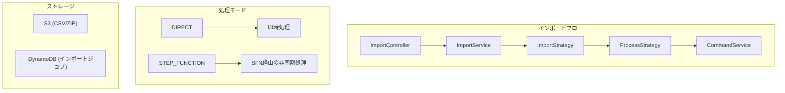

# Import

ImportModuleは、MBC CQRS Serverlessフレームワークで一括データインポート機能を提供します。単一レコードのインポート、CSVファイルのインポート、複数のCSVを含むZIPファイルのインポートをサポートしています。

## アーキテクチャ



## インストール

```bash
npm install @mbc-cqrs-serverless/import
```

## モジュール登録

```ts
import { ImportModule } from "@mbc-cqrs-serverless/import";

@Module({
  imports: [
    ImportModule.register({
      enableController: true, // 組み込みRESTコントローラーを有効化
      profiles: [
        {
          tableName: "products",
          importStrategy: ProductImportStrategy,
          processStrategy: ProductProcessStrategy,
        },
      ],
      imports: [ProductModule], // ストラテジーの依存関係をエクスポートするモジュール
      zipFinalizationHooks: [BackupToS3Hook], // オプション: インポート後のフック
    }),
  ],
})
export class AppModule {}
```

## モジュールオプション

| オプション | 型 | 必須 | 説明 |
|------------|----------|--------------|-----------------|
| `profiles` | `ImportEntityProfile[]` | はい | 各エンティティタイプのインポート設定の配列 |
| `enableController` | `boolean` | いいえ | 組み込みのImportControllerエンドポイントを有効化 |
| `imports` | `ModuleMetadata['imports']` | いいえ | ストラテジークラスが必要とするプロバイダをエクスポートするモジュール |
| `zipFinalizationHooks` | `Type<IZipFinalizationHook>[]` | いいえ | ZIPインポート完了後に実行されるフック |

## コアコンセプト

### インポートエンティティプロファイル

インポートしたい各エンティティタイプには、プロファイル設定が必要です：

```ts
interface ImportEntityProfile {
  tableName: string; // このデータタイプの一意識別子
  importStrategy: Type<IImportStrategy<any, any>>; // 変換と検証
  processStrategy: Type<IProcessStrategy<any, any>>; // 比較とマッピング
}
```

### 処理モード

| モード | 説明 | ユースケース |
|----------|-----------------|--------------|
| `DIRECT` | リクエスト内でCSVを即座に処理 | 小さなファイル（100行未満） |
| `STEP_FUNCTION` | AWS Step Functions経由で非同期処理 | 大きなファイル、本番インポート |

### インポートステータス

| ステータス | 説明 |
|------------|-----------------|
| `CREATED` | インポートジョブが作成され、処理待ち |
| `QUEUED` | 処理のためにキューに入れられたジョブ |
| `PROCESSING` | 現在処理中 |
| `COMPLETED` | 正常に完了 |
| `FAILED` | 処理失敗 |

## APIリファレンス

### ImportServiceのメソッド

#### `createWithApi(dto: CreateImportDto, options): Promise<ImportEntity>`

APIを使用して単一のインポートレコードを作成します。データは設定されたImportStrategyを使用して変換および検証されます。

```ts
const importEntity = await this.importService.createWithApi(
  {
    tableName: "products",
    tenantCode: "tenant001",
    attributes: {
      code: "PROD001",
      name: "Product One",
      price: 100,
    },
  },
  { invokeContext }
);
```

#### `handleCsvImport(dto: CreateCsvImportDto, options): Promise<ImportEntity[] | ImportEntity>`

CSVインポートのメインルーター。processingModeに基づいて、直接処理またはStep Functionに委譲します。

```ts
// DIRECTモード - 作成されたインポートの配列を返す
const imports = await this.importService.handleCsvImport(
  {
    processingMode: "DIRECT",
    bucket: "my-bucket",
    key: "imports/products.csv",
    tableName: "products",
    tenantCode: "tenant001",
  },
  { invokeContext }
);

// STEP_FUNCTIONモード - マスタージョブエンティティを返す
const masterJob = await this.importService.handleCsvImport(
  {
    processingMode: "STEP_FUNCTION",
    bucket: "my-bucket",
    key: "imports/products.csv",
    tableName: "products",
    tenantCode: "tenant001",
  },
  { invokeContext }
);
```

#### `createZipJob(dto: CreateZipImportDto, options): Promise<ImportEntity>`

ZIPファイルインポート用のマスタージョブを作成します。ZIPファイルには複数のCSVファイルが含まれている必要があります。

```ts
const zipJob = await this.importService.createZipJob(
  {
    bucket: "my-bucket",
    key: "imports/bulk-data.zip",
    tenantCode: "tenant001",
    sortedFileKeys: ["products.csv", "categories.csv"], // オプション: 処理順序を指定
    tableName: "products", // オプション: tableName検出をオーバーライド
  },
  { invokeContext }
);
```

#### `updateStatus(key: DetailKey, status: string, payload?, attributes?, notifyId?): Promise<void>`

インポートジョブのステータスを更新し、SNS経由で通知を送信します。

```ts
await this.importService.updateStatus(
  { pk: "IMPORT#tenant001", sk: "products#01ABC" },
  "COMPLETED",
  { result: { recordsProcessed: 100 } }
);
```

#### `getImportByKey(key: DetailKey): Promise<ImportEntity>`

キーによってインポートエンティティを取得します。

```ts
const importJob = await this.importService.getImportByKey({
  pk: "IMPORT#tenant001",
  sk: "products#01ABC",
});
```

## REST APIエンドポイント

`enableController: true`の場合、以下のエンドポイントが利用可能です：

### `POST /imports`

単一のインポートレコードを作成します。

```json
{
  "tableName": "products",
  "tenantCode": "tenant001",
  "attributes": {
    "code": "PROD001",
    "name": "Product One"
  }
}
```

**レスポンス**: `202 Accepted`

### `POST /imports/csv`

CSVファイルのインポートを開始します。

```json
{
  "processingMode": "STEP_FUNCTION",
  "bucket": "my-bucket",
  "key": "imports/products.csv",
  "tableName": "products",
  "tenantCode": "tenant001"
}
```

**レスポンス**: `200 OK` (DIRECT) / `202 Accepted` (STEP_FUNCTION)

### `POST /imports/zip`

ZIPファイルのインポートを開始します。

```json
{
  "bucket": "my-bucket",
  "key": "imports/bulk-data.zip",
  "tenantCode": "tenant001"
}
```

**レスポンス**: `202 Accepted`

## インポートストラテジーの実装

### IImportStrategyインターフェース

ImportStrategyはデータの変換と検証を処理します：

```ts
interface IImportStrategy<TInput, TAttributesDto> {
  transform(input: TInput): Promise<TAttributesDto>;
  validate(data: TAttributesDto): Promise<void>;
}
```

### BaseImportStrategyの使用

共通機能のために基底クラスを拡張します：

```ts
import { BaseImportStrategy } from "@mbc-cqrs-serverless/import";
import { Injectable } from "@nestjs/common";

@Injectable()
export class ProductImportStrategy extends BaseImportStrategy<
  CsvProductRow,
  ProductAttributesDto
> {
  async transform(input: CsvProductRow): Promise<ProductAttributesDto> {
    return {
      code: input.product_code?.trim(),
      name: input.product_name?.trim(),
      price: parseFloat(input.price),
      category: input.category?.trim(),
    };
  }

  // validate()は継承されます - class-validatorを使用
}
```

### IProcessStrategyインターフェース

ProcessStrategyは既存データとの比較とコマンドへのマッピングを処理します：

```ts
interface IProcessStrategy<TEntity, TAttributesDto> {
  compare(
    importAttributes: TAttributesDto,
    tenantCode: string
  ): Promise<ComparisonResult<TEntity>>;

  map(
    status: ComparisonStatus,
    importAttributes: TAttributesDto,
    tenantCode: string,
    existingData?: TEntity
  ): Promise<CommandInputModel | CommandPartialInputModel>;

  getCommandService(): CommandService;
}
```

### 比較ステータス

| ステータス | 説明 |
|------------|-----------------|
| `NOT_EXIST` | エンティティが存在しない - 新規作成 |
| `CHANGED` | エンティティは存在するが変更あり - 更新 |
| `EQUAL` | エンティティが存在し同一 - スキップ |

### ProcessStrategyの例

```ts
import {
  BaseProcessStrategy,
  ComparisonResult,
  ComparisonStatus,
} from "@mbc-cqrs-serverless/import";
import { CommandService, DataService } from "@mbc-cqrs-serverless/core";
import { Injectable } from "@nestjs/common";

@Injectable()
export class ProductProcessStrategy extends BaseProcessStrategy<
  ProductEntity,
  ProductAttributesDto
> {
  constructor(
    private readonly dataService: DataService,
    private readonly commandService: CommandService
  ) {
    super();
  }

  async compare(
    importAttributes: ProductAttributesDto,
    tenantCode: string
  ): Promise<ComparisonResult<ProductEntity>> {
    const pk = `PRODUCT#${tenantCode}`;
    const sk = `PRODUCT#${importAttributes.code}`;

    const existing = await this.dataService.getItem({ pk, sk });

    if (!existing) {
      return { status: ComparisonStatus.NOT_EXIST };
    }

    // 関連フィールドを比較
    if (
      existing.name !== importAttributes.name ||
      existing.attributes?.price !== importAttributes.price
    ) {
      return { status: ComparisonStatus.CHANGED, existingData: existing };
    }

    return { status: ComparisonStatus.EQUAL };
  }

  async map(
    status: ComparisonStatus,
    importAttributes: ProductAttributesDto,
    tenantCode: string,
    existingData?: ProductEntity
  ) {
    const pk = `PRODUCT#${tenantCode}`;
    const sk = `PRODUCT#${importAttributes.code}`;

    if (status === ComparisonStatus.NOT_EXIST) {
      return {
        pk,
        sk,
        code: importAttributes.code,
        name: importAttributes.name,
        tenantCode,
        type: "PRODUCT",
        attributes: { price: importAttributes.price },
      };
    }

    // 既存を更新
    return {
      pk,
      sk,
      name: importAttributes.name,
      version: existingData.version,
      attributes: {
        ...existingData.attributes,
        price: importAttributes.price,
      },
    };
  }

  getCommandService(): CommandService {
    return this.commandService;
  }
}
```

## ZIPファイナライゼーションフック

フックはZIPインポート完了後に実行されます。後処理タスクに使用します。

```ts
import { IZipFinalizationHook, ZipFinalizationContext } from "@mbc-cqrs-serverless/import";
import { S3Service } from "@mbc-cqrs-serverless/core";
import { Injectable } from "@nestjs/common";

@Injectable()
export class BackupToS3Hook implements IZipFinalizationHook {
  constructor(private readonly s3Service: S3Service) {}

  async execute(context: ZipFinalizationContext): Promise<void> {
    const { executionInput, status, results } = context;
    const { bucket, key } = executionInput.parameters;

    if (status === "COMPLETED") {
      // ファイルをバックアップ場所に移動
      const backupKey = `backup/${new Date().toISOString()}/${key}`;
      await this.s3Service.copyObject({
        sourceBucket: bucket,
        sourceKey: key,
        destinationBucket: bucket,
        destinationKey: backupKey,
      });
    }
  }
}
```

### ZipFinalizationContext

| プロパティ | 型 | 説明 |
|--------------|----------|-----------------|
| `event` | `ZipImportSfnEvent` | 元のStep Functionイベント |
| `masterJobKey` | `DetailKey` | マスターZIPジョブのキー |
| `results` | `object` | 集計結果（totalRows、processedRows、failedRows） |
| `status` | `ImportStatusEnum` | ジョブの最終ステータス |
| `executionInput` | `any` | 元のStep Functions実行入力 |

## DTO

### CreateImportDto

| プロパティ | 型 | 必須 | 説明 |
|--------------|----------|--------------|-----------------|
| `tableName` | `string` | はい | ターゲットエンティティタイプ |
| `tenantCode` | `string` | はい | テナントコード |
| `attributes` | `object` | はい | インポートデータの属性 |
| `sourceId` | `string` | いいえ | ソース識別子 |
| `name` | `string` | いいえ | インポートの表示名 |

### CreateCsvImportDto

| プロパティ | 型 | 必須 | 説明 |
|--------------|----------|--------------|-----------------|
| `processingMode` | `'DIRECT' \| 'STEP_FUNCTION'` | はい | CSVの処理方法 |
| `bucket` | `string` | はい | S3バケット名 |
| `key` | `string` | はい | S3オブジェクトキー |
| `tableName` | `string` | はい | ターゲットエンティティタイプ |
| `tenantCode` | `string` | はい | テナントコード |

### CreateZipImportDto

| プロパティ | 型 | 必須 | 説明 |
|--------------|----------|--------------|-----------------|
| `bucket` | `string` | はい | S3バケット名 |
| `key` | `string` | はい | S3オブジェクトキー |
| `tenantCode` | `string` | はい | テナントコード |
| `sortedFileKeys` | `string[]` | いいえ | この順序でファイルを処理 |
| `tableName` | `string` | いいえ | 自動検出されたtableNameをオーバーライド |

## ベストプラクティス

### CSVファイル形式

- UTF-8エンコーディングを使用
- 列名を含むヘッダー行を含める
- 列名は自動的にトリムされます
- 値は自動的にトリムされます

### 大規模ファイルのインポート

- 100行以上のファイルには`STEP_FUNCTION`モードを使用
- SNS通知で進行状況を監視
- 順序どおりにインポートする必要がある関連データにはZIPインポートを使用

### エラー処理

- 無効な行はCSV処理でログに記録されスキップされます
- `failedRows`カウンターを使用して失敗を追跡
- APIまたは通知でインポートステータスを確認

## 関連項目

- [インポート/エクスポートパターン](./import-export-patterns) - データのインポートとエクスポートの一般的なパターン
- [コマンドサービス](./command-service) - ProcessStrategyで使用されるコマンド操作
- [Step Functions](./architecture/step-functions) - 非同期処理インフラストラクチャ
