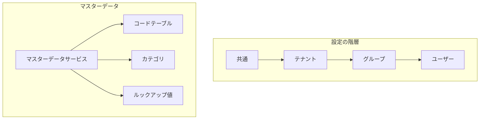

# マスターモジュール


マスターサービスは、マルチテナント環境でのマスターデータと設定の管理機能を提供します。
## 概要

マスターサービスは2つの主要コンポーネントで構成されています。


### Master Setting Service
- 階層的な設定管理を実装
- すべてのレベルでの設定作成をサポート
- テナント設定の更新および削除操作を提供
- 階層的な設定取得を実装


### マスターデータサービス
- マスターデータエンティティのCRUD操作を実装
- リストおよび取得機能を提供
- コード検証機能を含む
- テナント間のデータ整合性を確保

## アーキテクチャ



## インストール

```bash
npm install @mbc-cqrs-serverless/master
```

## 基本的な使い方

`MasterModule` の動作をカスタマイズするには、静的な `register()` メソッドでオプションの `object` を渡します。

### モジュールオプション

| オプション | 型 | 説明 |
|--------|------|-------------|
| `enableController` | `boolean` | デフォルトのマスターコントローラーを有効または無効にする |
| `dataSyncHandlers` | `Type<IDataSyncHandler>[]` | マスターデータを外部システム（例：RDS）に同期するオプションハンドラー |
| `prismaService` | `Type<any>` | RDSバッククエリ用のPrismaサービス。`enableController: true` の場合は必須 |

:::warning prismaServiceの要件
`enableController: true` の場合、`prismaService` パラメータは **必須** です。コントローラーが有効な状態で `prismaService` が提供されていない場合、起動時にエラーがスローされます。
:::

```ts
import { MasterModule } from '@mbc-cqrs-serverless/master'

@Module({
  imports: [ MasterModule.register({
      enableController: true,
      dataSyncHandlers: [MasterDataRdsSyncHandler],
      prismaService: PrismaService,
    })],
  controllers: [],
  exports: [],
})

```

## APIリファレンス

### マスター設定サービス
MasterSettingService インターフェースは、ユーザー、グループ、テナント、共通のさまざまなレベルで設定を管理します。設定の取得、更新、作成、削除を可能にします。

##### `getSetting(dto: GetSettingDto, context: { invokeContext: IInvoke }): Promise<MasterSettingEntity>`
指定された設定コードに基づいて特定の設定を取得します。
```ts
const masterSetting = await this.masterSettingService.getSetting(
  {
    code: "service",
  },
  { invokeContext }
);
```

#### `createCommonTenantSetting(dto: CommonSettingDto, context: { invokeContext: IInvoke }): Promise<CommandModel>`
システム全体で共有される共通のテナント設定を作成します。
```ts
const masterSetting = await this.masterSettingService.createCommonTenantSetting(
  {
    name: "common setting",
    code: "service",
    settingValue: {
      region: "US",
      plan: "common"
    }
  },
  { invokeContext }
);
```

#### `createTenantSetting(dto: TenantSettingDto, context: { invokeContext: IInvoke }): Promise<CommandModel>`
テナント固有の設定を作成します。
```ts
const masterSetting = await this.masterSettingService.createTenantSetting(
  {
    name: "tenant setting",
    code: "service",
    tenantCode: "mbc",
    settingValue: {
      region: "US",
      plan: "tenant"
    }
  },
  { invokeContext }
);
```

#### `createGroupSetting(dto: GroupSettingDto, context: { invokeContext: IInvoke }): Promise<CommandModel>`
テナント内でグループ固有の設定を作成します。
```ts
const masterSetting = await this.masterSettingService.createGroupSetting(
  {
    name: "group setting",
    code: "service",
    tenantCode: "mbc",
    groupId: "12",
    settingValue: {
      region: "US",
      plan: "USER"
    }
  },
  { invokeContext }
);
```
#### `createUserSetting(dto: UserSettingDto, context: { invokeContext: IInvoke }): Promise<CommandModel>`
テナント内でユーザー固有の設定を作成します。
```ts
const masterSetting = await this.masterSettingService.createUserSetting(
  {
    name: "user setting",
    code: "service",
    tenantCode: "mbc",
    userId: "92ca4f68-9ac6-4080-9ae2-2f02a86206a4",
    settingValue: {
      region: "US",
      plan: "USER"
    }
  },
  { invokeContext }
);
```


#### `updateSetting(params: DetailKey, dto: UpdateSettingDto, context: { invokeContext: IInvoke }): Promise<CommandModel>`
既存の設定を更新します。
```ts
const masterSetting = await this.masterSettingService.updateSetting(
  {
    pk: "MASTER#abc",
    sk: "MASTER_SETTING#service"
  },
  {
    name: 'Example Master Setting',
    settingValue: {
      homepage: "url",
      desc: "string"
    }
  },
  { invokeContext }
);
```

#### `deleteSetting(key: DetailKey, context: { invokeContext: IInvoke }): Promise<CommandModel>`
指定されたキーに基づいて特定の設定を削除します。
```ts
const masterSetting = await this.masterSettingService.deleteSetting(
  {
    pk: "MASTER#abc",
    sk: "MASTER_SETTING#service"
  },
  { invokeContext }
);
```

#### `list(searchDto: MasterSettingSearchDto, invokeContext: IInvoke): Promise<MasterRdsListEntity>`
ページネーションとフィルタリングでマスター設定をリストします。RDS（Prisma）の設定が必要です。
```ts
const result = await this.masterSettingService.list(
  {
    name: "service",           // 名前の部分一致
    code: "SVC",               // コードの部分一致
    keyword: "description",    // attributes.description内を検索
    page: 1,
    pageSize: 10,
    orderBys: ["-createdAt"],
  },
  invokeContext
);
```

#### `getDetail(key: DetailDto): Promise<MasterRdsEntity>`
詳細なマスター設定を取得します。見つからない場合はNotFoundExceptionをスローします。
```ts
const masterSetting = await this.masterSettingService.getDetail({
  pk: "MASTER#mbc",
  sk: "MASTER_SETTING#service"
});
```

#### `create(createDto: CommonSettingDto, invokeContext: IInvoke): Promise<CommandModel>`
新しいテナント設定を作成します。コンテキストからテナントコードを自動抽出するcreateTenantSettingのラッパーです。
```ts
const masterSetting = await this.masterSettingService.create(
  {
    code: "service",
    name: "Service Setting",
    settingValue: { key: "value" }
  },
  invokeContext
);
```

#### `createBulk(createDto: CommonSettingBulkDto, invokeContext: IInvoke): Promise<CommandModel[]>`
複数の設定を一度に作成します。

:::warning 新規作成のみの操作
`createBulk`は内部的に各アイテムに対して`create`を呼び出します。設定が既に存在する場合（例: `"Setting already exists: {code}"`）、`BadRequestException`をスローします。このメソッドは既存の設定の更新には使用できません。upsert動作（作成または更新）が必要な場合は、以下の[Upsertパターン](#upsert-pattern)セクションを参照してください。
:::

```ts
const settings = await this.masterSettingService.createBulk(
  {
    items: [
      { code: "setting1", name: "Setting 1", settingValue: {} },
      { code: "setting2", name: "Setting 2", settingValue: {} }
    ]
  },
  invokeContext
);
```

#### `update(key: DetailDto, updateDto: MasterSettingUpdateDto, invokeContext: IInvoke): Promise<CommandModel>`
マスター設定を更新します。
```ts
const result = await this.masterSettingService.update(
  { pk: "MASTER#mbc", sk: "MASTER_SETTING#service" },
  {
    name: "Updated Setting",
    attributes: { newKey: "newValue" }
  },
  invokeContext
);
```

#### `delete(key: DetailDto, invokeContext: IInvoke): Promise<CommandModel>`
マスター設定を削除します。deleteSettingのラッパーです。
```ts
await this.masterSettingService.delete(
  { pk: "MASTER#mbc", sk: "MASTER_SETTING#service" },
  invokeContext
);
```

#### `checkExistCode(code: string, invokeContext: IInvoke): Promise<boolean>`
現在のテナントに設定コードが既に存在するかどうかを確認します。
```ts
const exists = await this.masterSettingService.checkExistCode("service", invokeContext);
if (exists) {
  // 重複コードの処理
}
```

#### `copy(masterCopyDto: MasterCopyDto, opts: { invokeContext: IInvoke }): Promise<any>`
Step Functionsを使用して、マスター設定とデータを他のテナントに非同期でコピーします。既存のマスターデータで新しいテナントを初期化するのに便利です。
```ts
const task = await this.masterSettingService.copy(
  {
    masterSettingId: "MASTER#mbc#MASTER_SETTING#service",
    targetTenants: ["tenant1", "tenant2"],
    copyType: CopyType.BOTH,   // CopyType.SETTING_ONLY、CopyType.DATA_ONLY、またはCopyType.BOTH
    dataCopyOption: {
      mode: DataCopyMode.ALL,  // またはDataCopyMode.PARTIAL
      // id: ["id1", "id2"]    // modeがPARTIALの場合は必須
    }
  },
  { invokeContext }
);
// タスクエンティティを返します - コピー操作は非同期で実行されます
```

コピータイプ:
- `CopyType.SETTING_ONLY`: 設定のみをコピー
- `CopyType.DATA_ONLY`: データのみをコピー
- `CopyType.BOTH`: 設定とデータの両方をコピー

データコピーモード（copyTypeがDATA_ONLYまたはBOTHの場合に使用）:
- `DataCopyMode.ALL`: 設定下のすべてのマスターデータをコピー
- `DataCopyMode.PARTIAL`: 指定されたIDのみをコピー

### マスターデータサービス
MasterDataService サービスは、マスターデータと操作を管理するためのメソッドを提供します。これには、リスト、取得、作成、更新、削除、および特定のコードの存在確認が含まれます。

#### `list(searchDto: MasterDataSearchDto): Promise<MasterDataListEntity>`
指定された検索条件に基づいてマスターデータをリストします。注: このメソッドはinvokeコンテキストを必要としません。
```ts
const masterData = await this.masterDataService.list({
  tenantCode: "mbc",
  settingCode: "service"
});
```

#### `get(key: DetailDto): Promise<MasterDataEntity>`
主キー (pk) およびソートキー (sk) によるマスターデータの取得。

```ts
const masterData = await this.masterDataService.get(
  {
    pk:"MASTER#abc", 
    sk:"MASTER_DATA#service#01"
  }
);
```

  
#### `create(data: CreateMasterDataDto, context: { invokeContext: IInvoke }): Promise<MasterDataEntity>`

新しいマスターデータエンティティを作成します。

```ts
const masterData = await this.masterDataService.create(
  {
    code: 'MASTER001',
    name: 'Example Master Data',
    settingCode: "service",
    tenantCode: "common",
    attributes: {
      homepage: "http://mbc.com",
      desc: "description for mbc"
    }
  },
  { invokeContext }
);
```

#### `update(key: DetailDto, updateDto: UpdateDataSettingDto, context: { invokeContext: IInvoke }): Promise<MasterDataEntity>`
既存のマスターデータを更新します。

```ts
const masterData = await this.masterDataService.update(
  {
    pk: "MASTER#abc",
    sk: "MASTER_DATA#service#01"
  },
  {
    name: 'Example Master Data',
    attributes: {
      homepage: "http://mbc.com",
      desc: "description for mbc"
    }
  },
  { invokeContext }
);
```


#### `delete(key: DetailDto, opts: { invokeContext: IInvoke }): Promise<MasterDataEntity>`
指定されたキーに基づいて特定のマスターデータを削除します。
```ts
const masterData = await this.masterDataService.delete(
  {
    pk: "MASTER#abc",
    sk: "MASTER_DATA#service#01"
  },
  { invokeContext }
);
```

#### `checkExistCode(tenantCode: string, type: string, code: string): Promise<boolean>`
指定されたテナントとタイプ内で特定のコードが存在するかどうかを確認します。

```ts
const exists = await this.masterDataService.checkExistCode("mbc", "service", "01");
if (exists) {
  // 既存コードの処理
}
```

#### `getDetail(key: DetailDto): Promise<MasterRdsEntity>`
関連情報を含む詳細なマスターデータを取得します。見つからない場合はNotFoundExceptionをスローします。

```ts
const masterData = await this.masterDataService.getDetail({
  pk: "MASTER#mbc",
  sk: "MASTER_DATA#service#01"
});
```

#### `createSetting(createDto: MasterDataCreateDto, invokeContext: IInvoke): Promise<MasterDataEntity>`
新しいマスターデータエンティティを作成します。シーケンスが指定されていない場合は自動生成されます。

:::warning 新規作成のみの操作
`createSetting`はマスターデータが既に存在する場合（例: `"Master data already exists: {code}"`）、`BadRequestException`をスローします。upsert動作（作成または更新）が必要な場合は、以下の[Upsertパターン](#upsert-pattern)セクションを参照してください。
:::

```ts
const masterData = await this.masterDataService.createSetting(
  {
    code: 'MASTER001',
    name: 'Example Master Data',
    settingCode: "service",
    tenantCode: "mbc",
    attributes: {
      homepage: "http://mbc.com",
      desc: "description for mbc"
    }
  },
  invokeContext
);
```

#### `createBulk(createDto: MasterDataCreateBulkDto, invokeContext: IInvoke): Promise<MasterDataEntity[]>`
複数のマスターデータエンティティを一括作成します。

:::warning 新規作成のみの操作
`createBulk`は内部的に各アイテムに対して`createSetting`を呼び出します。既に存在するアイテムがある場合、`BadRequestException`をスローします。upsert動作が必要な場合は、以下の[Upsertパターン](#upsert-pattern)セクションを参照してください。
:::

```ts
const masterDataList = await this.masterDataService.createBulk(
  {
    items: [
      {
        code: 'MASTER001',
        name: 'First Master Data',
        settingCode: "service",
        tenantCode: "mbc",
        attributes: {}
      },
      {
        code: 'MASTER002',
        name: 'Second Master Data',
        settingCode: "service",
        tenantCode: "mbc",
        attributes: {}
      }
    ]
  },
  invokeContext
);
```

#### `updateSetting(key: DetailDto, updateDto: MasterDataUpdateDto, invokeContext: IInvoke): Promise<MasterDataEntity>`
既存のマスターデータエンティティを更新します。

```ts
const masterData = await this.masterDataService.updateSetting(
  {
    pk: "MASTER#mbc",
    sk: "MASTER_DATA#service#01"
  },
  {
    name: 'Updated Master Data',
    attributes: {
      homepage: "http://updated-mbc.com"
    }
  },
  invokeContext
);
```

#### `deleteSetting(key: DetailDto, invokeContext: IInvoke): Promise<MasterDataEntity>`
キーでマスターデータエンティティを削除します。

```ts
const result = await this.masterDataService.deleteSetting(
  {
    pk: "MASTER#mbc",
    sk: "MASTER_DATA#service#01"
  },
  invokeContext
);
```

#### `listByRds(searchDto: CustomMasterDataSearchDto, context: { invokeContext: IInvoke }): Promise<MasterRdsListEntity>`
フィルタリングとページネーションでRDS内のマスターデータを検索します。このメソッドはPrismaサービスが設定されている場合に使用されます。

```ts
const result = await this.masterDataService.listByRds(
  {
    settingCode: "service",    // マスタータイプコードの完全一致
    keyword: "example",        // 名前の部分一致（大文字小文字を区別しない）
    code: "001",               // マスターコードの部分一致（大文字小文字を区別しない）
    page: 1,
    pageSize: 10,
    orderBys: ["seq", "masterCode"],
  },
  { invokeContext }
);
```

##### 検索パラメータ {#search-parameters}

| パラメータ | 型 | 必須 | マッチタイプ | 説明 |
|---------------|----------|--------------|----------------|-----------------|
| `settingCode` | `string` | いいえ | 完全一致 | マスタータイプコード（masterTypeCode）でフィルタ |
| `keyword` | `string` | いいえ | 部分一致（大文字小文字を区別しない） | 名前フィールドでフィルタ |
| `code` | `string` | いいえ | 部分一致（大文字小文字を区別しない） | マスターコードでフィルタ |
| `page` | `number` | いいえ | - | ページ番号（デフォルト: 1） |
| `pageSize` | `number` | いいえ | - | 1ページあたりの項目数（デフォルト: 10） |
| `orderBys` | `string[]` | いいえ | - | ソート順（デフォルト: ["seq", "masterCode"]） |
| `isDeleted` | `boolean` | いいえ | 完全一致 | 削除ステータスでフィルタ |

:::warning 既知の問題（v1.0.17で修正済み）
v1.0.17より前のバージョンでは、`settingCode` パラメータが誤って完全一致ではなく部分一致（`contains`）を使用していました。これにより意図しない検索結果が返される問題がありました。例えば、「PRODUCT」を検索すると「PRODUCT_TYPE」や「MY_PRODUCT」も返されていました。

v1.0.16以前をご使用で、`settingCode` の完全一致が必要な場合は、v1.0.17以降にアップグレードしてください。

参照： [変更履歴 v1.0.17](./changelog#v1017)
:::

## Upsertパターン {#upsert-pattern}

`createBulk`と`createSetting`メソッドは**新規作成のみ**の操作です。同じコードのレコードが既に存在する場合、`BadRequestException`をスローします。これは、master-web JSONエディタ経由で既存レコードのJSONデータを再インポートすると失敗することを意味します。

新規レコードの作成と既存レコードの更新の両方をサポートするには（upsert動作）、既存レコードの有無を確認してからcreateまたはupdateを呼び分けるカスタムupsertサービスを実装してください。

### マスター設定のUpsert

```ts
import {
  CommandModel,
  getUserContext,
  IInvoke,
  KEY_SEPARATOR,
} from '@mbc-cqrs-serverless/core'
import {
  CommonSettingDto,
  MasterSettingService,
} from '@mbc-cqrs-serverless/master'
import { Injectable, Logger } from '@nestjs/common'
import { PrismaService } from 'src/prisma'

const MASTER_PK_PREFIX = 'MASTER'
const SETTING_SK_PREFIX = 'MASTER_SETTING'

@Injectable()
export class MasterSettingUpsertService {
  private readonly logger = new Logger(MasterSettingUpsertService.name)

  constructor(
    private readonly masterSettingService: MasterSettingService,
    private readonly prismaService: PrismaService,
  ) {}

  async upsertBulk(
    items: CommonSettingDto[],
    invokeContext: IInvoke,
  ): Promise<CommandModel[]> {
    const results: CommandModel[] = []
    for (const item of items) {
      const result = await this.upsertOne(item, invokeContext)
      results.push(result)
    }
    return results
  }

  private async upsertOne(
    dto: CommonSettingDto,
    invokeContext: IInvoke,
  ): Promise<CommandModel> {
    const userContext = getUserContext(invokeContext)
    const tenantCode = dto.tenantCode ?? userContext.tenantCode

    // Check if record exists in RDS (RDSにレコードが存在するか確認)
    const existing = await this.prismaService.master.findFirst({
      where: {
        tenantCode,
        masterType: SETTING_SK_PREFIX,
        masterCode: dto.code,
        isDeleted: false,
      },
    })

    if (existing) {
      // Update existing setting (既存の設定を更新)
      const pk = `${MASTER_PK_PREFIX}${KEY_SEPARATOR}${tenantCode}`
      const sk = `${SETTING_SK_PREFIX}${KEY_SEPARATOR}${dto.code}`
      return this.masterSettingService.updateSetting(
        { pk, sk },
        {
          code: dto.code,
          tenantCode,
          name: dto.name,
          settingValue: dto.settingValue,
        },
        { invokeContext },
      )
    } else {
      // Create new setting (新しい設定を作成)
      return this.masterSettingService.create(dto, invokeContext)
    }
  }
}
```

### マスターデータのUpsert

```ts
import {
  getUserContext,
  IInvoke,
  KEY_SEPARATOR,
} from '@mbc-cqrs-serverless/core'
import {
  MasterDataCreateDto,
  MasterDataService,
} from '@mbc-cqrs-serverless/master'
import { Injectable, Logger } from '@nestjs/common'
import { PrismaService } from 'src/prisma'

const MASTER_PK_PREFIX = 'MASTER'
const DATA_SK_PREFIX = 'MASTER_DATA'

@Injectable()
export class MasterDataUpsertService {
  private readonly logger = new Logger(MasterDataUpsertService.name)

  constructor(
    private readonly masterDataService: MasterDataService,
    private readonly prismaService: PrismaService,
  ) {}

  async upsertBulk(
    items: MasterDataCreateDto[],
    invokeContext: IInvoke,
  ) {
    const results = []
    for (const item of items) {
      const result = await this.upsertOne(item, invokeContext)
      results.push(result)
    }
    return results
  }

  private async upsertOne(
    dto: MasterDataCreateDto,
    invokeContext: IInvoke,
  ) {
    const userContext = getUserContext(invokeContext)
    const tenantCode = dto.tenantCode ?? userContext.tenantCode
    const sk = `${DATA_SK_PREFIX}${KEY_SEPARATOR}${dto.settingCode}${KEY_SEPARATOR}${dto.code}`

    // Check if record exists in RDS (RDSにレコードが存在するか確認)
    const existing = await this.prismaService.master.findFirst({
      where: {
        tenantCode,
        masterType: DATA_SK_PREFIX,
        sk,
        isDeleted: false,
      },
    })

    if (existing) {
      // Update existing data (既存のデータを更新)
      const pk = `${MASTER_PK_PREFIX}${KEY_SEPARATOR}${tenantCode}`
      return this.masterDataService.updateSetting(
        { pk, sk },
        { name: dto.name, seq: dto.seq, attributes: dto.attributes },
        invokeContext,
      )
    } else {
      // Create new data (新しいデータを作成)
      return this.masterDataService.createSetting(dto, invokeContext)
    }
  }
}
```

### Upsertコントローラー

`/upsert-bulk`エンドポイントを公開するカスタムコントローラーにupsertサービスを登録します：

```ts
import { INVOKE_CONTEXT, IInvoke } from '@mbc-cqrs-serverless/core'
import { Body, Controller, Post } from '@nestjs/common'
import { MasterSettingUpsertService } from './master-setting-upsert.service'

@Controller('api/master-setting')
export class MasterSettingUpsertController {
  constructor(
    private readonly upsertService: MasterSettingUpsertService,
  ) {}

  @Post('/upsert-bulk')
  async upsertBulk(
    @Body() dto: { items: any[] },
    @INVOKE_CONTEXT() invokeContext: IInvoke,
  ) {
    return this.upsertService.upsertBulk(dto.items, invokeContext)
  }
}
```

### モジュール登録

フレームワークの`MasterModule`と一緒にupsertコントローラーとサービスを登録します：

```ts
import { MasterModule as CoreMasterModule } from '@mbc-cqrs-serverless/master'
import { Module } from '@nestjs/common'
import { PrismaService } from 'src/prisma'

@Module({
  imports: [
    CoreMasterModule.register({
      enableController: true,
      prismaService: PrismaService,
      dataSyncHandlers: [MasterDataSyncRdsHandler],
    }),
  ],
  controllers: [
    MasterSettingUpsertController,
    MasterDataUpsertController,
  ],
  providers: [
    MasterSettingUpsertService,
    MasterDataUpsertService,
  ],
})
export class MasterModule {}
```

### Axiosインターセプターによるフロントエンド統合

master-webの`AddJsonData`コンポーネントは一括作成用のハードコードされたAPI URL（`/master-setting/bulk`と`/master-data/bulk`）を使用しています。これらのリクエストをカスタムupsertエンドポイントにリダイレクトするには、Axiosリクエストインターセプターを追加します：

```tsx
const httpClient = useMemo(() => {
  const instance = axios.create({
    baseURL: `${baseEndpoint}/api`,
    headers: {
      'Content-Type': 'application/json',
      'x-tenant-code': tenantCode,
    },
  })

  instance.interceptors.request.use(async (config) => {
    // Rewrite bulk create APIs to upsert-bulk APIs (一括作成APIをupsert-bulk APIに書き換え)
    if (config.method?.toUpperCase() === 'POST') {
      if (config.url === '/master-setting/bulk') {
        config.url = '/master-setting/upsert-bulk'
      } else if (config.url === '/master-data/bulk') {
        config.url = '/master-data/upsert-bulk'
      }
    }

    // Inject auth token (認証トークンを注入)
    try {
      const session = await fetchAuthSession()
      const token = session.tokens?.idToken?.toString()
      if (token) {
        config.headers.Authorization = `Bearer ${token}`
      }
    } catch {
      // Ignore auth errors (認証エラーを無視)
    }
    return config
  })

  return instance
}, [tenantCode])
```

このインターセプターにより、master-web JSONエディタは新規作成のみのエンドポイントの代わりにupsertエンドポイントを自動的に呼び出し、初回登録とJSONデータの再インポートの両方が可能になります。
