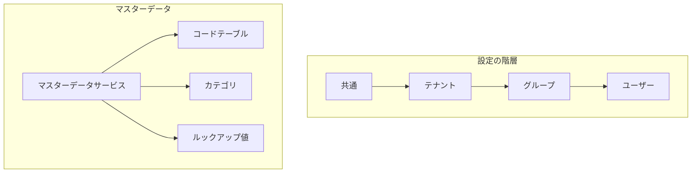

# マスターモジュール


マスターサービスは、マルチテナント環境でのマスターデータと設定の管理機能を提供します。
## 概要

マスターサービスは2つの主要コンポーネントで構成されています。


### Master Setting Service
- 階層的な設定管理を実装
- すべてのレベルでの設定作成をサポート
- テナント設定の更新および削除操作を提供
- 階層的な設定取得を実装


### マスターデータサービス
- マスターデータエンティティのCRUD操作を実装
- リストおよび取得機能を提供
- コード検証機能を含む
- テナント間のデータ整合性を確保

## アーキテクチャ



## インストール

```bash
npm install @mbc-cqrs-serverless/master
```

## 基本的な使い方

`MasterModule` の動作をカスタマイズするには、静的な `register()` メソッドでオプションの `object` を渡します。

### モジュールオプション

| オプション | 型 | 説明 |
|--------|------|-------------|
| `enableController` | `boolean` | デフォルトのマスターコントローラーを有効または無効にする |
| `dataSyncHandlers` | `Type<IDataSyncHandler>[]` | マスターデータを外部システム（例：RDS）に同期するオプションハンドラー |
| `prismaService` | `Type<any>` | RDSバッククエリ用のオプションPrismaサービス |

```ts
import { MasterModule } from '@mbc-cqrs-serverless/master'

@Module({
  imports: [ MasterModule.register({
      enableController: true,
      dataSyncHandlers: [MasterDataRdsSyncHandler],
      prismaService: PrismaService,
    })],
  controllers: [],
  exports: [],
})

```

## APIリファレンス

### マスター設定サービス
MasterSettingService インターフェースは、ユーザー、グループ、テナント、共通のさまざまなレベルで設定を管理します。設定の取得、更新、作成、削除を可能にします。

##### `getSetting(dto: GetSettingDto, context: { invokeContext: IInvoke }): Promise<MasterSettingEntity>`
指定された設定コードに基づいて特定の設定を取得します。
```ts
const masterSetting = await this.masterSettingService.getSetting(
  {
    code: "service",
  }
);
```

#### `createCommonTenantSetting(dto: CommonSettingDto, context: { invokeContext: IInvoke }): Promise<CommandModel>`
システム全体で共有される共通のテナント設定を作成します。
```ts
const masterSetting = await this.masterSettingService.createGroupSetting(
  {
  name: "common setting",
  code: "service",
  settingValue: {
    region: "US",
    plan: "common"
  }
});
```

#### `createTenantSetting(dto: TenantSettingDto, context: { invokeContext: IInvoke }): Promise<CommandModel>`
テナント固有の設定を作成します。
```ts
const masterSetting = await this.masterSettingService.createGroupSetting(
  {
  name: "tenant setting",
  code: "service",
  tenantCode: "mbc",
  settingValue: {
    region: "US",
    plan: "tenant"
  }
});
```

#### `createGroupSetting(dto: GroupSettingDto, context: { invokeContext: IInvoke }): Promise<CommandModel>`
テナント内でグループ固有の設定を作成します。
```ts
const masterSetting = await this.masterSettingService.createGroupSetting(
  {
  name: "group setting",
  code: "service",
  tenantCode: "mbc",
  groupId: "12",
  settingValue: {
    region: "US",
    plan: "USER"
  }
});
```
#### `createUserSetting(dto: UserSettingDto, context: { invokeContext: IInvoke }): Promise<CommandModel>`
テナント内でユーザー固有の設定を作成します。
```ts
const masterSetting = await this.masterSettingService.createUserSetting(
  {
  name: "user setting",
  code: "service",
  tenantCode: "mbc",
  userId: "92ca4f68-9ac6-4080-9ae2-2f02a86206a4",
  settingValue: {
    region: "US",
    plan: "USER"
  }
});
```


#### `updateSetting(params: DetailKey, dto: UpdateSettingDto, context: { invokeContext: IInvoke }): Promise<CommandModel>`
既存の設定を更新します。
```ts
const masterSetting = await this.masterSettingService.updateSetting(
  {
    pk:"MASTER#abc", 
    sk:"MASTER_SETTING#service"
  },
  {
  name: 'Example Master Setting',
  settingValue: {
    homepage: "url",
    desc: "string"
  }
});
```

#### `deleteSetting(key: DetailKey, context: { invokeContext: IInvoke }): Promise<CommandModel>`
指定されたキーに基づいて特定の設定を削除します。
```ts
const masterSetting = await this.masterSettingService.deleteSetting(
  {
    pk:"MASTER#abc", 
    sk:"MASTER_SETTING#service"
  }
);
```

### マスターデータサービス
MasterDataService サービスは、マスターデータと操作を管理するためのメソッドを提供します。これには、リスト、取得、作成、更新、削除、および特定のコードの存在確認が含まれます。

#### `list( searchDto: MasterDataSearchDto): Promise<MasterDataListEntity>`
指定された検索条件に基づいてマスターデータをリストします。
```ts
const masterData = await this.masterDataService.list(
  {
    tenantCode: "mbc",
    settingCode: "service"
  }
);
```

#### `get(key: DetailDto): Promise<MasterDataEntity>`
主キー (pk) およびソートキー (sk) によるマスターデータの取得。

```ts
const masterData = await this.masterDataService.get(
  {
    pk:"MASTER#abc", 
    sk:"MASTER_DATA#service#01"
  }
);
```

  
#### `create(data: CreateMasterDataDto, context: { invokeContext: IInvoke })`

新しいマスターデータエンティティを作成します。

```ts
const masterData = await this.masterDataService.create({
  code: 'MASTER001',
  name: 'Example Master Data',
  settingCode: "service",
  tenantCode: "COMMON",
  attributes: {
    homepage: "http://mbc.com",
    desc: "description for mbc"
  }
});
```

#### `update(key: DetailDto, updateDto: UpdateDataSettingDto, context: { invokeContext: IInvoke })`
既存のマスターデータを更新します。

```ts
const masterData = await this.masterDataService.update(
  {
    pk:"MASTER#abc", 
    sk:"MASTER_DATA#service#01"
  },
  {
  name: 'Example Master Data',
  attributes: {
    homepage: "http://mbc.com",
    desc: "description for mbc"
  }
});
```


#### `delete(key: DetailDto, opts: { invokeContext: IInvoke })`
指定されたキーに基づいて特定のマスターデータを削除します。
```ts
const masterData = await this.masterDataService.delete(
  {
    pk:"MASTER#abc", 
    sk:"MASTER_DATA#service#01"
  }
);
```

#### `checkExistCode(tenantCode: string, type: string, code: string)`
指定されたテナントとタイプ内で特定のコードが存在するかどうかを確認します。

```ts
const masterData = await this.masterDataService.checkExistCode("mbc", "service", "01");
```

#### `getDetail(key: DetailDto): Promise<MasterDataDetailEntity>`
関連情報を含む詳細なマスターデータを取得します。見つからない場合はNotFoundExceptionをスローします。

```ts
const masterData = await this.masterDataService.getDetail({
  pk: "MASTER#mbc",
  sk: "MASTER_DATA#service#01"
});
```

#### `createSetting(createDto: MasterDataCreateDto, invokeContext: IInvoke): Promise<CommandModel>`
新しいマスターデータエンティティを作成します。シーケンスが指定されていない場合は自動生成されます。

```ts
const masterData = await this.masterDataService.createSetting(
  {
    code: 'MASTER001',
    name: 'Example Master Data',
    settingCode: "service",
    tenantCode: "mbc",
    attributes: {
      homepage: "http://mbc.com",
      desc: "description for mbc"
    }
  },
  invokeContext
);
```

#### `createBulk(createDto: MasterDataCreateBulkDto, invokeContext: IInvoke): Promise<CommandModel[]>`
複数のマスターデータエンティティを一括作成します。

```ts
const masterDataList = await this.masterDataService.createBulk(
  {
    items: [
      {
        code: 'MASTER001',
        name: 'First Master Data',
        settingCode: "service",
        tenantCode: "mbc"
      },
      {
        code: 'MASTER002',
        name: 'Second Master Data',
        settingCode: "service",
        tenantCode: "mbc"
      }
    ]
  },
  invokeContext
);
```

#### `updateSetting(key: DetailDto, updateDto: MasterDataUpdateDto, invokeContext: IInvoke): Promise<CommandModel>`
既存のマスターデータエンティティを更新します。

```ts
const masterData = await this.masterDataService.updateSetting(
  {
    pk: "MASTER#mbc",
    sk: "MASTER_DATA#service#01"
  },
  {
    name: 'Updated Master Data',
    attributes: {
      homepage: "http://updated-mbc.com"
    }
  },
  invokeContext
);
```

#### `deleteSetting(key: DetailDto, invokeContext: IInvoke): Promise<CommandModel>`
キーでマスターデータエンティティを削除します。

```ts
const result = await this.masterDataService.deleteSetting(
  {
    pk: "MASTER#mbc",
    sk: "MASTER_DATA#service#01"
  },
  invokeContext
);
```

#### `listByRds(searchDto: CustomMasterDataSearchDto, context: { invokeContext: IInvoke }): Promise<MasterRdsListEntity>`
フィルタリングとページネーションでRDS内のマスターデータを検索します。このメソッドはPrismaサービスが設定されている場合に使用されます。

```ts
const result = await this.masterDataService.listByRds(
  {
    settingCode: "service",    // マスタータイプコードの完全一致
    keyword: "example",        // 名前の部分一致（大文字小文字を区別しない）
    code: "001",               // マスターコードの部分一致（大文字小文字を区別しない）
    page: 1,
    pageSize: 10,
    orderBys: ["seq", "masterCode"],
  },
  { invokeContext }
);
```

##### 検索パラメータ {#search-parameters}

| パラメータ | 型 | 必須 | マッチタイプ | 説明 |
|---------------|----------|--------------|----------------|-----------------|
| `settingCode` | `string` | いいえ | 完全一致 | マスタータイプコード（masterTypeCode）でフィルタ |
| `keyword` | `string` | いいえ | 部分一致（大文字小文字を区別しない） | 名前フィールドでフィルタ |
| `code` | `string` | いいえ | 部分一致（大文字小文字を区別しない） | マスターコードでフィルタ |
| `page` | `number` | いいえ | - | ページ番号（デフォルト: 1） |
| `pageSize` | `number` | いいえ | - | 1ページあたりの項目数（デフォルト: 10） |
| `orderBys` | `string[]` | いいえ | - | ソート順（デフォルト: ["seq", "masterCode"]） |
| `isDeleted` | `boolean` | いいえ | 完全一致 | 削除ステータスでフィルタ |

:::warning 既知の問題（v1.0.17で修正済み）
v1.0.17より前のバージョンでは、`settingCode` パラメータが誤って完全一致ではなく部分一致（`contains`）を使用していました。これにより意図しない検索結果が返される問題がありました。例えば、「PRODUCT」を検索すると「PRODUCT_TYPE」や「MY_PRODUCT」も返されていました。

v1.0.16以前をご使用で、`settingCode` の完全一致が必要な場合は、v1.0.17以降にアップグレードしてください。

参照： [変更履歴 v1.0.17](./changelog#v1017)
:::
