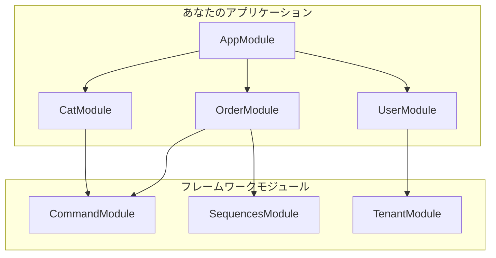

# モジュール

## 概要

モジュールは`@Module()`デコレーターで注釈されたクラスです。`@Module()`デコレーターはアプリケーション構造を整理するメタデータを提供します。モジュールは関連する機能をカプセル化し、NestJSのモジュールパターンに従います。



## モジュール構造

MBC CQRS Serverlessの一般的なモジュールには以下が含まれます：

```typescript
import { Module } from '@nestjs/common';
import { CommandModule } from '@mbc-cqrs-serverless/core';

import { CatController } from './cat.controller';
import { CatService } from './cat.service';
import { CatDataSyncRdsHandler } from './handler/cat-rds.handler';

@Module({
  imports: [
    CommandModule.register({
      tableName: 'cat',
      dataSyncHandlers: [CatDataSyncRdsHandler],
    }),
  ],
  controllers: [CatController],
  providers: [CatService],
  exports: [CatService],
})
export class CatModule {}
```

## モジュールコンポーネント

| コンポーネント | 説明 |
|-----------|-------------|
| `imports` | このモジュールで使用するプロバイダーをエクスポートするインポート済みモジュールのリスト |
| `controllers` | HTTPリクエストを処理するコントローラー |
| `providers` | インジェクションに利用可能なサービスやその他のプロバイダー |
| `exports` | このモジュールをインポートするモジュールで利用可能にすべきプロバイダー |

## フレームワークモジュール

MBC CQRS Serverlessはすぐに使えるモジュールをいくつか提供しています：

### コアモジュール

| モジュール | パッケージ | 用途 |
|--------|---------|---------|
| `CommandModule` | `@mbc-cqrs-serverless/core` | CQRSコマンド処理とデータ同期 |
| `SequencesModule` | `@mbc-cqrs-serverless/sequence` | 連番ID生成 |
| `TenantModule` | `@mbc-cqrs-serverless/tenant` | マルチテナント管理 |

### 機能モジュール

| モジュール | パッケージ | 用途 |
|--------|---------|---------|
| `TaskModule` | `@mbc-cqrs-serverless/task` | Step Functionsによる非同期タスク実行 |
| `MasterModule` | `@mbc-cqrs-serverless/master` | マスターデータと設定の管理 |
| `ImportModule` | `@mbc-cqrs-serverless/import` | CSV/APIデータインポート |

### サポートモジュール

| モジュール | パッケージ | 用途 |
|--------|---------|---------|
| `NotificationModule` | `@mbc-cqrs-serverless/core` | SES経由のメール通知 |
| `SettingModule` | `@mbc-cqrs-serverless/ui-setting` | ユーザーインターフェース設定の保存 |

## 動的モジュール登録

ほとんどのフレームワークモジュールは設定を受け付ける動的モジュールです：

### CommandModule

```typescript
CommandModule.register({
  tableName: 'cat',
  dataSyncHandlers: [CatDataSyncRdsHandler],
  skipError: false,
  disableDefaultHandler: false,
})
```

| オプション | 型 | デフォルト | 説明 |
|--------|------|---------|-------------|
| `tableName` | `string` | 必須 | DynamoDBテーブル名（接尾辞なし） |
| `dataSyncHandlers` | `Type[]` | `[]` | データ同期ハンドラークラス |
| `skipError` | `boolean` | `false` | 将来の使用のために予約済み（未実装） |
| `disableDefaultHandler` | `boolean` | `false` | デフォルトのDynamoDBデータ同期ハンドラーを無効化 |

### SequencesModule

```typescript
SequencesModule.register({
  enableController: true,
})
```

### MasterModule

```typescript
MasterModule.register({
  enableController: true,
  prismaService: PrismaService,
})
```

:::warning MasterModule 設定の注意点
`enableController: true` の場合、`prismaService` パラメータは**必須**です。アプリケーションのPrismaServiceクラスを指定する必要があります。コントローラーが有効な状態で `prismaService` が指定されていない場合、フレームワークはエラーをスローします。
:::

### TaskModule

TaskModuleはAWS Step Functionsを使用した非同期タスク実行を処理します。`ITaskQueueEventFactory`を実装したカスタムイベントファクトリが必要です。

```typescript
import { TaskModule } from '@mbc-cqrs-serverless/task';
import { MyTaskQueueEventFactory } from './my-task-queue-event.factory';

TaskModule.register({
  taskQueueEventFactory: MyTaskQueueEventFactory,
  enableController: true,
})
```

| オプション | 型 | デフォルト | 説明 |
|--------|------|---------|-------------|
| `taskQueueEventFactory` | `Type<ITaskQueueEventFactory>` | 必須 | タスクキューイベントを変換するファクトリクラス |
| `enableController` | `boolean` | `false` | 組み込みタスクRESTエンドポイントを有効化 |

`taskQueueEventFactory`は`ITaskQueueEventFactory`インターフェースを実装する必要があります。両方のメソッドはオプションです - 必要なものだけ実装してください：

```typescript
import { ITaskQueueEventFactory, TaskQueueEvent, StepFunctionTaskEvent } from '@mbc-cqrs-serverless/task';
import { IEvent } from '@mbc-cqrs-serverless/core';
import { MyTaskEvent } from './my-task.event';
import { MyStepFunctionTaskEvent } from './my-sfn-task.event';

export class MyTaskQueueEventFactory implements ITaskQueueEventFactory {
  // Optional: Transform SQS task queue events into domain events (オプション: SQSタスクキューイベントをドメインイベントに変換)
  async transformTask(event: TaskQueueEvent): Promise<IEvent[]> {
    // Create domain-specific events from task queue events (タスクキューイベントからドメイン固有のイベントを作成)
    return [new MyTaskEvent().fromSqsRecord(event)];
  }

  // Optional: Transform Step Function task events into domain events (オプション: Step Functionタスクイベントをドメインイベントに変換)
  async transformStepFunctionTask(event: StepFunctionTaskEvent): Promise<IEvent[]> {
    // Check taskKey.sk to determine which event type to create (taskKey.skをチェックして作成するイベントタイプを決定)
    if (event.taskKey.sk.startsWith('MY_TASK')) {
      return [new MyStepFunctionTaskEvent(event)];
    }
    return [];
  }
}
```

### ImportModule

ImportModuleはCSVおよびAPIデータインポート機能を提供します。各エンティティタイプに対してデータのインポートと処理方法を指定するインポートプロファイルの定義が必要です。

```typescript
import { ImportModule } from '@mbc-cqrs-serverless/import';
import { PolicyImportStrategy } from './strategies/policy-import.strategy';
import { PolicyProcessStrategy } from './strategies/policy-process.strategy';
import { PolicyModule } from './policy.module';

@Module({
  imports: [
    ImportModule.register({
      profiles: [
        {
          tableName: 'policy',
          importStrategy: PolicyImportStrategy,
          processStrategy: PolicyProcessStrategy,
        },
      ],
      imports: [PolicyModule], // Modules that export providers needed by strategies (ストラテジーが必要とするプロバイダーをエクスポートするモジュール)
      enableController: true,
    }),
  ],
})
export class AppModule {}
```

| オプション | 型 | デフォルト | 説明 |
|--------|------|---------|-------------|
| `profiles` | `ImportEntityProfile[]` | 必須 | 各エンティティタイプのインポートプロファイルの配列 |
| `imports` | `ModuleMetadata['imports']` | `[]` | ストラテジークラスが必要とするプロバイダーをエクスポートするモジュール |
| `enableController` | `boolean` | `false` | 組み込みの`/import`および`/import/csv`エンドポイントを有効化 |

各`ImportEntityProfile`には以下が必要です：

| プロパティ | 型 | 説明 |
|----------|------|-------------|
| `tableName` | `string` | データタイプの一意識別子（例：'policy'、'user'） |
| `importStrategy` | `Type<IImportStrategy>` | インポートロジック（変換と検証）を実装するクラス |
| `processStrategy` | `Type<IProcessStrategy>` | ビジネス処理ロジック（比較とマッピング）を実装するクラス |

### SettingModule

SettingModuleはユーザーインターフェース設定を管理します。オプションで設定管理用のRESTエンドポイントを公開できます。

```typescript
import { SettingModule } from '@mbc-cqrs-serverless/ui-setting';

@Module({
  imports: [
    SettingModule.register({
      enableSettingController: true,
      enableDataController: true,
    }),
  ],
})
export class AppModule {}
```

| オプション | 型 | デフォルト | 説明 |
|--------|------|---------|-------------|
| `enableSettingController` | `boolean` | `false` | UI設定管理用のセッティングコントローラーを有効化 |
| `enableDataController` | `boolean` | `false` | データ関連設定用のデータセッティングコントローラーを有効化 |

### NotificationModule（静的）

NotificationModuleはSES経由のメール通知とAppSync経由のリアルタイム更新を提供する静的モジュール（動的ではない）です。グローバルモジュールとして自動的に登録されるため、AppModuleで一度だけインポートするだけで済みます。

```typescript
import { NotificationModule } from '@mbc-cqrs-serverless/core';

@Module({
  imports: [
    NotificationModule, // No configuration needed - static module (設定不要 - 静的モジュール)
  ],
})
export class AppModule {}
```

このモジュールは以下をエクスポートします：
- `EmailService` - Amazon SES経由でメールを送信
- `AppSyncService` - AppSync経由でリアルタイム通知を送信

## カスタムモジュールの作成

### ステップ1: モジュールファイルの作成

```typescript
// src/order/order.module.ts
import { Module } from '@nestjs/common';
import { CommandModule } from '@mbc-cqrs-serverless/core';
import { SequencesModule } from '@mbc-cqrs-serverless/sequence';

import { OrderController } from './order.controller';
import { OrderService } from './order.service';
import { OrderDataSyncHandler } from './handlers/order-data-sync.handler';

@Module({
  imports: [
    CommandModule.register({
      tableName: 'order',
      dataSyncHandlers: [OrderDataSyncHandler],
    }),
    SequencesModule.register({
      enableController: false,
    }),
  ],
  controllers: [OrderController],
  providers: [OrderService],
  exports: [OrderService],
})
export class OrderModule {}
```

### ステップ2: AppModuleへの登録

```typescript
// src/app.module.ts
import { Module } from '@nestjs/common';
import { OrderModule } from './order/order.module';

@Module({
  imports: [OrderModule],
})
export class AppModule {}
```

## ベストプラクティス

1. **エンティティごとに1つのモジュール**: 各ビジネスエンティティ用の専用モジュールを作成する
2. **コントローラーではなくサービスをエクスポート**: 他のモジュールが必要とするプロバイダーのみをエクスポートする
3. **グローバルモジュールにはforRootを使用**: AppModuleでグローバル設定を一度だけ登録する
4. **モジュールを焦点を絞った状態に保つ**: 各モジュールは単一の責任を持つべき

## 関連ドキュメント

- [NestJS Modules](https://docs.nestjs.com/modules): NestJS公式モジュールドキュメント
- [CommandService](./command-service.md): CommandModuleの詳細設定
- [Event Handling Patterns](./event-handling-patterns.md): データ同期ハンドラーの作成
