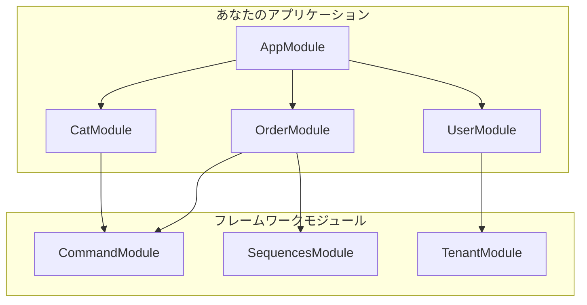

# モジュール

## 概要

モジュールは`@Module()`デコレーターで注釈されたクラスです。`@Module()`デコレーターはアプリケーション構造を整理するメタデータを提供します。モジュールは関連する機能をカプセル化し、NestJSのモジュールパターンに従います。



## モジュール構造

MBC CQRS Serverlessの一般的なモジュールには以下が含まれます：

```typescript
import { Module } from '@nestjs/common';
import { CommandModule } from '@mbc-cqrs-serverless/core';

import { CatController } from './cat.controller';
import { CatService } from './cat.service';
import { CatDataSyncRdsHandler } from './handler/cat-rds.handler';

@Module({
  imports: [
    CommandModule.register({
      tableName: 'cat',
      dataSyncHandlers: [CatDataSyncRdsHandler],
    }),
  ],
  controllers: [CatController],
  providers: [CatService],
  exports: [CatService],
})
export class CatModule {}
```

## モジュールコンポーネント

| コンポーネント | 説明 |
|-----------|-------------|
| `imports` | このモジュールで使用するプロバイダーをエクスポートするインポート済みモジュールのリスト |
| `controllers` | HTTPリクエストを処理するコントローラー |
| `providers` | インジェクションに利用可能なサービスやその他のプロバイダー |
| `exports` | このモジュールをインポートするモジュールで利用可能にすべきプロバイダー |

## フレームワークモジュール

MBC CQRS Serverlessはすぐに使えるモジュールをいくつか提供しています：

### コアモジュール

| モジュール | パッケージ | 用途 |
|--------|---------|---------|
| `CommandModule` | `@mbc-cqrs-serverless/core` | CQRSコマンド処理とデータ同期 |
| `SequencesModule` | `@mbc-cqrs-serverless/sequence` | 連番ID生成 |
| `TenantModule` | `@mbc-cqrs-serverless/tenant` | マルチテナント管理 |

### 機能モジュール

| モジュール | パッケージ | 用途 |
|--------|---------|---------|
| `TaskModule` | `@mbc-cqrs-serverless/task` | Step Functionsによる非同期タスク実行 |
| `MasterModule` | `@mbc-cqrs-serverless/master` | マスターデータと設定の管理 |
| `ImportModule` | `@mbc-cqrs-serverless/import` | CSV/APIデータインポート |

### サポートモジュール

| モジュール | パッケージ | 用途 |
|--------|---------|---------|
| `NotificationModule` | `@mbc-cqrs-serverless/core` | SES経由のメール通知 |
| `SettingModule` | `@mbc-cqrs-serverless/ui-setting` | ユーザーインターフェース設定の保存 |

## 動的モジュール登録

ほとんどのフレームワークモジュールは設定を受け付ける動的モジュールです：

### CommandModule

```typescript
CommandModule.register({
  tableName: 'cat',
  dataSyncHandlers: [CatDataSyncRdsHandler],
  skipError: false,
  disableDefaultHandler: false,
})
```

| オプション | 型 | デフォルト | 説明 |
|--------|------|---------|-------------|
| `tableName` | `string` | 必須 | DynamoDBテーブル名（接尾辞なし） |
| `dataSyncHandlers` | `Type[]` | `[]` | データ同期ハンドラークラス |
| `skipError` | `boolean` | `false` | データ同期中のエラーをスキップ |
| `disableDefaultHandler` | `boolean` | `false` | データテーブルへのデフォルトデータ同期を無効化 |

### SequencesModule

```typescript
SequencesModule.register({
  enableController: true,
})
```

### MasterModule

```typescript
MasterModule.register({
  enableController: true,
})
```

## カスタムモジュールの作成

### ステップ1: モジュールファイルの作成

```typescript
// src/order/order.module.ts
import { Module } from '@nestjs/common';
import { CommandModule } from '@mbc-cqrs-serverless/core';
import { SequencesModule } from '@mbc-cqrs-serverless/sequence';

import { OrderController } from './order.controller';
import { OrderService } from './order.service';
import { OrderDataSyncHandler } from './handlers/order-data-sync.handler';

@Module({
  imports: [
    CommandModule.register({
      tableName: 'order',
      dataSyncHandlers: [OrderDataSyncHandler],
    }),
    SequencesModule.register({
      enableController: false,
    }),
  ],
  controllers: [OrderController],
  providers: [OrderService],
  exports: [OrderService],
})
export class OrderModule {}
```

### ステップ2: AppModuleへの登録

```typescript
// src/app.module.ts
import { Module } from '@nestjs/common';
import { OrderModule } from './order/order.module';

@Module({
  imports: [OrderModule],
})
export class AppModule {}
```

## ベストプラクティス

1. **エンティティごとに1つのモジュール**: 各ビジネスエンティティ用の専用モジュールを作成する
2. **コントローラーではなくサービスをエクスポート**: 他のモジュールが必要とするプロバイダーのみをエクスポートする
3. **グローバルモジュールにはforRootを使用**: AppModuleでグローバル設定を一度だけ登録する
4. **モジュールを焦点を絞った状態に保つ**: 各モジュールは単一の責任を持つべき

## 関連ドキュメント

- [NestJS Modules](https://docs.nestjs.com/modules): NestJS公式モジュールドキュメント
- [CommandService](./command-service.md): CommandModuleの詳細設定
- [Event Handling Patterns](./event-handling-patterns.md): データ同期ハンドラーの作成
