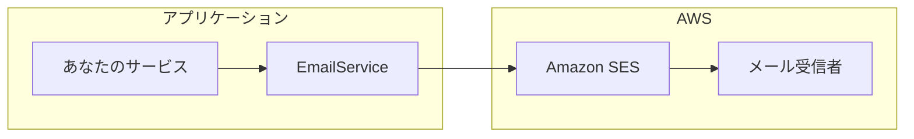

# NotificationModule

## 概要

`NotificationModule`はAmazon SESを使用したメール通知機能を提供します。最小限の設定で簡単に統合できるように設計されています。



## 機能

- AWS SESの自動統合
- HTMLメールサポート
- ファイル添付
- CC/BCC受信者
- グローバルスコープ登録

## 設定

以下の環境変数を設定してください:

```bash
# Required
SES_FROM_EMAIL=noreply@your-domain.com

# Optional (defaults to AWS SDK configuration)
SES_ENDPOINT=
SES_REGION=ap-northeast-1
```

## モジュール登録

`NotificationModule`はグローバルに登録されるため、`EmailService`はアプリケーション内のどこからでも注入可能です:

```typescript
import { Module } from '@nestjs/common';
import { NotificationModule } from '@mbc-cqrs-serverless/core';

@Module({
  imports: [NotificationModule],
})
export class AppModule {}
```

## 基本的な使い方

任意のサービスで`EmailService`を注入して使用します:

```typescript
import { Injectable } from '@nestjs/common';
import { EmailService } from '@mbc-cqrs-serverless/core';

@Injectable()
export class OrderService {
  constructor(private readonly emailService: EmailService) {}

  async sendOrderConfirmation(order: Order): Promise<void> {
    await this.emailService.sendEmail({
      toAddrs: [order.customerEmail],
      subject: `Order Confirmation - ${order.code}`,
      body: `
        <h1>Thank you for your order!</h1>
        <p>Order Number: ${order.code}</p>
        <p>Total: ${order.total}</p>
      `,
    });
  }
}
```

## AWS SESのセットアップ

### 本番環境のセットアップ

1. **ドメインを検証する**: ドメイン検証用のDNSレコードを追加
2. **本番アクセスを申請する**: サンドボックスモードから移行
3. **IAM権限を設定する**: LambdaにSES送信権限があることを確認

### IAMポリシー

メール送信に必要なIAM権限:

```json
{
  "Version": "2012-10-17",
  "Statement": [
    {
      "Effect": "Allow",
      "Action": [
        "ses:SendEmail",
        "ses:SendRawEmail"
      ],
      "Resource": "*"
    }
  ]
}
```

### ローカル開発

ローカル開発では、LocalStackまたはメールテストサービスを使用できます:

```bash
# Using LocalStack
SES_ENDPOINT=http://localhost:4566
SES_REGION=ap-northeast-1
```

## 一般的なパターン

### メールテンプレート

再利用可能なメールテンプレートを作成:

```typescript
@Injectable()
export class EmailTemplateService {
  private templates = {
    welcome: (name: string) => ({
      subject: 'Welcome to Our Platform',
      body: `<h1>Welcome, ${name}!</h1><p>We're glad to have you.</p>`,
    }),
    passwordReset: (resetLink: string) => ({
      subject: 'Password Reset Request',
      body: `<p>Click <a href="${resetLink}">here</a> to reset your password.</p>`,
    }),
  };

  getTemplate(name: keyof typeof this.templates, ...args: any[]) {
    return this.templates[name](...args);
  }
}
```

### エラーハンドリング

```typescript
async sendNotification(email: string, content: EmailContent): Promise<boolean> {
  try {
    await this.emailService.sendEmail({
      toAddrs: [email],
      subject: content.subject,
      body: content.body,
    });
    return true;
  } catch (error) {
    console.error('Failed to send email:', error);
    // Optionally: queue for retry or log to monitoring
    return false;
  }
}
```

## 関連ドキュメント

- [EmailService API](./email-service.md): すべてのオプションを含む詳細なAPIリファレンス
- [Environment Variables](./environment-variables.md): 設定オプション
