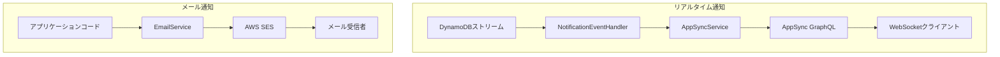

# 通知モジュール

NotificationModuleは、MBC CQRS Serverlessフレームワークで2種類の通知機能を提供します：

- WebSocketベースの更新用の**リアルタイム通知**（AWS AppSync経由）
- メール送信用の**メール通知**（AWS SES経由）

## アーキテクチャ



## リアルタイム通知

### 概要

DynamoDBでデータ変更が発生すると、リアルタイム通知が自動的に送信されます。システムはAWS AppSyncを使用して、購読中のWebSocketクライアントに通知を配信します。

### INotificationインターフェース

通知ペイロードの構造：

```ts
interface INotification {
  id: string;        // Unique notification ID (一意の通知ID)
  table: string;     // Source DynamoDB table name (ソースDynamoDBテーブル名)
  pk: string;        // Partition key of the changed item (変更されたアイテムのパーティションキー)
  sk: string;        // Sort key of the changed item (変更されたアイテムのソートキー)
  tenantCode: string; // Tenant code for filtering notifications (通知フィルタリング用のテナントコード)
  action: string;    // Type of change: 'INSERT', 'MODIFY', 'REMOVE', or custom actions (変更タイプ)
  content?: object;  // Optional payload with changed data (変更データを含むオプションのペイロード)
}
```

### AppSyncService

`AppSyncService`はリアルタイム通知をAppSyncに送信し、WebSocket経由で配信します。

#### 設定

以下の環境変数を設定してください：

```bash
APPSYNC_ENDPOINT=https://xxxxx.appsync-api.ap-northeast-1.amazonaws.com/graphql
APPSYNC_API_KEY=da2-xxxxxxxxxx  # Optional: Use API key auth instead of IAM (オプション: IAMの代わりにAPIキー認証を使用)
```

#### 使用方法

```ts
import { AppSyncService, INotification } from "@mbc-cqrs-serverless/core";

@Injectable()
export class MyService {
  constructor(private readonly appSyncService: AppSyncService) {}

  async notifyClients() {
    const notification: INotification = {
      id: "notification-123",
      table: "my-table",
      pk: "ITEM#tenant1",
      sk: "ITEM#item001",
      tenantCode: "tenant1",
      action: "MODIFY",
      content: { status: "updated" },
    };

    await this.appSyncService.sendMessage(notification);
  }
}
```

#### 認証

AppSyncServiceは2つの認証方法をサポートしています：

1. **APIキー**: `APPSYNC_API_KEY`環境変数を設定
2. **IAM署名V4**: APIキーが設定されていない場合に自動的に使用

### 自動通知

フレームワークはデータ変更時に以下の流れで自動的に通知を送信します：

1. DynamoDBストリームが`NotificationEventHandler`をトリガー
2. ハンドラーが変更情報を抽出し`INotification`を作成
3. `AppSyncService.sendMessage()`がAppSyncに配信
4. 接続されたクライアントがWebSocket購読経由で更新を受信

## メール通知

### EmailService

`EmailService`はAWS SESを使用してメールを送信します。

#### 設定

```bash
SES_FROM_EMAIL=noreply@your-domain.com  # Required: Default sender address (必須: デフォルト送信者アドレス)
SES_REGION=ap-northeast-1                # Optional: SES region (オプション: SESリージョン)
SES_ENDPOINT=                            # Optional: Custom endpoint for LocalStack (オプション: LocalStack用カスタムエンドポイント)
```

#### 基本的な使い方

```ts
import { EmailService, EmailNotification } from "@mbc-cqrs-serverless/core";

@Injectable()
export class MyService {
  constructor(private readonly emailService: EmailService) {}

  async sendWelcomeEmail(userEmail: string) {
    const email: EmailNotification = {
      toAddrs: [userEmail],
      subject: "Welcome to Our Service",
      body: "<h1>Welcome!</h1><p>Thank you for signing up.</p>",
    };

    await this.emailService.send(email);
  }
}
```

#### 添付ファイル付きメール

```ts
import { EmailNotification, Attachment } from "@mbc-cqrs-serverless/core";
import * as fs from "fs";

const pdfBuffer = fs.readFileSync("report.pdf");

const email: EmailNotification = {
  toAddrs: ["user@example.com"],
  subject: "Monthly Report",
  body: "<p>Please find attached your monthly report.</p>",
  attachments: [
    {
      filename: "report.pdf",
      content: pdfBuffer,
      contentType: "application/pdf",
    },
  ],
};

await this.emailService.send(email);
```

#### EmailNotificationインターフェース

| プロパティ | 型 | 必須 | 説明 |
|--------------|----------|--------------|-----------------|
| `fromAddr` | `string` | いいえ | 送信者メール（設定されていない場合はSES_FROM_EMAILを使用） |
| `toAddrs` | `string[]` | はい | 受信者メールアドレスのリスト |
| `ccAddrs` | `string[]` | いいえ | CC受信者 |
| `bccAddrs` | `string[]` | いいえ | BCC受信者 |
| `subject` | `string` | はい | メール件名 |
| `body` | `string` | はい | HTMLとしてのメール本文 |
| `replyToAddrs` | `string[]` | いいえ | 返信先アドレス |
| `attachments` | `Attachment[]` | いいえ | 添付ファイル |

#### Attachmentインターフェース

| プロパティ | 型 | 必須 | 説明 |
|--------------|----------|--------------|-----------------|
| `filename` | `string` | はい | 受信者に表示されるファイル名 |
| `content` | `Buffer` | はい | Buffer形式のファイルコンテンツ |
| `contentType` | `string` | いいえ | MIMEタイプ（例：'application/pdf'） |

## 関連情報

- [イベントハンドリングパターン](./event-handling-patterns) - 通知がイベントとどのように統合されるか
- [環境変数](./environment-variables) - 設定リファレンス
