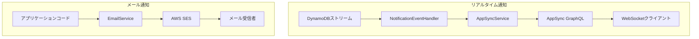

# 通知モジュール

NotificationModuleは、MBC CQRS Serverlessフレームワークで2種類の通知機能を提供します：

- WebSocketベースの更新用の**リアルタイム通知**（AWS AppSync経由）
- メール送信用の**メール通知**（AWS SES経由）

## アーキテクチャ



## リアルタイム通知

### 概要

DynamoDBでデータ変更が発生すると、リアルタイム通知が自動的に送信されます。システムはAWS AppSyncを使用して、購読中のWebSocketクライアントに通知を配信します。

### INotificationインターフェース

通知ペイロードの構造：

```ts
interface INotification {
  id: string;        // Unique notification ID (一意の通知ID)
  table: string;     // Source DynamoDB table name (ソースDynamoDBテーブル名)
  pk: string;        // Partition key of the changed item (変更されたアイテムのパーティションキー)
  sk: string;        // Sort key of the changed item (変更されたアイテムのソートキー)
  tenantCode: string; // Tenant code for filtering notifications (通知フィルタリング用のテナントコード)
  action: string;    // Type of change: 'INSERT', 'MODIFY', 'REMOVE' (変更タイプ)
  content?: object;  // Optional payload with changed data (変更データを含むオプションのペイロード)
}
```

### AppSyncService

`AppSyncService`はリアルタイム通知をAppSyncに送信し、WebSocket経由で配信します。

#### メソッド: `sendMessage(msg: INotification): Promise<any>`

GraphQLミューテーション経由でAppSyncに通知を送信します。通知はすべての購読中のWebSocketクライアントに配信されます。

```ts
await this.appSyncService.sendMessage({
  id: "unique-id",
  table: "my-table",
  pk: "ITEM#tenant1",
  sk: "ITEM#001",
  tenantCode: "tenant1",
  action: "MODIFY",
  content: { status: "updated" },
});
```

#### 設定

以下の環境変数を設定してください：

```bash
APPSYNC_ENDPOINT=https://xxxxx.appsync-api.ap-northeast-1.amazonaws.com/graphql
APPSYNC_API_KEY=da2-xxxxxxxxxx  # Optional: Use API key auth instead of IAM (オプション: IAMの代わりにAPIキー認証を使用)
```

#### 使用方法

```ts
import { AppSyncService, INotification } from "@mbc-cqrs-serverless/core";

@Injectable()
export class MyService {
  constructor(private readonly appSyncService: AppSyncService) {}

  async notifyClients() {
    const notification: INotification = {
      id: "notification-123",
      table: "my-table",
      pk: "ITEM#tenant1",
      sk: "ITEM#item001",
      tenantCode: "tenant1",
      action: "MODIFY",
      content: { status: "updated" },
    };

    await this.appSyncService.sendMessage(notification);
  }
}
```

#### 認証

AppSyncServiceは2つの認証方法をサポートしています：

1. **APIキー**: `APPSYNC_API_KEY`環境変数を設定
2. **IAM署名V4**: APIキーが設定されていない場合に自動的に使用

### 自動通知

フレームワークはデータ変更時に以下の流れで自動的に通知を送信します：

1. DynamoDBストリームが`NotificationEventHandler`をトリガー
2. ハンドラーが変更情報を抽出し`INotification`を作成
3. `AppSyncService.sendMessage()`がAppSyncに配信
4. 接続されたクライアントがWebSocket購読経由で更新を受信

### NotificationEvent

`NotificationEvent`クラスはSQSからの通知イベントを表します。`IEvent`を実装し、通知データを含むSQSレコードをラップします。

```ts
import { NotificationEvent } from "@mbc-cqrs-serverless/core";

class NotificationEvent implements IEvent, SQSRecord {
  source: string;
  messageId: string;
  receiptHandle: string;
  body: string;              // JSON string containing INotification data (INotificationデータを含むJSON文字列)
  attributes: SQSRecordAttributes;
  messageAttributes: SQSMessageAttributes;
  md5OfBody: string;
  eventSource: string;
  eventSourceARN: string;
  awsRegion: string;

  // Creates a NotificationEvent from an SQS record (SQSレコードからNotificationEventを作成)
  fromSqsRecord(record: SQSRecord): NotificationEvent;
}
```

### NotificationEventHandler

`NotificationEventHandler`は`NotificationEvent`を処理してAppSyncに通知を送信する組み込みイベントハンドラーです。通知モジュールを使用する際に自動的に登録されます。

```ts
import { NotificationEventHandler, NotificationEvent } from "@mbc-cqrs-serverless/core";

@EventHandler(NotificationEvent)
export class NotificationEventHandler implements IEventHandler<NotificationEvent> {
  async execute(event: NotificationEvent): Promise<any> {
    // Parses the notification from event body (イベント本文から通知をパース)
    // Sends to AppSync via sendMessage() (sendMessage()経由でAppSyncに送信)
  }
}
```

通常、このハンドラーと直接やり取りする必要はありません - SQSキューに通知が発行されると自動的に動作します。

## メール通知

### EmailService

`EmailService`はAWS SESを使用してメールを送信します。

#### 設定

```bash
SES_FROM_EMAIL=noreply@your-domain.com  # Required: Default sender address (必須: デフォルト送信者アドレス)
SES_REGION=ap-northeast-1                # Optional: SES region (オプション: SESリージョン)
SES_ENDPOINT=                            # Optional: Custom endpoint for LocalStack (オプション: LocalStack用カスタムエンドポイント)
```

#### 基本的な使い方

```ts
import { EmailService, EmailNotification } from "@mbc-cqrs-serverless/core";

@Injectable()
export class MyService {
  constructor(private readonly emailService: EmailService) {}

  async sendWelcomeEmail(userEmail: string) {
    const email: EmailNotification = {
      toAddrs: [userEmail],
      subject: "Welcome to Our Service",
      body: "<h1>Welcome!</h1><p>Thank you for signing up.</p>",
    };

    await this.emailService.sendEmail(email);
  }
}
```

#### 添付ファイル付きメール

```ts
import { EmailNotification, Attachment } from "@mbc-cqrs-serverless/core";
import * as fs from "fs";

const pdfBuffer = fs.readFileSync("report.pdf");

const email: EmailNotification = {
  toAddrs: ["user@example.com"],
  subject: "Monthly Report",
  body: "<p>Please find attached your monthly report.</p>",
  attachments: [
    {
      filename: "report.pdf",
      content: pdfBuffer,
      contentType: "application/pdf",
    },
  ],
};

await this.emailService.sendEmail(email);
```

### インラインテンプレートメール {#inline-template-emails}

`sendInlineTemplateEmail()`メソッドを使用すると、SESに事前登録されたテンプレートを必要とせずに、動的データ置換を使用したテンプレートメールを送信できます。

:::info バージョン情報
インラインテンプレートメール（`sendInlineTemplateEmail()`）は[バージョン1.0.23](/docs/changelog#v1023)で追加されました。
:::

#### 基本的な使い方

```ts
import { EmailService, TemplatedEmailNotification } from "@mbc-cqrs-serverless/core";

@Injectable()
export class MyService {
  constructor(private readonly emailService: EmailService) {}

  async sendWelcomeEmail(user: { name: string; email: string }) {
    const notification: TemplatedEmailNotification = {
      toAddrs: [user.email],
      template: {
        subject: "Welcome, {{name}}!",
        html: "<h1>Hello {{name}}</h1><p>Welcome to our service!</p>",
        text: "Hello {{name}}, Welcome to our service!", // Optional plain text version (オプションのプレーンテキスト版)
      },
      data: {
        name: user.name,
      },
    };

    await this.emailService.sendInlineTemplateEmail(notification);
  }
}
```

#### テンプレート構文

テンプレートは`{{variableName}}`プレースホルダーを使用し、`data`オブジェクトの値で置換されます：

```ts
const notification: TemplatedEmailNotification = {
  toAddrs: ["user@example.com"],
  template: {
    subject: "Order {{orderId}} Confirmation",
    html: `
      <h1>Thank you, {{customerName}}!</h1>
      <p>Your order #{{orderId}} has been confirmed.</p>
      <p>Total: {{currency}}{{totalAmount}}</p>
    `,
  },
  data: {
    customerName: "John Doe",
    orderId: "12345",
    currency: "$",
    totalAmount: "99.99",
  },
};
```

#### 高度なテンプレート機能 {#advanced-template-features}

:::info バージョン情報
ネストプロパティアクセスとUnicode/日本語キーのサポートは[バージョン1.0.25](/docs/changelog#v1025)で追加されました。
:::

##### ネストプロパティアクセス

ドット記法を使用してネストされたオブジェクトプロパティにアクセスできます：

```ts
const notification: TemplatedEmailNotification = {
  toAddrs: ["user@example.com"],
  template: {
    subject: "Welcome {{user.profile.firstName}}!",
    html: `
      <p>Hello {{user.profile.firstName}} {{user.profile.lastName}},</p>
      <p>Your verification code is: {{auth.otp}}</p>
    `,
  },
  data: {
    user: {
      profile: {
        firstName: "John",
        lastName: "Doe",
      },
    },
    auth: {
      otp: "123456",
    },
  },
};
```

##### Unicode/日本語キーのサポート

テンプレート変数は日本語キーを含むUnicode文字をサポートします：

```ts
const notification: TemplatedEmailNotification = {
  toAddrs: ["user@example.com"],
  template: {
    subject: "{{注文.確認番号}} - Order Confirmation",
    html: `
      <p>{{顧客.名前}} 様</p>
      <p>ご注文番号: {{注文.確認番号}}</p>
      <p>商品: {{注文.詳細.品名}}</p>
    `,
  },
  data: {
    "顧客": {
      "名前": "山田 太郎",
    },
    "注文": {
      "確認番号": "ORD-2024-001",
      "詳細": {
        "品名": "ワイヤレスイヤホン",
      },
    },
  },
};
```

##### プレースホルダー内の空白

プレースホルダー内の空白は自動的にトリミングされるため、`{{ name }}`と`{{name}}`は同等です：

```ts
// Both of these work identically (これらは同じように動作します)
template: {
  subject: "Hello {{ name }}!",  // Whitespace is trimmed (空白はトリミングされます)
  html: "<p>Hello {{name}}!</p>", // No whitespace (空白なし)
}
```

##### 存在しない変数

データオブジェクトに変数が見つからない場合、プレースホルダーは出力に保持されます。これは開発中に欠落データを特定するのに役立ちます：

```ts
// If 'missingKey' is not in data, output will contain '{{missingKey}}' ('missingKey'がデータにない場合、出力には'{{missingKey}}'が含まれます)
template: {
  html: "<p>Value: {{missingKey}}</p>",
}
```

##### 制限事項

セキュリティ上の理由から、テンプレート変数名には以下の制限が適用されます：

| 制限 | 値 | 理由 |
|----------------|-----------|------------|
| 変数名の最大長 | 255文字 | ReDoS（正規表現サービス拒否）攻撃を防止 |

255文字を超える変数名は置換されず、出力にそのままプレースホルダーとして残ります。

#### TemplatedEmailNotificationインターフェース

| プロパティ | 型 | 必須 | 説明 |
|--------------|----------|--------------|-----------------|
| `fromAddr` | `string` | いいえ | 送信者メール（設定されていない場合はSES_FROM_EMAILを使用） |
| `toAddrs` | `string[]` | はい | 受信者メールアドレスのリスト |
| `ccAddrs` | `string[]` | いいえ | CC受信者 |
| `bccAddrs` | `string[]` | いいえ | BCC受信者 |
| `replyToAddrs` | `string[]` | いいえ | 返信先アドレス |
| `template` | `InlineTemplateContent` | はい | 件名、HTML、オプションのテキストを含むテンプレート |
| `data` | `Record<string, any>` | はい | テンプレート変数置換用のデータオブジェクト |
| `configurationSetName` | `string` | いいえ | トラッキング用のSES設定セット名 |

#### InlineTemplateContentインターフェース

| プロパティ | 型 | 必須 | 説明 |
|--------------|----------|--------------|-----------------|
| `subject` | `string` | はい | メール件名（テンプレート変数をサポート） |
| `html` | `string` | はい | HTML本文（テンプレート変数をサポート） |
| `text` | `string` | いいえ | プレーンテキスト本文（テンプレート変数をサポート） |

#### ローカル開発

SESアクセスなしでローカルで実行する場合、メソッドは自動的に手動テンプレートコンパイルにフォールバックし、開発中にメールフローをテストできます。

#### EmailNotificationインターフェース

| プロパティ | 型 | 必須 | 説明 |
|--------------|----------|--------------|-----------------|
| `fromAddr` | `string` | いいえ | 送信者メール（設定されていない場合はSES_FROM_EMAILを使用） |
| `toAddrs` | `string[]` | はい | 受信者メールアドレスのリスト |
| `ccAddrs` | `string[]` | いいえ | CC受信者 |
| `bccAddrs` | `string[]` | いいえ | BCC受信者 |
| `subject` | `string` | はい | メール件名 |
| `body` | `string` | はい | HTMLとしてのメール本文 |
| `replyToAddrs` | `string[]` | いいえ | 返信先アドレス |
| `attachments` | `Attachment[]` | いいえ | 添付ファイル |
| `emailTags` | `EmailTag[]` | いいえ | メール分類用のタグ（SES Email Tags） |

### メールタグ {#email-tags}

メールタグを使用すると、AWS SES経由で送信されたメールを分類および追跡できます。タグはSES分析、CloudWatch、およびイベント宛先でメールをフィルタリングするのに役立ちます。

:::info バージョン情報
EmailTagsサポートは[バージョン1.1.0](/docs/changelog#v110)で追加されました。
:::

#### 基本的な使い方

```ts
import { EmailService, EmailNotification, EmailTag } from "@mbc-cqrs-serverless/core";

const email: EmailNotification = {
  toAddrs: ["user@example.com"],
  subject: "Order Confirmation",
  body: "<p>Your order has been confirmed.</p>",
  emailTags: [
    { name: "category", value: "order-confirmation" },
    { name: "tenant", value: "tenant-123" },
    { name: "environment", value: "production" },
  ],
};

await this.emailService.sendEmail(email);
```

#### EmailTagインターフェース

| プロパティ | 型 | 必須 | 説明 |
|--------------|----------|--------------|-----------------|
| `name` | `string` | はい | タグ名（例: 'category', 'campaign'） |
| `value` | `string` | はい | 分類用のタグ値 |

#### ユースケース

- **キャンペーントラッキング**: マーケティングキャンペーンごとにメールにタグ付けしてパフォーマンスを分析
- **テナント分離**: マルチテナントメール分析用にテナントコードでタグ付け
- **メールタイプの分類**: トランザクションメールとプロモーションメールを区別
- **環境タグ付け**: 開発、ステージング、本番環境間でメールを追跡

#### Attachmentインターフェース

| プロパティ | 型 | 必須 | 説明 |
|--------------|----------|--------------|-----------------|
| `filename` | `string` | はい | 受信者に表示されるファイル名 |
| `content` | `Buffer` | はい | Buffer形式のファイルコンテンツ |
| `contentType` | `string` | いいえ | MIMEタイプ（例：'application/pdf'） |

## 関連情報

- [イベントハンドリングパターン](./event-handling-patterns) - 通知がイベントとどのように統合されるか
- [環境変数](./environment-variables) - 設定リファレンス
