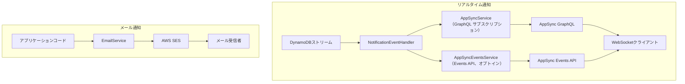

# 通知モジュール

NotificationModuleは、MBC CQRS Serverlessフレームワークで2種類の通知機能を提供します：

- WebSocketベースの更新用の**リアルタイム通知**（AWS AppSync経由）
- メール送信用の**メール通知**（AWS SES経由）

## アーキテクチャ {#architecture}


```mermaid
graph TB
    subgraph "リアルタイム通知"
        A["DynamoDBストリーム"] --> B["NotificationEventHandler"]
        B --> C["AppSyncService\n（GraphQL サブスクリプション）"]
        B --> C2["AppSyncEventsService\n（Events API、オプトイン）"]
        C --> D["AppSync GraphQL"]
        C2 --> D2["AppSync Events API"]
        D --> E["WebSocketクライアント"]
        D2 --> E
    end

    subgraph "メール通知"
        F["アプリケーションコード"] --> G["EmailService"]
        G --> H["AWS SES"]
        H --> I["メール受信者"]
    end
```

## リアルタイム通知 {#real-time-notifications}

### 概要

DynamoDBでデータ変更が発生すると、リアルタイム通知が自動的に送信されます。システムはAWS AppSyncを使用して、購読中のWebSocketクライアントに通知を配信します。

### INotificationインターフェース

通知ペイロードの構造：

```ts
interface INotification {
  id: string;        // Unique notification ID (一意の通知ID)
  table: string;     // Source DynamoDB table name (ソースDynamoDBテーブル名)
  pk: string;        // 変更されたアイテムのパーティションキー
  sk: string;        // 変更されたアイテムのソートキー
  tenantCode: string; // Tenant code for filtering notifications (通知フィルタリング用のテナントコード)
  action: string;    // Type of change: 'INSERT', 'MODIFY', 'REMOVE' (変更タイプ)
  content?: object;  // Optional payload with changed data (変更データを含むオプションのペイロード)
}
```

### AppSyncService

`AppSyncService`はリアルタイム通知をAppSyncに送信し、WebSocket経由で配信します。

#### メソッド: `sendMessage(msg: INotification): Promise<void>`

GraphQLミューテーション経由でAppSyncに通知を送信します。通知はすべての購読中のWebSocketクライアントに配信されます。

:::info バージョン情報
`sendMessage` の戻り値型は[バージョン1.3.0](/docs/changelog#v130)で `Promise<any>` から `Promise<void>` に変更されました。テストでこのメソッドを `mockResolvedValue(null)` でモックしている場合は `mockResolvedValue(undefined)` に更新してください。詳細は[v1.3.0移行ガイド](/docs/migration/v1.3.0)を参照してください。
:::

```ts
await this.appSyncService.sendMessage({
  id: "unique-id",
  table: "my-table",
  pk: "ITEM#tenant1",
  sk: "ITEM#001",
  tenantCode: "tenant1",
  action: "MODIFY",
  content: { status: "updated" },
});
```

#### 設定

以下の環境変数を設定してください：

```bash
APPSYNC_ENDPOINT=https://xxxxx.appsync-api.ap-northeast-1.amazonaws.com/graphql
APPSYNC_API_KEY=da2-xxxxxxxxxx  # Optional: Use API key auth instead of IAM (オプション: IAMの代わりにAPIキー認証を使用)
```

#### 使用方法

```ts
import { Injectable } from "@nestjs/common";
import { AppSyncService, INotification } from "@mbc-cqrs-serverless/core";

@Injectable()
export class MyService {
  constructor(private readonly appSyncService: AppSyncService) {}

  async notifyClients() {
    const notification: INotification = {
      id: "notification-123",
      table: "my-table",
      pk: "ITEM#tenant1",
      sk: "ITEM#item001",
      tenantCode: "tenant1",
      action: "MODIFY",
      content: { status: "updated" },
    };

    await this.appSyncService.sendMessage(notification);
  }
}
```

#### 認証

AppSyncServiceは2つの認証方法をサポートしています：

1. **API キー**: `APPSYNC_API_KEY`環境変数を設定
2. **IAM署名V4**: APIキーが設定されていない場合に自動的に使用

### 自動通知

フレームワークはデータ変更時に以下の流れで自動的に通知を送信します：

1. DynamoDBストリームが`NotificationEventHandler`をトリガー
2. ハンドラーが変更情報を抽出し`INotification`を作成
3. `AppSyncService.sendMessage()`がAppSyncに配信
4. 接続されたクライアントがWebSocket購読経由で更新を受信

### NotificationEvent

`NotificationEvent`クラスはSQSからの通知イベントを表します。`IEvent`を実装し、通知データを含むSQSレコードをラップします。

```ts
import { NotificationEvent } from "@mbc-cqrs-serverless/core";

class NotificationEvent implements IEvent, SQSRecord {
  source: string;
  messageId: string;
  receiptHandle: string;
  body: string;              // JSON string containing INotification data (INotificationデータを含むJSON文字列)
  attributes: SQSRecordAttributes;
  messageAttributes: SQSMessageAttributes;
  md5OfBody: string;
  eventSource: string;
  eventSourceARN: string;
  awsRegion: string;

  // Creates a NotificationEvent from an SQS record (SQSレコードからNotificationEventを作成)
  fromSqsRecord(record: SQSRecord): NotificationEvent;
}
```

### NotificationEventHandler

`NotificationEventHandler`は`NotificationEvent`を処理してAppSyncに通知を送信する組み込みイベントハンドラーです。通知モジュールを使用する際に自動的に登録されます。

```ts
import { EventHandler, IEventHandler, NotificationEvent } from "@mbc-cqrs-serverless/core";

@EventHandler(NotificationEvent)
export class NotificationEventHandler implements IEventHandler<NotificationEvent> {
  async execute(event: NotificationEvent): Promise<void> {
    // Parses the notification from event body (イベント本文から通知をパース)
    // Sends to AppSync via sendMessage() (sendMessage()経由でAppSyncに送信)
  }
}
```

通常、このハンドラーと直接やり取りする必要はありません - SQSキューに通知が発行されると自動的に動作します。

## AppSync Events API（オプトイン） {#appsync-events-service}

:::info バージョン情報
`AppSyncEventsService` とデュアルパブリッシュサポートは [バージョン 1.3.0](/docs/changelog#v130) で追加されました。
:::

### 概要

`AppSyncEventsService` は **AWS AppSync Events API**（スキーマ不要の HTTP pub/sub サービス）をベースにした、代替（または補完）のリアルタイムトランスポートを提供します。GraphQL サブスクリプションとは異なり、GraphQL スキーマが不要で、クライアントはワイルドカードチャンネルパスでサブスクライブします。

`NOTIFICATION_TRANSPORTS=appsync-event` を設定してオプトインします。`NOTIFICATION_TRANSPORTS=appsync-graphql,appsync-event` と両方のエンドポイントを設定すると、フレームワークは両方のトランスポートに**デュアルパブリッシュ**し、ダウンタイムなしのマイグレーションを可能にします。

### メソッド: `sendMessage(msg: INotification): Promise<void>`

AppSync Events チャンネルに通知をパブリッシュします。通知はサブスクライブ中のすべてのクライアントに配信されます。

```ts
await this.appSyncEventsService.sendMessage({
  id: "command-123",
  table: "orders-table",
  pk: "ORDER#tenant1",
  sk: "ORDER#001",
  tenantCode: "tenant1",
  action: "MODIFY",
  content: { status: "confirmed" },
});
```

### 使用方法

```ts
import { Injectable } from "@nestjs/common";
import { AppSyncEventsService, INotification } from "@mbc-cqrs-serverless/core";

@Injectable()
export class MyService {
  constructor(private readonly appSyncEventsService: AppSyncEventsService) {}

  async notifyClients() {
    const notification: INotification = {
      id: "notification-456",
      table: "my-table",
      pk: "ITEM#tenant1",
      sk: "ITEM#item001",
      tenantCode: "tenant1",
      action: "MODIFY",
      content: { status: "updated" },
    };

    await this.appSyncEventsService.sendMessage(notification);
  }
}
```

### チャンネル構造

すべての通知は最も具体的な単一チャンネルにパブリッシュされます。クライアントは AppSync Events のワイルドカード（`/*`）を使って必要な粒度でサブスクライブします：

```
/{namespace}/{tenantCode}/{action}/{sanitizedId}
  seg 1        seg 2       seg 3    seg 4
```

| クライアントの目的 | サブスクライブ先 |
|-----------------|-----------------|
| テナントの全イベント | `/{namespace}/{tenantCode}/*` |
| アクションでフィルタリング | `/{namespace}/{tenantCode}/{action}/*` |
| 特定コマンドを追跡 | `/{namespace}/{tenantCode}/{action}/{sanitizedId}` |

### 設定

```bash
# Events API トランスポートを有効にします（Events API のみ）
NOTIFICATION_TRANSPORTS=appsync-event
APPSYNC_EVENTS_ENDPOINT=https://xxxx.appsync-api.ap-northeast-1.amazonaws.com/event
# オプション：AppSync Event API に事前作成されたネームスペースと一致する必要があります
APPSYNC_EVENTS_NAMESPACE=default
```

[AppSync Events 環境変数](/docs/environment-variables#appsync-events-env) を参照してください。

### GraphQL サブスクリプションからの移行

デュアルパブリッシュモードを使用して、ダウンタイムなしでクライアントを段階的に移行します：

**フェーズ 1 — デュアルパブリッシュ（両方のトランスポートが有効）：**
```bash
NOTIFICATION_TRANSPORTS=appsync-graphql,appsync-event
APPSYNC_EVENTS_ENDPOINT=https://xxxx.appsync-api.ap-northeast-1.amazonaws.com/event
APPSYNC_EVENTS_NAMESPACE=default
APPSYNC_ENDPOINT=https://xxxx.appsync-api.ap-northeast-1.amazonaws.com/graphql  # 設定済みのまま
```

**フェーズ 2 — Events API のみ（全クライアントの移行完了後）：**
```bash
NOTIFICATION_TRANSPORTS=appsync-event
APPSYNC_EVENTS_ENDPOINT=https://xxxx.appsync-api.ap-northeast-1.amazonaws.com/event
APPSYNC_EVENTS_NAMESPACE=default
# APPSYNC_ENDPOINT を削除
```

### CDK インフラストラクチャ

`EventApi` と `ChannelNamespace` を自動的にプロビジョニングするには、`Config` に `appsyncEvents` を追加します：

```typescript
// infra/config/config.ts
export const config: Config = {
  // ...
  appsyncEvents: {
    enabled: true,
    namespace: 'default',       // optional, defaults to 'default' (オプション、デフォルトは 'default')
    apiKeyExpireDays: 365,      // optional, defaults to 365 (オプション、デフォルトは 365)
  },
}
```

CDK スタックは `AppSyncEventsHttpEndpoint` と `AppSyncEventsNamespace` を出力し、Lambda と ECS に `NOTIFICATION_TRANSPORTS`、`APPSYNC_EVENTS_ENDPOINT`、`APPSYNC_EVENTS_NAMESPACE` を自動で注入します。

### 認証

`AppSyncEventsService` はパブリッシュに2種類の認証方式をサポートします：

1. **IAM SigV4（Lambda/ECS 推奨）**: パブリッシュ時に自動で使用されます。CDK スタックの `grantPublish()` により Lambda と ECS タスクロールに `appsync:EventPublish` 権限が付与されます。
2. **API キー**: ブラウザクライアントのサブスクライブに使用します。クライアント側（Amplify の `apiKey` 設定など）で設定します。サーバー側では不要です。

### クライアントサイドサブスクリプション（ブラウザ） {#client-side-subscription}

ブラウザクライアントは AWS Amplify v6 の `events` API を使って AppSync Events チャンネルをサブスクライブします。チャンネルパスで受信する通知を決定します — `/*` ワイルドカードで任意の粒度でサブスクライブできます。

#### AWS Amplify v6 でのセットアップ

```bash
npm install aws-amplify
```

```typescript
import { Amplify } from 'aws-amplify';
import { events } from 'aws-amplify/data';

// アプリ起動時に一度 Amplify を設定します（例: _app.tsx または main.ts）
Amplify.configure({
  API: {
    Events: {
      endpoint: 'https://YOUR_APPSYNC_EVENTS_ENDPOINT/event',
      region: 'ap-northeast-1',
      defaultAuthMode: 'apiKey',
      apiKey: 'YOUR_API_KEY',  // CDK から AppSyncEventsApiKey として出力されます
    },
  },
});
```

#### 通知のサブスクライブ

```typescript
interface INotification {
  id: string;
  table: string;       // 例: "dev-myapp-order-data"
  pk: string;          // 変更されたアイテムのパーティションキー
  sk: string;          // 変更されたアイテムのソートキー
  tenantCode: string;
  action: string;      // INSERT | MODIFY | REMOVE
  content?: object;    // 変更内容のオプショナルペイロード
}

// テナントの全通知をサブスクライブ
const channel = await events.connect('/default/tenant001/*');

const subscription = channel.subscribe({
  next: ({ data }: { data: INotification }) => {
    console.log(`${data.action} on ${data.table}: pk=${data.pk}`);
    // UI を更新するかローカルステートを更新
  },
  error: (err) => {
    console.error('Subscription error:', err);
  },
});

// コンポーネントのアンマウント時にサブスクライブ解除
subscription.unsubscribe();
```

#### React フックの例

```typescript
import { useEffect, useRef } from 'react';
import { events } from 'aws-amplify/data';

function useOrderNotifications(tenantCode: string, orderId: string) {
  const subscriptionRef = useRef<{ unsubscribe(): void } | null>(null);

  useEffect(() => {
    // 特定の注文をサブスクライブ
    const channel = `/default/${tenantCode}/MODIFY/${orderId.replace(/#/g, '_')}`;

    events.connect(channel).then((conn) => {
      subscriptionRef.current = conn.subscribe({
        next: ({ data }) => {
          console.log('Order updated:', data);
          // 再フェッチをトリガーするかローカルステートを更新
        },
        error: (err) => console.error(err),
      });
    });

    return () => {
      subscriptionRef.current?.unsubscribe();
    };
  }, [tenantCode, orderId]);
}
```

:::tip チャンネルパスのフォーマット
チャンネルパスのサニタイズされたアイテム ID は `#` を `_` に置換します。例えば `ORDER#ORD001` は `ORDER_ORD001` になります。クライアントサイドでは `sk.replace(/#/g, '_')` を使って正確なチャンネルパスを算出してください。
:::

## カスタム通知トランスポート（オプション） {#custom-transports}

:::info バージョン情報
カスタムトランスポート用の `@NotificationTransport` デコレーターは[バージョン 1.3.0](/docs/changelog#v130)で追加されました。
:::

フレームワークのコードを変更せずに、任意の外部システム（Slack、PagerDuty、カスタム WebSocket サーバーなど）へ配信するカスタム通知トランスポートを登録できます。

### カスタムトランスポートの実装

```typescript
import {
  INotificationTransport,
  INotification,
  NotificationTransport,
} from '@mbc-cqrs-serverless/core';

// @Injectable() を追加しないこと — @NotificationTransport() が既にシングルトンプロバイダーとして登録します
@NotificationTransport()
export class SlackNotificationTransport implements INotificationTransport {
  async sendMessage(msg: INotification): Promise<void> {
    // Slack またはカスタムエンドポイントへ通知を送信
    await fetch(process.env.SLACK_WEBHOOK_URL, {
      method: 'POST',
      body: JSON.stringify({ text: `Change in ${msg.table}: ${msg.action}` }),
    });
  }
}
```

:::warning トランスポート登録のガイドライン
- **同じクラスに `@Injectable()` を追加しない** — `@NotificationTransport()` がすでにシングルトンプロバイダーとして登録します。両方のアノテーションを使用すると DI スコープの競合が発生します（AP026）。
- **モジュールの `providers` に登録**: クラスをモジュールの `providers` 配列に追加してください。
- **エラーは伝播される**: `sendMessage` でスローされたエラーはフレームワークに握り潰されません。トランスポートクラス内にリトライ/フォールバックロジックを実装してください。
:::

### トランスポートの選択

アクティブなトランスポートは `NOTIFICATION_TRANSPORTS` 環境変数（カンマ区切り）で制御します。カスタムトランスポートは組み込みトランスポートと常に同時にアクティブになります。組み込みトランスポートを制御するには環境変数を設定してください：

```bash
NOTIFICATION_TRANSPORTS=appsync-graphql  # GraphQL サブスクリプションのみ（デフォルト）
NOTIFICATION_TRANSPORTS=appsync-event    # Events API のみ
NOTIFICATION_TRANSPORTS=appsync-graphql,appsync-event  # 両方の組み込みトランスポート
```

## メール通知 {#email-notifications}

### EmailService

`EmailService`はAWS SESを使用してメールを送信します。

#### 設定

```bash
SES_FROM_EMAIL=noreply@your-domain.com  # Required: Default sender address (必須: デフォルト送信者アドレス)
SES_REGION=ap-northeast-1                # Optional: SES region (オプション: SESリージョン)
SES_ENDPOINT=                            # Optional: Custom endpoint for LocalStack (オプション: LocalStack用カスタムエンドポイント)
```

#### 基本的な使い方

```ts
import { Injectable } from "@nestjs/common";
import { EmailService, EmailNotification } from "@mbc-cqrs-serverless/core";

@Injectable()
export class MyService {
  constructor(private readonly emailService: EmailService) {}

  async sendWelcomeEmail(userEmail: string) {
    const email: EmailNotification = {
      toAddrs: [userEmail],
      subject: "Welcome to Our Service",
      body: "<h1>Welcome!</h1><p>Thank you for signing up.</p>",
    };

    await this.emailService.sendEmail(email);
  }
}
```

#### 添付ファイル付きメール

```ts
import { EmailNotification, Attachment } from "@mbc-cqrs-serverless/core";
import * as fs from "fs";

const pdfBuffer = fs.readFileSync("report.pdf");

const email: EmailNotification = {
  toAddrs: ["user@example.com"],
  subject: "Monthly Report",
  body: "<p>Please find attached your monthly report.</p>",
  attachments: [
    {
      filename: "report.pdf",
      content: pdfBuffer,
      contentType: "application/pdf",
    },
  ],
};

await this.emailService.sendEmail(email);
```

### インラインテンプレートメール {#inline-template-emails}

`sendInlineTemplateEmail()`メソッドを使用すると、SESに事前登録されたテンプレートを必要とせずに、動的データ置換を使用したテンプレートメールを送信できます。

:::info バージョン情報
インラインテンプレートメール（`sendInlineTemplateEmail()`）は[バージョン1.0.23](/docs/changelog#v1023)で追加されました。
:::

#### 基本的な使い方

```ts
import { Injectable } from "@nestjs/common";
import { EmailService, TemplatedEmailNotification } from "@mbc-cqrs-serverless/core";

@Injectable()
export class MyService {
  constructor(private readonly emailService: EmailService) {}

  async sendWelcomeEmail(user: { name: string; email: string }) {
    const notification: TemplatedEmailNotification = {
      toAddrs: [user.email],
      template: {
        subject: "Welcome, {{name}}!",
        html: "<h1>Hello {{name}}</h1><p>Welcome to our service!</p>",
        text: "Hello {{name}}, Welcome to our service!", // Optional plain text version (オプションのプレーンテキスト版)
      },
      data: {
        name: user.name,
      },
    };

    await this.emailService.sendInlineTemplateEmail(notification);
  }
}
```

#### テンプレート構文

テンプレートは `{{variableName}}` プレースホルダーを使用し、`data`オブジェクトの値に置き換えられます：

```ts
const notification: TemplatedEmailNotification = {
  toAddrs: ["user@example.com"],
  template: {
    subject: "Order {{orderId}} Confirmation",
    html: `
      <h1>Thank you, {{customerName}}!</h1>
      <p>Your order #{{orderId}} has been confirmed.</p>
      <p>Total: {{currency}}{{totalAmount}}</p>
    `,
  },
  data: {
    customerName: "John Doe",
    orderId: "12345",
    currency: "$",
    totalAmount: "99.99",
  },
};
```

#### 高度なテンプレート機能 {#advanced-template-features}

:::info バージョン情報
ネストプロパティアクセスとUnicode/日本語キーのサポートは[バージョン1.0.25](/docs/changelog#v1025)で追加されました。
:::

##### ネストプロパティアクセス

ドット記法を使用してネストされたオブジェクトプロパティにアクセスできます：

```ts
const notification: TemplatedEmailNotification = {
  toAddrs: ["user@example.com"],
  template: {
    subject: "Welcome {{user.profile.firstName}}!",
    html: `
      <p>Hello {{user.profile.firstName}} {{user.profile.lastName}},</p>
      <p>Your verification code is: {{auth.otp}}</p>
    `,
  },
  data: {
    user: {
      profile: {
        firstName: "John",
        lastName: "Doe",
      },
    },
    auth: {
      otp: "123456",
    },
  },
};
```

##### Unicode/日本語キーのサポート

テンプレート変数は日本語キーを含むUnicode文字をサポートします：

```ts
const notification: TemplatedEmailNotification = {
  toAddrs: ["user@example.com"],
  template: {
    subject: "{{注文.確認番号}} - Order Confirmation",
    html: `
      <p>{{顧客.名前}} 様</p>
      <p>ご注文番号: {{注文.確認番号}}</p>
      <p>商品: {{注文.詳細.品名}}</p>
    `,
  },
  data: {
    "顧客": {
      "名前": "山田 太郎",
    },
    "注文": {
      "確認番号": "ORD-2024-001",
      "詳細": {
        "品名": "ワイヤレスイヤホン",
      },
    },
  },
};
```

##### プレースホルダー内の空白

プレースホルダー内の空白は自動的にトリミングされるため、前後に空白があるプレースホルダーは空白なしのものと同等です（以下の例を参照）：

```ts
// Both of these work identically (これらは同じように動作します)
template: {
  subject: "Hello {{ name }}!",  // Whitespace is trimmed (空白はトリミングされます)
  html: "<p>Hello {{name}}!</p>", // No whitespace (空白なし)
}
```

##### 存在しない変数

データオブジェクトに変数が見つからない場合、プレースホルダーは出力に保持されます。これは開発中に欠落データを特定するのに役立ちます：

```ts
// データに 'missingKey' がない場合、プレースホルダーはそのまま保持されます
template: {
  html: "<p>Value: {{missingKey}}</p>",
}
```

##### 制限事項

セキュリティ上の理由から、テンプレート変数名には以下の制限が適用されます：

| 制限 | 値 | 理由 |
|----------------|-----------|------------|
| 変数名の最大長 | 255文字 | ReDoS（正規表現サービス拒否）攻撃を防止 |

255文字を超える変数名は置換されず、出力にそのままプレースホルダーとして残ります。

#### TemplatedEmailNotificationインターフェース

| プロパティ | 型 | 必須 | 説明 |
|--------------|----------|--------------|-----------------|
| `fromAddr` | `string` | いいえ | 送信者メール（設定されていない場合はSES_FROM_EMAILを使用） |
| `toAddrs` | `string[]` | はい | 受信者メールアドレスのリスト |
| `ccAddrs` | `string[]` | いいえ | CC受信者 |
| `bccAddrs` | `string[]` | いいえ | BCC受信者 |
| `replyToAddrs` | `string[]` | いいえ | 返信先アドレス |
| `template` | `InlineTemplateContent` | はい | 件名、HTML、オプションのテキストを含むテンプレート |
| `data` | `Record<string, any>` | はい | テンプレート変数置換用のデータオブジェクト |
| `configurationSetName` | `string` | いいえ | トラッキング用のSES設定セット名 |
| `emailTags` | `EmailTag[]` | いいえ | メール分類用のタグ（SES Email Tags） |

#### InlineTemplateContentインターフェース

| プロパティ | 型 | 必須 | 説明 |
|--------------|----------|--------------|-----------------|
| `subject` | `string` | はい | メール件名（テンプレート変数をサポート） |
| `html` | `string` | はい | HTML本文（テンプレート変数をサポート） |
| `text` | `string` | いいえ | プレーンテキスト本文（テンプレート変数をサポート） |

#### ローカル開発

SESアクセスなしでローカルで実行する場合、メソッドは自動的に手動テンプレートコンパイルにフォールバックし、開発中にメールフローをテストできます。

#### EmailNotificationインターフェース

| プロパティ | 型 | 必須 | 説明 |
|--------------|----------|--------------|-----------------|
| `fromAddr` | `string` | いいえ | 送信者メール（設定されていない場合はSES_FROM_EMAILを使用） |
| `toAddrs` | `string[]` | はい | 受信者メールアドレスのリスト |
| `ccAddrs` | `string[]` | いいえ | CC受信者 |
| `bccAddrs` | `string[]` | いいえ | BCC受信者 |
| `subject` | `string` | はい | メール件名 |
| `body` | `string` | はい | HTMLとしてのメール本文 |
| `replyToAddrs` | `string[]` | いいえ | 返信先アドレス |
| `attachments` | `Attachment[]` | いいえ | 添付ファイル |
| `emailTags` | `EmailTag[]` | いいえ | メール分類用のタグ（SES Email Tags） |

### メールタグ {#email-tags}

メールタグを使用すると、AWS SES経由で送信されたメールを分類および追跡できます。タグはSES分析、CloudWatch、およびイベント宛先でメールをフィルタリングするのに役立ちます。

:::info バージョン情報
EmailTagsサポートは[バージョン1.1.0](/docs/changelog#v110)で追加されました。
:::

#### 基本的な使い方

```ts
import { EmailService, EmailNotification, EmailTag } from "@mbc-cqrs-serverless/core";

const email: EmailNotification = {
  toAddrs: ["user@example.com"],
  subject: "Order Confirmation",
  body: "<p>Your order has been confirmed.</p>",
  emailTags: [
    { name: "category", value: "order-confirmation" },
    { name: "tenant", value: "tenant-123" },
    { name: "environment", value: "production" },
  ],
};

await this.emailService.sendEmail(email);
```

#### EmailTagインターフェース

| プロパティ | 型 | 必須 | 説明 |
|--------------|----------|--------------|-----------------|
| `name` | `string` | はい | タグ名（例: 'category', 'campaign'） |
| `value` | `string` | はい | 分類用のタグ値 |

#### ユースケース

- **キャンペーントラッキング**: マーケティングキャンペーンごとにメールにタグ付けしてパフォーマンスを分析
- **テナント分離**: マルチテナントメール分析用にテナントコードでタグ付け
- **メールタイプの分類**: トランザクションメールとプロモーションメールを区別
- **環境タグ付け**: 開発、ステージング、本番環境間でメールを追跡

#### Attachmentインターフェース

| プロパティ | 型 | 必須 | 説明 |
|--------------|----------|--------------|-----------------|
| `filename` | `string` | はい | 受信者に表示されるファイル名 |
| `content` | `Buffer` | はい | Buffer形式のファイルコンテンツ |
| `contentType` | `string` | いいえ | MIMEタイプ（例：'application/pdf'） |

## 関連ドキュメント

- [メールサービス](/docs/email-service) - SESメール送信
- [イベントハンドリングパターン](/docs/event-handling-patterns) - 通知がイベントとどのように統合されるか
- [環境変数](/docs/environment-variables) - AppSyncとSESの設定
- [キュー](/docs/queue) - 通知キューイングのSQS
- [よくある問題 — AppSync Events API が通知を配信しない](/docs/common-issues#appsync-events-not-publishing) - AppSync Events API のトラブルシューティング
