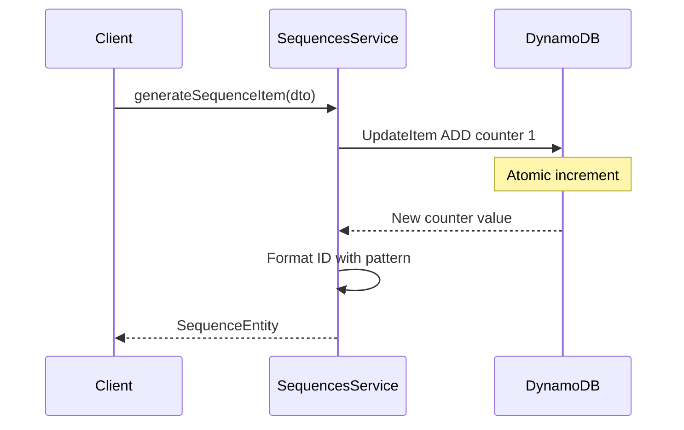

# 採番モジュール

## 1. このサービスの目的は、システム内で動的なシーケンスを管理することです。

`SequenceModule` は、DynamoDB を主要なデータベースとして使用してシステム内で動的なシーケンスを管理するためのサービスです。

このサービスは次の目的で設計されています:

- シーケンスタイプ、テナント、日付などのパラメータに基づいて一意なシーケンス番号を生成します。
- 次のようなサイクルに基づいてシーケンスを自動的にリセットします:
  - 毎日。
  - 毎月。
  - 毎年。
  - 会計年度単位。

システムの特定の要件に従ってシーケンス番号をフォーマットします（例: TODO-PERSONAL-72-001）。
マルチテナントシステムでのデータの整合性と完全性を確保します。

## 動作の仕組み



## 2. 使用方法


`SequenceModule` の動作をカスタマイズする解決策は、静的な `register()` メソッドでオプションの `object` を渡すことです。オプションオブジェクトには、1 つのプロパティのみが含まれています。

- `enableController`: デフォルトのシーケンスコントローラーを有効または無効にします。

シーケンスモジュールの使用方法とシーケンスコントローラーの認証をカスタマイズする方法を示す簡単な例を作成します。

```ts
// seq.controller.ts
import { SequencesController } from "@mbc-cqrs-serverless/sequence";
import { Controller } from "@nestjs/common";
import { ApiTags } from "@nestjs/swagger";
import { Auth } from "src/auth/auth.decorator";
import { ROLE } from "src/auth/role.enum";

@Controller("api/sequence")
@ApiTags("sequence")
@Auth(ROLE.JCCI_ADMIN)
export class SeqController extends SequencesController {}
```

```ts
// seq.module.ts
import { SequencesModule } from "@mbc-cqrs-serverless/sequence";
import { Module } from "@nestjs/common";

import { SeqController } from "./seq.controller";

@Module({
  imports: [SequencesModule.register({ enableController: false })],
  controllers: [SeqController],
  exports: [SequencesModule],
})
export class SeqModule {}
```

コントローラーのほかに、`SequencesService` を直接使用してサービスを注入することでシーケンスを生成できます。

`SequencesService` には3つのパブリックメソッドがあります:

### *async* `generateSequenceItem( dto: GenerateFormattedSequenceDto, options?: {invokeContext:IInvoke}):  Promise<SequenceEntity>`


GenerateFormattedSequenceDto オブジェクトで提供されたパラメータに基づいて新しいシーケンスを生成します。

#### パラメータ

`dto: GenerateFormattedSequenceDto`
シーケンス生成の動作をカスタマイズするデータ転送オブジェクトです。そのプロパティには以下が含まれます:

- `date?: Date`
  - デフォルト: 現在の日付。
  - 説明: シーケンスが生成される日付を指定します。

- `rotateBy?: RotateByEnum`
  - デフォルト: NONE。
  - オプション
    - FISCAL_YEARLY
    - YEARLY
    - MONTHLY
    - DAILY
    - NONE
  - 説明: シーケンスの回転タイプを決定します。

- `tenantCode: string`
  - 必須: はい。
  - 説明: テナントと用途のタイプコードを識別します。

- `typeCode: string`
  - 必須: はい。
  - 説明: テナントと用途のタイプコードを識別します。
  
- `params?: SequenceParamsDto`
  - Required: No.
  - 説明: シーケンスを識別するためのパラメータを定義します。
    ```ts
    export class SequenceParamsDto {
      @IsString()
      code1: string

      @IsString()
      @IsOptional()
      code2?: string

      @IsOptional()
      @IsString()
      code3?: string

      @IsOptional()
      @IsString()
      code4?: string

      @IsOptional()
      @IsString()
      code5?: string

      constructor(partial: Partial<SequenceParamsDto>) {
        Object.assign(this, partial)
      }
    }
    ```

- `prefix?: string`
  - Required: No.
  - 説明: フォーマットされたシーケンスの先頭に追加するオプションのプレフィックス。プレフィックスはフォーマットされたパターンの前に追加されます。
  - 例: prefixが`'INV-'`でフォーマットが`'2024-001'`を生成する場合、結果は`'INV-2024-001'`になります。

- `postfix?: string`
  - Required: No.
  - 説明: フォーマットされたシーケンスの末尾に追加するオプションのポストフィックス。ポストフィックスはフォーマットされたパターンの後に追加されます。
  - 例: postfixが`'-DRAFT'`でフォーマットが`'2024-001'`を生成する場合、結果は`'2024-001-DRAFT'`になります。

####  Response
この関数の戻り値は次のような `SequenceEntity` 型になります。
  ```ts
  export class SequenceEntity {
    id: string
    no: number
    formattedNo: string
    issuedAt: Date

    constructor(partial: Partial<SequenceEntity>) {
      Object.assign(this, partial)
    }
  }
  ```

####  カスタマイズ方法
デフォルトでは、返されるデータには、「%%no%%」形式の formattedNo フィールドが含まれます。「no」はシーケンス番号を表します。独自のカスタム形式を定義したい場合は、次のパラメータを使用して DynamoDB のマスター データを更新できます。

- PK: `MASTER${KEY_SEPARATOR}${tenantCode}`
- SK: `MASTER_DATA${KEY_SEPARATOR}${typeCode}`


データ構造は以下のとおりです：
  ```json
    {
      "format": "string",
      "startMonth": "number",
      "registerDate": "string"
    }
  ```

#### 例

たとえば、「code1」から「code5」、「month」、「day」、「date」、「no」、および「fiscal_year」をフォーマットに追加する場合、フォーマットは次のようになります。
```json
{
  "format": "%%code2#:0>7%%-%%fiscal_year#:0>2%%-%%code3%%%%no#:0>3%%"
} 
```
このフォーマットでは:
- 変数は `%% <param> %%` 内に記述されます。
- `#` の後に変数の長さを指定し、フォーマットされたシーケンス番号が返されるときに必要なフィールドの長さを示します。
例えば:

- `%%code2#:0>7%%` は、code2 が 7 文字の長さにフォーマットされ、必要に応じて先頭にゼロが埋め込まれます。
- `%%fiscal_year#:0>2%% `は、fiscal_year を 2 文字の長さにフォーマットします。
- `%%code3%%` は code3 の値をそのまま表します。
- `%%no#:0>3%%` は、シーケンス番号 (no) が 3 桁の長さにフォーマットされ、必要に応じて先頭にゼロが埋め込まれることを保証します。

特定の月から始まる会計年度を計算したい場合は、「startMonth」フィールドを追加できます。たとえば、会計年度を 3 月から開始する場合、形式は次のようになります。
```
{
  "format": "%%code2#:0>7%%-%%fiscal_year#:0>2%%-%%code3%%%%no#:0>3%%",
  "startMonth": 3
}
```
この場合:
- startMonth: 会計年度を開始する月を定義します (例: 3 月の場合は 3)。

特定の日付 (例: 2005-01-01) から始まる会計年度を計算したい場合は、次のように `registerDate` フィールドを追加できます。

```
{
  "format": "%%code2#:0>7%%-%%fiscal_year#:0>2%%-%%code3%%%%no#:0>3%%",
  "registerDate": "2005-01-01"
}
```

この場合
- registerDate: 会計年度の正確な開始日を定義します (例: "2005-01-01")。

これにより、特定のビジネス ニーズに応じて会計年度の計算をカスタマイズできます。

### *async* `generateSequenceItemWithProvideSetting(dto: GenerateFormattedSequenceWithProvidedSettingDto, options?: {invokeContext: IInvoke}): Promise<SequenceEntity>`

このメソッドを使用すると、DynamoDBでのマスターデータ設定なしで、DTOで直接提供されたカスタム設定でシーケンスを生成できます。

#### パラメータ

`dto: GenerateFormattedSequenceWithProvidedSettingDto`
シーケンスパラメータとフォーマット設定の両方を含むデータ転送オブジェクト。プロパティには以下が含まれます：

- `date?: Date`
  - デフォルト: 現在の日付。
  - 説明: シーケンスが生成される日付を指定します。

- `rotateBy?: RotateByEnum`
  - デフォルト: NONE。
  - オプション: FISCAL_YEARLY, YEARLY, MONTHLY, DAILY, NONE
  - 説明: シーケンスの回転タイプを決定します。

- `tenantCode: string`
  - 必須: はい。
  - 説明: シーケンスのテナントを識別します。

- `typeCode: string`
  - 必須: はい。
  - 説明: シーケンスのタイプコードを識別します。

- `params?: SequenceParamsDto`
  - Required: No.
  - 説明: シーケンスを識別するためのパラメータを定義します（code1からcode5）。

- `prefix?: string`
  - Required: No.
  - 説明: フォーマットされたシーケンスの先頭に追加するオプションのプレフィックス。

- `postfix?: string`
  - Required: No.
  - 説明: フォーマットされたシーケンスの末尾に追加するオプションのポストフィックス。

- `format: string`
  - 必須: はい。
  - 説明: 生成されるシーケンスの構造を定義するフォーマット文字列。例: `%%code1%%-%%no#:0>5%%`。

- `registerDate?: string`
  - Required: No.
  - 説明: 会計年度計算に影響を与えるオプションの登録日（ISO 8601形式）。

- `startMonth?: number`
  - Required: No.
  - 説明: 会計年度の開始月（1-12）。指定しない場合のデフォルトは4（4月）。

#### 例

```ts
const result = await this.sequencesService.generateSequenceItemWithProvideSetting(
  {
    tenantCode: 'tenant001',
    typeCode: 'INVOICE',
    format: '%%code1%%-%%no#:0>5%%',
    rotateBy: RotateByEnum.YEARLY,
    params: { code1: 'INV' },
  },
  { invokeContext },
);
// Returns: { formattedNo: 'INV-00001', no: 1, ... }
```

固定のマスターデータ設定ではなく、リクエストごとに異なる動的なシーケンス設定が必要な場合にこのメソッドを使用します。

prefixとpostfixを使用した例：

```ts
const result = await this.sequencesService.generateSequenceItemWithProvideSetting(
  {
    tenantCode: 'tenant001',
    typeCode: 'ORDER',
    format: '%%fiscal_year%%-%%no#:0>4%%',
    rotateBy: RotateByEnum.FISCAL_YEARLY,
    startMonth: 4,
    params: { code1: 'ORD' },
    prefix: 'ORD-',    // フォーマットされたシーケンスの先頭に追加
    postfix: '-DRAFT', // フォーマットされたシーケンスの末尾に追加
  },
  { invokeContext },
);
// Returns: { formattedNo: 'ORD-2024-0001-DRAFT', no: 1, ... }
```

### *async* `getCurrentSequence(key: DetailKey): Promise<DataEntity>` <span class="badge badge--warning">非推奨</span>

:::info

非推奨、削除予定: この API 要素は将来のバージョンで削除される可能性があります

:::

### *async* `genNewSequence( dto: GenerateSequenceDto, options: {invokeContext: IInvoke}): Promise<DataEntity>` <span class="badge badge--warning">非推奨</span>

:::info

非推奨、削除予定: この API 要素は将来のバージョンで削除される可能性があります。代わりに [`generateSequenceItem` メソッド](#async-generatesequenceitem-dto-generateformattedsequencedto-options-invokecontextiinvoke--promisesequenceentity) を使用してください

:::


