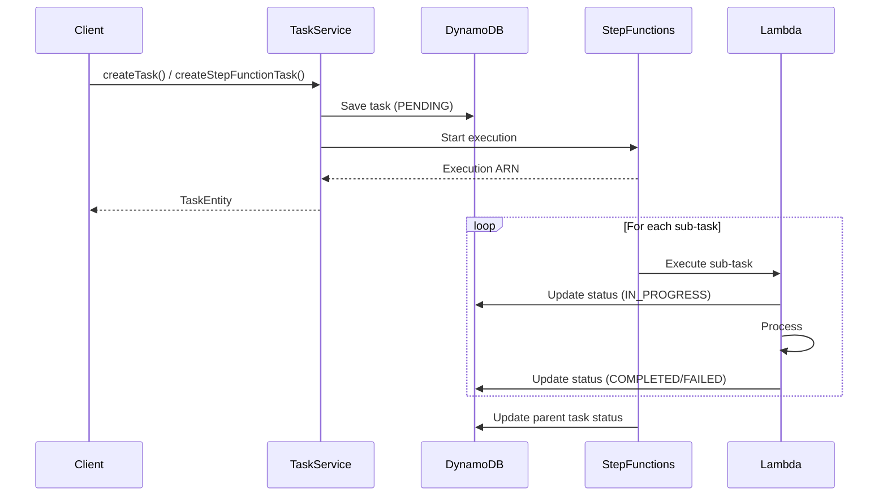

# タスクモジュール

Taskパッケージは、MBC CQRS Serverlessフレームワークにおいて包括的なタスク管理機能を提供します。これにより、以下のことが可能になります：

- 非同期タスク実行
- タスクステータスの追跡
- 進捗の監視
- エラーハンドリングと再試行
- タスキュー管理
- タスク履歴とロギング

## アーキテクチャ



## インストール

```bash
npm install @mbc-cqrs-serverless/task
```

## 使用方法

タスク処理には2つのタイプがあります：

- 単一タスク処理
- Step Functionを使用したタスク処理

### 単一タスク処理

1. タスクイベントの定義

```ts
import { TaskQueueEvent } from "@mbc-cqrs-serverless/task";

export class TaskEvent extends TaskQueueEvent {}
```

2. タスクイベントハンドラーの定義

```ts
import { EventHandler, IEventHandler } from "@mbc-cqrs-serverless/core";
import { Logger } from "@nestjs/common";

import { TaskEvent } from "./task.event";

@EventHandler(TaskEvent)
export class TaskEventHandler implements IEventHandler<TaskEvent> {
  private readonly logger = new Logger(TaskEventHandler.name);

  constructor() {}

  async execute(event: TaskEvent): Promise<any> {
    this.logger.debug("executing task event::", event);

    //

    this.logger.debug(`Process task completed: ${event.taskEvent.eventID}`);
    return "Result after process";
  }
}
```

3. `ITaskQueueEventFactory`の実装

```ts
import {
  ITaskQueueEventFactory,
  TaskQueueEvent,
} from "@mbc-cqrs-serverless/task";
import { TaskEvent } from "src/sample/handler/task.event";

export class TaskQueueEventFactory implements ITaskQueueEventFactory {
  async transformTask(event: TaskQueueEvent): Promise<any[]> {
    return [new TaskEvent().fromSqsRecord(event)];
  }
}
```

4. カスタム`TaskModule`

```ts
import { TaskModule } from "@mbc-cqrs-serverless/task";
import { Module } from "@nestjs/common";
import { TaskEventHandler } from "src/sample/handler/task.handler";

import { TaskQueueEventFactory } from "./task-queue-event-factory";

@Module({
  imports: [
    TaskModule.register({
      taskQueueEventFactory: TaskQueueEventFactory,
      enableController: true, // Optional: enable REST endpoints for task management
    }),
  ],
  providers: [TaskEventHandler],
  exports: [TaskModule],
})
export class CustomTaskModule {}
```

5. カスタム`EventFactoryAddedTask`

```ts
import { EventFactory, IEvent } from "@mbc-cqrs-serverless/core";
import { EventFactoryAddedTask, TaskEvent } from "@mbc-cqrs-serverless/task";
import { Logger } from "@nestjs/common";
import { DynamoDBStreamEvent } from "aws-lambda";

@EventFactory()
export class CustomEventFactory extends EventFactoryAddedTask {
  private readonly logger = new Logger(CustomEventFactory.name);
  async transformDynamodbStream(event: DynamoDBStreamEvent): Promise<IEvent[]> {
    const curEvents = await super.transformDynamodbStream(event);
    const taskEvents = event.Records.map((record) => {
      if (
        record.eventSourceARN.endsWith("tasks") ||
        record.eventSourceARN.includes("tasks" + "/stream/")
      ) {
        if (record.eventName === "INSERT") {
          return new TaskEvent().fromDynamoDBRecord(record);
        }
      }
      return undefined;
    })
      .filter((event) => !!event)
      .filter((event) => event.taskEntity.sk.split("#").length < 3);

    return [...curEvents, ...taskEvents];
  }
}
```

6. タスクの作成

### Step Functionを使用したタスク処理

1. Step Functionタスクイベントの定義

```ts
import { StepFunctionTaskEvent } from "@mbc-cqrs-serverless/task";

export class SfnTaskEvent extends StepFunctionTaskEvent {}
```

2. Step Functionタスクイベントハンドラーの定義

```ts
import {
  EventHandler,
  IEventHandler,
  StepFunctionService,
} from "@mbc-cqrs-serverless/core";
import { TaskService } from "@mbc-cqrs-serverless/task";
import { Logger } from "@nestjs/common";
import { ConfigService } from "@nestjs/config";

import { SfnTaskEvent } from "./sfn-task.event";

@EventHandler(SfnTaskEvent)
export class SfnTaskEventHandler implements IEventHandler<SfnTaskEvent> {
  private readonly logger = new Logger(SfnTaskEventHandler.name);

  constructor() {}

  async execute(event: SfnTaskEvent): Promise<any> {
    this.logger.debug("executing task event::", event);

    //

    return "Result after process";
  }
}
```

3. `ITaskQueueEventFactory`の実装

```ts
import {
  ITaskQueueEventFactory,
  StepFunctionTaskEvent,
} from "@mbc-cqrs-serverless/task";
import { SfnTaskEvent } from "src/sample/handler/sfn-task.event";

export class TaskQueueEventFactory implements ITaskQueueEventFactory {
  async transformStepFunctionTask(event: StepFunctionTaskEvent): Promise<any[]> {
    return [new SfnTaskEvent(event)];
  }
}
```

4. カスタム`TaskModule`

```ts
import { TaskModule } from "@mbc-cqrs-serverless/task";
import { Module } from "@nestjs/common";
import { TaskEventHandler } from "src/sample/handler/task.handler";

import { TaskQueueEventFactory } from "./task-queue-event-factory";

@Module({
  imports: [
    TaskModule.register({
      taskQueueEventFactory: TaskQueueEventFactory,
      enableController: true, // Optional: enable REST endpoints for task management
    }),
  ],
  providers: [TaskEventHandler],
  exports: [TaskModule],
})
export class CustomTaskModule {}
```

5. カスタム`EventFactoryAddedTask`

```ts
import { EventFactory, IEvent } from "@mbc-cqrs-serverless/core";
import { EventFactoryAddedTask, TaskEvent } from "@mbc-cqrs-serverless/task";
import { Logger } from "@nestjs/common";
import { DynamoDBStreamEvent } from "aws-lambda";

@EventFactory()
export class CustomEventFactory extends EventFactoryAddedTask {
  private readonly logger = new Logger(CustomEventFactory.name);
  async transformDynamodbStream(event: DynamoDBStreamEvent): Promise<IEvent[]> {
    const curEvents = await super.transformDynamodbStream(event);
    const taskEvents = event.Records.map((record) => {
      if (
        record.eventSourceARN.endsWith("tasks") ||
        record.eventSourceARN.includes("tasks" + "/stream/")
      ) {
        if (record.eventName === "INSERT") {
          return new TaskEvent().fromDynamoDBRecord(record);
        }
      }
      return undefined;
    })
      .filter((event) => !!event)
      .filter((event) => event.taskEntity.sk.split("#").length < 3);

    return [...curEvents, ...taskEvents];
  }
}
```

6. Step Functionタスクの作成

```ts
const item = [
  { key: "value1" },
  { key: "value2" },
  { key: "value3" },
  { key: "value4" },
  { key: "value5" },
  { key: "value6" },
];

await this.taskService.createStepFunctionTask(
  {
    input: item,
    taskType: "cat",
    tenantCode: "mbc",
  },
  { invokeContext }
);
```
