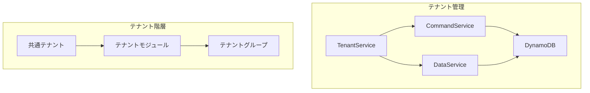

# テナントモジュール

TenantModuleは、MBC CQRS Serverlessフレームワークでマルチテナント管理機能を提供します。テナントの作成、更新、およびグループ構成の管理が可能です。

## アーキテクチャ



## インストール

```bash
npm install @mbc-cqrs-serverless/tenant
```

## モジュール登録

```ts
import { TenantModule } from "@mbc-cqrs-serverless/tenant";

@Module({
  imports: [
    TenantModule.register({
      enableController: true, // 組み込みのRESTコントローラーを有効にする
      dataSyncHandlers: [TenantDataSyncHandler], // オプション: カスタム同期ハンドラー
    }),
  ],
})
export class AppModule {}
```

## モジュールオプション

| オプション | 型 | 必須 | 説明 |
|------------|----------|--------------|-----------------|
| `enableController` | `boolean` | いいえ | 組み込みのTenantControllerを有効または無効にする |
| `dataSyncHandlers` | `Type<IDataSyncHandler>[]` | いいえ | テナントデータを外部システムに同期するためのカスタムハンドラー |

## APIリファレンス

### TenantServiceメソッド

#### `getTenant(key: DetailKey): Promise<DataModel>`

プライマリキーでテナントを取得します。

```ts
import { TenantService } from "@mbc-cqrs-serverless/tenant";

@Injectable()
export class MyService {
  constructor(private readonly tenantService: TenantService) {}

  async findTenant(pk: string, sk: string) {
    const tenant = await this.tenantService.getTenant({ pk, sk });
    return tenant;
  }
}
```

#### `createCommonTenant(dto: CommonTenantCreateDto, context): Promise<CommandModel>`

すべてのテナントの基本構成となる共通テナントを作成します。

```ts
const commonTenant = await this.tenantService.createCommonTenant(
  {
    name: "Common Settings",
    attributes: {
      defaultLanguage: "en",
      timezone: "UTC",
    },
  },
  { invokeContext }
);
```

#### `createTenant(dto: TenantCreateDto, context): Promise<CommandModel>`

指定されたコードと構成で新しいテナントを作成します。

```ts
const tenant = await this.tenantService.createTenant(
  {
    code: "tenant001",
    name: "Tenant One",
    attributes: {
      industry: "technology",
      plan: "enterprise",
    },
  },
  { invokeContext }
);
```

#### `updateTenant(key: DetailKey, dto: TenantUpdateDto, context): Promise<CommandModel>`

既存のテナント情報を更新します。

```ts
const updatedTenant = await this.tenantService.updateTenant(
  { pk: "SYSTEM#tenant001", sk: "TENANT" },
  {
    name: "Updated Tenant Name",
    attributes: {
      plan: "premium",
    },
  },
  { invokeContext }
);
```

#### `deleteTenant(key: DetailKey, context): Promise<CommandModel>`

isDeletedをtrueに設定してテナントを論理削除します。

```ts
const deletedTenant = await this.tenantService.deleteTenant(
  { pk: "SYSTEM#tenant001", sk: "TENANT" },
  { invokeContext }
);
```

#### `addTenantGroup(dto: TenantGroupAddDto, context): Promise<CommandModel>`

指定されたロールでテナントにグループを追加します。

```ts
const result = await this.tenantService.addTenantGroup(
  {
    tenantCode: "tenant001",
    groupId: "group001",
    role: "admin",
  },
  { invokeContext }
);
```

#### `customizeSettingGroups(dto: TenantGroupUpdateDto, context): Promise<CommandModel>`

特定のテナントロールの設定グループをカスタマイズします。

```ts
const result = await this.tenantService.customizeSettingGroups(
  {
    tenantCode: "tenant001",
    role: "admin",
    settingGroups: ["group001", "group002", "group003"],
  },
  { invokeContext }
);
```

#### `createTenantGroup(tenantGroupCode: string, dto: TenantCreateDto, context): Promise<CommandModel>`

既存のテナントの下にサブテナントまたはテナントグループを作成します。

```ts
const tenantGroup = await this.tenantService.createTenantGroup(
  "tenant001", // 親テナントコード
  {
    code: "department-a",
    name: "Department A",
    attributes: {
      department: "engineering",
    },
  },
  { invokeContext }
);
```

## DTO

### TenantCreateDto

| プロパティ | 型 | 必須 | 説明 |
|--------------|----------|--------------|-----------------|
| `code` | `string` | はい | 一意のテナントコード |
| `name` | `string` | はい | テナント表示名 |
| `attributes` | `object` | いいえ | 追加のテナント属性 |

### TenantGroupAddDto

| プロパティ | 型 | 必須 | 説明 |
|--------------|----------|--------------|-----------------|
| `tenantCode` | `string` | はい | 対象テナントコード |
| `groupId` | `string` | はい | 追加するグループ識別子 |
| `role` | `string` | はい | グループのロール |

### TenantGroupUpdateDto

| プロパティ | 型 | 必須 | 説明 |
|--------------|----------|--------------|-----------------|
| `tenantCode` | `string` | はい | 対象テナントコード |
| `role` | `string` | はい | 更新するロール |
| `settingGroups` | `string[]` | はい | 新しい設定グループ配列 |

## 関連項目

- [マルチテナントパターン](./multi-tenant-patterns) - 高度なマルチテナント実装パターン
- [コマンドサービス](./command-service) - TenantServiceで使用されるコマンド操作
