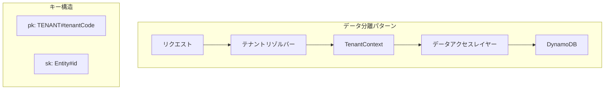

# テナント
テナントサービスは、マルチテナントサーバーレスCQRSアーキテクチャにおけるテナントレベルの操作を管理する機能を提供します。

## 概要

テナントサービスは次の目的で設計されています::
- テナントレベルのエンティティ操作を管理
- テナントエンティティのCRUD操作を実装
- 異なるテナント間の適切な分離を確保
- テナントコードを検証し、テナントの整合性を維持

## アーキテクチャ



## インストール

```bash
npm install @mbc-cqrs-serverless/tenant
```
 

## 基本的な使い方

```ts 
import { TenantModule } from '@mbc-cqrs-serverless/tenant'

@Module({
  imports: [ TenantModule.register({
      enableController: true,
    })],
  controllers: [],
  exports: [],
})
```
## APIリファレンス


### `getTenant(key: DetailKey): Promise<DataModel>`
指定されたキーに基づいてテナントの詳細を取得します。

``` ts
const tenant = await tenantService.getTenant({
  pk: 'TENANT#mbc',
  sk: 'MASTER',
});
```

### `createCommonTenant(dto: CommonTenantCreateDto, context: { invokeContext: IInvoke }):Promise<CommandModel>`
システム全体で共有される共通のテナントを作成します。

``` ts
const tenant = await tenantService.createCommonTenant({

  name: "Common",
  description: "describes the tenant "
});
```

### ` createTenant(dto: TenantCreateDto,context: { invokeContext: IInvoke },): Promise<CommandModel>`

個別のエンティティのためのテナントを作成します。

``` ts
const tenant = await tenantService.createTenant({
  name: "MBC tenant",
  code: "mbc",
  description: "describes the tenant "
});
```

### ` updateTenant(key: DetailKey,dto: TenantUpdateDto,context: { invokeContext: IInvoke }): Promise<CommandModel>`

既存のテナントの詳細を更新します。


個別のエンティティのためのテナントを作成します。

``` ts
const tenant = await tenantService.updateTenant(
  {
    pk: 'TENANT#mbc',
    sk: 'MASTER',
  }
  {
    name: "MBC tenant",
    description: "describes the tenant "
  }
);
```

###  `deleteTenant(key: DetailKey,context: { invokeContext: IInvoke }): Promise<CommandModel>`
指定されたキーに基づいてテナントを削除します。

``` ts
const tenant = await tenantService.deleteTenant(
  {
    pk: 'TENANT#mbc',
    sk: 'MASTER',
  }
);
```
### `addTenantGroup(dto: TenantGroupAddDto,context: { invokeContext: IInvoke }): Promise<CommandModel>`

特定のテナントにグループを追加します。
``` ts
const tenant = await tenantService.addTenantGroup(
  {
    tenantCode: "abc",
    groupId: "19",
    role: "company"
  }
);
```

### `customizeSettingGroups(dto: TenantGroupUpdateDto,context: { invokeContext: IInvoke }): Promise<CommandModel>`
テナントに関連するグループの設定をカスタマイズします。

``` ts
const tenant = await tenantService.customizeSettingGroups(
  {
    tenantCode: "mbc",
    settingGroups: ["19","20"],
    role: "company"
  }
);
```

### `createTenantGroup(tenantGroupCode: string, dto: TenantCreateDto, context: { invokeContext: IInvoke }): Promise<CommandModel>`

複数のテナントを含むことができるテナントグループを作成します。テナントグループは、テナントを階層的に、またはビジネスユニットごとに整理するのに役立ちます。

``` ts
const tenantGroup = await tenantService.createTenantGroup(
  "group-001",
  {
    name: "Enterprise Group",
    description: "Group for enterprise customers"
  },
  { invokeContext }
);
```

**パラメータ:**
- `tenantGroupCode`: テナントグループの一意の識別子
- `dto`: 名前と説明を含むテナント作成データ
- `context`: ユーザー情報を含む呼び出しコンテキスト

**戻り値:** `Promise<CommandModel>` - 作成されたテナントグループコマンド
